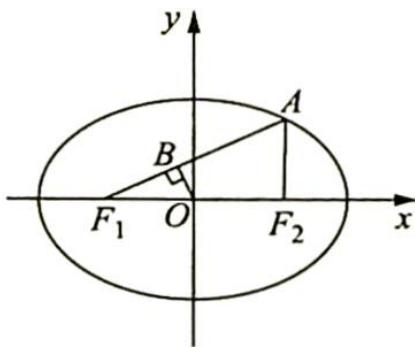
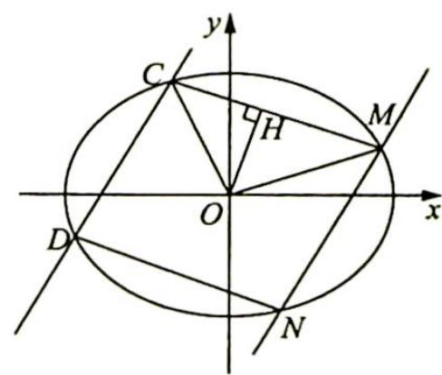

## 21.2 垂直弦模型及延伸

## 研究密钥

椭圆 $\frac{x^2}{a^2} + \frac{y^2}{b^2} = 1 (a > b > 0)$ 与直线 $l$ 交于 $A, B$ 两点，在 $\triangle ABO$ 中， $OH$ 为 $AB$ 上的高，则 $\langle \overrightarrow{OA}, \overrightarrow{OB} \rangle = \frac{\pi}{2} \Leftrightarrow \frac{1}{|OH|^2} = \frac{1}{a^2} + \frac{1}{b^2}$ .

【证明】充分性

依题意,如图1所示.

不妨设 $|OA|=m, |OB|=n, \angle A O x = \alpha$ , 则 $\angle B O x = \alpha + \frac{\pi}{2}$ , 从而 $A(m \cos \alpha, m \sin \alpha), B(n \cos (\alpha + \frac{\pi}{2}), n \sin (\alpha + \frac{\pi}{2}))$ , 即 $B(-n \sin \alpha, n \cos \alpha)$ .

由 $A, B$ 在椭圆上, 得 $\left\{ \begin{array}{l} \frac{m^2 \cos^2 \alpha}{a^2} + \frac{m^2 \sin^2 \alpha}{b^2} = 1 \\ \frac{n^2 \sin^2 \alpha}{a^2} + \frac{n^2 \cos^2 \alpha}{b^2} = 1 \end{array} \right.$ , 即 $\left\{ \begin{array}{l} \frac{\cos^2 \alpha}{a^2} + \frac{\sin^2 \alpha}{b^2} = \frac{1}{m^2} \\ \frac{\sin^2 \alpha}{a^2} + \frac{\cos^2 \alpha}{b^2} = \frac{1}{n^2} \end{array} \right.$ , 两式相加可得 $\frac{1}{m^2} + \frac{1}{n^2} = \frac{1}{a^2} + \frac{1}{b^2}$ , 又 $\frac{1}{2} |OH||AB| = \frac{1}{2} |OA||OB|$ , 即 $|OH|^2 (|OA|^2 + |OB|^2) = |OA|^2 |OB|^2$ , 所以 $\frac{1}{|OH|^2} = \frac{|OA|^2 + |OB|^2}{|OA|^2 |OB|^2} = \frac{1}{m^2} + \frac{1}{n^2} = \frac{1}{a^2} + \frac{1}{b^2}$ .

必要性

①如图2所示,直线AB的斜率不存在.

设 AB: x = m，则 $\left|OH\right| = m$ ，又因为 $\frac{1}{\left|OH\right|^{2}} = \frac{1}{a^{2}} + \frac{1}{b^{2}}$ ，所以 $\frac{1}{m^{2}} = \frac{1}{a^{2}} + \frac{1}{b^{2}}$ ， $m^{2}=\frac{a^{2}b^{2}}{a^{2}+b^{2}}.$

  
图2

联立方程 $\left\{ \begin{array}{l} x = m \\ \frac{x^2}{a^2} + \frac{y^2}{b^2} = 1 \end{array} \right.$ , 可得 $y^2 = b^2 - \frac{b^2}{a^2} m^2 = \frac{b^2}{a^2} (a^2 - m^2)$ , 所以 $A(m, \frac{b}{a} \sqrt{a^2 - m^2})$ , $B(m, -\frac{b}{a} \sqrt{a^2 - m^2})$ , $\overrightarrow{OA} \cdot \overrightarrow{OB} = m^2 - \frac{b^2}{a^2} (a^2 - m^2) = m^2 - b^2 + \frac{b^2}{a^2} m^2 = \frac{a^2 b^2}{a^2 + b^2} - b^2 + \frac{b^4}{a^2 + b^2} = 0$ , 所以 $\langle \overrightarrow{OA}, \overrightarrow{OB} \rangle = \frac{\pi}{2}$ .

②如图3所示,直线AB的斜率存在.

②如图3所示,直线AB的斜率存在.
设 AB: $y = kx + m$ , 则 $|OH| = \frac{|m|}{\sqrt{1 + k^{2}}}$ , 又因为 $\frac{1}{|OH|^{2}} = \frac{1}{a^{2}} + \frac{1}{b^{2}}$ , 所以 $\frac{1}{\left(\frac{|m|}{\sqrt{1+k^{2}}}\right)^{2}}=\frac{1}{a^{2}}+\frac{1}{b^{2}}$ ，即 $\frac{1+k^{2}}{m^{2}}=\frac{a^{2}+b^{2}}{a^{2}b^{2}}$ ，所以 $(1+k^{2})a^{2}b^{2}=(a^{2}+b^{2})m^{2},a^{2}b^{2}+a^{2}b^{2}k^{2}=a^{2}m^{2}+b^{2}m^{2}$ ，即 $a^{2}(m^{2}-b^{2})+b^{2}(m^{2}-a^{2}k^{2})=0.$

  
图3

联立方程 $\left\{\begin{aligned}y&=kx+m\\ \frac{x^{2}}{a^{2}}+\frac{y^{2}}{b^{2}}&=1\end{aligned}\right.$ ，消去x整理可得 $\left(a^{2}+\frac{b^{2}}{k^{2}}\right)y^{2}-\frac{2mb^{2}}{k^{2}}y+\frac{m^{2}b^{2}}{k^{2}}-a^{2}b^{2}=0$ ，所以 $y_{1}\cdot$

$$
y _ {2} = \frac {\frac {m ^ {2} b ^ {2}}{k ^ {2}} - a ^ {2} b ^ {2}}{a ^ {2} + \frac {b ^ {2}}{k ^ {2}}} = \frac {b ^ {2} (m ^ {2} - a ^ {2} k ^ {2})}{b ^ {2} + a ^ {2} k ^ {2}}.
$$

消去 y 整理可得 $(a^{2}k^{2}+b^{2})x^{2}+2mka^{2}x+a^{2}m^{2}-a^{2}b^{2}=0$ ，所以 $x_{1}x_{2}=\frac{a^{2}(m^{2}-b^{2})}{a^{2}k^{2}+b^{2}}$ $\overrightarrow{OA}\cdot\overrightarrow{OB}=x_{1}x_{2}+y_{1}y_{2}=\frac{a^{2}(m^{2}-b^{2})}{a^{2}k^{2}+b^{2}}+\frac{b^{2}(m^{2}-a^{2}k^{2})}{b^{2}+a^{2}k^{2}}=0$ ，所以 $\langle\overrightarrow{OA},\overrightarrow{OB}\rangle=\frac{\pi}{2}$ .

例21.8 设椭圆 $\frac{x^2}{a^2} + \frac{y^2}{b^2} = 1 (a > b > 0)$ 的左、右焦点分别为 $F_1, F_2, A$ 是椭圆上的一点， $AF_2 \perp F_1F_2$ ，原点 $O$ 到直线 $AF_1$ 的距离为 $\frac{1}{3} |OF_1|$ .

(1) 求证: $a = \sqrt{2}b$ ;

(2) 设 $Q_{1}, Q_{2}$ 为椭圆上的两个动点, $OQ_{1} \perp OQ_{2}$ , 过原点 $O$ 作直线 $Q_{1}Q_{2}$ 的垂线 $OD$ , 垂足为 $D$ , 求点 $D$ 的轨迹方程.

分析 ▶ (1) 可从代数法与几何法两个角度寻找 $a, b$ 之间的数量关系; (2) 符合垂直弦模型特征, 可应用模型快速求出 $|OD|$ , 从而得出 $D$ 的轨迹方程.

解析 ▶ (1)证法一(代数法): 由题设 $AF_{2} \perp F_{1}F_{2}$ 及 $F_{1}(-c,0), F_{2}(c,0)$ , 不妨设点 $A'(c,y)(y>0)$ .

由于点 A 在椭圆上，有 $\frac{c^{2}}{a^{2}} + \frac{y^{2}}{b^{2}} = 1$ ，即 $\frac{a^{2} - b^{2}}{a^{2}} + \frac{y^{2}}{b^{2}} = 1$ ，解得 $y = \frac{b^{2}}{a}$ ，从而得到 $A\left(c, \frac{b^{2}}{a}\right)$ ，直线 $AF_{1}$ 的方程为 $y = \frac{b^{2}}{2ac}(x + c)$ ，整理得 $b^{2}x - 2acy + b^{2}c = 0$ 。

由题设, 原点 $O$ 到直线 $AF_{1}$ 的距离为 $\frac{1}{3} |OF_{1}|$ , 即 $\frac{c}{3} = \frac{b^{2}c}{\sqrt{b^{4} + 4a^{2}c^{2}}}$ ①, 将 $c^{2} = a^{2} - b^{2}$ 代入式 ① 并化简, 得 $a^{2} = 2b^{2}$ , 即 $a = \sqrt{2}b$ .

证法二(几何法): 同证法一, 得到点 A 的坐标为 $A\left(c, \frac{b^{2}}{a}\right)$ . 如图所示, 过点 O 作 $OB \perp AF_{1}$ , 垂足为点 B, 易知 $\triangle F_{1}BO \sim \triangle F_{1}F_{2}A$ , 故 $\frac{|BO|}{|OF_{1}|} = \frac{|F_{2}A|}{|F_{1}A|}$ .

由椭圆定义得 $|AF_1| + |AF_2| = 2a$ ，又 $|BO| = \frac{1}{3} |OF_1|$ ，所以 $\frac{1}{3} = \frac{|F_2A|}{|F_1A|} = \frac{|F_2A|}{2a - |F_2A|}$ ，解得 $|F_2A| = \frac{a}{2}$ .

而 $|F_2A| = \frac{b^2}{a}$ ，得 $\frac{b^2}{a} = \frac{a}{2}$ 即 $a = \sqrt{2} b.$

(2)由垂直弦模型可知 $\frac{1}{|OD|^2} = \frac{1}{a^2} + \frac{1}{b^2} = \frac{3}{2b^2}$ , 所以可知点 $D$ 到原点 $O$ 的距离始终为定值 $\sqrt{\frac{2b^2}{3}}$ , 因此点 $D$ 的轨迹方程为 $x^2 + y^2 = \frac{2}{3} b^2$ .

模型的好处就是对于题目能够迅速地找到解决问题的途径,本题利用垂直弦模型,可以直接得出答案,但是对于正规的解答过程,需要将模型的证明书写上去.

变式 1 直线 $x + y = 1$ 与椭圆 $\frac{x^2}{a^2} + \frac{y^2}{b^2} = 1 (a > b > 0)$ 交于点 $P, Q$ , 且 $OP \perp OQ$ , 离心率 $e \in [\frac{\sqrt{3}}{3}, \frac{\sqrt{2}}{2}]$ , 则 $a$ 的取值范围是 \_\_\_\_.

分析 由 ${OP} \bot  {OQ}$ 知,圆 ${x}^{2} + {y}^{2} = {r}^{2}$ 与直线 $x + y = 1$ 相切,且 $\frac{1}{{r}^{2}} = \frac{1}{{a}^{2}} + \frac{1}{{b}^{2}}$ .

解析 由垂直弦模型可知, 若 $OP \perp OQ$ , 则原点 $O$ 到直线 $x + y = 1$ 的距离 $d$ 为定值, 即 $d = \frac{1}{\sqrt{2}} = \frac{\sqrt{2}}{2} = r$ , 所以 $\frac{1}{r^2} = 2 = \frac{1}{a^2} + \frac{1}{b^2}$ .

又 $e = \frac{c}{a}\in \left[\frac{\sqrt{3}}{3},\frac{\sqrt{2}}{2}\right]$ ，故 $e^2 = \frac{c^2}{a^2} = 1 - \frac{b^2}{a^2}\in \left[\frac{1}{3},\frac{1}{2}\right],\frac{b^2}{a^2}\in \left[\frac{1}{2},\frac{2}{3}\right].$

令 $b^{2} = \lambda a^{2}$ ，则 $\lambda \in \left[\frac{1}{2},\frac{2}{3}\right]$ 所以 $\frac{1}{a^2} +\frac{1}{b^2} = \frac{1}{\lambda a^2} +\frac{1}{a^2} = \frac{\lambda + 1}{\lambda a^2} = 2$ ，即 $a^2 = \frac{\lambda + 1}{2\lambda}\in \left[\frac{5}{4},\frac{3}{2}\right].$

又 $a > 0$ ，故 $a\in \left[\frac{\sqrt{5}}{2},\frac{\sqrt{6}}{2}\right]$

例 21.9 若椭圆 $\frac{x^2}{a^2} + \frac{y^2}{b^2} = 1 (a > b > 0)$ 与直线 $l$ 交于 $A, B$ 两点，且 $OA \perp OB$ ，求弦 $|AB|$ 及 $S_{\triangle OAB}$ 的取值范围。

分析 因为 $OA \perp OB$ ，根据勾股定理可得 $|AB|^{2} = |OA|^{2} + |OB|^{2}, |OA|, |OB|$ 都是变量，由垂直弦模型可知 $\frac{1}{|OA|^{2}} + \frac{1}{|OB|^{2}} = \frac{1}{a^{2}} + \frac{1}{b^{2}}$ 为定值，所以添加 $\frac{1}{|OA|^{2}} + \frac{1}{|OB|^{2}}$ ，创造条件使用基本不等式和完全平方公式求取值范围。由垂直弦模型可知，原点 O 到直线 l 的距离 d 为定值，只要把 $|AB|$ 的取值范围代入 $S_{\triangle OAB} = \frac{1}{2} |AB| d$ 即可。

解析 由垂直弦模型可知, 原点 $O$ 到直线 $l$ 的距离 $d$ 满足 $\frac{1}{d^2} = \frac{1}{a^2} + \frac{1}{b^2} = \frac{1}{|OA|^2} +$

$\frac{1}{|OB|^2}$ , 且 $b \leqslant |OA| \leqslant a, b \leqslant |OB| \leqslant a$ .

$$
\text {所以} \left| A B \right| ^ {2} = \left| O A \right| ^ {2} + \left| O B \right| ^ {2} = (\left| O A \right| ^ {2} + \left| O B \right| ^ {2}) \cdot \left(\frac {1}{\left| O A \right| ^ {2}} + \frac {1}{\left| O B \right| ^ {2}}\right) \cdot \frac {1}{\frac {1}{a ^ {2}} + \frac {1}{b ^ {2}}}
$$

$$
= \frac {a ^ {2} b ^ {2}}{a ^ {2} + b ^ {2}} \left(1 + \frac {| O A | ^ {2}}{| O B | ^ {2}} + \frac {| O B | ^ {2}}{| O A | ^ {2}} + 1\right) = \frac {a ^ {2} b ^ {2}}{a ^ {2} + b ^ {2}} \left(2 + \frac {| O B | ^ {2}}{| O A | ^ {2}} + \frac {| O A | ^ {2}}{| O B | ^ {2}}\right).
$$

令 $t = \frac{|OB|}{|OA|}$ , 则 $t \in \left[\frac{b}{a}, \frac{a}{b}\right]$ , 所以 $|AB|^2 = \frac{a^2b^2}{a^2 + b^2} \left(2 + t^2 + \frac{1}{t^2}\right) \geqslant \frac{4a^2b^2}{a^2 + b^2}$ .

当 $t = \frac{1}{t}$ 时，等号成立， $|AB|_{\min}^2 = \frac{4a^2b^2}{a^2 + b^2}$ ，故 $\left|AB\right|_{\min} = \frac{2ab}{\sqrt{a^2 + b^2}}.$

当 $t = \frac{b}{a}$ 或 $t = \frac{a}{b}$ 时， $|AB|_{\max}^2 = \frac{a^2b^2}{a^2 + b^2}\left(2 + \frac{b^2}{a^2} +\frac{a^2}{b^2}\right) = \frac{a^2b^2}{a^2 + b^2}\left(\frac{b}{a} +\frac{a}{b}\right)^2 = a^2 +b^2$ ，故 $\left|AB\right|_{\max} =$ $\sqrt{a^2 + b^2}$ ，所以 $|AB|\in \left[\frac{2ab}{\sqrt{a^2 + b^2}},\sqrt{a^2 + b^2}\right].$

同时 $S_{\triangle QAB} = \frac{1}{2}|AB|d = \frac{1}{2}\frac{ab}{\sqrt{a^2 + b^2}} |AB|\in \left[\frac{a^2b^2}{a^2 + b^2},\frac{ab}{2}\right].$

变式① 已知椭圆 $E: \frac{x^2}{a^2} + \frac{y^2}{b^2} = 1 (a > b > 0)$ , 它的上、下顶点分别为 $A, B$ , 左、右焦点分别为 $F_1, F_2$ , 若四边形 $AF_1BF_2$ 为正方形, 且面积为 2.

(1)求椭圆 E 的标准方程；

(2)设存在斜率不为零且平行的两条直线 $l_{1}$ , $l_{2}$ , 与椭圆 $E$ 分别交于点 $C, D, M, N$ , 且四边形 $CDNM$ 是菱形, 求出该菱形周长的最大值.

解析 (1) 因为 $E: \frac{x^2}{a^2} + \frac{y^2}{b^2} = 1 (a > b > 0)$ , 所以 $a^2 = b^2 + c^2$ .

又四边形 $AF_{1}BF_{2}$ 为正方形，且面积为2，所以 $2b = 2c, \frac{1}{2}(2b) \times (2c) = 2$ ，则 $b = c = 1, a^{2} = b^{2} + c^{2} = 2$ . 故椭圆 $E$ 的标准方程为 $\frac{x^2}{2} + y^2 = 1$ .

(2)解法一(垂直弦模型): 过点 O 作 $OH \perp CM$ 交 CM 于点 H, 如图所示.

由题意可得 $OC \perp OM$ , 根据垂直弦模型可得 $\frac{1}{|OH|^2} = \frac{1}{|OC|^2} + \frac{1}{|OM|^2} = \frac{1}{a^2} + \frac{1}{b^2} = \frac{3}{2}$ , 且 $b \leqslant |OC| \leqslant a, b \leqslant |OM| \leqslant a$ .

$$
\left| C M \right| ^ {2} = \left| O C \right| ^ {2} + \left| O M \right| ^ {2} = \frac {2}{3} \left(\left| O C \right| ^ {2} + \left| O M \right| ^ {2}\right) \cdot \left(\frac {1}{\left| O C \right| ^ {2}} + \frac {1}{\left| O M \right| ^ {2}}\right) =
$$

$\frac{2}{3}\left(2 + \frac{|OM|^2}{|OC|^2} + \frac{|OC|^2}{|OM|^2}\right) \leqslant \frac{2}{3}\left(2 + \frac{b^2}{a^2} + \frac{a^2}{b^2}\right) = \frac{2}{3}\left(2 + \frac{1}{2} + \frac{2}{1}\right) = 3$ ，所以 $|CM|_{\max} = \sqrt{3}$ ，菱形 CDMN 的周长的最大值 $C_{\max} = 4|CM| = 4\sqrt{3}$ .

解法二(坐标法): 设平行直线 $l_{1}: y = kx + m, l_{2}: y = kx - m$ , 不妨设直线 $y = kx + m$ 与 $\frac{x^{2}}{2} + y^{2} = 1$ 交于 $C(x_{1}, y_{1}), D(x_{2}, y_{2})$ .

由 $\left\{\begin{aligned}\frac{x^{2}}{2}+y^{2}=1\\ y=kx+m\end{aligned}\right.$ 消 y 得 $x^{2}+2(kx+m)^{2}=2$ ，化简得 $(2k^{2}+1)x^{2}+4kmx+2m^{2}-2=0$ ，其中 $\Delta=(4km)^{2}-4\times(2k^{2}+1)\cdot(2m^{2}-2)=16k^{2}-8m^{2}+8>0$ ，即 $m^{2}<2k^{2}+1$ ，所以 $x_{1}+x_{2}=-\frac{4km}{2k^{2}+1},x_{1}x_{2}=\frac{2m^{2}-2}{2k^{2}+1}.$

由椭圆的对称性和菱形的中心对称性, 可知 $OC \perp OD$ , 所以 $x_{1}x_{2} + y_{1}y_{2} = 0, y_{1} = kx_{1} + m$ ,

$$
\begin{array}{r l} y _ {2} & = k x _ {2} + m, x _ {1} x _ {2} + y _ {1} y _ {2} = (1 + k ^ {2}) x _ {1} x _ {2} + k m (x _ {1} + x _ {2}) + m ^ {2} \\ & = \frac {(2 m ^ {2} - 2) (1 + k ^ {2}) - 4 k ^ {2} m ^ {2} + m ^ {2} (2 k ^ {2} + 1)}{2 k ^ {2} + 1} \\ & = \frac {2 k ^ {2} m ^ {2} + 2 m ^ {2} - 2 k ^ {2} - 2 - 4 k ^ {2} m ^ {2} + 2 k ^ {2} m ^ {2} + m ^ {2}}{2 k ^ {2} + 1} \\ & = \frac {3 m ^ {2} - 2 k ^ {2} - 2}{2 k ^ {2} + 1} = 0, \end{array}
$$

所以 $3m^{2}=2k^{2}+2$ .

$$
\begin{array}{r l} | C D | & = \sqrt {(1 + k ^ {2}) [ (x _ {1} + x _ {2}) ^ {2} - 4 (x _ {1} x _ {2}) ]} = \sqrt {(1 + k ^ {2}) [ \frac {1 6 k ^ {2} m ^ {2}}{(2 k ^ {2} + 1) ^ {2}} - \frac {8 (m ^ {2} - 1)}{2 k ^ {2} + 1} ]} \\ & = \sqrt {\frac {(1 + k ^ {2}) (3 2 k ^ {2} + 8)}{3 (2 k ^ {2} + 1) ^ {2}}} = \sqrt {\frac {8}{3} + \frac {8 k ^ {2}}{3 (2 k ^ {2} + 1) ^ {2}}} = \sqrt {\frac {8}{3} + \frac {8}{3 (4 k ^ {2} + 4 + \frac {1}{k ^ {2}})}} \\ & \leqslant \sqrt {\frac {8}{3} + \frac {8}{3 (4 + 2 \sqrt {4 k ^ {2} \cdot \frac {1}{k ^ {2}}})}} = \sqrt {3}, \end{array}
$$

则当且仅当 $k = \pm \frac{\sqrt{2}}{2}$ 时， $|CD|$ 的最大值为 $\sqrt{3}$ . 此时四边形 CDMN 周长最大值为 $4\sqrt{3}$ .

探究总结

## 垂直弦模型的拓展

椭圆中的垂直弦模型: $\overrightarrow{OA} \perp \overrightarrow{OB} \Leftrightarrow \frac{1}{|OH|^2} = \frac{1}{|OA|^2} + \frac{1}{|OB|^2} = \frac{1}{a^2} + \frac{1}{b^2}$ .

对于该模型还有如下推广：

模型演绎 1: 若 $\langle\overrightarrow{OA},\overrightarrow{OB}\rangle<\frac{\pi}{2}\Leftrightarrow\frac{1}{|OH|^{2}}<\frac{1}{a^{2}}+\frac{1}{b^{2}}.$

模型演绎 2: 若 $\langle\overrightarrow{OA},\overrightarrow{OB}\rangle>\frac{\pi}{2}\Leftrightarrow\frac{1}{|OH|^{2}}>\frac{1}{a^{2}}+\frac{1}{b^{2}}.$

模型演绎 3: 类似地, 在双曲线中也有垂直弦模型:

$$
\overrightarrow {O A} \perp \overrightarrow {O B} \Leftrightarrow \frac {1}{| O H | ^ {2}} = \frac {1}{| O A | ^ {2}} + \frac {1}{| O B | ^ {2}} = \frac {1}{a ^ {2}} - \frac {1}{b ^ {2}}.
$$

例:(2009 北京卷理 19)已知双曲线 $C:\frac{x^{2}}{a^{2}}-\frac{y^{2}}{b^{2}}=1(a>0,b>0)$ 的离心率为 $\sqrt{3}$ ，右准线方程为 $x=\frac{\sqrt{3}}{3}$ .

(1) 求双曲线 C 的方程;

(2)设直线 l 是圆 $x^{2}+y^{2}=2$ 上动点 $P(x_{0},y_{0})(x_{0}y_{0}\neq0)$ 处的切线，l 与双曲线 C 交于不同的两点 A, B，证明 $\angle AOB$ 的大小为定值.

第(1)问求出双曲线 C 的方程为 $x^{2}-\frac{y^{2}}{2}=1$ ; $\frac{1}{|OH|^{2}}=\frac{1}{2}=\frac{1}{a^{2}}-\frac{1}{b^{2}}$ ，所以由垂直弦模型可得 $\overrightarrow{OA}\perp\overrightarrow{OB}$ ，即 $\angle AOB=90^{\circ}$ 。由此可见掌握一些模型可以预知结果，快速锁定解题方向。

例 21.10 已知椭圆 $C: x^{2} + 2y^{2} = 4$ .

(1)求椭圆 C 的离心率；

(2)设 O 为原点, 若点 A 在椭圆 C 上, 点 B 在直线 y=2 上, 且 $AO \perp OB$ , 求直线 AB 与圆 $x^{2} + y^{2} = 2$ 的位置关系, 并证明你的结论;

(3)在(2)的条件下,求线段AB的最小值.

分析 ▶ (1)求出原点到直线 $AB$ 的距离, 将这个值与半径作比较, 可得直线 $AB$ 与圆 $x^{2}+y^{2}=2$ 的位置关系; (2)根据勾股定理可得 $|AB|^{2}=|OA|^{2}+|OB|^{2}$ , 结合第 (2)问的结论凑项以满足基本不等式的条件来求出最小值.

解析 (1) 椭圆 $C$ 的方程为 $\frac{x^2}{4} + \frac{y^2}{2} = 1, e = \frac{c}{a} = \frac{\sqrt{2}}{2}$ .

(2)判断直线与圆的位置关系,即寻找圆心到直线的距离 d 与半径 r 之间的关系.

若 $OA \perp OB$ , 则斜边 $AB$ 上的高 $h$ 满足 $\frac{1}{h^2} = \frac{1}{|OA|^2} + \frac{1}{|OB|^2}$ .

设 $A(x_{1},y_{1}), B(x_{2},2)$ ，由 $\overrightarrow{OA} \perp \overrightarrow{OB}$ ，得 $\overrightarrow{OA} \cdot \overrightarrow{OB} = 0$ ，即 $x_{1}x_{2} + 2y_{1} = 0$ ①， $x_{1}^{2} + 2y_{1}^{2} = 4$ ②， $\frac{1}{|OA|^{2}}+\frac{1}{|OB|^{2}}=\frac{1}{x_{1}^{2}+y_{1}^{2}}+\frac{1}{x_{2}^{2}+4}$ ③.

由①式得 $x_{2}=\frac{-2y_{1}}{x_{1}}$ ，代入③式，得 $\frac{1}{|OA|^{2}}+\frac{1}{|OB|^{2}}=\frac{1}{x_{1}^{2}+y_{1}^{2}}+\frac{1}{\frac{4y_{1}^{2}}{x_{1}^{2}}+4}=\frac{1}{x_{1}^{2}+y_{1}^{2}}+\frac{x_{1}^{2}}{4x_{1}^{2}+4y_{1}^{2}}=$ $\frac{x_{1}^{2}+4}{4x_{1}^{2}+4y_{1}^{2}}=\frac{x_{1}^{2}+4}{4x_{1}^{2}+8-2x_{1}^{2}}=\frac{x_{1}^{2}+4}{2x_{1}^{2}+8}=\frac{1}{2}=\frac{1}{h^{2}}$ ，则点O到AB的距离 $h=\sqrt{2}=r$ ，因此直线AB与圆 $x^{2}+y^{2}=2$ 的位置关系为相切.

(3) 由 (2) 知, $\frac{1}{|OA|^2} + \frac{1}{|OB|^2} = \frac{1}{2}$ , $|AB|^2 = |OA|^2 + |OB|^2 = 2(|OA|^2 + |OB|^2) \cdot \left(\frac{1}{|OA|^2} + \frac{1}{|OB|^2}\right) = 2\left(2 + \frac{|OA|^2}{|OB|^2} + \frac{|OB|^2}{|OA|^2}\right) \geqslant 2\left(2 + 2\sqrt{\frac{|OA|^2}{|OB|^2} \cdot \frac{|OB|^2}{|OA|^2}}\right) = 8$ , 当且仅当 $|OA| = |OB|$ 时取“=”. 此时线段 $AB$ 的最小值为 $2\sqrt{2}$ .

## 评注

本题深挖直角三角形的几何性质:斜边上的高线满足 $\frac{1}{h^{2}}=\frac{1}{a^{2}}+\frac{1}{b^{2}}(a,b$ 为两条直角边长, $h$ 为斜边上的高).
