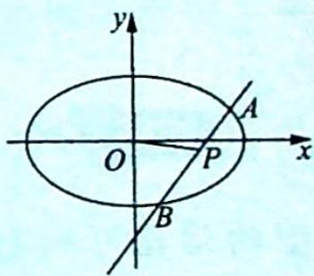
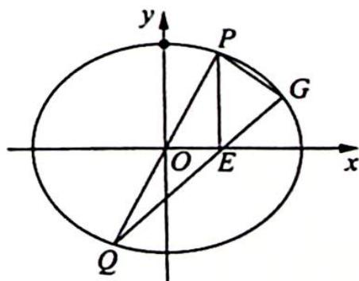

## 21.3 中点弦模型及延伸

## 研究密钥

在椭圆 $E:\frac{x^{2}}{a^{2}}+\frac{y^{2}}{b^{2}}=1(a>b>0)$ 中，如图所示，若直线 $y=kx+m(k\neq0$ 且 $m\neq0)$ 与椭圆 E 交于 A, B 两点，点 P 为弦 AB 的中点，设直线 PO 的斜率为 $k_{0}$ ，则 $k_{0}k=-\frac{b^{2}}{a^{2}}$ .

【证明】证法一(推演法): 设 $A(x_{1}, y_{1}), B(x_{2}, y_{2})$ .

由 $\left\{\begin{aligned}\frac{x^{2}}{a^{2}}+\frac{y^{2}}{b^{2}}=1\\ y=kx+m\end{aligned}\right.$ 消去 y 得 $(b^{2}+a^{2}k^{2})x^{2}+2kma^{2}x+a^{2}m^{2}-a^{2}b^{2}=0$ ，由韦

达定理得 $\left\{ \begin{array}{l} x_{1} + x_{2} = -\frac{2kma^{2}}{b^{2} + a^{2}k^{2}} \\ x_{1}x_{2} = \frac{a^{2}(m^{2} - b^{2})}{b^{2} + a^{2}k^{2}} \end{array} \right.$ ，由 $\Delta = 4k^2 m^2 a^4 - 4a^2 (b^2 + a^2 k^2)(m^2 - b^2) > 0$ 得 $a^2 k^2 + b^2 > m^2$ .

设 $P(x_0, y_0)$ , 则 $x_0 = \frac{x_1 + x_2}{2} = -\frac{kma^2}{b^2 + a^2k^2}, y_0 = kx_0 + m = \frac{mb^2}{b^2 + a^2k^2}$ , 即 $k_0 = k_{OP} = \frac{y_0}{x_0} = -\frac{b^2}{ka^2}$ , 故 $k_0k = -\frac{b^2}{a^2}$ .

证法二(点差法):不妨设 $A(x_{1},y_{1}), B(x_{2},y_{2})$ ，则 AB 的中点 $P\left(\frac{x_{1}+x_{2}}{2},\frac{y_{1}+y_{2}}{2}\right)$ .

由 $\left\{\begin{aligned}\frac{x_{1}^{2}}{a^{2}}+\frac{y_{1}^{2}}{b^{2}}=1\\ \frac{x_{2}^{2}}{a^{2}}+\frac{y_{2}^{2}}{b^{2}}=1\end{aligned}\right.$ 两式作差后得 $\frac{x_{1}^{2}-x_{2}^{2}}{a^{2}}+\frac{y_{1}^{2}-y_{2}^{2}}{b^{2}}=0$ ，从而 $\frac{y_{1}^{2}-y_{2}^{2}}{x_{1}^{2}-x_{2}^{2}}=\frac{y_{1}+y_{2}}{x_{1}+x_{2}}\cdot\frac{y_{1}-y_{2}}{x_{1}-x_{2}}=k_{0}k=$ $-\frac{b^{2}}{a^{2}}.$

证法三(斜率的几何意义):

设 $A(x_{1},y_{1}),B(x_{2},y_{2})$ ，则 $AB$ 的中点 $P\left(\frac{x_1 + x_2}{2},\frac{y_1 + y_2}{2}\right)$

$$
k _ {0} k = \frac {\frac {y _ {1} + y _ {2}}{2}}{\frac {x _ {1} + x _ {2}}{2}} \cdot \frac {y _ {1} - y _ {2}}{x _ {1} - x _ {2}} = \frac {y _ {1} + y _ {2}}{x _ {1} + x _ {2}} \cdot \frac {y _ {1} - y _ {2}}{x _ {1} - x _ {2}} = \frac {y _ {1} ^ {2} - y _ {2} ^ {2}}{x _ {1} ^ {2} - x _ {2} ^ {2}}
$$

$$
= \frac {b ^ {2} \left(1 - \frac {x _ {1} ^ {2}}{a ^ {2}}\right) - b ^ {2} \left(1 - \frac {x _ {2} ^ {2}}{a ^ {2}}\right)}{x _ {1} ^ {2} - x _ {2} ^ {2}} = \frac {\frac {b ^ {2}}{a ^ {2}} (x _ {2} ^ {2} - x _ {1} ^ {2})}{x _ {1} ^ {2} - x _ {2} ^ {2}} = - \frac {b ^ {2}}{a ^ {2}}.
$$

例21.11（2022全国新高考Ⅱ卷16）已知椭圆 $\frac{x^2}{6} + \frac{y^2}{3} = 1$ ，直线 $l$ 与椭圆在第一象限交于 $A, B$ ，与 $x$ 轴、 $y$ 轴分别交于 $M, N$ ，且 $|MA| = |NB|$ ， $|MN| = 2\sqrt{3}$ ，则直线 $l$ 的方程为 \_\_\_\_.

分析 ▶ 设直线方程 $y=kx+m$ , AB 的中点为 E, 根据中点弦模型的结论 $k_{OE} \cdot k_{AB} = -\frac{1}{2}$ 可求 k 的值, 再由另一个条件 $|MN| = 2\sqrt{3}$ 列出关于 k, m 的方程, 求 m 的值.

解析 ▶ 取 AB 的中点为 E，因为 $\left|MA\right| = \left|NB\right|$ ，则 $\left|ME\right| = \left|NE\right|$ ，根据椭圆的中点弦模型的结论可知 $k_{OE} \cdot k_{AB} = -\frac{1}{2}$ 。设 $l_{AB}: y = kx + m$ ，其中 k < 0, m > 0。

令 $x = 0$ ，则 $y = m$ ；令 $y = 0$ ，则 $x = -\frac{m}{k}$ ，故 $E\left(-\frac{m}{2k}, \frac{m}{2}\right)$ ，由 $k_{OE} \cdot k_{AB} = -\frac{1}{2}$ ，可知 $\frac{m}{2} \cdot \left(-\frac{2k}{m}\right) \cdot k = -\frac{1}{2}$ ，整理得 $k^2 = \frac{1}{2}$ ，因为 $k < 0$ ，所以 $k = -\frac{\sqrt{2}}{2}$

又 $|MN| = 2\sqrt{3}$ , 则 $m^2 + \frac{m^2}{k^2} = 12$ , 即 $m = 2$ , 故直线 $AB$ 的方程为 $y = -\frac{\sqrt{2}}{2} x + 2$ .

变式(1) 已知椭圆 $E: \frac{x^{2}}{a^{2}} + \frac{y^{2}}{b^{2}} = 1 (a > b > 0)$ 的半焦距为 $c$ , 原点 $O$ 到经过两点 $(c, 0), (0, b)$ 的直线的距离为 $\frac{1}{2} c$ .

(1)求椭圆 E 的离心率；

(2)如图所示, $AB$ 是圆 $M: (x + 2)^{2} + (y - 1)^{2} = \frac{5}{2}$ 的一条直径, 若椭圆 $E$ 经过 $A, B$ 两点, 求椭圆 $E$ 的方程.

(1)思路一(等面积法): 点到直线的距离理解为三角形斜边上的高, 用两种方式表示三角形的面积, 再结合 $a^{2} = b^{2} + c^{2}$ 求离心率; 思路二(方程思想): 根据公式和已知条件用两种方式表示点到直线的距离, 再结合 $a^{2} = b^{2} + c^{2}$ 求离心率. (2)根据中点弦模型可得 $k_{AB}$ , 因此可得直线 $AB$ 的方程, 与椭圆方程联立, 使用韦达定理可得弦长 $|AB|$ , $AB$ 又是圆的直径, 建立方程求出待定系数得椭圆方程.

解析 ▶ (1)解法一(等面积法):依题意得 $\frac{1}{2}bc=\frac{1}{2}\sqrt{b^{2}+c^{2}}\cdot\frac{c}{2}=\frac{ac}{4}$ ,得 a=2b,所以 e= $\frac{c}{a}=\sqrt{1-\frac{b^{2}}{a^{2}}}=\frac{\sqrt{3}}{2}.$

解法二(方程思想): 由题意得直线经过 $(c,0)$ ， $(0,b)$ 两点，则直线的方程为 $\frac{x}{c}+\frac{y}{b}=1$ ，即 $bx+cy-bc=0$ ，原点O到直线的距离 $d=\frac{bc}{\sqrt{b^{2}+c^{2}}}=\frac{bc}{a}=\frac{c}{2}$ ，则a=2b，故 $e=\frac{c}{a}=\sqrt{1-\frac{b^{2}}{a^{2}}}=\frac{\sqrt{3}}{2}$ .

(2)(利用中点弦模型求解)因为点 M 为弦 AB 的中点,所以 $k_{OM} \cdot k_{AB} = -\frac{b^{2}}{a^{2}} = -\frac{1}{4}$ .

又 $M(-2,1)$ , 即 $k_{OM} = -\frac{1}{2}$ , 得 $k_{AB} = \frac{1}{2}$ , 因此 $AB$ 所在的直线方程为 $y - 1 = \frac{1}{2}(x + 2)$ , 即 $x - 2y + 4 = 0$ .

联立 $\left\{\begin{aligned}x^{2}+4y^{2}&=4b^{2}\\ x-2y+4&=0\end{aligned}\right.$ ，消去x建立关于y的一元二次方程得 $(2y-4)^{2}+4y^{2}=4b^{2}$ ，化简整理得 $2y^{2}-4y+4-b^{2}=0$ 。

由韦达定理可得 $y_1 + y_2 = 2$ , $y_1y_2 = \frac{4 - b^2}{2}$ , $|AB| = \sqrt{1 + \frac{1}{k_{AB}^2}} \cdot |y_1 - y_2| = \sqrt{5}\sqrt{(y_1 + y_2)^2 - 4y_1y_2} = \sqrt{5} \cdot \sqrt{4 - 2(4 - b^2)} = \sqrt{5} \cdot \sqrt{2b^2 - 4} = \sqrt{10}$ , 所以 $2b^2 - 4 = 2, b^2 = 3$ , $a^2 = 4b^2 = 12$ .

故椭圆方程为 $\frac{x^{2}}{12}+\frac{y^{2}}{3}=1.$

## 评注

本题挖掘几何性质,利用中点弦模型 $k_{OM} \cdot k_{AB} = -\frac{b^2}{a^2}$ ,得到 $AB$ 所在直线的斜率,从而求出 $AB$ 所在直线的方程,将求解椭圆方程的问题转化到直线与椭圆相交的弦长等于圆 $M$ 的直径上来,从而求出椭圆方程,在命题意图上,命题者很好地把握了圆的几何性质以及中点弦模型的应用.在考生实际做题时,对于中点弦模型可通过点差法得到,在这里我们不再赘述,关键是通过例题及变式题的分析、研究来理解试题本身的内涵及外延,希望广大考生掌握圆锥曲线中几种常见的衍生结论,以便在考试中迅速找到解题的切入点与突破口.

## 探究总结

## 中点弦模型的拓展

椭圆中的中点弦模型: 点 P 为弦 AB 的中点, 则 $k_{OP} \cdot k_{AB} = -\frac{b^{2}}{a^{2}}$ . 另外还有以下推广.

模型演绎 1: 当 a=b 时, 椭圆演变为圆, 有 $k_{0} \cdot k = -1$ , OP 恰好是 AB 的中垂线, 在直线与圆类型的题目中, 常用这点进行解题.

模型演绎 2: 类似的模型还有如下几种, 椭圆方程均为 $\frac{x^{2}}{a^{2}} + \frac{y^{2}}{b^{2}} = 1 (a > b > 0)$ .

(1)长轴模型:如图1所示,A,B为长轴端点,P为椭圆上异于A,B的任一点,则 $k_{PA}\cdot k_{PB}=-\frac{b^{2}}{a^{2}}$ .

(2)长轴模型延伸:如图2所示,A,B为长轴端点,点M,N在椭圆上,且关于x轴对称,则 $k_{AM}\cdot k_{BN}=\frac{b^{2}}{a^{2}}$ .

(3)中心弦模型:如图3所示,MN为过原点的弦,点P在椭圆上(异于M,N两点),且 $k_{PM},k_{PN}$ 存在,则 $k_{PM}\cdot k_{PN}=-\frac{b^{2}}{a^{2}}.$

图1

图2

图3

例21.12 (2022新课标全国甲卷理10)椭圆 $C: \frac{x^2}{a^2} + \frac{y^2}{b^2} = 1 (a > b > 0)$ 的左顶点为 $A$ , 点 $P$ , $Q$ 在 $C$ 上, 且关于 $y$ 轴对称. 若直线 $AP, AQ$ 的斜率之积为 $\frac{1}{4}$ , 则 $C$ 的离心率为 (   ). A. $\frac{\sqrt{3}}{2}$ B. $\frac{\sqrt{2}}{2}$ C. $\frac{1}{2}$ D. $\frac{1}{3}$

分析 ▶ 将 AP, AQ 的斜率之积转化为 $AP'$ , AQ 的斜率之积, 利用中心弦模型公式可求得 $\frac{b^{2}}{a^{2}}$ .

解析 ▶ 设点 P 关于 x 轴的对称点为 $P'$ ，则 $P'Q$ 过原点，根据中心弦模型公式可知 $k_{AP'} \cdot k_{AQ} = -\frac{b^{2}}{a^{2}} = -\frac{1}{4}$ ，则椭圆的离心率 $e = \sqrt{1 - \frac{b^{2}}{a^{2}}} = \frac{\sqrt{3}}{2}$ 。故选 A。

变式(1) (2019 新课标全国Ⅱ卷理 21)已知点 $A(-2,0), B(2,0)$ , 动点 $M(x,y)$ 满足直线 $AM$ 与 $BM$ 的斜率之积为 $-\frac{1}{2}$ . 记 $M$ 的轨迹为曲线 $C$ .

(1) 求 C 的方程, 并说明 C 是什么曲线;

(2)过坐标原点的直线交 C 于 P, Q 两点, 点 P 在第一象限, $PE \perp x$ 轴, 垂足为 E, 连接 QE 并延长交 C 于点 G.

(i) 证明: $\triangle PQG$ 是直角三角形;

(ii) 求 $\triangle PQG$ 面积的最大值.

分析 ▶ (1)直译法翻译为代数语言,并化简得出轨迹方程;(2)(i)将证明△PQG是直角三角形转化为三边所在直线的斜率关系问题.由斜率公式和中心弦模型可知 PQ 与 QG,PG 与 QG 均不垂直,因此要证 $k_{PQ} \cdot k_{PG} = -1$ ,由中心弦模型可得 $k_{PG} \cdot k_{QG} = -\frac{1}{2}$ ,再考虑 $k_{PQ}$ 与 $k_{QG}$ 之间关系即可.(ii)设直线 PQ 的方程为 $y = kx$ ,与椭圆的方程联立,结合韦达定理及弦长公式求出 $|PQ|$ , $|PG|$ ,由 PQ,PG 的垂直关系可得 $S_{\triangle PQG} = \frac{1}{2}|PQ||PG|$ ,将 $|PQ|, |PG|$ 代入,利用函数单调性求最值.

解析 (1)由题设得 $\frac{y}{x + 2} \cdot \frac{y}{x - 2} = -\frac{1}{2}$ , 化简得 $\frac{x^2}{4} + \frac{y^2}{2} = 1 (|x| \neq 2)$ , 所以 $C$ 为中心在

(2)(i)如图所示, 设 $P(x_{1}, y_{1})(x_{1} > 0, y_{1} > 0)$ , $G(x_{2}, y_{2})$ , 则 $Q(-x_{1}, -y_{1}), E(x_{1}, 0)$ , 又 $k_{PQ} = \frac{y_{1}}{x_{1}}, k_{QE} = \frac{y_{1}}{2x_{1}}$ , 得 $k_{PQ} = 2k_{QE}$ , 即 $k_{PQ} = 2k_{QG}$ .

将点 $P(x_{1},y_{1}),G(x_{2},y_{2})$ 的坐标代入椭圆 $\frac{x^2}{4} +\frac{y^2}{2} = 1$ 中，得 $\left\{ \begin{array}{ll}\frac{x_1^2}{4} +\frac{y_1^2}{2} = 1 & ①\\ \frac{x_2^2}{4} +\frac{y_2^2}{2} = 1 & ② \end{array} \right.$ ， $① - ②$ 得， $\frac{x_1^2 - x_2^2}{4} +\frac{y_1^2 - y_2^2}{2} = 0$ ，所以 $\frac{y_1^2 - y_2^2}{x_1^2 - x_2^2} = -\frac{1}{2}$ ，即 $\frac{(y_1 + y_2)(y_1 - y_2)}{(x_1 + x_2)(x_1 - x_2)} = -\frac{1}{2}.$

设 $PG$ 中点为 $R$ , 则 $k_{OR} = k_{QG}$ , 又 $k_{OR} = \frac{y_1 + y_2}{x_1 + x_2}$ , 因此 $k_{QG} \cdot k_{PG} = -\frac{1}{2}, k_{PQ} \cdot k_{PG} = 2k_{QG} \cdot k_{PG} = -1$ , 故 $PQ \perp PG$ , 所以 $\triangle PQG$ 是直角三角形.

(2)设直线 $PQ$ 的方程为 $y = kx (k > 0)$ , 联立 $\left\{ \begin{array}{l} y = kx \\ \frac{x^2}{4} + \frac{y^2}{2} = 1 \end{array} \right.$ , 消 $y$ 得 $x^2 + 2k^2 x^2 = 4$ , 即 $x_1^2 = \frac{4}{1 + 2k^2}$ .

$$
\vert P Q \vert = \sqrt {1 + k ^ {2}} \cdot \left| x _ {P} - x _ {Q} \right| = \sqrt {1 + k ^ {2}} \cdot \left| 2 x _ {1} \right| = 2 x _ {1} \sqrt {1 + k ^ {2}}.
$$

以下求 $|PG|$ ，有两种方法.

解法一(利用弦长公式):依题意可得 $E(x_{1},0)$ 在直线 QG 上,所以直线 QG 的方程为 $y=\frac{k}{2}(x-x_{1})$ . 联立 $\left\{\begin{aligned}y&=\frac{k}{2}(x-x_{1})\\ \frac{x^{2}}{4}&+\frac{y^{2}}{2}=1\end{aligned}\right.$ ，消 y 得 $(2+k^{2})x^{2}-2x_{1}k^{2}x+k^{2}x_{1}^{2}-8=0$ ①，由于 $G(x_{2},y_{2})$ ，则 $-x_{1}$ 和 $x_{2}$ 是方程①的解，故 $\left|x_{2}-x_{1}\right|=-x_{1}+x_{2}=\frac{2k^{2}x_{1}}{2+k^{2}}$ .

由此得 $|PG| = \sqrt{1 + \frac{1}{k^2}}\cdot |x_2 - x_1| = \sqrt{1 + \frac{1}{k^2}}\cdot \frac{2k^2x_1}{2 + k^2}$ 所以 $S_{\triangle PQG} = \frac{1}{2}|PQ||PG| = \frac{1}{2}\times$ $2x_{1}\sqrt{1 + k^{2}}\cdot \sqrt{1 + \frac{1}{k^{2}}}\cdot \frac{2k^{2}x_{1}}{2 + k^{2}} = \frac{2k(1 + k^{2})x_{1}^{2}}{2 + k^{2}}.$

而 $x_{1}^{2} = \frac{4}{1 + 2k^{2}}$ ，所以 $S_{\triangle PQG} = \frac{2\cdot\frac{4}{1 + 2k^2}\cdot k(1 + k^2)}{2 + k^2} = \frac{8k(1 + k^2)}{(1 + 2k^2)(2 + k^2)} = \frac{8\left(\frac{1}{k} + k\right)}{1 + 2\left(\frac{1}{k} + k\right)^2}.$

设 $t = k + \frac{1}{k}$ , 则由 $k > 0$ 得 $t \geqslant 2$ , 当且仅当 $k = 1$ 时取等号, 则 $S = \frac{8t}{1 + 2t^2}, t \in [2, +\infty)$ . 由于 $S = \frac{8t}{1 + 2t^2} = \frac{8}{\frac{1}{t} + 2t}$ 在 $[2, +\infty)$ 上单调递减, 所以当 $t = 2$ , 即 $k = 1$ 时, $S_{\triangle PQG}$ 取得最大值为 $S_{\max} = \frac{8}{\frac{1}{2} + 2 \times 2} = \frac{16}{9}$ .

解法二(利用直角三角形中三角函数定义): $|PQ| = 2x_{1}\sqrt{1 + k^{2}} = \sqrt{1 + k^{2}}\cdot \frac{4}{\sqrt{2k^{2} + 1}}.$

又由到角公式得 $\tan \angle PQG = \frac{k - \frac{k}{2}}{1 + \frac{k^2}{2}} = \frac{k}{k^2 + 2}$ , 所以 $\frac{|PG|}{|PQ|} = \tan \angle PQG = \frac{k}{k^2 + 2}$ , 得 $|PG| = \frac{k}{k^2 + 2} \cdot |PQ| = \frac{k}{k^2 + 2} \cdot \frac{4\sqrt{1 + k^2}}{\sqrt{2k^2 + 1}}$ . 所以 $S_{\triangle PQG} = \frac{1}{2} |PQ||PG| = \frac{1}{2} \times \frac{4\sqrt{1 + k^2}}{\sqrt{2k^2 + 1}} \cdot \frac{k}{k^2 + 2}$ . $\frac{4\sqrt{1 + k^2}}{\sqrt{2k^2 + 1}} = \frac{8k(1 + k^2)}{(k^2 + 2)(2k^2 + 1)} = \frac{8\left(\frac{1}{k} + k\right)}{1 + 2\left(\frac{1}{k} + k\right)^2}$ .

以下同解法一.

## 评注

设线段 PG 的中点为 R，由中点弦的结论得 $k_{PG} \cdot k_{OR} = -\frac{b^{2}}{a^{2}} = -\frac{1}{2}$ ， $k_{OR} = k_{QG} = k_{QE}$ 。又 $k_{PQ} = 2k_{QE}$ ，则 $k_{PQ} \cdot k_{PG} = -1$ ，故 $PQ \perp PG$ 。这里充分运用了设而不求与整体代入的思想，是解析几何中用代数解决几何问题的重要思想。
