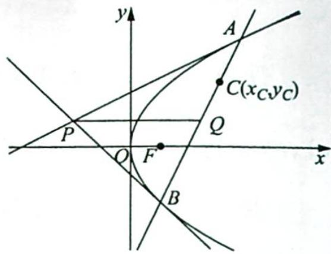
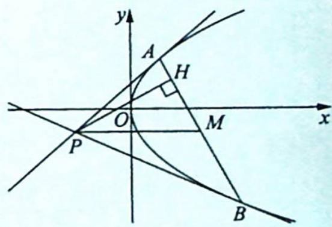
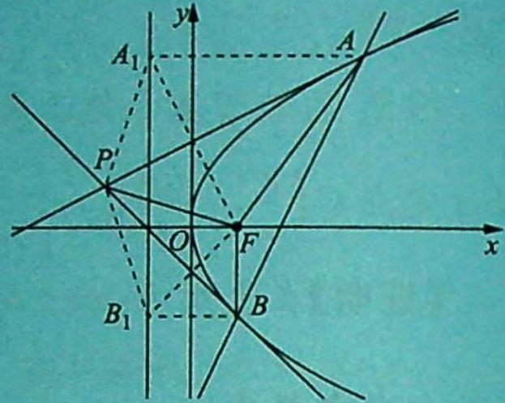
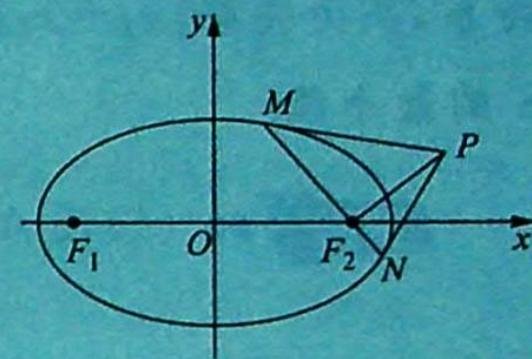
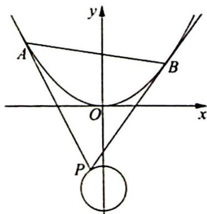

## 21.4.2 阿基米德三角形模型的拓展

## 研究密钥

模型演绎一:有关顶点和底边过定点的相关性质

性质1:如图所示,已知抛物线 $y^{2}=2px(p>0)$ 的焦点为 $F,A(x_{1},y_{1}),B(x_{2},y_{2})$ 是抛物线上的两点,直线AB恒过抛物线内一点 $C(x_{C},y_{C})$ .以A,B两点为切点的抛物线的两条切线相交于点 $P$ , 设线段 $AB$ 的中点为 $Q$ , 连接 $PQ$ , 则有如下结论:

①点 P 的坐标为 $\left(\frac{y_{1}y_{2}}{2p},\frac{y_{1}+y_{2}}{2}\right)$ ;

② $PQ \perp y$ 轴（即 $PQ \parallel x$ 轴）；

③直线 AB 的方程为 $2px-(y_{1}+y_{2})y+y_{1}y_{2}=0$ ;

④△PAB 的面积为 $\frac{|y_{1}-y_{2}|^{3}}{8p}$ ;

⑤点 P 位于直线 $y_{CY}-p(x+x_{C})=0$ 上.

【证明】①根据 $A(x_{1},y_{1})$ , $B(x_{2},y_{2})$ 易得直线 PA, PB 的方程分别为 $y_{1}y = p(x + x_{1})$ , $y_{2}y=p(x+x_{2})$ ，联立方程组 $\left\{\begin{aligned}y_{1}y=p(x+x_{1})\\ y_{2}y=p(x+x_{2})\end{aligned}\right.$ ，解得 $\left\{\begin{aligned}x&=\frac{y_{1}y_{2}}{2p}\\ y&=\frac{y_{1}+y_{2}}{2}\end{aligned}\right.$ 所以点 P 的坐标为 $\left(\frac{y_{1}y_{2}}{2p},\frac{y_{1}+y_{2}}{2}\right)$ .

②因为点 $Q$ 为线段 $AB$ 的中点, 所以点 $Q$ 的坐标为 $\left(\frac{x_1 + x_2}{2}, \frac{y_1 + y_2}{2}\right)$ , 则点 $P$ 与点 $Q$ 的纵坐标相同, $PQ \parallel x$ 轴, 即 $PQ \perp y$ 轴.

③由直线方程的点斜式得直线 AB 的方程为 $x - x_{1} = \frac{x_{1} - x_{2}}{y_{1} - y_{2}} (y - y_{1})$ ，将 $\left\{\begin{aligned}x_{1}&=\frac{y_{1}^{2}}{2p}\\ x_{2}&=\frac{y_{2}^{2}}{2p}\end{aligned}\right.$ 代入上式化简得直线 AB 的方程为 $2px - (y_{1} + y_{2})y + y_{1}y_{2} = 0$ .

④根据上述若干结论可得点 $P\left(\frac{y_1y_2}{2p}, \frac{y_1 + y_2}{2}\right)$ 到直线 $AB: 2px - (y_1 + y_2)y + y_1y_2 = 0$ 的距离 $d = \frac{\left|2p \cdot \frac{y_1y_2}{2p} - (y_1 + y_2) \cdot \frac{y_1 + y_2}{2} + y_1y_2\right|}{\sqrt{4p^2 + (y_1 + y_2)^2}} = \frac{(y_1 - y_2)^2}{2\sqrt{4p^2 + (y_1 + y_2)^2}}$ ，又 $|AB| = \sqrt{1 + \left(\frac{y_1 + y_2}{2p}\right)^2} |y_1 - y_2| = \frac{\sqrt{4p^2 + (y_1 + y_2)^2}}{2p} |y_1 - y_2|$ ，所以 $S_{\triangle PAB} = \frac{1}{2} |AB| \cdot d = \frac{1}{2} \times \frac{\sqrt{4p^2 + (y_1 + y_2)^2}}{2p} \cdot |y_1 - y_2| \cdot \frac{(y_1 - y_2)^2}{2\sqrt{4p^2 + (y_1 + y_2)^2}} = \frac{|y_1 - y_2|^3}{8p}$ .

⑤设 $P(x, y)$ ，由①得到 $\begin{cases} x = \frac{y_1y_2}{2p} \\ y = \frac{y_1 + y_2}{2} \end{cases}$ ，所以 $\begin{cases} y_1y_2 = 2px \\ y_1 + y_2 = 2y \end{cases}$ .

又点 C 位于直线 AB 上, 所以由③可得 $2px_{C}-(y_{1}+y_{2})y_{C}+y_{1}y_{2}=0$ .

将 $\left\{ \begin{array}{l} y_{1}y_{2} = 2px \\ y_{1} + y_{2} = 2y \end{array} \right.$ 代入上式可得 $y_{C}y - p(x + x_{C}) = 0$ ，即点 $P$ 位于直线 $y_{C}y - p(x + x_{C}) = 0$ 上.

性质2: 若阿基米德三角形的顶点 $P$ 在定直线 $L: ax + by + c = 0 (a \neq 0)$ 上, 则其底边 $AB$ 恒过定点 $C\left(\frac{c}{a}, -\frac{bp}{a}\right)$ .

【证明】在直线 $L: ax + by + c = 0$ 上任取一点 $P_{0}(m, n)$ , 则 $am + bn + c = 0$ , 则易求得直线 $L$ 的参数方程为 $\left\{ \begin{array}{l} x = m + bt \\ y = n - at \end{array} \right.$ , 其中 $t$ 是参数.

由性质1可知,当点 $P$ 的坐标为 $(m + bt, n - at)$ 时, 直线 $AB$ 的方程为 $(n - at)y = p[x + (m + bt)]$ , 化简得 $(pb + ay)t = ny - px - pm$ .

由 $\left\{\begin{aligned}pb+ay=0\\ny-px-pm=0\end{aligned}\right.$ 并结合 $am+bn+c=0$ ，解得 $\left\{\begin{aligned}x=\frac{c}{a}\\ y=-\frac{bp}{a}\end{aligned}\right.$ ，即直线 AB 恒过定点 $C\left(\frac{c}{a},-\frac{bp}{a}\right).$

模型演绎二:有关阿基米德三角形面积的性质

性质3: 若阿基米德三角形底边 $AB$ 的长度为定值 $a$ , 则 $\triangle PAB$ 的面积的最大值为 $\frac{a^3}{8p}$ .

【证明】如图所示, 过点 P 作 $PH \perp AB$ 于点 H.

设点 M 是 AB 的中点，则 $M\left(\frac{x_{1}+x_{2}}{2},\frac{y_{1}+y_{2}}{2}\right)$ .

由性质1知 $P\left(\frac{y_1y_2}{2p},\frac{y_1 + y_2}{2}\right)$ ，结合 $\left\{ \begin{array}{l}x_{1} = \frac{y_{1}^{2}}{2p}\\ x_{2} = \frac{y_{2}^{2}}{2p} \end{array} \right.$ 得

$|PM| = \frac{x_1 + x_2}{2} - \frac{y_1y_2}{2p} = \frac{\frac{y_1^2}{2p} + \frac{y_2^2}{2p}}{2} - \frac{y_1y_2}{2p} = \frac{(y_1 - y_2)^2}{4p}$ ①.

设直线 AB 的方程为 $x = my + n$ ，则由弦长公式得 $\left|AB\right| = \sqrt{1 + m^{2}} \left|y_{1} - y_{2}\right| = a$ ，即 $\left|y_{1} - y_{2}\right| = \frac{a}{\sqrt{1 + m^{2}}}$ ②，根据①②两式可得 $\triangle PAB$ 的面积 $S_{\triangle PAB} = \frac{1}{2} \left|AB\right| \cdot \left|PH\right| = \frac{1}{2} a \cdot \left|PH\right| \leqslant \frac{1}{2} a \cdot \left|PM\right| = \frac{a(y_{1} - y_{2})^{2}}{8p} = \frac{a^{3}}{8p(1 + m^{2})} \leqslant \frac{a^{3}}{8p}$ ，当且仅当 $AB \perp x$ 轴时等号成立.

## 模型演绎三:和阿基米德三角形有关的轨迹问题

性质4: 若抛物线 $y^{2}=2px(p>0)$ 的焦点为 $F\left(\frac{p}{2},0\right)$ ，则 $\angle PFA=\angle PFB$ .

【证明】如图所示，过点 $A$ 作 $AA_{1}$ 垂直于抛物线的准线于点 $A_{1}$ ，过点 $B$ 作 $BB_{1}$ 垂直于抛物线的准线于点 $B_{1}$ ，连接 $PA_{1}$ ， $A_{1}F, PB_{1}, B_{1}F$ ，则有 $A_{1}\left(-\frac{p}{2}, y_{1}\right), B_{1}\left(-\frac{p}{2}, y_{2}\right)$ ，所以 $\overrightarrow{A_{1}F} \cdot \overrightarrow{PA} = \left(\frac{p}{2} - \left(-\frac{p}{2}\right), 0 - y_{1}\right) \cdot \left(\frac{y_{1}^{2}}{2p} - \frac{y_{1}y_{2}}{2p}, y_{1} - \frac{y_{1} + y_{2}}{2}\right) = 0$ ，故 $A_{1}F \perp PA$ .

又 $|AA_{1}|=|AF|$ ，所以 PA 是 $A_{1}F$ 的垂直平分线， $|PA_{1}|=|PF|$ ，同理可证 $|PB_{1}|=|PF|$ ，则 $|PA_{1}|=|PB_{1}|$ ， $\angle PA_{1}B_{1}=\angle PB_{1}A_{1}$ ，即 $\angle PA_{1}A=\angle PA_{1}B_{1}+\angle AA_{1}B_{1}=\angle PA_{1}B_{1}+90^{\circ}=\angle PB_{1}A_{1}+90^{\circ}=\angle PB_{1}A_{1}+\angle BB_{1}A_{1}=\angle PB_{1}B.$ 易证 $\triangle PA_{1}A\cong\triangle PFA,\triangle PB_{1}B\cong\triangle PFB$ ，故 $\angle PFA=\angle PA_{1}A=\angle PB_{1}B=\angle PFB.$

## 模型演绎四:椭圆和双曲线的阿基米德三角形的性质

圆锥曲线中一条弦的两个端点和这两个端点处的切线的交点所构成的三角形叫作阿基米德三角形,这条弦叫作阿基米德三角形的底边,两切线的交点叫作阿基米德三角形的顶点.类比于抛物线的阿基米德三角形的许多性质,可得到椭圆和双曲线的阿基米德三角形的一些性质.

性质5:圆锥曲线的切点弦:设点 $P(x_{0},y_{0})$ 是圆锥曲线外任意一点,过点P向圆锥曲线引两条切线,切点分别为 $M(x_{1},y_{1}),N(x_{2},y_{2})$ ,则线段MN称为圆锥曲线的切点弦.

【证明】设椭圆、双曲线和抛物线的方程分别为 $\frac{x^2}{a^2} + \frac{y^2}{b^2} = 1 (a > b > 0)$ , $\frac{x^2}{a^2} - \frac{y^2}{b^2} = 1$ $(a > 0, b > 0)$ 和 $y^2 = 2px (p > 0)$ , 则椭圆、双曲线和抛物线在点 $M(x_1, y_1)$ 处的切线方程分别为 $\frac{x_1x}{a^2} + \frac{y_1y}{b^2} = 1$ , $\frac{x_1x}{a^2} - \frac{y_1y}{b^2} = 1$ 和 $y_1y = p(x + x_1)$ .

因为点 P 在上述切线上, 所以 $(x_{0}, y_{0})$ 满足 $\frac{x_{1}x_{0}}{a^{2}} + \frac{y_{1}y_{0}}{b^{2}} = 1, \frac{x_{1}x_{0}}{a^{2}} - \frac{y_{1}y_{0}}{b^{2}} = 1$ 和 $y_{1}y_{0} = p(x_{0} + x_{1})$ , 同样可得 $(x_{0}, y_{0})$ 满足 $\frac{x_{2}x_{0}}{a^{2}} + \frac{y_{2}y_{0}}{b^{2}} = 1, \frac{x_{2}x_{0}}{a^{2}} - \frac{y_{2}y_{0}}{b^{2}} = 1$ 和 $y_{2}y_{0} = p(x_{0} + x_{2})$ , 则椭圆、双曲线和抛物线的过 M, N 两点的直线方程分别为 $\frac{x_{0}x}{a^{2}} + \frac{y_{0}y}{b^{2}} = 1, \frac{x_{0}x}{a^{2}} - \frac{y_{0}y}{b^{2}} = 1$ 和 $y_{0}y = p(x + x_{0})$ .

故椭圆、双曲线和抛物线对应点 $P(x_0, y_0)$ 的切点弦方程分别为 $\frac{x_0 x}{a^2} + \frac{y_0 y}{b^2} = 1, \frac{x_0 x}{a^2} - \frac{y_0 y}{b^2} = 1$ 和 $y_0 y = p(x + x_0)$ .

性质6: 已知椭圆的方程为 $\frac{x^2}{a^2} + \frac{y^2}{b^2} = 1 (a > b > 0)$ , 点 $F_2$ 是椭圆的右焦点, 线段 $MN$ 是过点 $F_2$ 的椭圆的焦点弦, 过 $M, N$ 两点作椭圆的两条切线交于点 $P$ , 则点 $P$ 的轨迹是椭圆的右准线 $l$ , 且 $F_2 P \perp MN$ .

【证明】如图所示，设 $P(x_0, y_0), M(x_1, y_1), N(x_2, y_2)$ ，则切点弦 $MN$ 的方程为 $\frac{x_0x}{a^2} + \frac{y_0y}{b^2} = 1$ ，直线 $MP$ 的方程为 $\frac{x_1x}{a^2} + \frac{y_1y}{b^2} = 1$ ，直线 $NP$ 的方程为 $\frac{x_2x}{a^2} + \frac{y_2y}{b^2} = 1$ 。因为切点弦 $MN$ 经过点 $F_2(c, 0)$ ，所以将

点 $F_{2}$ 的坐标代入切点弦 $MN$ 的方程得 $x_{0} = \frac{a^{2}}{c}, P\left(\frac{a^{2}}{c}, y_{0}\right)$ , 即点 $P$ 在椭圆的右准线 $l$ 上.

因为点 $P$ 在直线 $MP$ 和直线 $NP$ 上，所以 $\left\{ \begin{array}{l} x_{1} \cdot \frac{a^{2}}{c} \\ \frac{a^{2}}{a^{2}} + \frac{y_{1} y_{0}}{b^{2}} = 1 \end{array} \right.$ ，解得 $y_{0}(y_{2} - y_{1}) =$ $\frac{x_{2} \cdot \frac{a^{2}}{c}}{a^{2}} + \frac{y_{2} y_{0}}{b^{2}} = 1$

$$
- \frac {b ^ {2}}{c} (x _ {2} - x _ {1})
$$

又 $\overrightarrow{F_2P} = \left(\frac{a^2}{c} - c, y_0\right) = \left(\frac{b^2}{c}, y_0\right), \overrightarrow{MN} = (x_2 - x_1, y_2 - y_1)$ ，所以 $\overrightarrow{F_2P} \cdot \overrightarrow{MN} = \left(\frac{b^2}{c}, y_0\right) \cdot (x_2 - x_1, y_2 - y_1) = \frac{b^2}{c} (x_2 - x_1) + y_0 (y_2 - y_1) = 0$ ，即 $F_2P \perp MN$ .

性质7: 已知双曲线的方程为 $\frac{x^{2}}{a^{2}} - \frac{y^{2}}{b^{2}} = 1 (a > 0, b > 0)$ , 点 $F_{2}$ 是双曲线的右焦点, 线段 $MN$ 是过点 $F_{2}$ 的双曲线的焦点弦, 过 $M, N$ 两点作双曲线的两条切线交于点 $P$ , 则点 $P$ 的轨迹是双曲线的右准线 $l$ , 且 $F_{2} P \perp MN$ .

证明过程与性质 6 类似, 在此不再赘述.

例 21.14 设点 P 为直线 y = x - 2 上的动点，过点 P 作抛物线 $y = \frac{1}{2}x^{2}$ 的切线，切点分别为 A, B.

(1) 求证: 直线 AB 过定点;

(2)求 $\triangle PAB$ 的面积S的最小值,以及S取得最小值时点P的坐标.

分析 (1)联立抛物线 $y = \frac{1}{2} x^2$ 在点 $A, B$ 处的切线方程，化简可得点 $P$ 的坐标，满足直线方程 $y = x - 2$ ，将化简结果代入直线 $AB$ 的方程可得定点。(2)思路一：根据模型演绎一的性质 1 可得 $\triangle PAB$ 的面积为 $\frac{|x_1 - x_2|^3}{8p}$ ；思路二：根据三角形面积公式可得 $S_{\triangle ABC} = \frac{1}{2} |x_1y_2 - x_2y_1| = \frac{|x_1 - x_2|^3}{8p}$ . 由点 $P\left(\frac{x_1 + x_2}{2}, \frac{x_1x_2}{2}\right)$ 在直线 $y = x - 2$ 上，得到 $x_1 + x_2, x_1x_2$ 的关系，从而得到 $|x_1 - x_2| = \sqrt{(x_1 + x_2)^2 - 4x_1x_2}$ 的取值范围，代入面积公式可得 $\triangle PAB$ 的面积 $S$ 的最小值.

解析 (1) 设 $A\left(x_{1}, \frac{x_{1}^{2}}{2}\right), B\left(x_{2}, \frac{x_{2}^{2}}{2}\right)$ , 抛物线 $y = \frac{1}{2} x^{2}$ 在点 $A$ 处的切线方程为 $y - \frac{x_{1}^{2}}{2} = x_{1}(x - x_{1})$ , 即 $y = x_{1}x - \frac{x_{1}^{2}}{2}$ , 同理可得抛物线 $y = \frac{1}{2} x^{2}$ 在点 $B$ 处的切线方程 $y = x_{2}x - \frac{x_{2}^{2}}{2}$ , 联立得 $x_{1}x - \frac{x_{1}^{2}}{2} = x_{2}x - \frac{x_{2}^{2}}{2}$ , 故 $(x_{1} - x_{2})x = \frac{x_{1}^{2} - x_{2}^{2}}{2}$ , 即 $x = \frac{x_{1} + x_{2}}{2}$ , 代入 $y = x_{1}x - \frac{x_{1}^{2}}{2} = \frac{x_{1}x_{2}}{2}$ , 即点 $P(\frac{x_{1} + x_{2}}{2}, \frac{x_{1}x_{2}}{2})$ .

由 $P$ 点在直线 $y = x - 2$ 上，即 $\frac{x_1x_2}{2} = \frac{x_1 + x_2}{2} - 2 \Leftrightarrow x_1x_2 = x_1 + x_2 - 4.$

又 $AB$ 的方程 $\frac{y - \frac{x_1^2}{2}}{x - x_1} = \frac{\frac{x_1^2}{2} - \frac{x_2^2}{2}}{x_1 - x_2} = \frac{x_1 + x_2}{2}$ , 则 $y - \frac{x_1^2}{2} = \frac{x_1 + x_2}{2}x - \frac{x_1^2 + x_1x_2}{2}$ , 即 $y = \frac{x_1 + x_2}{2}x - \frac{x_1x_2}{2} = \frac{x_1 + x_2}{2}x - \frac{x_1 + x_2}{2} + 2 = \frac{x_1 + x_2}{2}(x - 1) + 2.$

故直线 AB 过定点 $(1,2)$ .

(2)解法一(运用阿基米德三角形的性质):如图所示,过点P作y轴的平行线与AB相交于点M,则 $S_{\triangle PAB}=\frac{1}{2}|PM||x_{1}-x_{2}|$ ,又 $|PM|=|y_{M}-y_{P}|$ ,易证M为AB的中点,所以 $y_{M}=\frac{y_{1}+y_{2}}{2}=\frac{x_{1}^{2}+x_{2}^{2}}{4},y_{P}=\frac{x_{1}x_{2}}{2}$ ,因此 $|PM|=\frac{x_{1}^{2}+x_{2}^{2}}{4}-\frac{x_{1}x_{2}}{2}=\frac{(x_{1}-x_{2})^{2}}{4}$ ,那么S

$\frac{x_1^2 + x_2^2}{4}, y_P = \frac{x_1x_2}{2}$ , 因此 $|PM| = \frac{x_1^2 + x_2^2}{4} - \frac{x_1x_2}{2} = \frac{(x_1 - x_2)^2}{4}$ , 那么 $S_{\triangle PAB} = \frac{1}{8}|x_1 - x_2|^3$ .

再看 $|x_1 - x_2|^2 = (x_1 + x_2)^2 - 4x_1x_2$ ，又 $P\left(\frac{x_1 + x_2}{2}, \frac{x_1x_2}{2}\right)$ ，且点 $P$ 在直线 $y = x - 2$ 上，不妨设 $\frac{x_1 + x_2}{2} = a$ ，则 $\frac{x_1x_2}{2} = a - 2$ ，因此 $x_1 + x_2 = 2a, x_1x_2 = 2a - 4$ .

故 $(x_{1}-x_{2})^{2}=(x_{1}+x_{2})^{2}-4x_{1}x_{2}=4a^{2}-8a+16=4(a^{2}-2a+1)+12=4(a-1)^{2}+12\geqslant$ 12(当且仅当 a=1 时, 取“=”).

此时， $S_{\triangle PAB}$ 的最小值为 $\frac{1}{8} \times (2\sqrt{3})^{3} = 3\sqrt{3}$ ，此时点 P 的坐标为 $(1, -1)$ .

解法二(运用三角形面积公式):如图所示, $\overrightarrow{AB}=(x_{1},y_{1}),\overrightarrow{AC}=(x_{2},y_{2})$ , $S_{\triangle ABC}=\frac{1}{2}\left|x_{1}y_{2}-x_{2}y_{1}\right|$ .

在本题中，设 $P(x_0, y_0), A\left(x_1, \frac{x_1^2}{2}\right), B\left(x_2, \frac{x_2^2}{2}\right)$ ，且 $x_0 = \frac{x_1 + x_2}{2}, y_0 = \frac{x_1x_2}{2}$ ，那么 $\overrightarrow{PA} = \left(x_1 - \frac{x_1 + x_2}{2}, \frac{x_1^2}{2} - \frac{x_1x_2}{2}\right) = \left(\frac{x_1 - x_2}{2}, \frac{x_1(x_1 - x_2)}{2}\right)$ ，同理 $\overrightarrow{PB} = \left(x_2 - \frac{x_1 + x_2}{2}, \frac{x_2^2}{2} - \frac{x_1x_2}{2}\right) = \left(\frac{x_2 - x_1}{2}, \frac{x_2(x_2 - x_1)}{2}\right)$ ，则 $S_{\triangle PAB} = \frac{1}{2} \left| \frac{x_2}{4}(x_1 - x_2)(x_2 - x_1) - \frac{x_1}{4}(x_2 - x_1)(x_1 - x_2) \right| = \frac{1}{8} |-x_2 (x_1 - x_2)^2 + x_1 (x_1 - x_2)^2| = \frac{1}{8} |x_1 - x_2|^3.$

计算 $S_{\triangle PAB} = \frac{1}{8}\left|x_1 - x_2\right|^3$ 的最值方法同上.

## 评注

若 $P$ 点的运动轨迹由直线 $y = x - 2$ 变为其他曲线, 如圆、圆锥曲线等, 其方法是不变的, 只是计算的复杂度不同.

变式 1 (2021 新课标全国 I 卷理 21) 已知抛物线 $C: x^{2} = 2py (p > 0)$ 的焦点为 $F$ , 且 $F$ 与圆 $M: x^{2} + (y + 4)^{2} = 1$ 上点的距离的最小值为 4.

(1) 求 $p$ ;

(2)若点 $P$ 在 $M$ 上, $PA, PB$ 是 $C$ 的两条切线, $A, B$ 是切点, 求 $\triangle PAB$ 面积的最大值.

解析 ▶ (1) 设 $F\left(0, \frac{p}{2}\right)$ , 由题意可得 $\frac{p}{2} + 3 = 4$ , 解得 $p = 2$ .

(2)解法一:由(1)知,抛物线C的方程为 $x^{2}=4y$ .如图所示,设 $A(x_{1},\frac{x_{1}^{2}}{4}),B(x_{2},\frac{x_{2}^{2}}{4})$ ,抛物线 $y=\frac{1}{4}x^{2}$ 在点A处的切线方程为 $y-\frac{x_{1}^{2}}{4}=\frac{x_{1}}{2}(x-x_{1})$ ,即 $y=\frac{x_{1}}{2}x-\frac{x_{1}^{2}}{4}$ .

同理抛物线 $y = \frac{1}{4} x^2$ 在点 $B$ 处的切线方程为 $y - \frac{x_2^2}{4} = \frac{x_2}{2}(x - x_2)$ ，即 $y = \frac{x_2}{2} x - \frac{x_2^2}{4}$ ，得 $\frac{x_1x}{2} - \frac{x_1^2}{4} = \frac{x_2x}{2} - \frac{x_2^2}{4}, \frac{x_1 - x_2}{2} x = \frac{x_1^2 - x_2^2}{4}$ ，故 $x = \frac{x_1 + x_2}{2}, y = \frac{x_1x_2}{4}$ ，即 $P\left(\frac{x_1 + x_2}{2}, \frac{x_1x_2}{4}\right)$ .

那么 $S_{\triangle PAB} = \frac{1}{2}\left|\frac{y_1 + y_2}{2} -\frac{x_1x_2}{4}\right|x_1 - x_2| = \frac{1}{2}\left|\frac{x_1^2 + x_2^2 - 2x_1x_2}{8}\right|x_1 - x_2| = \frac{1}{16}|x_1 - x_2|^3.$

再来分析点 $P\left(\frac{x_1 + x_2}{2}, \frac{x_1x_2}{4}\right)$ 在圆 $x^2 + (y + 4)^2 = 1$ 上，则有 $\left\{ \begin{array}{l} \frac{x_1 + x_2}{2} = \cos \theta \\ \frac{x_1x_2}{4} + 4 = \sin \theta \end{array} \right.$ ( $\theta \in [0, 2\pi]$ ), 故 $\left\{ \begin{array}{l} x_1 + x_2 = 2\cos \theta \\ x_1x_2 = 4\sin \theta - 16 \end{array} \right.$ , 那么 $|x_1 - x_2|^2 = (x_1 + x_2)^2 - 4x_1x_2 = 4\cos^2\theta - 4(4\sin \theta - 16) = 4\cos^2\theta - 16\sin \theta + 64 = -4\sin^2\theta - 16\sin \theta + 68 = -4(\sin \theta + 2)^2 + 84, \theta \in [0, 2\pi]$ .

当 $\sin \theta = -1$ 时， $|x_1 - x_2|^2$ 取最大值，且 $|x_1 - x_2|_{\max}^2 = 80$ ，故 $S_{\triangle PAB}$ 的最大值为 $\frac{1}{16} \times 80 \times \sqrt{80} = 20\sqrt{5}$ .

解法二(运用△PAB 的顶点坐标表示面积): 设 $P(x_{0}, y_{0})$ , $A(x_{1}, \frac{x_{1}^{2}}{4})$ , $B(x_{2}, \frac{x_{2}^{2}}{4})$ , 且 $x_{0} = \frac{x_{1} + x_{2}}{2}$ , $y_{0} = \frac{x_{1}x_{2}}{4}$ , $\overrightarrow{PA} = \left(x_{1} - \frac{x_{1} + x_{2}}{2}, \frac{x_{1}^{2}}{4} - \frac{x_{1}x_{2}}{4}\right) = \left(\frac{x_{1} - x_{2}}{2}, \frac{x_{1}(x_{1} - x_{2})}{4}\right)$ , $\overrightarrow{PB} = \left(x_{2} - \frac{x_{1} + x_{2}}{2}, \frac{x_{2}^{2}}{4} - \frac{x_{1}x_{2}}{4}\right) = \left(\frac{x_{2} - x_{1}}{2}, \frac{x_{2}(x_{2} - x_{1})}{4}\right)$ , $S_{\triangle PAB} = \frac{1}{2} \left| \frac{-x_{2}}{8}(x_{1} - x_{2})^{2} + \frac{x_{1}}{8}(x_{1} - x_{2})^{2} \right| = \frac{1}{16} |x_{1} - x_{2}|^{3}$ .

求最值的方法同解法一.

评注 对于抛物线 $C: x^{2} = 2py (p > 0)$ , 设 $P(x_{0}, y_{0}), PA, PB$ 是 $C$ 的两条切线, $A(x_{1}, y_{1}), B(x_{2}, y_{2})$ 是切点, 则阿基米德 $\triangle PAB$ 的面积 $S_{\triangle PAB} = \frac{\sqrt{(x_{0}^{2} - 2py_{0})^{3}}}{p} = \frac{|x_{1} - x_{2}|^{3}}{8p}$ .

变式(2) (2018 浙江卷理 21)如图所示,已知点 $P$ 是 $y$ 轴左侧(不含 $y$ 轴)一点,抛物线 $C: y^{2} = 4x$ 上存在不同的两点 $A, B$ 满足 $PA, PB$ 的中点均在 $C$ 上.

(1)设 ${AB}$ 中点为 $M$ ,证明： ${PM}$ 垂直于 $y$ 轴；

(2) 若 $P$ 是半椭圆 $x^{2} + \frac{y^{2}}{4} = 1 (x < 0)$ 上的动点, 求 $\triangle PAB$ 面积的取值范围.

解析 (1) 设 $P(x_0, y_0), A(\frac{1}{4}y_1^2, y_1), B(\frac{1}{4}y_2^2, y_2)$ . 因为 $PA, PB$ 的中点在抛物线上, 所以 $y_{1}, y_{2}$ 为方程 $y^{2} - 2y_{0}y + 8x_{0} - y_{0}^{2} = 0$ 的两个不同的实数根，则 $y_{1} + y_{2} = 2y_{0}, \frac{y_{1} + y_{2}}{2} = y_{0}$ ，点 $M$ 的纵坐标等于点 $P$ 的纵坐标。

因此，PM 垂直于 y 轴。

(2)由(1)可知 $\left\{ \begin{array}{l} y_{1} + y_{2} = 2y_{0} \\ y_{1}y_{2} = 8x_{0} - y_{0}^{2} \end{array} \right.$ , 所以 $|PM| = \frac{1}{8}(y_1^2 + y_2^2) - x_0 = \frac{3}{4}y_0^2 - 3x_0, |y_1 - y_2| = 2\sqrt{2(y_0^2 - 4x_0)}$ , 因此 $\triangle PAB$ 的面积 $S_{\triangle PAB} = \frac{1}{2}|PM||y_1 - y_2| = \frac{3\sqrt{2}}{4}(y_0^2 - 4x_0)^{\frac{3}{2}}$ . 又 $x_0^2 + \frac{y_0^2}{4} = 1 (-1 \leqslant x_0 < 0)$ , 所以 $y_0^2 - 4x_0 = -4x_0^2 - 4x_0 + 4 \in [4,5]$ .

故 $\triangle PAB$ 面积的取值范围是 $\left[6\sqrt{2},\frac{15\sqrt{10}}{4}\right]$ .
