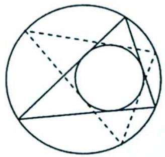
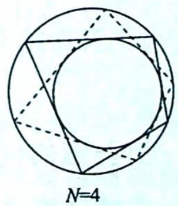
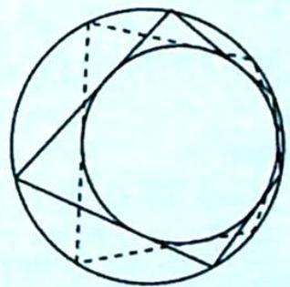

## 21.5 彭色列闭合定理及延伸

## 研究密钥

彭色列闭合定理 平面上有两个圆(可以推广为圆锥曲线), 设想在外圆上有一只跳蚤, 它从某点出发, 每次沿着向内圆作出的一条切线跳到外圆上的一个新的点, 如果经过 $N$ 次跳跃后它回到了起点, 我们就说它的路径闭合. 彭色列闭合定理断言: 跳蚤的路径是否闭合和它的起始位置无关, 也就是说, 假设它从外圆上某点出发经过 $N$ 次跳跃后回到起点, 那么它从外圆上任意一点出发经过 $N$ 次跳跃后也一定回到起点.

以上即为圆中的彭色列闭合定理,如图所示,当 $N = 3$ 时是最简明的情况.此定理在圆锥曲线中同样成立.该定理描述为:平面上给定两条圆锥曲线,若存在一封闭多边形外切其中一条圆锥曲线且内接另一条圆锥曲线,则此封闭多边形内接的圆锥曲线上每一个点都是满足这样(外切内接)性质的封闭多边形的顶点,且所有满足此性质的封闭多边形的边数相同.

  
N=3

  
N=5

例 21.15 (2021 新课标全国甲卷文 21) 抛物线 C 的顶点为坐标原点 O，焦点在 x 轴上，直线 l: x = 1 交 C 于 P, Q 两点，且 $OP \perp OQ$ . 已知点 $M(2,0)$ ，且 $\odot M$ 与 l 相切.

(1) 求 $C, \odot M$ 的方程；

(2) 设 $A_{1}, A_{2}, A_{3}$ 是 $C$ 上的三个点, 直线 $A_{1}A_{2}, A_{1}A_{3}$ 均与 $\odot M$ 相切, 判断直线 $A_{2}A_{3}$ 与 $\odot M$ 的位置关系, 并说明理由.

分析 ▶ (1)根据题意可得 $PQ$ 过定点 $(1,0)$ , 直线 $l: x = 1$ 与抛物线 $C$ 的一个交点为 $(1,1)$ , 代入可得 $p$ 的值, 即可求出 $C$ 的方程. 由题意可得圆心为 $M(2,0)$ , 圆的半径 1 , 即可求出 $\odot M$ 的方程. (2)直线 $A_{1}A_{2}, A_{1}A_{3}$ 均与 $\odot M$ 相切, 根据圆心到直线的距离公式可得两个方程, 根据方程思想和韦达定理可得 $y_{2} + y_{3}, y_{2}y_{3}$ . 由题意可得直线 $A_{2}A_{3}$ 的方程, 求出圆心到直线的距离, 即可判断直线 $A_{2}A_{3}$ 与 $\odot M$ 的位置关系.

解析 (1) 因为 $OP \perp OQ$ , 所以 $PQ$ 过定点 $(1,0)$ , 抛物线 $C$ 过点 $(1,1)$ , 故 $2p = 1$ , 解得 $p = \frac{1}{2}$ , 则 $C$ 的方程为 $y^2 = x$ .

由题意可得圆心为 $M(2,0)$ ，圆的半径 1，故 $\odot M$ 的方程为 $(x-2)^{2}+y^{2}=1$ 。

(2) 设 $A_{1}(x_{1}, y_{1}), A_{2}(x_{2}, y_{2}), A_{3}(x_{3}, y_{3})$ ，直线 $A_{1}A_{2}$ 的方程为 $\frac{y - y_{1}}{y_{2} - y_{1}} = \frac{x - y_{1}^{2}}{y_{2}^{2} - y_{1}^{2}}$ ，即 $x - (y_{2} + y_{1})y + y_{1}y_{2} = 0$ ，直线 $A_{1}A_{2}$ 与 $\odot M$ 相切，所以点 $M(2,0)$ 到直线 $A_{1}A_{2}$ 的距离为 1，则 $1 = \frac{|2 + y_{1}y_{2}|}{\sqrt{1 + (y_{2} + y_{1})^{2}}}$ ，即 $(y_{1}^{2} - 1)y_{2}^{2} + 2y_{1}y_{2} + 3 - y_{1}^{2} = 0.$

同理可得 $(y_{1}^{2} - 1)y_{3}^{2} + 2y_{1}y_{3} + 3 - y_{1}^{2} = 0$ ，所以 $y_{2},y_{3}$ 是方程 $(y_{1}^{2} - 1)t^{2} + 2y_{1}t + 3 - y_{1}^{2} = 0$ 的两个根， $y_{2} + y_{3} = -\frac{2y_{1}}{y_{1}^{2} - 1},y_{2}y_{3} = \frac{3 - y_{1}^{2}}{y_{1}^{2} - 1}.$

由题意可得直线 $A_{2}A_{3}$ 的方程为 $x - (y_{2} + y_{3})y + y_{2}y_{3} = 0$ ，设点 $M(2,0)$ 到直线 $A_{2}A_{3}$ 的距离为 $d$ ，则 $d^{2} = \frac{\left(2 + \frac{3 - y_{1}^{2}}{y_{1}^{2} - 1}\right)^{2}}{1 + \left(\frac{2y_{1}}{y_{1}^{2} - 1}\right)^{2}} = 1.$

故直线 $A_{2}A_{3}$ 与 $\odot M$ 相切.

变式(1) 已知曲线 $C: y^{2} = 2px (p > 0)$ 过定点 $(1,1)$ , 点 $P$ 是曲线 $C$ 上的动点, 过点 $P$ 的圆 $M: (x - t)^{2} + y^{2} = 1 (t > 1)$ 的切线 $l_{1}, l_{2}$ 分别交曲线 $C$ 于另外两点 $A, B$ .

(1)求曲线 C 的方程；

(2) 若 $t = \sqrt{2}$ , 点 $P$ 为原点, 判断直线 $AB$ 与圆的位置关系;

(3)对任意的动点 $P$ , 是否存在实数 $t$ , 使得直线 $AB$ 与圆相切? 若存在, 求出 $t$ 的值; 若不存在, 请说明理由.

解析 (1) 将 $(1,1)$ 代入曲线 $C: y^{2} = 2px (p > 0)$ , 可得 $2p = 1$ , 所以曲线 $C$ 的方程为 $y^{2} = x$ .

(2) 若 $t = \sqrt{2}$ , 点 $P$ 为原点, 则圆的方程为 $(x - \sqrt{2})^2 + y^2 = 1$ , 设切线为 $y = kx$ . 则 $\frac{|\sqrt{2}k|}{\sqrt{1 + k^2}} = 1$ , 解得 $k = \pm 1$ , 即切线为 $y = \pm x$ , 与抛物线方程联立, 根据对称性易解得直线 $AB$ 为 $x = 1$ , 此时, 圆心 $(\sqrt{2}, 1)$ 到直线 $x = 1$ 的距离为 $\sqrt{2} - 1 < 1$ , 因此, 直线 $AB$ 和圆相交.

(3)探索型的题目,可以先利用特殊值引路:取 $P(0,0)$ , 圆 $M:(x-t)^{2}+y^{2}=1(t>1)$ , 设切线为 $y=kx$ , 由 $\frac{|tk|}{\sqrt{1+k^{2}}}=1$ , 解得 $k^{2}=\frac{1}{t^{2}-1}$ ①, 切线 $y=kx$ 与抛物线联立, 根据对称性可解得直线 $AB$ 为 $x=\frac{1}{k^{2}}$ .

若直线和圆相切, 则 $\frac{1}{k^2} = 1 + t$ ②, 由①②解得 $t = 2$ 或 $t = -1$ (舍去). 因此, 对任意的动点 $P$ , 直线 $AB$ 和圆相切, 必有 $t = 2$ .

下面继续证明 t=2 时,对任意的动点 P, 直线 AB 和圆 $M:(x-2)^{2}+y^{2}=1$ 相切.

解法一(常规方法): 设出点 P 和切线, 先利用双切线模型, 然后再利用韦达定理求出点 A, B 的坐标.

设点 $P(a^{2},a)$ ，过点 P 和圆 M 相切的切线为 $x=m(y-a)+a^{2}$ ，则 $\frac{|2+ma-a^{2}|}{\sqrt{1+m^{2}}}=1$ ，整理可得 $(a^{2}-1)m^{2}-2(a^{2}-2)am+(a^{2}-2)^{2}-1=0$ ①.

设切线 $PA, PB$ 对应的 $m$ 分别为 $m_1, m_2$ , 则 $m_1 + m_2 = \frac{2a(a^2 - 2)}{a^2 - 1}, m_1m_2 = \frac{(a^2 - 2)^2 - 1}{a^2 - 1}$ .

切线 $PA: x = m_1(y - a) + a^2$ 与抛物线联立: $y^2 - m_1y + m_1a - a^2 = 0$ , 则 $y_P y_A = m_1a - a^2$ , 即 $y_A = m_1 - a$ , 即点 $A((m_1 - a)^2, m_1 - a)$ , 同理可得点 $B((m_2 - a)^2, m_2 - a)$ , 因此, 直线 $AB$ 为 $y - (m_1 - a) = \frac{(m_1 - a) - (m_2 - a)}{(m_1 - a)^2 - (m_2 - a)^2} [x - (m_1 - a)^2] = \frac{1}{m_1 + m_2 - 2a} [x - (m_1 - a)^2]$ , 即为 $y - (m_1 - a) = \frac{1 - a^2}{2a} [x - (m_1 - a)^2]$ , 则圆心 (2,0) 到直线 $AB$ 的距离 $d = \left|\frac{1 - a^2}{a} + m_1 - a - \frac{1 - a^2}{2a} (m_1 - a)^2\right|$ . 结合①式, 代入化简可得 $d = \frac{|a^2 + 1|}{a^2 + 1} = 1$ .

综上所述,对任意的动点 $P$ , 存在实数 $t = 2$ , 使得直线 ${AB}$ 与圆相切.

解法二（利用抛物线的两点式方程+双切线模型+轮换证明）：设 $P(y_0^2, y_0), A(y_1^2, y_1)$ ， $B(y_2^2, y_2)$ ，则切线 $PA$ 为 $(y_0 + y_1)y = x + y_0y_1$ ，由 $\frac{|2 + y_0y_1|}{\sqrt{1 + (y_0 + y_1)^2}} = 1$ 可得 $y_0^2y_1^2 - y_0^2 - y_1^2 + 2y_0y_1 + 3 = 0$ ①.

对于切线 $PB: (y_0 + y_2)y = x + y_0y_2$ ，同理可得 $y_0^2y_2^2 - y_0^2 - y_2^2 + 2y_0y_2 + 3 = 0$ ②.

因此, 欲证明直线 $AB: (y_{1} + y_{2})y = x + y_{1}y_{2}$ 和圆相切, 只需要由①②证得 $y_{1}^{2}y_{2}^{2} - y_{1}^{2} - y_{2}^{2} + 2y_{1}y_{2} + 3 = 0$ ③, 成立即可.

根据①②可知: $y_1, y_2$ 是二次方程 $y_0^2 y^2 - y_0^2 - y^2 + 2y_0y + 3 = 0$ , 即 $y^2 (y_0^2 - 1) + 2y_0y + 3 - y_0^2 = 0$ 的两个根, 故 $y_1 + y_2 = \frac{-2y_0}{y_0^2 - 1}$ ④, $y_1y_2 = \frac{3 - y_0^2}{y_0^2 - 1}$ ⑤, 只需将④⑤代入③进行验证, 易知③成立.

## 评注

本题为彭色列闭合定理在抛物线中的应用,我们可由此推出一个结论:一条抛物线可以有无数个内接三角形共内切圆.
