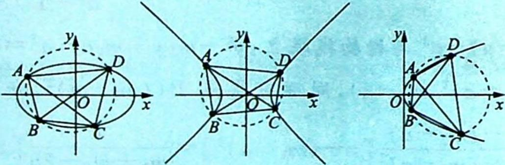
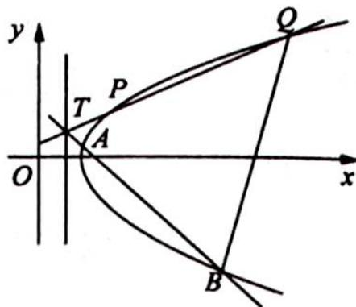
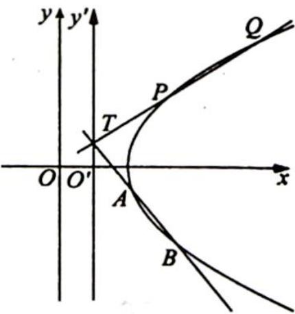

## 21.6.1 重要性质

## 研究密钥

如图所示, 若非圆二次曲线上四点 A, B, C, D 共圆, 则 $k_{AB} + k_{CD} = 0$ , $k_{AD} + k_{BC} = 0$ , $k_{AC} + k_{BD} = 0$ , 假设上述各条直线的斜率皆存在.

以抛物线 $y^{2}=2px(p>0)$ 为例, 证明 $k_{AB}+k_{CD}=0$ , 椭圆和双曲线证明过程类似.

【证明】证法一(利用直线的参数方程十圆幂定理): 设圆的两条弦所在直线的交点为 $P(x_{0}, y_{0})$ ，设直线 AB, CD 的斜率分别为 $k_{1}, k_{2}$ ，过点 P 的直线 AB 的参数方程为 $\left\{\begin{aligned} x &= x_{0} + t \\ y &= y_{0} + k_{1}t \end{aligned}\right.$ (t 为参数)，与抛物线 $y^{2} = 2px$ 联立并整理，可得 $k_{1}^{2}t^{2} + (2y_{0}k_{1} - 2p)t + y_{0}^{2} - 2px_{0} = 0$ .

设此方程的两个根为 $t_1, t_2$ ，则 $|PA||PB| = (1 + k_1^2)|t_1t_2| = (1 + k_1^2)\left|\frac{y_0^2 - 2px_0}{k_1^2}\right|$ ，同理，对于直线 $CD$ ，可得 $|PC||PD| = (1 + k_2^2)\left|\frac{y_0^2 - 2px_0}{k_2^2}\right|$ .

由圆幂定理可得 $|PA||PB|=|PC||PD|$ ，即 $(1+k_{1}^{2})\left|\frac{y_{0}^{2}-2px_{0}}{k_{1}^{2}}\right|=(1+k_{2}^{2})\left|\frac{y_{0}^{2}-2px_{0}}{k_{2}^{2}}\right|$

整理得 $k_{1}^{2}=k_{2}^{2}$ ，故 $k_{1}+k_{2}=0$ ，即 $k_{AB}+k_{CD}=0$ 。

注:二次曲线为双曲线或椭圆时,当 AB 与 CD 不平行时,证明方法与上述相同;当 AB 与 CD 平行时,A,B,C,D 共圆,在弦 AB,CD 斜率存在的条件下,则必有 $k_{AB}=k_{CD}=0$ ,结论仍然成立.

证法二(利用直线的点斜式方程十圆幂定理十点乘双根算法):设圆的两条弦所在直线的交点为 $P(x_{0},y_{0})$ ，设直线 AB, CD 的斜率分别为 $k_{1}, k_{2}$ ，则直线 AB 的方程为 $y - y_{0} = k_{1}(x - x_{0})$ ，与 $y^{2} = 2px$ 联立，可得 $(k_{1}(x - x_{0}) + y_{0})^{2} - 2px = 0$ .

设此方程的两个根为 $x_{1}, x_{2}$ , 故 $(k_{1}(x - x_{0}) + y_{0})^{2} - 2px = k_{1}^{2}(x - x_{1})(x - x_{2})$ , 即 $(x - x_{1})(x - x_{2}) = \frac{(k_{1}(x - x_{0}) + y_{0})^{2} - 2px}{k_{1}^{2}}$ .

$$
\left| P A \right| \left| P B \right| = (1 + k _ {1} ^ {2}) \left| x _ {0} - x _ {1} \right| \left| x _ {0} - x _ {2} \right| = (1 + k _ {1} ^ {2}) \left| \frac {\left(k _ {1} \left(x _ {0} - x _ {0}\right) + y _ {0}\right) ^ {2} - 2 p x _ {0}}{k _ {1} ^ {2}} \right| =
$$

$(1+k_{1}^{2})\left|\frac{y_{0}^{2}-2px_{0}}{k_{1}^{2}}\right|$ ，同理，对于直线 CD 可得 $\left|PC\right|\left|PD\right|=(1+k_{2}^{2})\left|\frac{y_{0}^{2}-2px_{0}}{k_{2}^{2}}\right|$ .

由圆幂定理可得 $|PA||PB| = |PC||PD|$ ，即 $(1 + k_1^2)\left|\frac{y_0^2 - 2px_0}{k_1^2}\right| = (1 + k_2^2) \cdot \left|\frac{y_0^2 - 2px_0}{k_2^2}\right|$ ，整理得 $k_1^2 = k_2^2$ 。故 $k_1 + k_2 = 0$ ，即 $k_{AB} + k_{CD} = 0$ 。

例 21.16 (2021 全国新高考 I 卷) 在平面直角坐标系 $xOy$ 中, 已知点 $F_{1}(-\sqrt{17},0)$ , $F_{2}(\sqrt{17},0)$ , 点 $M$ 满足 $|MF_{1}| - |MF_{2}| = 2$ . 记 $M$ 的轨迹为 $C$ .

(1) 求 C 的方程；

(2)设点 $T$ 在直线 $x = \frac{1}{2}$ 上, 过 $T$ 的两条直线分别交 $C$ 于 $A, B$ 两点和 $P, Q$ 两点, 且 $|TA||TB| = |TP||TQ|$ , 求直线 $AB$ 的斜率与直线 $PQ$ 的斜率之和.

分析 (1) 根据 $|MF_1| - |MF_2| = 2$ 可得轨迹为双曲线且为双曲线的右半支, $2a = 2$ , 根据焦点可得 $c$ , 根据 $a^2 + b^2 = c^2$ 可得 $b$ . (2) 因为 $|TA||TB| = |TP||TQ|$ , 符合四点共圆, 所以 $k_{AB} + k_{PQ} = 0$ . 解题步骤参考模型证明过程.

解析 ▶ (1) 因为 $|MF_1| - |MF_2| = 2$ ，所以轨迹 $C$ 为双曲线右半支， $c^2 = 17, 2a = 2$ ，则 $a^2 = 1, b^2 = 16$ ，故 $C$ 的方程为 $x^2 - \frac{y^2}{16} = 1 (x \geqslant 1)$ .

(2) 解法一（坐标法）：如图所示，设 $T\left(\frac{1}{2}, n\right)$ ，AB: $y - n = k_{1}\left(x - \frac{1}{2}\right)$ ，联立 $\left\{\begin{aligned}y-n=k_{1}\left(x-\frac{1}{2}\right)\end{aligned}\right.$ ，所以 $(16-k_{1}^{2})x^{2}+(k_{1}^{2}-2k_{1}n)x-\frac{1}{4}k_{1}^{2}-n^{2}+k_{1}n-16=0,x_{1}+x_{2}=$ $x^{2}-\frac{y^{2}}{16}=1$ $\frac{k_1^2 - 2k_1n}{k_1^2 - 16}, x_1 \cdot x_2 = \frac{\frac{1}{4}k_1^2 + n^2 - k_1n + 16}{k_1^2 - 16}, |TA| = \sqrt{1 + k_1^2}\left(x_1 - \frac{1}{2}\right),$ $|TB| = \sqrt{1 + k_1^2}\left(x_2 - \frac{1}{2}\right),$ 则 $|TA||TB| = (1 + k_1^2)\left(x_1 - \frac{1}{2}\right)\left(x_2 - \frac{1}{2}\right) = \frac{(n^2 + 12)(1 + k_1^2)}{k_1^2 - 16}.$

设 $PQ: y - n = k_{2} \left(x - \frac{1}{2}\right)$ , 同理 $|TP||TQ| = \frac{(n^{2} + 12)(1 + k_{2}^{2})}{k_{2}^{2} - 16}$ , 又 $|TA||TB| = |TP||TQ|$ , 所以 $\frac{1 + k_1^2}{k_1^2 - 16} = \frac{1 + k_2^2}{k_2^2 - 16}, 1 + \frac{17}{k_1^2 - 16} = 1 + \frac{17}{k_2^2 - 16}, k_1^2 - 16 = k_2^2 - 16$ , 即 $k_{1}^{2} = k_{2}^{2}$ , 又因为 $k_{1} \neq k_{2}$ , 所以 $k_{1} + k_{2} = 0$ .

解法二(参数方程): 设 AB: $\left\{\begin{aligned} x &= \frac{1}{2} + t \cos \alpha \\ y &= m + t \sin \alpha \end{aligned}\right.$ , PQ: $\left\{\begin{aligned} x &= \frac{1}{2} + t \cos \beta \\ y &= m + t \sin \beta \end{aligned}\right.$ .

将 $\left\{ \begin{array}{l} x = \frac{1}{2} + t\cos \alpha \\ y = m + t\sin \alpha \end{array} \right.$ 代入 $x^{2} - \frac{y^{2}}{16} = 1 (x \geqslant 1)$ , 可得 $16 \left( \frac{1}{2} + t\cos \alpha \right)^{2} - (m + t\sin \alpha)^{2} = 16$ , 即 $(16\cos^{2}\alpha - \sin^{2}\alpha)t^{2} + (16\cos \alpha - 2m\sin \alpha)t - m^{2} - 12 = 0, t_{1}t_{2} = \frac{-m^{2} - 12}{16\cos^{2}\alpha - \sin^{2}\alpha}$ , 同理 $t_{3}t_{4} = \frac{-m^{2} - 12}{16\cos^{2}\beta - \sin^{2}\beta}$ .

因此 $16\cos^2\alpha - \sin^2\alpha = 16\cos^2\beta - \sin^2\beta$ ，即 $17\cos^2\alpha - 1 = 17\cos^2\beta - 1$ ，得 $\cos^2\alpha = \cos^2\beta$ ，又 $\alpha \neq \beta$ ，所以 $\alpha + \beta = \pi$ ，即 $k_{AB} + k_{PQ} = 0$ 。

解法三(坐标平移):如图所示,平移 y 轴,使得点 T 在 $y'$ 轴上,即 $T\left(\frac{1}{2},m\right)\rightarrow T^{\prime}(0,m),\left\{\begin{aligned}x^{\prime}&=x-\frac{1}{2}\\ y^{\prime}&=y\end{aligned}\right.$ ，故 $\left\{\begin{aligned}x&=x^{\prime}+\frac{1}{2}\\ y&=y^{\prime}\end{aligned}\right.$ ，代入双曲线 $x^{2}-\frac{y^{2}}{16}=1$ 中得 $\left(x^{\prime}+\frac{1}{2}\right)^{2}-\frac{y^{\prime2}}{16}=1$ .

设直线 $AB$ 与 $PQ$ 在新坐标系下的方程分别为 $y' = k_1x' + m, y' = k_2x' + m, A, B, P, Q$ 在新坐标系下的坐标分别为 $A'(x_1', y_1')$ , $B'(x_2', y_2')$ , $P'(x_3', y_3')$ , $Q'(x_4', y_4')$ .

联立 $\left\{ \begin{array}{l} y' = k_1 x' + m \\ (x' + \frac{1}{2})^2 - \frac{y'^2}{16} = 1 \end{array} \right.$ , 得 $(16 - k_1^2) x'^2 + (16 - 2mk_1) x' - m^2 - 12 = 0, x'_1 x'_2 = \frac{-m^2 - 12}{16 - k_1^2}$ , 同理 $x_3' x_4' = \frac{-m^2 - 12}{16 - k_2^2}$ , 则 $|T'A'| |T'B'| = (1 + k_1^2) \cdot \left|\frac{-m^2 - 12}{16 - k_1^2}\right|$ , $|T' P'| |T' Q'| = (1 + k_2^2)$ .

$\left|\frac{-m^2 - 12}{16 - k_2^2}\right|$ , 所以 $(1 + k_1^2) \cdot \frac{-m^2 - 12}{16 - k_1^2} = (1 + k_2^2) \cdot \frac{-m^2 - 12}{16 - k_2^2}$ , 即 $\frac{1 + k_1^2}{16 - k_1^2} = \frac{1 + k_2^2}{16 - k_2^2}$ , 又 $k_1 \neq k_2$ , 得 $k_1 + k_2 = 0$ .

解法四(曲线系,四点共圆): $|TA||TB| = |TP||TQ| \Leftrightarrow A, B, P, Q$ 四点共圆,不妨设 $AB: y - k_{1}x - m_{1} = 0$ , $PQ: y - k_{2}x - m_{2} = 0$ , 则 $AB \cup PQ: (y - k_{1}x - m_{1})(y - k_{2}x - m_{2}) = 0$ , $A, B, P$ , $Q$ 四点满足 $x^{2} - \frac{y^{2}}{16} - 1 = 0$ 和 $(y - k_{1}x - m_{1})(y - k_{2}x - m_{2}) = 0$ , 则满足 $x^{2} - \frac{y^{2}}{16} - 1 + k(y - k_{1}x - m_{1}) \cdot (y - k_{2}x - m_{2}) = 0$ (\*) 对任意 $k$ 均成立.

由于 A, B, P, Q 四点共圆，这四点的坐标需同时满足圆方程 $x^{2} + y^{2} + Ax + By + C = 0$ ，它没有 xy 项。若 k 不为 0，则 $k_{1}$ 和 $k_{2}$ 互为相反数才能使 (\*) 式中无 xy 项。

故直线 $AB$ 的斜率与直线 $PQ$ 的斜率之和是 0.
