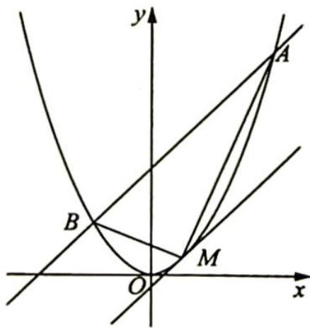

## 21.6.2 常用方法

## 研究密钥

对于四点共圆,全国卷每隔几年就会考查一次,因此,熟悉四点共圆的求解套路是很有必要的.圆锥曲线上四点共圆的证明常用共圆定理解决.

垂径定理:垂直于弦的直径平分这条弦,且平分弦所对的弧.

推论:(1)平分弦(不是直径)的直径垂直于弦,并且平分弦所对的两条弧;

(2)弦的垂直平分线经过圆心,并且平分弦所对的两条弧,找到满足垂径定理的几何条件,即可证明四点共圆.

另外通过解析的方法找到线段长度、两条直线的位置关系,再结合圆的定义、圆周角定理也可证明四点共圆.

例 21.17 如图所示, 已知 $O$ 为坐标原点. $F$ 为椭圆 $C: x^{2} + \frac{y^{2}}{2} = 1$ 在 $y$ 轴正半轴上的焦点. 过 $F$ 且斜率为 $-\sqrt{2}$ 的直线 $l$ 与 $C$ 交于 $A, B$ 两点, 点 $P$ 满 $\overrightarrow{OA} + \overrightarrow{OB} + \overrightarrow{OP} = 0$ .

(1) 证明: 点 P 在 C 上;

(2)设点 $P$ 关于点 $O$ 的对称点为 $Q$ . 证明: $A, P, B, Q$ 四点在同一圆上.

分析 ▶ (1) 设 $A, B$ 两点的坐标, 根据题意可得直线 $l$ 的方程, 与椭圆方程联立可得两根之间的关系, 由 $\overrightarrow{OA} + \overrightarrow{OB} + \overrightarrow{OP} = 0$ 求出点 $P$ 的坐标, 满足椭圆的方程即可; (2) 由垂径定理的推论可得, 弦的垂直平分线一定经过圆心, 所以若 $A, P, B, Q$ 四点共圆, 则直线 $AB$ 和 $PQ$ 各自的垂直平分线的交点为圆心, 设为 $O'$ , 则有 $|O'A| = |O'B|$ , $|O'P| = |O'Q|$ , 只需满足 $|O'P| = |O'A|$ 即可.

证明 ▶ (1)由题意得 $F(0,1)$ ，直线 $l: y = -\sqrt{2}x + 1$ .

联立 $\left\{ \begin{array}{l} y = -\sqrt{2} x + 1 \\ x^2 + \frac{y^2}{2} = 1 \end{array} \right.$ , 消 $y$ 得 $2x^{2} + (-\sqrt{2} x + 1)^{2} = 2, 4x^{2} - 2\sqrt{2} x - 1 = 0, \left\{ \begin{array}{l} x_{1} + x_{2} = \frac{2\sqrt{2}}{4} = \frac{\sqrt{2}}{2} \\ x_{1}x_{2} = -\frac{1}{4} \end{array} \right.$ ,

$$
\overrightarrow {O A} + \overrightarrow {O B} = - \overrightarrow {O P}
$$

$$
\left\{ \begin{array}{l} x _ {P} = - (x _ {1} + x _ {2}) = - \frac {\sqrt {2}}{2} \\ y _ {P} = - (y _ {1} + y _ {2}) = - (- \sqrt {2} x _ {1} + 1 - \sqrt {2} x _ {2} + 1) = \sqrt {2} (x _ {1} + x _ {2}) - 2 = \sqrt {2} \cdot \frac {\sqrt {2}}{2} - 2 = - 1 \end{array} . \right.
$$

所以 $P\left(-\frac{\sqrt{2}}{2}, - 1\right)$ 满足椭圆方程，故点 $P$ 在 $C$ 上.

(2) 点 $P$ 关于原点 $O$ 的对称点为 $Q\left(\frac{\sqrt{2}}{2}, 1\right)$ , $AB$ 的垂直平分线方程为 $y - \frac{1}{2} = \frac{\sqrt{2}}{2}\left(x - \frac{\sqrt{2}}{4}\right)$ , 得 $y = \frac{\sqrt{2}}{2} x + \frac{1}{4}$ , $PQ$ 的垂直平分线方程为 $y = -\frac{\sqrt{2}}{2} x$ .

联立 $\left\{ \begin{array}{l} y = \frac{\sqrt{2}}{2} x + \frac{1}{4} \\ y = -\frac{\sqrt{2}}{2} x \end{array} \right.$ , 得 $O' \left(-\frac{\sqrt{2}}{8}, \frac{1}{8}\right)$ , $|O'P| = \sqrt{\left(\frac{\sqrt{2}}{2} - \frac{\sqrt{2}}{8}\right)^2 + \left(\frac{9}{8}\right)^2} = \frac{3\sqrt{11}}{8}$ , $|O'A| = \sqrt{\left(-\frac{\sqrt{2}}{8} + \frac{\sqrt{6} - \sqrt{2}}{4}\right)^2 + \left(\frac{1}{8} - \frac{\sqrt{3} + 1}{2}\right)^2} = \frac{3\sqrt{11}}{8}$ , 可得 $|O'P| = |O'A|$ , 则 $|O'A| = |O'B| = |O'P| = |O'Q|$ , 故 $A, P, B, Q$ 四点在同一圆上.

变式(1) 设 A, B 是椭圆 $3x^{2} + y^{2} = \lambda$ 上的两点，点 $N(1,3)$ 是线段 AB 的中点，线段 AB 的垂直平分线与椭圆相交于 C, D 两点.

(1)确定 $\lambda$ 的取值范围,并求直线 $AB$ 的方程;

(2)试判断是否存在这样的 $\lambda$ , 使得 $A, B, C, D$ 四点在同一个圆上? 并说明理由.

解析 (1)解法一:依题意得,可设直线AB的方程为 $y=k(x-1)+3$ ,代入 $3x^{2}+y^{2}=$ $\lambda$ ，整理得 $(k^{2}+3)x^{2}-2k(k-3)x+(k-3)^{2}-\lambda=0$ ①.

设 $A(x_{1},y_{1}),B(x_{2},y_{2})$ ，则 $x_{1},x_{2}$ 是方程①的两个不同的根，所以 $\Delta = 4[\lambda (k^2 +3) - 3(k - 3)^2 ] > 0$ ②，且 $x_{1} + x_{2} = \frac{2k(k - 3)}{k^{2} + 3}$ .由 $N(1,3)$ 是线段 $AB$ 的中点，得 $\frac{x_1 + x_2}{2} = 1$ ，所以 $k(k - 3) = k^2 +3$ ，解得 $k = -1$ ，代入②得， $\lambda >12$ ，即 $\lambda$ 的取值范围是 $(12, + \infty)$

则直线 $AB$ 的方程为 $y - 3 = -(x - 1)$ , 即 $x + y - 4 = 0$ .

解法二: 设 $A(x_{1}, y_{1})$ , $B(x_{2}, y_{2})$ ，则有 $\left\{\begin{aligned}3x_{1}^{2}+y_{1}^{2}&=\lambda \\ 3x_{2}^{2}+y_{2}^{2}&=\lambda\end{aligned}\right.\Rightarrow3(x_{1}-x_{2})(x_{1}+x_{2})+(y_{1}-y_{2})(y_{1}+y_{2})=0.$ 依题意可得 $x_{1} \neq x_{2}$ ，所以 $k_{AB} = -\frac{3(x_{1} + x_{2})}{y_{1} + y_{2}}$ .

因为 $N(1,3)$ 是 $AB$ 的中点, 所以 $x_{1} + x_{2} = 2, y_{1} + y_{2} = 6$ , 从而 $k_{AB} = -1$ , 又由 $N(1,3)$ 在椭圆内, $\lambda > 3 \times 1^{2} + 3^{2} = 12$ , 所以 $\lambda$ 的取值范围是 $(12, +\infty)$ .

直线 AB 的方程为 $y-3=-(x-1)$ ，即 $x+y-4=0$ 。

(2)解法一:因为 CD 垂直平分 AB, 所以直线 CD 的方程为 y-3=x-1, 即 $x-y+2=0$ . 代入椭圆方程, 整理得 $4x^{2}+4x+4-\lambda=0$ ③.

又设 $C(x_{3},y_{3}),D(x_{4},y_{4}),CD$ 的中点为 $M(x_0,y_0)$ ，则 $x_{3},x_{4}$ 是方程③的两根，所以 $x_{3}+$ $x_{4} = -1$ ，且 $x_0 = \frac{1}{2} (x_3 + x_4) = -\frac{1}{2},y_0 = x_0 + 2 = \frac{3}{2}$ 即 $M(-\frac{1}{2},\frac{3}{2})$

于是由弦长公式可得 $|CD| = \sqrt{1 + \left(-\frac{1}{k}\right)^2} \cdot |x_3 - x_4| = \sqrt{2(\lambda - 3)}$ ④, 将直线 $AB$ 的方程 $x + y - 4 = 0$ 代入椭圆方程得 $4x^2 - 8x + 16 - \lambda = 0$ ⑤, 同理可得 $|AB| = \sqrt{1 + k^2} \cdot |x_1 - x_2| = \sqrt{2(\lambda - 12)}$ ⑥.

因为当 $\lambda > 12$ 时， $\sqrt{2(\lambda - 3)} > \sqrt{2(\lambda - 12)}$ ，所以 $|AB| < |CD|$ .

假设在 $\lambda > 12$ 时, 使得 $A, B, C, D$ 四点共圆, 则 $CD$ 必为圆的直径, 点 $M$ 为圆心. 点 $M$ 到直线 $AB$ 的距离 $d = \frac{|x_0 + y_0 - 4|}{\sqrt{2}} = \frac{|\frac{1}{2} + \frac{3}{2} - 4|}{\sqrt{2}} = \frac{3\sqrt{2}}{2}$ ⑦, 于是, 由 ④ ⑥ ⑦ 式和勾股定理可得 $|MA|^2 = |MB|^2 = d^2 + \left(\frac{|AB|}{2}\right)^2 = \frac{9}{2} + \frac{\lambda - 12}{2} = \frac{\lambda - 3}{2} = \left(\frac{|CD|}{2}\right)^2$ .

故当 $\lambda > 12$ 时, $A, B, C, D$ 四点均在以 $M$ 为圆心, $\frac{|CD|}{2}$ 为半径的圆上.

注：上述解法中最后一步可按如下解法获得：

A, B, C, D 共圆 $\Leftrightarrow \triangle ACD$ 为直角三角形，A 为直角 $\Leftrightarrow |AN|^{2} = |CN||DN|$ ，即 $\left(\frac{|AB|}{2}\right)^{2} = \left(\frac{|CD|}{2} + d\right) \cdot \left(\frac{|CD|}{2} - d\right)$ ⑧，由⑥式知，⑧式左边 $=\frac{\lambda-12}{2}$ .

由④式和⑦式知，⑧式右边= $\left(\frac{\sqrt{2(\lambda-3)}}{2}+\frac{3\sqrt{2}}{2}\right)\cdot\left(\frac{\sqrt{2(\lambda-3)}}{2}-\frac{3\sqrt{2}}{2}\right)=\frac{\lambda-3}{2}-\frac{9}{2}=\frac{\lambda-12}{2}$ 所以⑧式成立,即A,B,C,D四点共圆.

解法二:由(2)解法一及 $\lambda>12$ .

因为 $CD$ 垂直平分 $AB$ , 所以直线 $CD$ 的方程为 $y - 3 = x - 1$ , 代入椭圆方程, 整理得 $4x^{2} + 4x + 4 - \lambda = 0$ ③, 将直线 $AB$ 的方程 $x + y - 4 = 0$ , 代入椭圆方程, 整理得 $4x^{2} - 8x + 16 - \lambda = 0$ ⑤.

解③式和⑤式可得 $x_{1,2}=\frac{2\pm\sqrt{\lambda-12}}{2},x_{3,4}=\frac{-1\pm\sqrt{\lambda-3}}{2}.$

不妨设 $A\left(1 + \frac{1}{2}\sqrt{\lambda - 12}, 3 - \frac{1}{2}\sqrt{\lambda - 12}\right), C\left(\frac{-1 - \sqrt{\lambda - 3}}{2}, \frac{3 - \sqrt{\lambda - 3}}{2}\right), D\left(\frac{-1 + \sqrt{\lambda - 3}}{2}, \frac{3 + \sqrt{\lambda - 3}}{2}\right)$ .

所以 $\overrightarrow{CA} = \left[\frac{3 + \sqrt{\lambda - 12} + \sqrt{\lambda - 3}}{2}, \frac{3 + \sqrt{\lambda - 3} - \sqrt{\lambda - 12}}{2}\right]$ ,

$$
\overrightarrow {D A} = \left(\frac {3 + \sqrt {\lambda - 1 2} - \sqrt {\lambda - 3}}{2}, \frac {3 - \sqrt {\lambda - 3} - \sqrt {\lambda - 1 2}}{2}\right).
$$

计算可得 $\overrightarrow{CA}\cdot\overrightarrow{DA}=0$ ，所以A在以CD为直径的圆上，又B为A关于CD的对称点，所以A,B,C,D四点共圆.

(注:也可用勾股定理证明 $AC \perp AD.$ )

变式(2) 已知抛物线 $C: y^{2} = 2px (p > 0)$ 的焦点为 $F$ , 直线 $y = 4$ 与 $y$ 轴的交点为 $P$ , 与抛物线 $C$ 的交点为 $Q$ , 且 $|QF| = \frac{5}{4} |PQ|$ .

(1)求抛物线 C 的方程；

(2) 过 $F$ 的直线 $l$ 与 $C$ 相交于 $A, B$ 两点, 若 $AB$ 的垂直平分线 $l'$ 与 $C$ 相交于 $M, N$ 两点, 且 $A, M, B, N$ 四点在同一圆上, 求 $l$ 的方程.

解析 (1) 设 $Q(x_0, 4)$ , 代入 $y^2 = 2px$ 得 $x_0 = \frac{8}{p}$ .

所以 $|PQ| = \frac{8}{p}, |QF| = \frac{p}{2} + x_0 = \frac{p}{2} + \frac{8}{p}$ . 由题意得 $\frac{p}{2} + \frac{8}{p} = \frac{5}{4} \times \frac{8}{p}$ , 解得 $p = -2$ (舍去) 或 $p = 2$ . 故抛物线 $C$ 的方程为 $y^2 = 4x$ .

(2)依题意知 $l$ 与坐标轴不垂直, 故可设 $l$ 的方程为 $x = my + 1 (m \neq 0)$ , 代入 $y^{2} = 4x$ 得 $y^{2} - 4my - 4 = 0$ . 设 $A(x_{1}, y_{1}), B(x_{2}, y_{2})$ , 则 $y_{1} + y_{2} = 4m, y_{1}y_{2} = -4$ .

故 $AB$ 的中点为 $D(2m^2 + 1, 2m), |AB| = \sqrt{m^2 + 1} |y_1 - y_2| = 4(m^2 + 1)$ .

又 $l'$ 的斜率为 -m，所以 $l'$ 的方程为 $x = -\frac{1}{m} y + 2m^2 + 3$ ，将上式代入 $y^2 = 4x$ ，并整理得 $y^2 + \frac{4}{m} y - 4(2m^2 + 3) = 0$ .

设 $M(x_{3},y_{3}),N(x_{4},y_{4})$ ，则 $y_{3} + y_{4} = -\frac{4}{m},y_{3}\cdot y_{4} = -4(2m^{2} + 3)$ ，故MN的中点为 $E\left(\frac{2}{m^2} +2m^2 +3, - \frac{2}{m}\right),|MN| = \sqrt{1 + \frac{1}{m^2}} |y_3 - y_4| = \frac{4(m^2 + 1)\sqrt{2m^2 + 1}}{m^2}.$ 由于MN垂直平分

$AB$ ，故 $A, M, B, N$ 四点在同一圆上等价于 $|AE| = |BE| = \frac{1}{2} |MN|$ ，从而 $\frac{1}{4} |AB|^2 + |DE|^2 = \frac{1}{4} |MN|^2$ ，即 $4(m^2 + 1)^2 + \left(2m + \frac{2}{m}\right)^2 + \left(\frac{2}{m^2} + 2\right)^2 = \frac{4(m^2 + 1)^2(2m^2 + 1)}{m^4}, m \neq 0$ ，化简得 $m^2 - 1 = 0$ ，解得 $m = 1$ 或 $m = -1$ 。故所求直线 $l$ 的方程为 $x = y + 1$ 或 $x = -y + 1$ 。

## 评注

本题主要考查抛物线的几何性质、直线与抛物线、四点共圆等基础知识以及解析几何的基本思想方法、运算求解能力和综合解题能力。对于第(2)问将直线 $l$ 方程设为 $x = my + 1 (m \neq 0)$ ，这样可以避免讨论斜率不存在的情形，使问题简单化。

## 训练 21

1. (2013 广东卷理 20) 已知抛物线 C 的顶点为原点, 其焦点 $F(0, c)$ (c > 0) 到直线 l: x - y - 2 = 0 的距离为 $\frac{3\sqrt{2}}{2}$ . 设点 P 为直线 l 上的点, 过点 P 作抛物线 C 的两条切线 PA, PB, 其中 A, B 为切点.

(1)求抛物线 C 的方程;

(2) 当点 $P(x_0, y_0)$ 为直线 $l$ 上的定点时, 求直线 $AB$ 的方程;

(3)当点 $P$ 在直线 $l$ 上移动时, 求 $|AF||BF|$ 的最小值.

2. 如图所示, 已知抛物线 $C: x^{2} = 4y$ 的焦点为 $F$ , 过点 $F$ 作直线 $l$ 交抛物线 $C$ 于 $A, B$ 两点; 椭圆 $E$ 的中心在原点, 焦点在 $x$ 轴上, 点 $F$ 是它的一个顶点且其离心率 $e = \frac{\sqrt{3}}{2}$ .

(1)求椭圆 E 的方程；

(2)经过 $A, B$ 两点分别作抛物线 $C$ 的切线 $l_{1}, l_{2}$ , 切线 $l_{1}$ 与 $l_{2}$ 相交于点 $M$ , 求证: $AB \perp MF$ ;

(3)在椭圆 $E$ 上是否存在一点 $M'$ , 经过点 $M'$ 作抛物线 $C$ 的两条切线 $M'A', M'B'(A', B'$ 为切点), 使得直线 $A'B'$ 过点 $F$ ? 若存在, 求出抛物线 $C$ 与切线 $M'A', M'B'$ 所围成图形的面积; 若不存在, 试说明理由.

3. 如图所示, 设 $A,B$ 为曲线 $C : y = \frac{x^2}{4}$ 上的两点, 点 $A$ 与 $B$ 的横坐标之和为 4.

(1)求直线 $AB$ 的斜率；

(2)设点 $M$ 为曲线 $C$ 上一点, 曲线 $C$ 在点 $M$ 处的切线与直线 $A B$ 平行, 且 $A M \perp B M$ , 求直线 $A B$ 的方程.

4. 椭圆 $\frac{x^2}{4} + y^2 = 1$ 的上顶点为 $A$ , 过点 $A$ 作直线 $l_1, l_2$ 分别与椭圆交于 $C, D$ 两点且直线 $l_1, l_2$ 都与动圆 $(x + 1)^2 + y^2 = r^2 (r > 0)$ 相切, 求证: 直线 $CD$ 过定点.

5. 设点 $P$ 是抛物线 $C_{1}: y^{2} = 4x$ 上的动点, 过点 $P$ 作圆 $C_{2}: (x - 3)^{2} + y^{2} = r^{2} (r > 0)$ 的两条切线, 交抛物线 $C_{1}$ 于 $A, B$ 两点, 若过 $A, B$ 两点的直线恒与 $C_{2}$ 相切, 求圆的半径 $r$ .

6. 已知椭圆 $C: 9x^{2} + y^{2} = m^{2} (m > 0)$ , 直线 $l$ 不过原点 $O$ 且不平行于坐标轴, $l$ 与 $C$ 有两个交点 $A, B$ , 线段 $AB$ 的中点为 $M$ .

(1)证明:直线 ${OM}$ 的斜率与 $l$ 的斜率的乘积为定值；

(2) 若 $l$ 过点 $\left(\frac{m}{3}, m\right)$ , 延长线段 $OM$ 与 $C$ 交于点 $P$ , 四边形 $OAPB$ 能否为平行四边形? 若能, 求此时 $l$ 的斜率; 若不能, 说明理由.

7. 设椭圆 $E: \frac{x^2}{a^2} + \frac{y^2}{b^2} = 1 (a > b > 0)$ 过点 $M(2, \sqrt{2}), N(\sqrt{6}, 1)$ 两点， $O$ 为坐标原点。

(1)求椭圆 E 的标准方程；

(2)是否存在圆心为原点的圆,使得该圆的任意一条切线与椭圆 E 恒有两个交点 A, B, 且 $\overrightarrow{OA} \perp \overrightarrow{OB}$ ? 若存在,写出该圆的方程,并求 $|AB|$ 的取值范围; 若不存在,请说明理由.

8. 已知椭圆 $E: \frac{x^{2}}{a^{2}} + \frac{y^{2}}{b^{2}} = 1 (a > b > 0)$ 的离心率为 $\frac{1}{2}$ , 且经过点 $(-1, \frac{3}{2})$ .

(1)求椭圆 E 的标准方程；

(2)设椭圆 E 的右顶点为 A，点 O 为坐标原点，点 B 为椭圆 E 上异于左、右顶点的动点，直线 l: $x=t(t>a)$ 交 x 轴于点 P，直线 PB 交椭圆 E 于另一点 C，直线 BA 和 CA 分别交直线 l 于点 M 和 N，若 O, A, M, N 四点共圆，求 t 的值.
