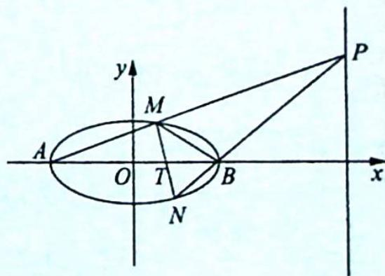

## 2. 抛物线中的结论

已知抛物线 $C: y^{2} = 2px (p > 0)$ , 若直线 $l: y = kx + m$ 与抛物线 $C$ 相交于 $A, B$ 两点 $(A, B$ 不是原点 $O$ ), 则以 $A, B$ 为直径的圆过抛物线 $C$ 上的一点 $P(x_{0}, y_{0})$ 的充要条件是直线 $l$ 过定点 $(2p + x_{0}, -y_{0})$ , 当点 $P$ 与坐标原点重合时, 定点坐标为 $(2p, 0)$ .

【证明】双曲线的证明类似于椭圆,在此不再赘述.下面证明抛物线中的模型拓展:

如图所示, 设 $A(x_{1}, y_{1}), B(x_{2}, y_{2})$ , 将原坐标系的原点 $O$ 平移至点 $P$ , 则任意一点的

原坐标 $(x,y)$ 与新坐标 $(x',y')$ 的关系为 $\left\{\begin{aligned}x&=x'+x_{0}\\ y&=y'+y_{0}\end{aligned}\right.$ ，所以抛物线在新坐标系中的方程为 $(y'+y_{0})^{2}=2p(x'+x_{0})$ ，即 $y'^{2}+2y_{0}y'-2px'+y_{0}^{2}-2px_{0}=0$ 。

因为点 $P(x_{0}, y_{0})$ 在抛物线 $y^{2} = 2px$ 上，所以 $y_{0}^{2} = 2px_{0}$ ，则抛物线的方程可化为 $y'^{2} + 2y_{0}y' - 2px' = 0$ .

设直线 AB 在新坐标系中的方程为 $mx' + ny' = 1$ ，将直线 AB 的方程代入抛物线的方程齐次化得 $y'^{2} + (2y_{0}y' - 2px') (mx' + ny') = 0$ ，展开得 $(1 + 2y_{0}n)y'^{2} + (2y_{0}m - 2pn)x'y' - 2pmx'^{2} = 0$ ，左、右两边同时除以 $x'^{2}$ ，得 $(1 + 2y_{0}n)\left(\frac{y'}{x'}\right)^{2} + (2y_{0}m - 2pn)\left(\frac{y'}{x'}\right) - 2pm = 0$ 。

而上述方程的两根即为直线 $PA, PB$ 的斜率, 所以由根与系数的关系得 $k_{PA} \cdot k_{PB} = \frac{y_1'}{x_1'} \cdot \frac{y_2'}{x_2'} = -\frac{2pm}{1 + 2y_0n}$ .

若 $PA \perp PB$ , 则 $k_{PA} \cdot k_{PB} = -\frac{2pm}{1 + 2y_0n} = -1$ , 即 $2pm - 2y_0n = 1$ , 所以直线 $AB$ 在新坐标系中过定点 $(2p, -2y_0)$ , 则直线 $AB$ 在原坐标系中过定点 $(2p + x_0, -2y_0 + y_0)$ , 即过定点 $(2p + x_0, -y_0)$ .

故当点 P 与坐标原点重合时, 定点坐标为 $(2p,0)$ .

2. 斜率之积不为 -1，为定值 $\lambda\left(\lambda\neq\frac{b^{2}}{a^{2}}\right)$

例 21.3 (2020 新课标全国 I 卷理 20) 已知 A, B 分别为椭圆 $E: \frac{x^{2}}{a^{2}} + y^{2} = 1 (a > 1)$ 的左、右顶点，G 为 E 的上顶点， $\overrightarrow{AG} \cdot \overrightarrow{GB} = 8$ . P 为直线 x = 6 上的动点，PA 与 E 的另一交点为 C, PB 与 E 的另一交点为 D.

(1) 求 E 的方程；

(2) 证明: 直线 CD 过定点.

分析 ▶ (1) 已知 $\overrightarrow{AG} \cdot \overrightarrow{GB} = 8$ , 分别表示出点 $G, A, B$ 的坐标, 代入即可求出 $a^2$ . (2) 由中点弦模型可得, 在椭圆 $\frac{x^2}{9} + y^2 = 1$ 中, $k_{CA} \cdot k_{CB} = -\frac{1}{9}$ . 设 $CD: my + t = x$ , 直线方程与椭圆方程联立可以表示出 $k_{BC} \cdot k_{BD}$ , 两个乘积的比值可得 $\frac{k_{CA}}{k_{BD}}$ , 即 $\frac{k_{PA}}{k_{PB}}$ , 解方程求出 $t$ 的值, 可得直线 $CD$ 过定点.

解析 ▶ (1) 由题意可得 $G(0,1)$ , 设 $A(-a,0), B(a,0)$ , 则 $\overrightarrow{AG} \cdot \overrightarrow{GB} = (a,1) \cdot (a,-1) = a^2 - 1 = 8$ , 所以 $a^2 = 9, a = 3$ .

故 E 的方程为 $\frac{x^{2}}{9} + y^{2} = 1$ .

(2)由(1)可知 $A(-3,0), B(3,0)$ , 设 $CD:my + t = x, C(x_1, y_1), D(x_2, y_2), P(6, y_0)$ .

由 $\left\{ \begin{array}{l} my + t = x \\ \frac{x^2}{9} + y^2 = 1 \end{array} \right.$ ，得 $(m^2 + 9)y^2 + 2mty + t^2 - 9 = 0$ ，所以 $y_1 + y_2 = \frac{-2mt}{m^2 + 9}, y_1y_2 = \frac{t^2 - 9}{m^2 + 9}, k_{BC}$ 。 $k_{BD} = \frac{y_1}{x_1 - 3} \cdot \frac{y_2}{x_2 - 3} = \frac{y_1y_2}{(my_1 + t - 3)(my_2 + t - 3)} = \frac{y_1y_2}{m^2y_1y_2 + m(t - 3)(y_1 + y_2) + (t - 3)^2}$ .

把 $y_{1} + y_{2}$ 与 $y_{1}y_{2}$ 代入整理得 $k_{BC} \cdot k_{BD} = \frac{t + 3}{9(t - 3)}$ ①, 由中点弦模型的推论可得 $k_{CA} \cdot k_{BC} = k_{PA} \cdot k_{BC} = -\frac{b^{2}}{a^{2}} = -\frac{1}{9}$ ②, ① ÷ ② 得 $\frac{k_{BD}}{k_{PA}} = \frac{t + 3}{3 - t}$ .

又因为 $k_{PA} = \frac{y_0}{9}, k_{PB} = \frac{y_0}{3} = k_{BD}$ , 所以 $\frac{k_{PB}}{k_{PA}} = \frac{t + 3}{3 - t} = 3, t = \frac{3}{2}$ , 则直线 $CD: my + \frac{3}{2} = x$ 经过定点 $\left(\frac{3}{2}, 0\right)$ .

## 评注

命题本源解密, 在椭圆 $\frac{x^2}{9} + y^2 = 1$ 中, $k_{CA} \cdot k_{CB} = -\frac{1}{9}$ , 又 $k_{PB} = 3k_{PA}$ (因为 $k_{PA} = \frac{y_0}{9}, k_{PB} = \frac{y_0}{3}$ ), 则 $k_{BC} \cdot k_{BD} = \frac{-\frac{1}{9}}{k_{CA}} \cdot k_{BD} = \frac{-\frac{1}{9}}{k_{CA}} \cdot k_{PB} = \frac{-\frac{1}{9}k_{PB}}{k_{PA}} = -\frac{1}{3}$ , 因此直线 $CD$ 过定点 $(t,0)$ , 且 $k_{BC} \cdot k_{BD} = \frac{1}{9} \cdot \frac{t + 3}{t - 3} = -\frac{1}{3}$ , 即 $t = \frac{3}{2}$ , 所以直线 $CD$ 过定点 $\left(\frac{3}{2}, 0\right)$ .

解后反思

## 例题的反思与发散

【反思一】若将本例中直线方程 x=6 改为 x=9，试求直线 CD 过定点的坐标。

若将本题中直线 $x = 6 \Rightarrow$ 改为 $x = 9, P(9, t), k_{PA} = \frac{t}{12}, k_{PB} = \frac{t}{6}$ , 即 $\frac{k_{PB}}{k_{PA}} = \frac{k_{BD}}{k_{AC}} = 2$ , 所以 $k_{BC} \cdot k_{BD} = k_{BC} \cdot 2k_{AC} = 2k_{AC} \cdot k_{BC} = 2 \cdot \left(-\frac{b^2}{a^2}\right) = -\frac{2}{9}$ 为定值.

设直线 $CD$ 过定点 $(n,0)$ , 则 $k_{BC} \cdot k_{BD} = \frac{b^2(n + a)}{a^2(n - a)} = -\frac{2}{9}$ , 即 $\frac{n + 3}{n - 3} = -2$ , 亦即 $n + 3 = -2n + 6$ , 所以 $n = 1$ . 因此直线 $CD$ 过定点 $(1,0)$ .

【反思二】已知椭圆 $C: \frac{x^{2}}{9} + y^{2} = 1, A, B$ 为左、右顶点，过 x 轴上定点 $T(1,0)$ 作直线 l 与椭圆 C 相交于 M, N 两点，连接 AM, BN，若直线 AM, BN 相交于点 P，求动点 P 的轨迹方程.

【解析】如图所示, 令 $l_{MN}: x = ty + 1$ , 代入 $\frac{x^2}{9} + y^2 = 1$ , 得 $(t^2 + 9)y^2 + 2ty + 1 - 9 = 0$ , 即 $(t^2 + 9)y^2 + 2ty - 8 = 0, \Delta > 0$ .

设 $M(x_{1},y_{1}), N(x_{2},y_{2}), P(x,y)$ ，则 $y_{1} + y_{2} = \frac{-2t}{t^{2} + 9}, y_{1}y_{2} = \frac{-8}{t^{2} + 9}$ .

$l_{MA}:\frac{y_{1}}{x_{1}+3}=\frac{y}{x+3}$ ①, $l_{NB}:\frac{y_{2}}{x_{2}-3}=\frac{y}{x-3}$ ②,联立①②消去y得 $\frac{y_{1}(x+3)}{x_{1}+3}=$ $\frac{y_{2}(x-3)}{x_{2}-3}\Rightarrow\frac{y_{1}(x+3)}{ty_{1}+4}=\frac{y_{2}(x-3)}{ty_{2}-2}$ ，所以 $y_{1}(ty_{2}-2)(x+3)=y_{2}(ty_{1}+4)(x-3),(ty_{1}y_{2}-2y_{1})x+3y_{1}(ty_{2}-2)=(ty_{1}y_{2}+4y_{2})x-3y_{2}(ty_{1}+4),(ty_{1}y_{2}+4y_{2}-ty_{1}y_{2}+2y_{1})x=$ $3ty_{1}y_{2}-6y_{1}+3ty_{1}y_{2}+12y_{2},(4y_{2}+2y_{1})x=6ty_{1}y_{2}-6y_{1}+12y_{2}$ ，所以 $x=\frac{6ty_{1}y_{2}-6y_{1}+12y_{2}}{4y_{2}+2y_{1}}=$

$$
\frac {\frac {- 4 8 t}{t ^ {2} + 9} + \frac {1 2 t}{t ^ {2} + 9} + 1 8 y _ {2}}{2 y _ {2} + \left(\frac {- 4 t}{t ^ {2} + 9}\right)} = \frac {\frac {- 3 6 t}{t ^ {2} + 9} + 1 8 y _ {2}}{\frac {- 4 t}{t ^ {2} + 9} + 2 y _ {2}} = 9.
$$

故动点 P 的轨迹方程为直线 x=9.

【反思三】若直线 l 与椭圆 $\frac{x^{2}}{a^{2}} + \frac{y^{2}}{b^{2}} = 1 (a > b > 0)$ 交于 A, B 两点，点 M 是椭圆的右顶点，且 $k_{MA} \cdot k_{MB}$ 为定值，则直线 l 经过 x 轴上的定点.

反之, 若直线 $l$ 经过 $x$ 轴上的定点, 且与椭圆 $\frac{x^2}{a^2} + \frac{y^2}{b^2} = 1 (a > b > 0)$ 相交于 $A, B$ 两点, 点 $M$ 是椭圆的右顶点, 则 $k_{MA} \cdot k_{MB}$ 为定值.

【解析】(以第二个结论为例证明). 设直线 l 经过 x 轴上的定点 $(t,0)$ ，设 $l:my+t=x$ ， $A(x_{1},y_{1})$ ， $B(x_{2},y_{2})$ .

因为 $M(a,0)$ ，所以 $k_{MA} \cdot k_{MB} = \frac{y_{1}}{x_{1}-a} \cdot \frac{y_{2}}{x_{2}-a} = \frac{y_{1} y_{2}}{(my_{1}+t-a)(my_{2}+t-a)}$ .

由 $\left\{\begin{aligned}m y+t&=x\\ \frac{x^{2}}{a^{2}}+\frac{y^{2}}{b^{2}}&=1\end{aligned}\right.$ 得 $(b^{2}m^{2}+a^{2})y^{2}+2b^{2}m t y+b^{2}t^{2}-a^{2}b^{2}=0$ ，所以 $y_{1}+y_{2}=\frac{-2b^{2}m t}{b^{2}m^{2}+a^{2}},y_{1}y_{2}=$ $\frac{b^{2}t^{2}-a^{2}b^{2}}{b^{2}m^{2}+a^{2}}$ ，把上述两式代入 $k_{MA}\cdot k_{MB}=\frac{y_{1}y_{2}}{m^{2}y_{1}y_{2}+m(t-a)(y_{1}+y_{2})+(t-a)^{2}}$ ，整理得 $k_{MA}\cdot$ $k_{MB}=\frac{b^{2}}{a^{2}}\frac{t+a}{t-a}$ 为定值.
