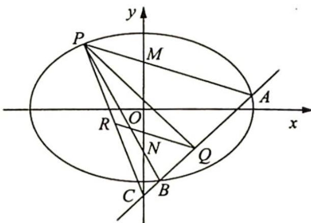
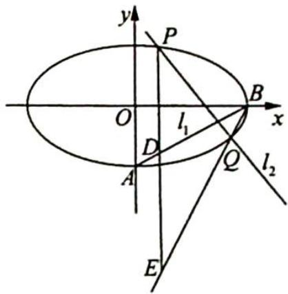
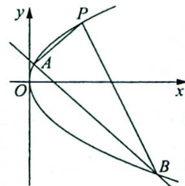
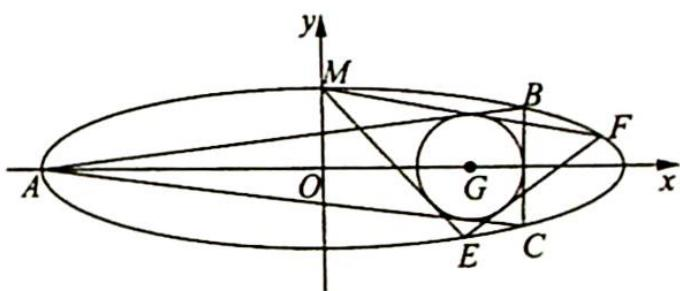
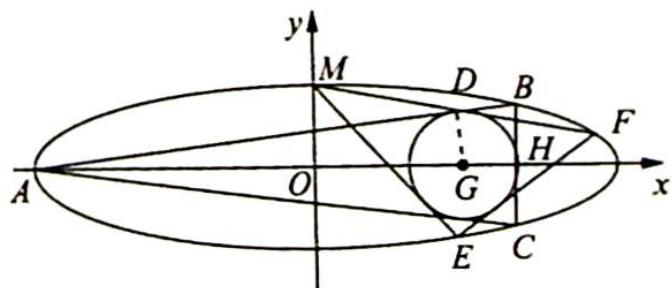
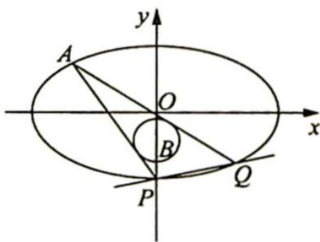
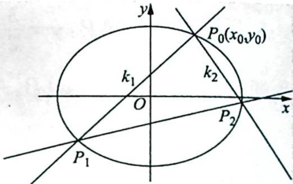

## 2. 斜率之和不为 0

研究密钥

如图所示， $P(x_0,y_0)$ 为曲线 $C:\frac{x^2}{a^2} +\frac{y^2}{b^2} = 1(a > b > 0)$ 上一点，过点 $P$ 作斜率为 $k_{1},k_{2}$ 的两条直线分别与曲线交于 $A,B$ 两点，若 $k_{1}+$ $k_{2} = \lambda (\lambda \neq 0)$ ，则直线 $AB$ 过定点 $M\left(x_0 - \frac{2y_0}{\lambda}, - y_0 - \frac{2b^2x_0}{a^2\lambda}\right).$ 当 $\lambda = 0$ 时，直线 $AB$ 的斜率为定值 $\frac{b^2x_0}{a^2y_0}$

【证明】①当直线 AB 的斜率不存在时, 设 $A(x,y)$ , $B(x,-y)$ , 则 $k_{1}+k_{2}=\frac{y-y_{0}}{x-x_{0}}+\frac{-y-y_{0}}{x-x_{0}}=\frac{-2y_{0}}{x-x_{0}}=\lambda$ , 解得 $x=x_{0}-\frac{2y_{0}}{\lambda}$ , 所以直线 AB 过定点 $M\left(x_{0}-\frac{2y_{0}}{\lambda},-y_{0}-\frac{2b^{2}x_{0}}{a^{2}\lambda}\right)$ .

②当直线 AB 的斜率存在时, 将坐标原点平移至点 P, 则曲线方程变为 $\frac{(x+x_{0})^{2}}{a^{2}}+\frac{(y+y_{0})^{2}}{b^{2}}=1$ .

在新坐标系下, 设直线 $AB: y = kx + m$ , 当 $m \neq 0$ 时, 则有 $\frac{y - kx}{m} = 1$ , 所以 $A, B$ 两点的坐标满足 $b^{2}x^{2} + a^{2}y^{2} + 2b^{2}x_{0}x \cdot \frac{y - kx}{m} + 2a^{2}y_{0}y \cdot \frac{y - kx}{m} = 0$ , 化简得 $a^{2}(m + 2y_{0})y^{2} + (2b^{2}x_{0} - 2a^{2}y_{0}k)xy + b^{2}(m - 2kx_{0})x^{2} = 0$ (※).

当 $m = 0$ 时，方程（※）也成立，在方程（※）两边同时除以 $x^{2}$ ，得 $a^2 (m + 2y_0)\left(\frac{y}{x}\right)^2 + (2b^2 x_0 - 2a^2 y_0k)\left(\frac{y}{x}\right) + b^2 (m - 2kx_0) = 0$ ，所以 $k_{1} + k_{2} = -\frac{2b^{2}x_{0} - 2a^{2}y_{0}k}{a^{2}(m + 2y_{0})} = \lambda$ ，即 $2a^{2}y_{0}k - 2b^{2}x_{0} = a^{2}\lambda (m + 2y_{0})$ ，解得 $m = \frac{2ky_0}{\lambda} -\frac{2b^2x_0}{a^2\lambda} -2y_0.$

所以直线 $AB$ 的方程为 $y = kx + \frac{2ky_0}{\lambda} -\frac{2b^2x_0}{a^2\lambda} -2y_0$ ，即 $y = k\left(x + \frac{2y_0}{\lambda}\right) - \frac{2b^2x_0}{a^2\lambda} -2y_0$ ，故直线 $AB$ 过定点 $M\left(-\frac{2y_0}{\lambda}, - \frac{2b^2x_0}{a^2\lambda} -2y_0\right)$ ，即在原坐标系下过定点 $M\left(x_0 - \frac{2y_0}{\lambda}, - y_0-\right.$ $\frac{2b^2x_0}{a^2\lambda})$

例 21.5 已知椭圆 $C: \frac{x^{2}}{a^{2}} + \frac{y^{2}}{b^{2}} = 1 (a > b > 0)$ 的焦距为 $2\sqrt{3}b$ ，经过点 $P(-2,1)$ .

(1) 求椭圆 C 的标准方程；

(2)设 O 为坐标原点, 在椭圆短轴上有两点 M, N 满足 $\overrightarrow{OM} = \overrightarrow{NO}$ , 直线 PM, PN 分别交椭圆于 A, B, $PQ \perp AB$ , Q 为垂足. 是否存在定点 R, 使得 $|QR|$ 为定值, 说明理由.

分析 ▶ 由条件“PQ⊥AB, Q为垂足”及结论“|QR|为定值”, 可推测 Q 在某一个定圆上, 而定点 R 为圆心, |QR|为半径, 因此问题可转化为求 AB 是否过定点的问题. 注意在求定点的过程中, 为了简化计算, 可以平移坐标系, 使点 P 为坐标原点, 求出定点后再还原回原坐标系中得出坐标.

解析 (1) 由 $2c = 2\sqrt{3}b$ ，得 $c = \sqrt{3}b$ ，且 $\frac{4}{a^2} + \frac{1}{b^2} = 1, a^2 = b^2 + c^2 = 4b^2$ ，则 $\frac{4}{4b^2} + \frac{1}{b^2} = 1$ ，即 $\frac{2}{b^2} = 1$ ，得 $b = \sqrt{2}, c = \sqrt{6}, a = 2\sqrt{2}$ ，所以椭圆 $C$ 的标准方程为 $\frac{x^2}{8} + \frac{y^2}{2} = 1$ .

(2)如图所示,设 $M(0,m)$ , $N(0,-m)$ , $k_{PM}=\frac{m-1}{2}$ , $k_{PN}=-\frac{1+m}{2}$ , $k_{PM}+k_{PN}=-1$ .

以 $P$ 为原点建立一个新的平面直角坐标系 $x^{\prime}Oy^{\prime}$ ，即 $P(-2,1)\rightarrow P^{\prime}(0,0)$ ，即 $(x,y)\rightarrow (x^{\prime},y^{\prime})$ ，得 $\left\{ \begin{array}{l}x^{\prime} = x + 2\\ y^{\prime} = y - 1 \end{array} \right.$

$$
\left\{ \begin{array}{l} x = x ^ {\prime} - 2 \\ y = y ^ {\prime} + 1 \end{array} . \right.
$$

椭圆 $\frac{x^2}{8} +\frac{y^2}{2} = 1\Rightarrow \frac{(x' - 2)^2}{8} +\frac{(y' + 1)^2}{2} = 1$ ，即 $x^{\prime 2} - 4x^{\prime} + 4 + 4(y^{\prime 2} + 2y^{\prime} + 1) - 8 = 0$ ，得 $x^{\prime 2} + 4y^{\prime 2} - 4x^{\prime} + 8y^{\prime} = 0.$

$AB: mx' + ny' = 1$ , 因此 $x'^2 + 4y'^2 - 4(x' - 2y')(mx' + ny') = 0$ , 即 $x'^2 + 4y'^2 - 4(mx'^2 + nx'y' - 2mx'y' - 2ny'^2) = 0$ , $(1 - 4m)x'^2 + (8n + 4)y'^2 + 4(2m - n)x'y' = 0$ , $(1 - 4m) + (8n + 4)\left(\frac{y'}{x'}\right)^2 + 4(2m - n) \cdot \frac{y'}{x'} = 0$ , $\frac{y'_1}{x'_1} + \frac{y'_2}{x'_2} = -\frac{4(2m - n)}{8n + 4} = -1$ , 即 $8m - 4n = 8n + 4$ , 得 $2m - 3n = 1$ , 由 $mx' + ny' = 1$ , 得 $mx' + ny' = 2m - 3n$ , 即 $m(x' - 2) + n(y' + 3) = 0$ , 说明直线 $mx' + ny' = 1$ 过定点 $(2, -3)$ .

还原到原坐标系 $xOy$ 中, 直线 $AB$ 过定点 $C(0,-2)$ . 取 $PC$ 的中点 $R$ , 因此 $R\left(-1, -\frac{1}{2}\right)$ , 由于 $PQ \perp AB$ , 所以 $Q$ 在以 $R$ 为圆心, $PC$ 为直径的圆上, 故 $|QR| = \frac{1}{2} |PC| = \frac{1}{2}\sqrt{(-2-0)^2 + (1+2)^2} = \frac{\sqrt{13}}{2}$ , 为定值.

变式(1) (2022 北京海淀一模 20) 已知椭圆 $C: \frac{x^{2}}{a^{2}} + \frac{y^{2}}{b^{2}} = 1 (a > b > 0)$ 的下顶点 $A$ 和右顶点 $B$ 都在直线 $l_{1}: y = \frac{1}{2} (x - 2)$ 上.

(1)求椭圆方程及离心率；

(2)不经过点 B 的直线 $l_{2}: y = kx + m$ 交椭圆于两点 P, Q, 过点 P 作 x 轴的垂线交 $l_{1}$ 于点 D, 点 P 关于点 D 的对称点为 E, 若 E, B, Q 三点共线, 求证: 直线 $l_{2}$ 经过定点.

解析 ▶ (1)依题意得 $A(0, - 1),B(2,0)$ ，则 $a = 2,b = 1$ ，椭圆 $C:\frac{x^2}{4} +y^2 = 1,e = \frac{c}{a} = \frac{\sqrt{3}}{2}$

(2)由 $A(0, - 1),B(2,0),AB:y = \frac{1}{2} (x - 2)$ ，如图所示.

设 $P(x_{1},y_{1}),Q(x_{2},y_{2}),PQ:y = kx + m$ ，则 $y_{D} = \frac{1}{2} (x_{1} - 2)$ ，得 $D\left(x_1,\frac{1}{2} (x_1 - 2)\right),E(x_1,x_1 - 2 - y_1),\overrightarrow{BQ} = (x_2 - 2,y_2),\overrightarrow{BE} = (x_1 - 2,$ $x_{1} - 2 - y_{1})$

又 $E, B, Q$ 三点共线，则 $(x_{2} - 2)(x_{1} - 2 - y_{1}) = (x_{1} - 2)y_{2}$ ，所以 $x_{1}x_{2} - 2x_{2} - x_{2}y_{1} - 2x_{1} + 4 + 2y_{1} = x_{1}y_{2} - 2y_{2}$ ，即 $x_{1}x_{2} - 2(x_{1} + x_{2}) + 2(y_{1} + y_{2}) + 4 = x_{1}y_{2} + x_{2}y_{1} = x_{1}(kx_{2} + m) + x_{2}(kx_{1} + m) = 2kx_{1}x_{2} + m(x_{1} + x_{2})$ ，亦即 $(2k - 1)x_{1}x_{2} + (m + 2)(x_{1} + x_{2}) = 2[k(x_{1} + x_{2}) + 2m] + 4 = 2k(x_{1} + x_{2}) + 4m + 4$ ，等价于 $(2k - 1)x_{1}x_{2} + (m + 2 - 2k)(x_{1} + x_{2}) = 4(m + 1)$ .

联立 $\left\{\begin{aligned}y&=kx+m\\ \frac{x^{2}}{4}&+y^{2}=1\end{aligned}\right.$ ，消 y 建立关于 x 的一元二次方程 $x^{2}+4(kx+m)^{2}-4=0$ ，即

$(4k^{2} + 1)x^{2} + 8mkx + 4m^{2} - 4 = 0,\left\{ \begin{array}{l}\Delta = 64m^{2}k^{2} - 4(4k^{2} + 1)(4m^{2} - 4) > 0\\ x_{1} + x_{2} = -\frac{8mk}{4k^{2} + 1}\\ x_{1}x_{2} = \frac{4(m^{2} - 1)}{4k^{2} + 1} \end{array} \right.$ ，因此（2k-1）

$\frac{4(m^2 - 1)}{4k^2 + 1} + (m + 2 - 2k) \cdot \frac{-8mk}{4k^2 + 1} = 4(m + 1)$ , 化简得 $16k^2 + 16mk + 4m^2 + 8k + 4m = 0$ , 即 $4(2k + m)^2 + 4(2k + m) = 0$ , 故 $4(2k + m)(2k + m + 1) = 0$ , 亦得 $m + 2k = 0$ 或 $m + 2k + 1 = 0$ , 所以直线 $PQ: y = kx + m = kx - 2k = k(x - 2)$ 过 $(2,0)$ (舍去). 或 $y = kx + m = kx - 2k - 1 = k(x - 2) - 1$ , 直线 $l_2$ 过定点 $(2, -1)$ .

## 评注

本题椭圆方程为 $\frac{x^2}{4} + y^2 = 1, B(2,0), P(x_1,y_1), Q(x_2,y_2), k_{BP} + k_{BQ} = k_{BP} + k_{BE}$ . 又 $AB: y = \frac{1}{2}(x - 2)$ , 则 $D\left(x_1, \frac{1}{2}(x_1 - 2)\right), E(x_1, x_1 - 2 - y_1), k_{BP} = \frac{y_1}{x_1 - 2}, k_{BE} = \frac{x_1 - 2 - y_1}{x_1 - 2}$ , 则 $k_{BP} + k_{BE} = \frac{y_1}{x_1 - 2} + \frac{x_1 - 2 - y_1}{x_1 - 2} = 1$ 为定值, 所以 $PQ$ 过定点. 因此本题的本质是在斜率之和为定值的前提下, 对直线过定点模型的应用.

## 探究总结

## 斜率之和为定值在双曲线和抛物线中的结论

(1)过双曲线 $\frac{x^{2}}{a^{2}}-\frac{y^{2}}{b^{2}}=1(a>0,b>0)$ 上一定点 $P(s,t)$ (P不是双曲线顶点)作两条直线分别与双曲线交于A,B两点.若这两条直线的斜率之和等于 $\lambda(\lambda$ 为常数),则:

①当 $\lambda=0$ 时, 直线 AB 的斜率为定值 $-\frac{b^{2}s}{a^{2}t}$ .

②当 $\lambda \neq 0$ 时，直线 AB 恒过一个定点，且定点为 $\left(s - \frac{2t}{\lambda}, -t + \frac{2b^{2}s}{\lambda a^{2}}\right)$ .

(2) 过抛物线 $y^{2} = 2px (p > 0)$ 上一定点 $P(x_{0}, y_{0})$ 作两条直线分别与抛物线交于 $A, B$ 两点.

①若 $k_{AP} + k_{BP} = 0$ ，则 $k_{AB} = -\frac{p}{y_{0}}$ .

②若 $k_{AP} + k_{BP} = \lambda$ ，则直线 AB 恒过定点 $\left(x_{0} - \frac{2y_{0}}{\lambda}, \frac{2p}{\lambda} - y_{0}\right)$ .

【证明】双曲线中该性质的证明类似于椭圆, 不再赘述, 下面重点再做一下抛物线中的证明. 如图所示, 设 $A(x_{1}, y_{1}), B(x_{2}, y_{2})$ , 将原坐标系的原点 $O$ 平移至点 $P$ , 则任意一点的原坐

标 $(x,y)$ 与新坐标 $(x',y')$ 的关系为 $\left\{\begin{aligned}x&=x'+x_{0}\\ y&=y'+y_{0}\end{aligned}\right.$ ，所以抛物线在新坐标系中的方程为 $(y'+y_{0})^{2}=2p(x'+x_{0})$ ，即 $y'^{2}+2y_{0}y'-2px'+y_{0}^{2}-2px_{0}=0$ 。

因为点 $P(x_{0}, y_{0})$ 在抛物线 $y^{2} = 2px$ 上，所以 $y_{0}^{2} = 2px_{0}$ ，抛物线的方程可化为 $y'^{2} + 2y_{0}y' - 2px' = 0$ .

设直线 $AB$ 在新坐标系中的方程为 $mx' + ny' = 1$ , 将直线 $AB$ 的方程代入抛物线的方程齐次化得 $y'^2 + (2y_0y' - 2px') (mx' + ny') = 0$ , 展开得 $(1 + 2y_0n)y'^2 + (2y_0m - 2pn)x'y' -$

$2pmx^{\prime2}=0$ ，左、右两边同时除以 $x^{\prime2}$ ，得 $(1+2y_{0}n)\left(\frac{y^{\prime}}{x^{\prime}}\right)^{2}+(2y_{0}m-2pn)\left(\frac{y^{\prime}}{x^{\prime}}\right)-2pm=0.$

上述方程的两根即为直线 $PA, PB$ 的斜率, 所以由根与系数的关系得 $k_{PA} + k_{PB} = \frac{y_1}{x_1} + \frac{y_2'}{x_2'} = \frac{2pn - 2y_0m}{1 + 2y_0n}$ .

①若 $k_{PA} + k_{PB} = \frac{2pn - 2y_{0}m}{1 + 2y_{0}n} = 0$ ，即 $2pn - 2y_{0}m = 0$ ，则直线 AB 在新坐标系中的斜率为 k = - $\frac{m}{n}$ = - $\frac{2p}{2y_{0}}$ = - $\frac{p}{y_{0}}$ 。因为平移坐标系不改变直线的斜率，所以直线 AB 在原坐标系中的斜率为定值 $-\frac{p}{y_{0}}$ 。

②若 $k_{PA} + k_{PB} = \frac{2pn - 2y_{0}m}{1 + 2y_{0}n} = \lambda$ 且 $\lambda \neq 0$ ，即 $2pn - 2y_{0}m = \lambda (1 + 2y_{0}n)$ ，整理得： $m\left(\frac{-2y_{0}}{\lambda}\right) + n\left(\frac{2p}{\lambda} - 2y_{0}\right) = 1$ ，故直线 AB 过定点 $\left(\frac{-2y_{0}}{\lambda}, \frac{2p}{\lambda} - 2y_{0}\right)$ ，直线 AB 在原坐标系中恒过定点 $\left(x_{0} - \frac{2y_{0}}{\lambda}, \frac{2p}{\lambda} - y_{0}\right)$ .

例 21.6 如图所示, 已知圆 $G: (x - 2)^{2} + y^{2} = r^{2}$ 是椭圆 $\frac{x^{2}}{16} + y^{2} = 1$ 的内接 $\triangle ABC$ 的内切

圆, 其中 A 为椭圆的左顶点.

(1)求圆 G 的半径 r;

(2) 过点 $M(0,1)$ 作圆 G 的两条切线交椭圆于 E, F 两点, 证明: 直线 EF 与圆 G 相切.

分析 ▶ (1)由题设可分析出 $BC \perp x$ 轴, 所以设 $B(2 + r, y_0)$ , 则 $\frac{(2 + r)^2}{16} + y_0^2 = 1$ , 过圆心 $G$ 作 $GD \perp AB$ 于 $D$ , $BC$ 交长轴于 $H$ , 易知 $\triangle ADG \sim \triangle AHB$ , 所以 $\frac{GD}{AD} = \frac{HB}{AH}$ , 根据两个方程可以解出 $r$ ; (2)设法求出直线 $EF$ 的方程, 再根据圆心到直线的距离确定 $EF$ 与圆 $G$ 相切.

解析 (1)如图所示,由题设可分析出 $BC \perp x$ 轴,所以设 $B(2 + r, y_0)$ ,过圆心 $G$ 作 $GD \perp AB$ 于 $D$ , $BC$ 交长轴于 $H$ ,所以 $\triangle ADG \sim \triangle AHB$ .

由 $\frac{GD}{AD}=\frac{HB}{AH}$ 得 $\frac{r}{\sqrt{36-r^{2}}}=\frac{y_{0}}{6+r}$ ，即 $y_{0}=\frac{r\sqrt{6+r}}{\sqrt{6-r}}$ ①，而点 $B(2+r,y_{0})$ 在椭圆上， $y_{0}^{2}=1-$ $\frac{(2+r)^{2}}{16}=\frac{12-4r-r^{2}}{16}=-\frac{(r-2)(r+6)}{16}$ ②，由①②式得 $15r^{2}+8r-12=0$ ，解得 $r=\frac{2}{3}$ 或r=

$-\frac{6}{5}$ (舍去).

(2) 设 $E(x_{1}, y_{1}), F(x_{2}, y_{2})$ , 将坐标原点平移到点 $M(0, 1)$ , 得到新的坐标系 $x^{\prime} M y^{\prime}$ , 则 $\left\{ \begin{array}{l} x^{\prime} = x \\ y^{\prime} = y - 1 \end{array} \right.$ , 得 $\left\{ \begin{array}{l} x = x^{\prime} \\ y = y^{\prime} + 1 \end{array} \right.$ .

设直线 $EF: mx' + ny' = 1$ , 椭圆方程在新的坐标系 $x'My'$ 下的方程为 $\frac{x'^2}{16} + (y' + 1)^2 = 1$ , 即 $x'^2 + 16(y' + 1)^2 = 16, x'^2 + 16y'^2 + 32y' = 0$ , 齐次化 $x'^2 + 16y'^2 + 32y'(mx' + ny') = 0$ , 即 $x'^2 + 16y'^2 + 32mx'y' + 32ny'^2 = 0, (32n + 16)y'^2 + 32mx'y' + x'^2 = 0, (32n + 16) \cdot \left(\frac{y'}{x'}\right)^2 + 32m\frac{y'}{x'} + 1 = 0$ , 所以 $\left\{\begin{array}{l}\frac{y_1'}{x_1'} + \frac{y_2'}{x_2'} = \frac{-32m}{32n + 16} = \frac{-2m}{2n + 1} \\ \frac{y_1'}{x_1'} \cdot \frac{y_2'}{x_2'} = \frac{1}{32n + 16}\end{array}\right.$ .

设过点 $M(0,1)$ 且与圆 $G:(x-2)^{2}+y^{2}=\left(\frac{2}{3}\right)^{2}$ 相切的直线方程为 $y=kx+1$ ，则 $\frac{|2k+1|}{\sqrt{k^{2}+1}}=\frac{2}{3}$ ，即 $32k^{2}+36k+5=0$ ，则 $k_{MF}+k_{ME}=-\frac{36}{32}=-\frac{9}{8}$ ， $k_{MF}\cdot k_{ME}=\frac{5}{32}$ ，所以 $\left\{\begin{aligned}\frac{y_{1}^{\prime}}{x_{1}^{\prime}}+\frac{y_{2}^{\prime}}{x_{2}^{\prime}}&=-\frac{2m}{2n+1}=-\frac{9}{8}\\ \frac{y_{1}^{\prime}}{x_{1}^{\prime}}\cdot\frac{y_{2}^{\prime}}{x_{2}^{\prime}}&=\frac{1}{32n+16}=\frac{5}{32}\end{aligned}\right.$ 解得 $n=-\frac{3}{10}, m=\frac{9}{40}$ ，即 $EF: \frac{9}{40}x' - \frac{3}{10}y' = 1$ ，还原到坐标系 xOy 中，得 $EF: \frac{9}{40}x - \frac{3}{10}(y - 1) = 1$ ，即 9x-12y-28=0。

故圆心 $G(2,0)$ 到直线 EF 的距离 $d=\frac{|9\times2-28|}{15}=\frac{2}{3}=r$ ，因此直线 EF 与圆 G 相切.

例 21.7 如图所示, 已知椭圆 $\frac{x^2}{4} + \frac{y^2}{3} = 1$ , 过椭圆上一点 $A(-1, \frac{3}{2})$ 作两条直线分别交椭圆于除 $A$ 外的 $P, Q$ 两点, 并且都与以 $B(0, -1)$ 为圆心, $r$ 为半径的动圆相切, 探究 $PQ$ 是否过定点, 若过定点, 求出定点坐标; 若不过定点, 请说明理由.

分析 ▶ 由圆心到切线的距离为半径可得关于斜率的方程,由韦达定理可得 $k_{AP} + k_{AQ}$ , $k_{AP} \cdot k_{AQ}$ . 将坐标原点平移到点 $A\left(-1, \frac{3}{2}\right)$ , 设新坐标系下直线 $PQ: mx' + ny' = 1$ , 与椭圆方程联立并齐次化, 转化为关于 $\frac{y'}{x'}$ 的方程, 同样由韦达定理可得 $k_{AP} + k_{AQ}, k_{AP} \cdot k_{AQ}$ , 从而得到 $m, n$ 的数量关系, 即直线 $PQ$ 过定点.

解析 ▶ $AP: y - \frac{3}{2} = k_{1}(x + 1)$ , $AQ: y - \frac{3}{2} = k_{2}(x + 1)$ , 圆心 $B(0, -1)$ , 则圆心到两直线的距离 $d(B, AP) = d(B, AQ) = r$ . $AP: k_{1}x - y + k_{1} + \frac{3}{2} = 0$ , $AQ: k_{2}x - y + k_{2} + \frac{3}{2} = 0$ , $\frac{\left|\frac{5}{2} + k_{1}\right|}{\sqrt{1 + k_{1}^{2}}} = \frac{\left|\frac{5}{2} + k_{2}\right|}{\sqrt{1 + k_{2}^{2}}} = r$ , 即 $\left\{\begin{aligned}k_{1}^{2} + 5k_{1} + \frac{25}{4} &= r^{2}(k_{1}^{2} + 1) \\ &k_{2}^{2} + 5k_{2} + \frac{25}{4} &= r^{2}(k_{2}^{2} + 1)\end{aligned}\right.$ $k_{1}, k_{2}$ 是方程 $(r^{2}-1)k^{2}-5k+r^{2}-\frac{25}{4}=0$ 的两个根，所以

以 $\left\{\begin{aligned}k_{1}+k_{2}&=\frac{5}{r^{2}-1}\\ &k_{1}k_{2}&=\frac{r^{2}-\frac{25}{4}}{r^{2}-1}\end{aligned}\right.$ 由上式得 $r^{2}-1=\frac{5}{k_{1}+k_{2}}$ ，所以 $k_{1}k_{2}=\frac{\frac{5}{k_{1}+k_{2}}-\frac{21}{4}}{\frac{5}{k_{1}+k_{2}}}=\frac{5-\frac{21}{4}(k_{1}+k_{2})}{5}$ ，即 $k_{1}k_{2}=1-\frac{21}{20}(k_{1}+k_{2})$ .

再用坐标平移齐次化 $A\left(-1, \frac{3}{2}\right) \rightarrow O'(0,0)$ , $\left\{\begin{aligned}x' &= x + 1 \\ y' &= y - \frac{3}{2}\end{aligned}\right.$ , 得 $\left\{\begin{aligned}x &= x' - 1 \\ y &= y' + \frac{3}{2}\end{aligned}\right.$ , 代入椭圆 $3x^{2} + 4y^{2} = 12$ 中， $3(x'-1)^{2} + 4(y' + \frac{3}{2})^{2} - 12 = 0, 3x'^{2} - 6x' + 3 + 4y'^{2} + 9 + 12y' = 12, 3x'^{2} + 4y'^{2} - 6x' + 12y' = 0, PQ: mx' + ny' = 1, 3x'^{2} + 4y'^{2} - 6(x'-2y')(mx' + ny') = 0, 所以 (12n + 4)y'^{2} + (12m - 6n)x'y' - (6m - 3)x'^{2} = 0, 即 (12n + 4)\left(\frac{y'}{x'}\right)^{2} + (12m - 6n)\left(\frac{y'}{x'}\right) - 6m + 3 = 0, 所以 \left\{\begin{aligned}k_{1}+k_{2}&=-\frac{12m-6n}{12n+4}\\ &k_{1}k_{2}&=\frac{3-6m}{12n+4}\end{aligned}\right.$ , $\frac{3-6m}{12n+4}=1-\frac{21}{20}\cdot\frac{6n-12m}{12n+4}$ , 解得 $\frac{-57}{10}n-\frac{93}{5}m=1$ .

过点 $\left(-\frac{93}{5}, -\frac{57}{10}\right)$ ，所以在 xOy 中的坐标为 $\left(-\frac{98}{5}, -\frac{21}{5}\right)$ ，故 PQ 过定点，定点坐标为 $\left(-\frac{98}{5}, -\frac{21}{5}\right)$ .

解后反思

相似情境下, $k_{1}+k_{2},k_{1}k_{2}$ 满足一定的线性关系,直线是否过定点?以上例题实际上给了我们更多方向的思维拓展,如果 $k_{1}+k_{2},k_{1}k_{2}$ 不为常数,但满足一定的线性关系, 如 $Ak_{1}k_{2}+B(k_{1}+k_{2})+C=0$ , 不难得到直线依然过定点. 有如下定理: 如图所示, 已知 $P_{0}(x_{0},y_{0})$ 为曲线 $C': \frac{x^{2}}{a^{2}}+\frac{y^{2}}{b^{2}}=1 (a>b>0)$ 上一点, $P_{1}P_{2}$ 为曲线 $C'$ 的动弦, 且弦 $P_{0}P_{1}, P_{0}P_{2}$ 的斜率存在 (记为 $k_{1}, k_{2}$ ), 则直线 $P_{1}P_{2}$ 过定点或直线 $P_{1}P_{2}$ 有定向的

充要条件是存在不全为0的实数A,B,C,使得 $Ak_{1}k_{2}+B(k_{1}+k_{2})+C=0$ .

【证明】先证明充分性: 存在不全为 0 的实数 A, B, C, 使得 $Ak_{1}k_{2} + B(k_{1} + k_{2}) + C = 0 \Rightarrow$ 直线 $P_{1}P_{2}$ 过定点或直线 $P_{1}P_{2}$ 有定向.

(1) 若直线 $P_{1} P_{2}$ 恒垂直于 $x$ 轴, 则直线 $P_{1} P_{2}$ 有定向;

(2)若直线 $P_{1}P_{2}$ 不恒垂直于 $x$ 轴，又分两种情况：

①若直线 $P_{1}P_{2}$ 的斜率不存在，设 $P_{1}(x,y)$ ， $P_{2}(x,-y)$ ，则 $k_{1}=\frac{y-y_{0}}{x-x_{0}}$ ， $k_{2}=\frac{-y-y_{0}}{x-x_{0}}$ ，所

$$
k _ {1} k _ {2} = \frac {y - y _ {0}}{x - x _ {0}} \cdot \frac {- y - y _ {0}}{x - x _ {0}} = \frac {y _ {0} ^ {2} - y ^ {2}}{(x - x _ {0}) ^ {2}} = \frac {b ^ {2} \left(1 - \frac {x _ {0} ^ {2}}{a ^ {2}}\right) - b ^ {2} \left(1 - \frac {x ^ {2}}{a ^ {2}}\right)}{(x - x _ {0}) ^ {2}} = \frac {b ^ {2} (x + x _ {0})}{a ^ {2} (x - x _ {0})}, k _ {1} + k _ {2} =
$$

$$
\frac {y - y _ {0}}{x - x _ {0}} + \frac {- y - y _ {0}}{x - x _ {0}} = \frac {- 2 y _ {0}}{x - x _ {0}}
$$

$$
A k _ {1} k _ {2} + B (k _ {1} + k _ {2}) + C = \frac {A b ^ {2} (x + x _ {0})}{a ^ {2} (x - x _ {0})} - \frac {2 B y _ {0}}{x - x _ {0}} + C = 0
$$

$$
(A b ^ {2} + C a ^ {2}) x = (C a ^ {2} - A b ^ {2}) x _ {0} + 2 B a ^ {2} y _ {0}
$$

① 若 $Ab^{2} + Ca^{2} \neq 0$ ，则 $x = \frac{(Ca^{2} - Ab^{2})x_{0} + 2Ba^{2}y_{0}}{Ab^{2} + Ca^{2}}$ ，所以直线 $P_{1}P_{2}$ 过定点 $\left(\frac{(Ca^{2} - Ab^{2})x_{0} + 2Ba^{2}y_{0}}{Ab^{2} + Ca^{2}}, \frac{2Bb^{2}x_{0} + (Ab^{2} - Ca^{2})y_{0}}{Ab^{2} + Ca^{2}}\right)$ .

⑥若 $Ab^{2}+Ca^{2}=0$ ，则 $(Ca^{2}-Ab^{2})x_{0}+2Ba^{2}y_{0}=0$ ，此时，对任意 $x\in(-a,a)$ ， $Ak_{1}k_{2}+B(k_{1}+k_{2})+C=0$ 恒成立，即直线 $P_{1}P_{2}$ 恒垂直于 x 轴，与题意矛盾。

②当直线 $P_{1}P_{2}$ 的斜率存在时, 将坐标原点平移至点 $P_{0}$ , 则椭圆方程变为 $\frac{(x+x_{0})^{2}}{a^{2}}+\frac{(y+y_{0})^{2}}{b^{2}}=1$ , 化简得 $\frac{x^{2}}{a^{2}}+\frac{2x_{0}x}{a^{2}}+\frac{y^{2}}{b^{2}}+\frac{2y_{0}y}{b^{2}}=0$ .

在新坐标系下, 设直线 $P_{1}P_{2}: y = kx + m$ , 与椭圆方程联立, 齐次化, 可得 $b^{2}x^{2} + 2b^{2}x^{2}x_{0}x \cdot \frac{y - kx}{m} + a^{2}y^{2} + 2a^{2}y_{0}y \cdot \frac{y - kx}{m} = 0$ , 化简并等式两边除以 $x^{2}$ , 得 $a^{2}(m + 2y_{0})\left(\frac{y}{x}\right)^{2} + (2b^{2}x_{0} - 2a^{2}y_{0}k)\left(\frac{y}{x}\right) + b^{2}(m - 2x_{0}k) = 0$ , 则 $Ak_{1}k_{2} + B(k_{1} + k_{2}) + C = A \cdot \frac{b^{2}(m - 2x_{0}k)}{a^{2}(m + 2y_{0})} - B \cdot \frac{2b^{2}x_{0} - 2a^{2}y_{0}k}{a^{2}(m + 2y_{0})} + C = 0$ , 即 $(Ab^{2} + Ca^{2})m = (2Ab^{2}x_{0} - 2Ba^{2}y_{0})k + 2Bb^{2}x_{0} - 2Ca^{2}y_{0}$ .

①若 $Ab^{2} + Ca^{2} \neq 0$ ，解得 $m = \frac{(2Ab^{2}x_{0} - 2Ba^{2}y_{0})k + 2Bb^{2}x_{0} - 2Ca^{2}y_{0}}{Ab^{2} + Ca^{2}}$ ，则直线 $P_{1}P_{2}: y = kx + \frac{(2Ab^{2}x_{0} - 2Ba^{2}y_{0})k + 2Bb^{2}x_{0} - 2Ca^{2}y_{0}}{Ab^{2} + Ca^{2}}$ ，即直线 $P_{1}P_{2}: y = k\left(x + \frac{2Ab^{2}x_{0} - 2Ba^{2}y_{0}}{Ab^{2} + Ca^{2}}\right) + \frac{2Bb^{2}x_{0} - 2Ca^{2}y_{0}}{Ab^{2} + Ca^{2}}$ ，所以直线 $P_{1}P_{2}$ 在新坐标系中过定点 $\left(-\frac{2Ab^{2}x_{0} - 2Ba^{2}y_{0}}{Ab^{2} + Ca^{2}}, \frac{2Bb^{2}x_{0} - 2Ca^{2}y_{0}}{Ab^{2} + Ca^{2}}\right)$ .

$$
P _ {1} P _ {2}
$$

$$
\left(\frac {(C a ^ {2} - A b ^ {2}) x _ {0} + 2 B a ^ {2} y _ {0}}{A b ^ {2} + C a ^ {2}}, \frac {2 B b ^ {2} x _ {0} + (A b ^ {2} - C a ^ {2}) y _ {0}}{A b ^ {2} + C a ^ {2}}\right)
$$

⑥若 $Ab^{2} + Ca^{2} = 0, 2Ab^{2}x_{0} - 2Ba^{2}y_{0} \neq 0$ , 则 $k = -\frac{Bb^{2}x_{0} - Ca^{2}y_{0}}{Ab^{2}x_{0} - Ba^{2}y_{0}}$ , 直线 $P_{1}P_{2}$ 有定向.

©若 $Ab^{2}+Ca^{2}=0$ , $2Ab^{2}x_{0}-2Ba^{2}y_{0}=0$ , 则 $2Bb^{2}x_{0}-2Ca^{2}y_{0}=0$ , 即关于 $x_{0}, y_{0}$ 的方程组 $\left\{\begin{aligned}&2Ab^{2}x_{0}-2Ba^{2}y_{0}=0\\ &2Bb^{2}x_{0}-2Ca^{2}y_{0}=0\end{aligned}\right.$ 有非零解，则 $AC=B^{2}$ .

若 $B \neq 0$ , 则 $A, C$ 同为正数或同为负数, 所以 $Ab^{2} + Ca^{2} \neq 0$ , 与 $Ab^{2} + Ca^{2} = 0$ 矛盾, 不成立; 若 $B = 0$ , 则 $AC = 0$ , 所以 $A = 0, C = 0$ , 与实数 $A, B, C$ 不全为 0 矛盾, 也不成立.

再证明必要性: 直线 $P_{1}P_{2}$ 过定点或直线 $P_{1}P_{2}$ 有定向 $\Rightarrow$ 存在不全为 0 的实数 A, B, C, 使得 $Ak_{1}k_{2} + B(k_{1} + k_{2}) + C = 0$ .

(1) 若直线 $P_{1}P_{2}$ 恒垂直于 $x$ 轴, 设 $P_{1}(x,y), P_{2}(x,-y)$ , 则 $k_{1} = \frac{y - y_{0}}{x - x_{0}}, k_{2} = \frac{-y - y_{0}}{x - x_{0}}$ , 所以 $k_{1}k_{2} = \frac{b^{2}(x + x_{0})}{a^{2}(x - x_{0})}, k_{1} + k_{2} = \frac{-2y_{0}}{x - x_{0}}$ .

存在不全为 0 的实数 A, B, C，使得 $Ak_{1}k_{2} + B(k_{1} + k_{2}) + C = 0$ ，等价于 $\frac{Ab^{2}(x + x_{0})}{a^{2}(x - x_{0})} - \frac{2By_{0}}{x - x_{0}} + C = 0$ 对 $x \in (-a, a)$ 且 $x \neq x_{0}$ 恒成立，即 $(Ab^{2} + Ca^{2})x = (Ca^{2} - Ab^{2})x_{0} + 2Ba^{2}y_{0}$ 对 $x \in (-a, a)$ 且 $x \neq x_{0}$ 恒成立，也就是 $\left\{\begin{aligned} &Ab^{2} + Ca^{2} = 0 \\ &(Ca^{2} - Ab^{2})x_{0} + 2Ba^{2}y_{0} = 0\end{aligned}\right.$ .

①若 $y_0 = 0$ ，点 $P_0$ 为长轴端点，则 $k_{1} + k_{2} = 0$ ，令 $A = 0, B = 1, C = 0$ ，则 $Ak_{1}k_{2} + B(k_{1} + k_{2}) + C = 0$

②若 $y_0 \neq 0$ ，令 $A = a^2, B = \frac{b^2 x_0}{y_0}, C = -b^2$ ，则 $Ak_1k_2 + B(k_1 + k_2) + C = 0$ .

(2) 若直线 $P_{1} P_{2}$ 不恒垂直于 $x$ 轴, 将坐标原点平移至点 $P_{0}$ , 则椭圆方程变为 $\frac{(x + x_{0})^{2}}{a^{2}} +$

$\frac{(y+y_{0})^{2}}{b^{2}}=1$ , 化简得 $\frac{x^{2}}{a^{2}}+\frac{2x_{0}x}{a^{2}}+\frac{y^{2}}{b^{2}}+\frac{2y_{0}y}{b^{2}}=0$ .

在新坐标系下, 若直线 $P_{1} P_{2}$ 的斜率存在, 设直线 $P_{1} P_{2}: y = k x + m$ , 与椭圆方程联立, 齐次化, 可得 $a^{2}(m + 2y_{0}) \left(\frac{y}{x}\right)^{2} + (2b^{2} x_{0} - 2a^{2} y_{0} k) \left(\frac{y}{x}\right) + b^{2}(m - 2x_{0} k) = 0$ .

①若直线 $P_{1}P_{2}$ 有定向, 即 $k$ 为常数, 则 $2b^{2}x_{0}-2a^{2}y_{0}k, b^{2}(m-2x_{0}k)$ 为不全为 0 的常数, 则一定存在不全为 0 的实数 $A, B, C$ , 使得 $Ak_{1}k_{2}+B(k_{1}+k_{2})+C=0$ .

②若直线 $P_{1}P_{2}$ 在新坐标系下过定点 $(-u,m_{0})$ ，得 $m_{0}=-uk+m$ ，即 $m=uk+m_{0}$ ，则关于 $\frac{y}{x}$ 的二次方程 $a^{2}(m+2y_{0})\cdot\left(\frac{y}{x}\right)^{2}+(2b^{2}x_{0}-2a^{2}y_{0}k)\cdot\left(\frac{y}{x}\right)+b^{2}(m-2x_{0}k)=0$ 的二次项系数为 $a^{2}uk+a^{2}(m_{0}+2y_{0})$ ，一次项系数为 $-2a^{2}y_{0}k+2b^{2}x_{0}$ ，常数项为 $(u-2x_{0})b^{2}k+b^{2}m_{0}$ 。

① 若 $(a^{2}u,a^{2}(m_{0}+2y_{0}))$ 与 $(-2a^{2}y_{0},2b^{2}x_{0})$ 共线，又 $(a^{2}u,a^{2}(m_{0}+2y_{0}))\neq0,$ $(-2a^{2}y_{0},2b^{2}x_{0})\neq0$ ，则根据共线向量定理，存在非零实数 $\mu$ ，使得 $\mu(a^{2}u,a^{2}(m_{0}+2y_{0}))+$ $(-2a^{2}y_{0},2b^{2}x_{0})=0$ ，令 A=0, B=1, C=- $\mu$ ，则 $Ak_{1}k_{2}+B(k_{1}+k_{2})+C=0.$

⑥若 $(a^{2}u,a^{2}(m_{0}+2y_{0}))$ 与 $(-2a^{2}y_{0},2b^{2}x_{0})$ 不共线，由平面向量基本定理，存在实数 $\mu_{1}$ ， $\mu_{2}$ ，使得 $\mu_{1}(a^{2}u,a^{2}(m_{0}+2y_{0}))+\mu_{2}(-2a^{2}y_{0},2b^{2}x_{0})+((u-2x_{0})b^{2},b^{2}m_{0})=0$ ，令A=1， $B=-\mu_{2},C=\mu_{1}$ ，则 $Ak_{1}k_{2}+B(k_{1}+k_{2})+C=0$ 。

在新坐标系中, 若直线 $P_{1}P_{2}$ 的斜率不存在, 则与 $y = kx + uk + m_{0}$ 过同一定点的直线 $P_{1}P_{2}: x = -u$ , 在原坐标系中的 $P_{1}P_{2}: x = -u + x_{0}$ , 可得 $k_{1}k_{2} = \frac{b^{2}(u - 2x_{0})}{a^{2}u}, k_{1} + k_{2} = \frac{2y_{0}}{u}$ , 若 $(a^{2}u, a^{2}(m_{0} + 2y_{0}))$ 与 $(-2a^{2}y_{0}, 2b^{2}x_{0})$ 共线, 同上令 $A = 0, B = 1, C = -\mu$ , 则 $Ak_{1}k_{2} + B(k_{1} + k_{2}) + C = 0$ ; 若 $(a^{2}u, a^{2}(m_{0} + 2y_{0}))$ 与 $(-2a^{2}y_{0}, 2b^{2}x_{0})$ 不共线, 同上令 $A = 1, B = -\mu_{2}, C = \mu_{1}$ , 则 $Ak_{1}k_{2} + B(k_{1} + k_{2}) + C = 0$ .
