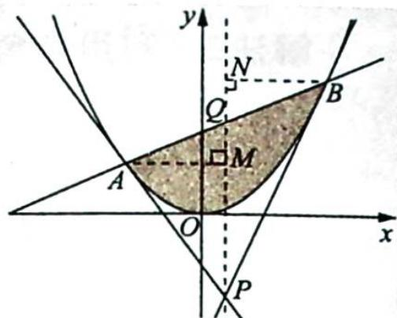

## 2. 阿基米德三角形的得名及其结论的证明

阿基米德三角形的得名是因为阿基米德本人最早利用逼近的思想证明了如下结论: 抛物线的弦与抛物线所围成的封闭图形的面积等于抛物线的弦与过弦的端点的两条切线所围成的三角形的面积的2/3. 用数学语言描述为: 如图所示, 已知 $A(x_{1}, y_{1}), B(x_{2}, y_{2})$ 是抛物线 $x^{2}=$

$2py(p>0)$ 上的两点,以A,B两点为切点的抛物线的两条切线相交于点P,则弦AB与抛物线所围成的封闭图形(图中阴影部分)的面积是 $\triangle PAB$ 的面积的 $\frac{2}{3}$ .

【证明】(定积分法)不妨设 $x_{1} < x_{2}$ , 则根据 $A(x_{1}, y_{1}), B(x_{2}, y_{2})$ ,

易得直线 $PA, PB$ 的方程分别为 $x_{1}x = p(y + y_{1}), x_{2}x = p(y + y_{2})$ ，联立方程组 $\left\{ \begin{array}{l} x_{1}x = p(y + y_{1}) \\ x_{2}x = p(y + y_{2}) \end{array} \right.$ ，解得 $\left\{ \begin{array}{l} x = \frac{x_1 + x_2}{2} \\ y = \frac{x_1x_2}{2p} \end{array} \right.$ ，所以点 $P$ 的坐标为 $\left(\frac{x_1 + x_2}{2}, \frac{x_1x_2}{2p}\right)$ .

如图所示, 过点 $P$ 作 $x$ 轴的垂线交线段 $A B$ 于点 $Q$ , 过点 $A$ 作 $A M \perp P Q$ 于点 $M$ , 过点 $B$ 作 $B N \perp P Q$ 于点 $N$ , 因为点 $Q$ 的横坐标为 $\frac{x_1 + x_2}{2}$ , 即点 $Q$ 是线段 $A B$ 的中点, 所以点 $Q \left( \frac{x_1 + x_2}{2}, \frac{y_1 + y_2}{2} \right)$ .

则 $\triangle PAB$ 的面积 $S_{\triangle PAB} = \frac{1}{2}\times |PQ|\cdot (|AM| + |BN|)$ $= \frac{1}{2}\times \left|\frac{y_1 + y_2}{2} -\frac{x_1x_2}{2p}\right|\cdot (x_2 - x_1)$ $= \frac{1}{2}\times \left|\frac{\frac{x_1^2}{2p} + \frac{x_2^2}{2p}}{2} -\frac{x_1x_2}{2p}\right|\cdot (x_2 - x_1)$ $= \frac{1}{2}\times \left|\frac{x_1^2 + x_2^2 - 2x_1x_2}{4p}\right|\cdot (x_2 - x_1)$ $= \frac{(x_2 - x_1)^3}{8p}.$

因为点 P 的坐标 $(x_{P}, y_{P})$ 满足 $\left\{\begin{aligned} x_{1} & x_{P} = p(y_{P} + y_{1}) \\ & x_{2} & x_{P} = p(y_{P} + y_{2}) \end{aligned}\right.$ ，所以 A, B 的坐标满足方程 $x_{P}x = p(y + y_{P})$ .
又 $(x_{P},y_{P})$ ，即 $\left(\frac{x_{1}+x_{2}}{2},\frac{x_{1}x_{2}}{2p}\right)$ ，所以直线AB的方程为 $\frac{x_{1}+x_{2}}{2}\cdot x=p\left(y+\frac{x_{1}x_{2}}{2p}\right)$ .
根据定积分的几何意义可知:线段AB与抛物线所围成的封闭图形的面积 $S=\int_{x_{1}}^{x_{2}}\left(\frac{x_{1}+x_{2}}{2p}\cdot x-\frac{x_{1}x_{2}}{2p}-\frac{x^{2}}{2p}\right)\mathrm{d}x=\left(\frac{x_{1}+x_{2}}{4p}\cdot x^{2}-\frac{x_{1}x_{2}}{2p}x-\frac{x^{3}}{6p}\right)\bigg|_{x_{1}}^{x_{2}}$ $=\frac{x_{1}+x_{2}}{4p}(x_{2}^{2}-x_{1}^{2})-\frac{x_{1}x_{2}}{2p}(x_{2}-x_{1})-\frac{x_{2}^{3}-x_{1}^{3}}{6p}=\frac{(x_{2}-x_{1})^{3}}{12p}=\frac{2}{3}S_{\triangle PAB}$ ，所以原命题得证.
