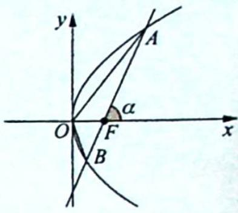
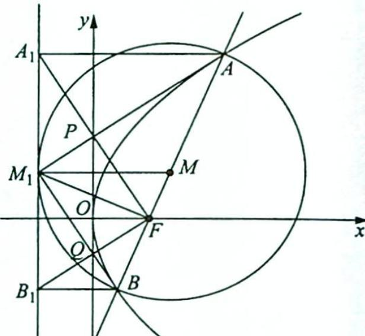
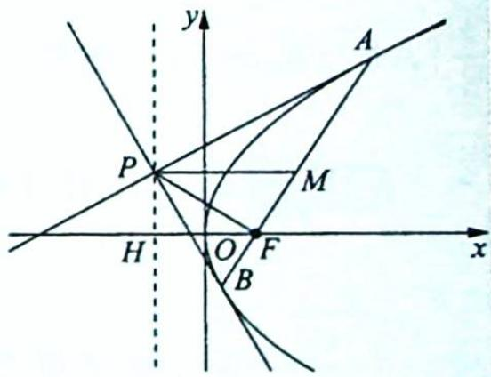

## 3. 阿基米德三角形模型的性质

性质1:如图所示,已知过抛物线 $y^{2}=2px(p>0)$ 的焦点F的直线交抛物线于 $A(x_{1},y_{1})$ , $B(x_{2},y_{2})$ 两点,且直线AB的倾斜角为 $\alpha$ ,则有如下结论:

① $y_{1}y_{2}=-p^{2},x_{1}x_{2}=\frac{p^{2}}{4};$

② $|AB|=x_{1}+x_{2}+p=\frac{2p}{\sin^{2}\alpha};$

③ $\frac{1}{|AF|}+\frac{1}{|BF|}=\frac{2}{p};$

④ $\frac{S_{\triangle OAB}^{2}}{|AB|}=\frac{p^{3}}{8}$ （或 $S_{\triangle OAB}=\frac{p^{2}}{2\sin\alpha}$ ）；

⑤过 A, B 两点作抛物线的切线, 两条切线的交点 P 在准线上.

【证明】①由抛物线的极坐标方程知 $y_{1}=\rho_{1}\sin\alpha=\frac{p\sin\alpha}{1-\cos\alpha},y_{2}=\rho_{2}\sin(\alpha+\pi)=$ $\frac{p\sin(\alpha+\pi)}{1-\cos(\alpha+\pi)}=\frac{-p\sin\alpha}{1+\cos\alpha}$ ，所以 $y_{1}y_{2}=\frac{p\sin\alpha}{1-\cos\alpha}\cdot\frac{-p\sin\alpha}{1+\cos\alpha}=-p^{2},x_{1}x_{2}=\frac{y_{1}^{2}}{2p}\cdot\frac{y_{2}^{2}}{2p}=\frac{p^{2}}{4}$ .

②由抛物线的焦半径公式的代数形式可知 $\left|AB\right|=\left|AF\right|+\left|BF\right|=\left(x_{1}+\frac{p}{2}\right)+$ $\left(x_{2}+\frac{p}{2}\right)=x_{1}+x_{2}+p$ ，由抛物线的焦半径公式的几何形式可知 $\left|AB\right|=\left|AF\right|+\left|BF\right|=$ $\frac{p}{1-\cos\alpha}+\frac{p}{1-\cos(\alpha+\pi)}=\frac{p}{1-\cos\alpha}+\frac{p}{1+\cos\alpha}=\frac{2p}{\sin^{2}\alpha}.$

③根据抛物线的焦半径公式的几何形式可知 $\frac{1}{|AF|} + \frac{1}{|BF|} = \frac{1 - \cos\alpha}{p} + \frac{1 - \cos(\alpha + \pi)}{p} = \frac{1 - \cos\alpha}{p} + \frac{1 + \cos\alpha}{p} = \frac{2}{p}$ .

④ 观察上面图形可以得到 $S_{\triangle OAB} = S_{\triangle OFA} + S_{\triangle OFB} = \frac{1}{2}|OF||AF|\sin \angle OFA+$ $\frac{1}{2}|OF||BF|\sin \angle OFB = \frac{1}{2}|OF|(|AF| + |BF|)\sin \alpha = \frac{1}{2}|OF||AB|\sin \alpha ,$ 所以 $\frac{S_{\triangle OAB}^2}{|AB|} =$ $\frac{|OF|^2|AB|^2\sin^2\alpha}{4|AB|} = \frac{p^2|AB|\sin^2\alpha}{16} = \frac{p^2\cdot\frac{2p}{\sin^2\alpha}\cdot\sin^2\alpha}{16} = \frac{p^3}{8}$ （或 $S_{\triangle OAB} = \frac{p^2}{2\sin\alpha}$ ）.

⑤设直线 $AB: y = k\left(x - \frac{p}{2}\right)$ , 联立 $\left\{ \begin{array}{l} y = k\left(x - \frac{p}{2}\right) \\ y^2 = 2px \end{array} \right.$ , 可得 $k^2 x^2 - p(k^2 + 2)x + \frac{p^2 k^2}{4} = 0$ , 所以 $x_1 + x_2 = \frac{p(k^2 + 2)}{k^2}, x_1 x_2 = \frac{p^2}{4}$ .

$y^{2}=2px$ 对 x 进行求导， $2yy^{\prime}=2p, y^{\prime}=\frac{p}{y}$ ，在点 $A(x_{1},y_{1})$ 的切线方程为 $y-y_{1}=\frac{p}{y_{1}}(x-x_{1})$ ，即 $yy_{1}=p(x-x_{1})+y_{1}^{2}=p(x-x_{1})+2px_{1}=px+px_{1}=p(x+x_{1})$ .
同理可得在点 $B(x_{2},y_{2})$ 的切线方程为 $y_{2}y=p(x+x_{2})$ ，联立 $\left\{\begin{aligned}y_{1}y&=p(x+x_{1})\\ y_{2}y&=p(x+x_{2})\end{aligned}\right.$ ，可得 $\frac{x+x_{1}}{y_{1}}=\frac{x+x_{2}}{y_{2}}$ ，即 $x(y_{2}-y_{1})=x_{2}y_{1}-x_{1}y_{2}, x\left[k\left(x_{2}-\frac{p}{2}\right)-k\left(x_{1}-\frac{p}{2}\right)\right]=x_{2}k\cdot\left(x_{1}-\frac{p}{2}\right)-x_{1}k\cdot\left(x_{2}-\frac{p}{2}\right), kx(x_{2}-x_{1})=-\frac{pk}{2}(x_{2}-x_{1}), x=-\frac{p}{2}$ ，即 P 在准线上.

性质2:如图所示,已知过抛物线 $y^{2}=2px(p>0)$ 的焦点 F 的直线交抛物线于 $A(x_{1},y_{1})$ , $B(x_{2},y_{2})$ 两点, 过点 A 作 $AA_{1}$ 垂直抛物线的准线于点 $A_{1}$ , 过点 B 作 $BB_{1}$ 垂直抛物线的准线于点 $B_{1}$ . 设线段 AB 的中点为点 M, 过点 M 作 $MM_{1}$ 垂直抛物线的准线于点 $M_{1}$ , 连接 $A_{1}F$ , $B_{1}F$ , $M_{1}F$ , 设 $AM_{1}$ 与 $A_{1}F$ 交于点 P, $BM_{1}$ 与 $B_{1}F$ 交于点 Q, 则有如下结论:

① $A{M}_{1}$ 平分 $\angle {A}_{1}{AF}$ , $B{M}_{1}$ 平分 $\angle {B}_{1}{BF}$ ,以 ${AB}$ 为直径的圆与抛物线的准线相切于点 ${M}_{1}$ ;

② ${A}_{1}F \bot  {B}_{1}F$ ;

③ $M_{1}F \perp AB;$

④ $\left|M_{1}F\right|^{2}=\left|AF\right|\left|BF\right|$ ;

⑤ $AM_{1}$ 垂直平分 $A_{1}F$ , $BM_{1}$ 垂直平分 $B_{1}F$ , 且四边形 $M_{1}QFP$ 是矩形;

⑥A,O,B₁三点共线,B,O,A₁三点共线.

【证明】①由梯形的中位线的性质及抛物线的定义可得 $|MM_{1}| = \frac{1}{2} (|AA_{1}| + |BB_{1}|) = \frac{1}{2} (|AF| + |BF|) = \frac{1}{2} |AB| = |AM| = |BM|$ ，所以 $\angle MM_{1}A = \angle MAM_{1}, \angle MM_{1}B = \angle MBM_{1}$ ，且以 AB 为直径的圆的圆心到抛物线的准线的距离等于圆的半径，即以 AB 为直径的圆与抛物线的准线相切于点 $M_{1}$ .

又因为 $AA_{1} \parallel MM_{1} \parallel BB_{1}$ , 所以 $\angle A_{1}AM_{1} = \angle AM_{1}M, \angle B_{1}BM_{1} = \angle BM_{1}M$ , 所以 $\angle A_{1}AM_{1} = \angle MAM_{1}, \angle B_{1}BM_{1} = \angle MBM_{1}$ , 即 $AM_{1}$ 平分 $\angle A_{1}AF, BM_{1}$ 平分 $\angle B_{1}BF$ .

②因为 $|AA_{1}| = |AF|$ ，所以 $\angle AA_{1}F = \angle AFA_{1}$ ，又 $AA_{1} // OF$ ，所以 $\angle AA_{1}F = \angle A_{1}FO$ ，则 $\angle AFA_{1} = \angle A_{1}FO$ ，同理可得 $\angle BFB_{1} = \angle B_{1}FO, \angle A_{1}FO + \angle B_{1}FO = \angle AFA_{1} + \angle BFB_{1} = \frac{1}{2} \times 180^{\circ} = 90^{\circ}$ ，即 $A_{1}F \perp B_{1}F$ .

③因为 $A_{1}F \perp B_{1}F$ , 所以 $\triangle A_{1}FB_{1}$ 是直角三角形, 又因为 $AA_{1} \parallel MM_{1} \parallel BB_{1}$ , 且 $M$ 是线段 $AB$ 的中点, 所以 $M_{1}$ 是 Rt $\triangle A_{1}FB_{1}$ 的斜边 $A_{1}B_{1}$ 的中点, $|M_{1}A_{1}| = |M_{1}F|$ , $\angle M_{1}A_{1}F = \angle M_{1}FA_{1}$ , 则 $\angle M_{1}FA_{1} + \angle AFA_{1} = \angle M_{1}A_{1}F + \angle AA_{1}F = 90^{\circ}$ , 即 $M_{1}F \perp AB$ .

④因为以 $AB$ 为直径的圆与抛物线的准线切于点 $M_{1}$ , 所以 $\triangle ABM_{1}$ 是直角三角形, 又因为 $M_{1}F \perp AB$ , 所以易证 $\triangle AM_{1}F \sim \triangle M_{1}BF$ , 可得 $\frac{|AF|}{|M_{1}F|} = \frac{|M_{1}F|}{|BF|}$ , 即 $|M_{1}F|^{2} = |AF||BF|$ .

⑤ 因为 $\left|AA_{1}\right|=\left|AF\right|$ ， $\angle A_{1}AM_{1}=\angle FAM_{1}$ ， $\left|AM_{1}\right|=\left|AM_{1}\right|$ ，所以 $\triangle A_{1}AM_{1}\cong\triangle FAM_{1}$ ，根据图形的对称性可知 $AM_{1}$ 垂直平分 $A_{1}F$ ，同理可得 $BM_{1}$ 垂直平分 $B_{1}F$ 。

$$
\angle A M _ {1} B = \angle A _ {1} F B _ {1} = 9 0 ^ {\circ}
$$

$$
M _ {1} Q F P
$$

⑥因为 $k_{OA}=\frac{y_{1}}{x_{1}}=\frac{y_{1}}{\frac{y_{1}^{2}}{2p}}=\frac{2p}{y_{1}}, k_{OB_{1}}=\frac{y_{2}}{-\frac{p}{2}}=-\frac{2y_{2}}{p}$ ，由性质 1 可知 $y_{1}y_{2}=-p^{2}$ ，所以 $k_{OA}=$ $\frac{2p}{y_{1}}=-\frac{2y_{2}}{p}=k_{OB_{1}}$ ，即 A, O, $B_{1}$ 三点共线，同理可证 B, O, $A_{1}$ 三点共线.

性质3: 若阿基米德三角形底边 $AB$ 过抛物线的焦点 $F\left(\frac{p}{2},0\right)$ , 则 $\triangle PAB$ 的面积的最小值为 $p^{2}$ .

【证明】如图所示,由性质1可知点P在直线 $x=-\frac{p}{2}$ 上,且 $y_{1}y_{2}=-p^{2}$ ①.

易求得直线 $PA, PB$ 的方程分别为 $y_{1}y = p(x + x_{1}), y_{2}y = p(x + x_{2})$ , 所以 $\left\{ \begin{array}{l} k_{PA} = \frac{p}{y_1} \\ k_{PB} = \frac{p}{y_2} \end{array} \right.$ , 结合①式可得 $k_{PA} \cdot k_{PB} = \frac{p}{y_1} \cdot \frac{p}{y_2} = -1$ , 所以 $PA \perp PB$ , 再根据性质 2 可知 $PF \perp AB$ .

设点 M 是 AB 的中点，则 $M\left(\frac{x_{1}+x_{2}}{2},\frac{y_{1}+y_{2}}{2}\right)$ ，结合 $\left\{\begin{aligned}x_{1}&=\frac{y_{1}^{2}}{2p}\\ x_{2}&=\frac{y_{2}^{2}}{2p}\end{aligned}\right.$ ，可得 $|PM|=\frac{x_{1}+x_{2}}{2}+\frac{p}{2}=\frac{\frac{y_{1}^{2}}{2p}+\frac{y_{2}^{2}}{2p}}{2}+\frac{p}{2}\geqslant\frac{2\sqrt{\frac{y_{1}^{2}}{2p}\cdot\frac{y_{2}^{2}}{2p}}}{2}+\frac{p}{2}=p$ （或者由 $|PM|\geqslant|PF|\geqslant|HF|$ 得出），当且仅当 $y_{1}=-y_{2}=p$ 或 $y_{1}=-y_{2}=-p$ 时等号成立。
所以△PAB的面积为 $\frac{1}{2}|PM|\cdot|y_{1}-y_{2}|\geqslant\frac{1}{2}p\cdot|y_{1}-y_{2}|=\frac{1}{2}p\cdot(|y_{1}|+|y_{2}|)\geqslant\frac{1}{2}p\cdot2\sqrt{|y_{1}|\cdot|y_{2}|}=p^{2}$ ，当且仅当 $y_{1}=-y_{2}=p$ 或 $y_{1}=-y_{2}=-p$ 时等号成立。

例21.13 (2019新课标全国Ⅲ卷理21)如图所示,已知曲线 $C: y = \frac{x^2}{2}$ ,点 $D$ 为直线 $y = -\frac{1}{2}$ 上的动点,过点 $D$ 作曲线 $C$ 的两条切线,切点分别为 $A, B$ .

(1) 证明: 直线 AB 过定点:

(2)若以点 $E\left(0,\frac{5}{2}\right)$ 为圆心的圆与直线 AB 相切,且切点为线段 AB 的中点,求四边形 ADBE 的面积.

分析 (1) 设 $D, A$ 两点的坐标, 用导数和斜率的几何意义分别表示切线 $DA$ 的斜率, 根据相等关系建立方程, 同理根据 $DB$ 的斜率建立方程, 根据方程思想可得直线 $AB$ 的方程. (2) 由 (1) 得直线 $AB$ 的方程为 $y = tx + \frac{1}{2}$ , 联立直线方程与抛物线方程, 根据弦长公式得 $|AB|$ , 根据点到直线的距离公式得点 $D, E$ 到直线 $AB$ 的距离 $d_1, d_2$ , 则四边形 $ADBE$ 的面积 $S = \frac{1}{2} |AB|(d_1 + d_2)$ , 根据已知条件求出 $t$ , 代入可得四边形 $ADBE$ 的面积.

解析 (1) 设 $D\left(t, -\frac{1}{2}\right), A(x_1, y_1)$ , 则 $x_1^2 = 2y_1$ , 由于 $y' = x$ , 所以切线 $DA$ 的斜率为 $x_1, \frac{y_1 + \frac{1}{2}}{x_1 - t} = x_1$ , 整理得 $2tx_1 - 2y_1 + 1 = 0$ .

设 $B(x_{2},y_{2})$ ，同理可得 $2tx_{2} - 2y_{2} + 1 = 0$ ，所以直线 $AB$ 的方程为 $2tx - 2y + 1 = 0$ ，即直线 $AB$ 过定点 $\left(0,\frac{1}{2}\right)$

(2)由(1)得直线 $AB$ 的方程为 $y = tx + \frac{1}{2}$ , 联立方程组 $\left\{ \begin{array}{l} y = tx + \frac{1}{2} \\ y = \frac{x^2}{2} \end{array} \right.$ , 可得 $x^2 - 2tx - 1 = 0$ , 于是 $x_1 + x_2 = 2t, x_1x_2 = -1, y_1 + y_2 = t(x_1 + x_2) + 1 = 2t^2 + 1$ , 由弦长公式得 $|AB| = \sqrt{t^2 + 1}$ . $|x_1 - x_2| = \sqrt{t^2 + 1} \cdot \sqrt{(x_1 + x_2)^2 - 4x_1x_2} = 2(t^2 + 1)$ .

设 $d_{1}, d_{2}$ 分别为点 $D, E$ 到直线 $AB$ 的距离，则 $d_{1} = \sqrt{t^{2} + 1}, d_{2} = \frac{2}{\sqrt{t^{2} + 1}}$ ，所以四边形

ADBE的面积 $S = \frac{1}{2} |AB|(d_1 + d_2) = (t^2 + 3)\sqrt{t^2 + 1}$ .

设点 M 为线段 AB 的中点，则 $M\left(t, t^{2} + \frac{1}{2}\right)$ ，由于 $\overrightarrow{EM} \perp \overrightarrow{AB}$ ，而 $\overrightarrow{EM} = (t, t^{2} - 2)$ ， $\overrightarrow{AB}$ 与向量 $(1, t)$ 平行，所以 $t + (t^{2} - 2) \cdot t = 0$ ，解得 t = 0 或 $t = \pm 1$ 。

当 $t = 0$ 时, $S = 3$ ; 当 $t = \pm 1$ 时, $S = 4\sqrt{2}$ , 所以四边形 $ADBE$ 的面积为 3 或 $4\sqrt{2}$ .

变式(1) (2006 全国Ⅱ卷理 21)已知抛物线 $x^{2} = 4y$ 的焦点为 $F, A, B$ 是抛物线上的两动点, 且 $\overrightarrow{AF} = \lambda \overrightarrow{FB} (\lambda > 0)$ , 过 $A, B$ 两点分别作抛物线的切线, 设其交点为 $M$ .

(1)证明 $\overrightarrow{FM}\cdot\overrightarrow{AB}$ 为定值；

(2)设 $\triangle ABM$ 的面积为 $S$ ,写出 $S=f(\lambda)$ 的表达式,并求 $S$ 的最小值.

解析 (1) 设 $A\left(x_{1}, \frac{x_{1}^{2}}{4}\right), B\left(x_{2}, \frac{x_{2}^{2}}{4}\right)$ , 则直线 $AB$ 为 $(x_{1} + x_{2})x = 4y + x_{1}x_{2}$ , 代入点 $F(0,1)$ , 可得 $x_{1}x_{2} = -4$ .

由于 $y'=\frac{x}{2}$ ，故抛物线在点 A, B 的切线分别为 $xx_{1}=2\left(y+\frac{x_{1}^{2}}{4}\right)$ ， $xx_{2}=2\left(y+\frac{x_{2}^{2}}{4}\right)$ ，联立这两条切线，可解得点 M 的坐标为 $\left(\frac{x_{1}+x_{2}}{2},\frac{x_{1}x_{2}}{4}\right)$ ，即为 $\left(\frac{x_{1}+x_{2}}{2},-1\right)$ .

$\overrightarrow{FM} = \left(\frac{x_1 + x_2}{2}, -2\right), \overrightarrow{AB} = \left(x_2 - x_1, \frac{x_2^2}{4} - \frac{x_1^2}{4}\right)$ ，故 $\overrightarrow{FM} \cdot \overrightarrow{AB} = \frac{x_1 + x_2}{2} \cdot (x_2 - x_1) - 2\left(\frac{x_2^2}{4} - \frac{x_1^2}{4}\right) = 0.$

(2) 由 $\overrightarrow{AF} = \lambda \overrightarrow{FB}$ 可得 $0 = \frac{x_1 + \lambda x_2}{1 + \lambda}$ , 结合 $x_1 x_2 = -4$ , 可解得 $\frac{x_1^2}{4} = \lambda, \frac{x_2^2}{4} = \frac{1}{\lambda}$ .

$|\overrightarrow{FM}|=\sqrt{\left(\frac{x_{1}+x_{2}}{2}\right)^{2}+(-1-1)^{2}}=\sqrt{\lambda}+\frac{1}{\sqrt{\lambda}},|AB|=|AF|+|BF|=\frac{x_{1}^{2}}{4}+1+\frac{x_{2}^{2}}{4}+1=$ $\left(\sqrt{\lambda}+\frac{1}{\sqrt{\lambda}}\right)^{2}$ ，由(1)知 $FM\perp AB$ ，故 $S=\frac{1}{2}|AB||FM|=\frac{1}{2}\left(\sqrt{\lambda}+\frac{1}{\sqrt{\lambda}}\right)^{3}\geqslant4$ ，当且仅当 $\sqrt{\lambda}=\frac{1}{\sqrt{\lambda}}$ ，即 $\lambda=$ 1 时，S 有最小值 4.
