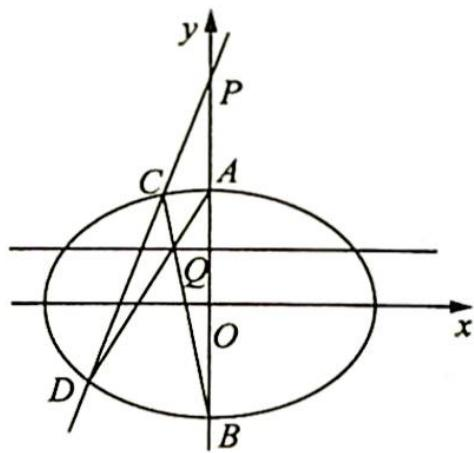
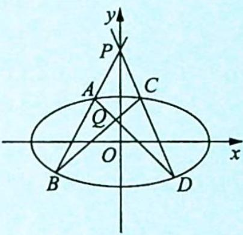
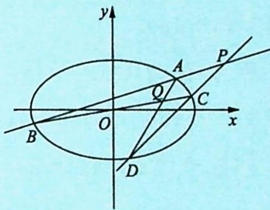
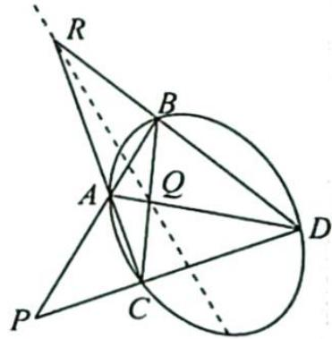
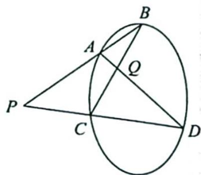

## 1. 轨迹问题

例 22.2 如图所示, 自点 $P(0,4)$ 向椭圆 $\frac{x^2}{8} + \frac{y^2}{4} = 1$ 引割线, 交点分别为 $C, D, A, B$ 为椭圆短轴端点. $AD \cap BC = Q$ , 求点 $Q$ 的轨迹.

分析 ▶ 由极点极线结论可得极点 $P(0,4)$ 对应的极线方程为 $\frac{x \cdot 0}{8} + \frac{y \cdot 4}{4} = 1$ ，解得 $y = 1$ ，所以点 $Q$ 的轨迹方程为 $y = 1$ ，这就为后面的解答提供了解题方向。

解析 设 $C(x_{1},y_{1}),D(x_{2},y_{2})$ ，联立 $\left\{ \begin{array}{l} l_{BC}:y = \frac{y_1 + 2}{x_1} x - 2 \\ l_{AD}:y = \frac{y_2 - 2}{x_2} x + 2 \end{array} \right.$ （思考：在此处我们是消 $y$ 还是消 $x?$ ）

消 $x$ 得 $\frac{y + 2}{y - 2} = \frac{(y_1 + 2)x_2}{(y_2 - 2)x_1} \Rightarrow (y + 2)(y_2 - 2)x_1 = (y - 2)(y_1 + 2)x_2 \Rightarrow y_Q = \frac{2x_1(y_2 - 2) + 2x_2(y_1 + 2)}{x_2(y_1 + 2) - x_1(y_2 - 2)}$ , 把 $y = kx + 4$ 代入, 则 $y_Q = \frac{2x_1(kx_2 + 2) + 2x_2(kx_1 + 6)}{x_2(kx_1 + 6) - x_1(kx_2 + 2)} = \frac{4kx_1x_2 + 4x_1 + 12x_2}{6x_2 - 2x_1}$ .

(直接证明 $y_{Q} = 1$ 比较困难, 我们可以考虑等价证明 $y_{Q} - 1 = 0$ , 这也是我们处理这种问题的常见手段.)

只需证明 $y_{Q} - 1 = \frac{4kx_{1}x_{2} + 6x_{1} + 6x_{2}}{6x_{2} - 2x_{1}} = 0$ 成立。(韦达定理代入即可)

联立 $\left\{ \begin{array}{l} y = kx + 4 \\ \frac{x^2}{8} + \frac{y^2}{4} = 1 \end{array} \right.$ ，可得 $(1 + 2k^2)x^2 + 16kx + 24 = 0$ ，所以 $\left\{ \begin{array}{l} x_1 + x_2 = \frac{-16k}{1 + 2k^2} \\ x_1x_2 = \frac{24}{1 + 2k^2} \end{array} \right.$ ，代入上式可得 $y_Q - 1 = \frac{4kx_1x_2 + 6x_1 + 6x_2}{6x_2 - 2x_1} = 0.$

故 Q 点的轨迹方程为 y=1.

解后反思

## 变换条件 举一反三

反思1:如图1所示,自点 $P(0,4)$ 向椭圆 $\frac{x^{2}}{8}+\frac{y^{2}}{4}=1$ 引割线,交点分别为A,B和C,D,且AD交BC于点Q,求点Q的轨迹方程.

由极点极线结论可得极点 $P(0,4)$ 对应的极线方程为 $\frac{x \cdot 0}{8} + \frac{y \cdot 4}{4} = 1$ ，解得 y = 1，所以点 Q 的轨迹方程为 y = 1。

图 1

图 2

反思2:(更一般的情形)如图2所示,自椭圆 $\frac{x^{2}}{8}+\frac{y^{2}}{4}=1$ 外一点 $P(4,1)$ 向椭圆引两条割线,分别交椭圆于点A,B和C,D,且 $AD\cap BC=Q$ ,求动点Q的轨迹方程.

由极点极线结论可得极点 $P(4,1)$ 对应的极线方程为 $\frac{x \cdot 4}{8} + \frac{y \cdot 1}{4} = 1$ ，即 $2x + y - 4 = 0$ ，
所以点 Q 的轨迹方程为 $2x + y - 4 = 0$ .

解法一(运用定比点差法证明): 设 $\overrightarrow{AP} = \lambda \overrightarrow{PB}, A(x_1, y_1), B(x_2, y_2)$ ，则 $\left\{\begin{aligned}&4=\frac{x_1+\lambda x_2}{1+\lambda}\\ &1=\frac{y_1+\lambda y_2}{1+\lambda}\end{aligned}\right.$ ，即 $\left\{\begin{aligned}\lambda x_{2}=4+4\lambda-x_{1}\\ \lambda y_{2}=1+\lambda-y_{1}\end{aligned}\right.$ ①，又 $\left\{\begin{aligned}\frac{x_{1}^{2}}{8}+\frac{y_{1}^{2}}{4}=1\\ \frac{(\lambda x_{2})^{2}}{8}+\frac{(\lambda y_{2})^{2}}{4}=\lambda^{2}\end{aligned}\right.\Rightarrow\frac{4(x_{1}-\lambda x_{2})}{8}+\frac{y_{1}-\lambda y_{2}}{4}=1-\lambda$ ，代入①式，可

得 $2(2x_{1}-4-4\lambda)+(2y_{1}-1-\lambda)=4-4\lambda$ ，即 $4x_{1}+2y_{1}=5\lambda+13$ ②。

综合①②式，可得 $\left\{ \begin{array}{l} y_{1} = \frac{5\lambda + 13 - 4x_{1}}{2} \\ \lambda x_{2} = 4 + 4\lambda - x_{1} \\ \lambda y_{2} = \frac{4x_{1} - 3\lambda - 11}{2} \end{array} \right.$ ③，同理，设 $\overrightarrow{CP} = \mu \overrightarrow{PD}, C(x_3, y_3), D(x_4, y_4)$ ，则 $\left\{ \begin{array}{l} y_{3} = \frac{5\mu + 13 - 4x_{3}}{2} \\ \mu x_{4} = 4 + 4\mu - x_{3} \\ \mu y_{4} = \frac{4x_{3} - 3\mu - 11}{2} \end{array} \right.$ ④. 直线 $AD$ 的方程为 $\frac{y - y_1}{x - x_1} = \frac{y_4 - y_1}{x_4 - x_1}$ ，即 $(y_4 - y_1)x + (x_1 - x_4)y = x_1y_4 - x_4y_1$ ， $\left(\frac{4x_3 - 3\mu - 11}{2\mu} - \frac{5\lambda + 13 - 4x_1}{2}\right)x + \left(x_1 - \frac{4 + 4\mu - x_3}{\mu}\right)y = x_1 \cdot \frac{4x_3 - 3\mu - 11}{2\mu} - \frac{4 + 4\mu - x_3}{\mu} \cdot \frac{5\lambda + 13 - 4x_1}{2}$ ，即 $(4\mu x_1 + 4x_3 - 16\mu - 5\lambda\mu - 11)x + (2\mu x_1 + 2x_3 - 8\mu - 8)y = (13\mu + 5)x_1 + (5\lambda + 13)x_3 - (5\lambda + 13)(4 + 4\mu).$ 同理直线 $BC$ 的方程为 $(4\lambda x_3 + 4x_1 - 16\lambda - 5\lambda\mu - 11)x + (2\lambda x_3 + 2x_1 - 8\lambda - 8)y = (13\lambda + 5)x_3 + (5\mu + 13)x_1 - (5\mu + 13)(4 + 4\lambda).$ 两式相减，得 $[4(\mu - 1)x_1 + 4(1 - \lambda)x_3 + 16(\lambda - \mu)]x + [2(\mu - 1)x_1 + 2(1 - \lambda)x_3 + 8(\lambda - \mu)]y = 8(\mu - 1)x_1 + 8(1 - \lambda)x_3 + 32(\lambda - \mu)$ ，即 $2x + y = 4.$

解法二(运用曲线系证明): 如图所示, 点 $P(x_0, y_0)$ 不在二次曲线 $\Gamma$ : $F(x, y) = 0$ 上, 其中 $F(x, y) = ax^2 + bxy + cy^2 + dx + ey + f$ . 经过点 $P$ 的两条直线分别交曲线 $\Gamma$ 于点 $A, B, C, D, AD$ 与 $BC$ 交于点 $Q, AC$ 与 $BD$ 交于点 $R$ , 则直线 $QR$ 的方程为 $ax_0x + b \cdot \frac{x_0y + y_0x}{2} + cy_0y + d \cdot \frac{x_0 + x}{2} + e \cdot \frac{y_0 + y}{2} + f = 0$ .

引理证明

为了解决此问题,先解决下面问题:

如图所示, 点 $A, B, C, D$ 在二次曲线 $\Gamma: F(x, y) = 0$ 上, 其中 $F(x, y) = ax^2 + bxy + cy^2 + dx + ey + f$ , AB 与 CD 交于点 $P(x_1, y_1)$ , AD 与 BC 交于点 $Q(x_2, y_2)$ . 求证: $ax_1x_2 + b \cdot \frac{x_1y_2 + x_2y_1}{2} + cy_1y_2 + d \cdot \frac{x_1 + x_2}{2} + e \cdot \frac{y_2 + y_1}{2} + f = 0$ .

【证明】设 $AB: m_1(x - x_1) + n_1(y - y_1) = 0, CD: p_1(x - x_1) + q_1(y - y_1) = 0, AD: m_2(x - x_2) + n_2(y - y_2) = 0, BC: p_2(x - x_2) + q_2(y - y_2) = 0.$

考虑二次曲线方程的一般形式是 $ax^2 + bxy + cy^2 + dx + ey + f = 0 (a, b, c$ 不同时为 0), 因此可将二次曲线 $\Gamma$ 的方程设为 ( $\lambda$ 与 $\mu$ 为参数): $\lambda[m_1(x - x_1) + n_1(y - y_1)][p_1(x - x_1) + q_1(y - y_1)] + \mu[m_2(x - x_2) + n_2(y - y_2)][p_2(x - x_2) + q_2(y - y_2)] = 0$ .

显然 A, B, C, D 四点坐标均满足这个方程.

将 $\lambda [m_1(x - x_1) + n_1(y - y_1)][p_1(x - x_1) + q_1(y - y_1)]$ 整理成如下形式： $a_{1}(x - x_{1})^{2} + b_{1}(x - x_{1})(y - y_{1}) + c_{1}(y - y_{1})^{2},$

将上式进一步展开, 设结果为 $a_{1}x^{2} + b_{1}xy + c_{1}y^{2} + d_{1}x + e_{1}y + f_{1}$ , 其中 $d_{1} = -2a_{1}x_{1} - b_{1}y_{1}, e_{1} = -b_{1}x_{1} - 2c_{1}y_{1}, f_{1} = a_{1}x_{1}^{2} + b_{1}x_{1}y_{1} + c_{1}y_{1}^{2}$ .

不难验证: $a_{1}x_{1}x + b_{1} \cdot \frac{x_{1}y + xy_{1}}{2} + c_{1}y_{1}y + d_{1} \cdot \frac{x + x_{1}}{2} + e_{1} \cdot \frac{y + y_{1}}{2} + f_{1} = 0$ , 这是一个与 $x, y$ 无关的恒等式, 从而得 $a_{1}x_{1}x_{2} + b_{1} \cdot \frac{x_{1}y_{2} + x_{2}y_{1}}{2} + c_{1}y_{1}y_{2} + d_{1} \cdot \frac{x_{1} + x_{2}}{2} + e_{1} \cdot \frac{y_{1} + y_{2}}{2} + f_{1} = 0$ .

为叙述方便,将前面等式简记为 $T_{1}=0$ . 类似地,可证得 $T_{2}=0$ .

同时,依据前面的符号表示,二次曲线 $\Gamma$ 的方程可整理为 $(a_{1}+a_{2})x^{2}+(b_{1}+b_{2})xy+(c_{1}+c_{2})y^{2}+(d_{1}+d_{2})x+(e_{1}+e_{2})y+(f_{1}+f_{2})=0$ .

要证明原题结论成立, 只要证明: $T = (a_{1} + a_{2})x_{1}x_{2} + (b_{1} + b_{2}) \cdot \frac{x_{1}y_{2} + x_{2}y_{1}}{2} + (c_{1} + c_{2})y_{1}y_{2} + (d_{1} + d_{2}) \cdot \frac{x_{1} + x_{2}}{2} + (e_{1} + e_{2}) \cdot \frac{y_{1} + y_{2}}{2} + (f_{1} + f_{2}) = 0$ , 而 $T = T_{1} + T_{2} = 0$ , 即 $ax_{1}x_{2} + b \cdot \frac{x_{1}y_{2} + x_{2}y_{1}}{2} + cy_{1}y_{2} + d \cdot \frac{x_{1} + x_{2}}{2} + e \cdot \frac{y_{1} + y_{2}}{2} + f = 0$ .

## 解决问题

设 $P(x_0, y_0), Q(x_1, y_1), R(x_2, y_2)$ ，则依据前文的结论可得 $ax_0x_1 + b \cdot \frac{x_0y_1 + x_1y_0}{2} + cy_0y_1 + d \cdot \frac{x_0 + x_1}{2} + e \cdot \frac{y_0 + x_1}{2} + e \cdot \frac{y_0 + y_1}{2} + f = 0$ ，因此 $Q, R$ 两点均满足方程 $ax_0x + b \cdot \frac{x_0y + xy_0}{2} + cy_0y + d \cdot \frac{x_0 + x}{2} + e \cdot \frac{y_0 + y}{2} + f = 0$ .

这是一条直线的方程,由两点确定一条直线可知,此方程即为直线 QR 的方程.

因此过 $P(4,1)$ 向椭圆外引两条割线 AB 和 CD，则 AD 和 BC 的交点 Q 的轨迹为 $\frac{4x}{8} + \frac{y}{4} = 1$ ，即 $2x + y = 4$ 。
