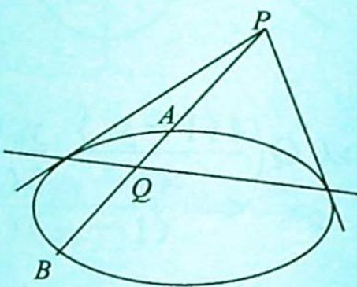
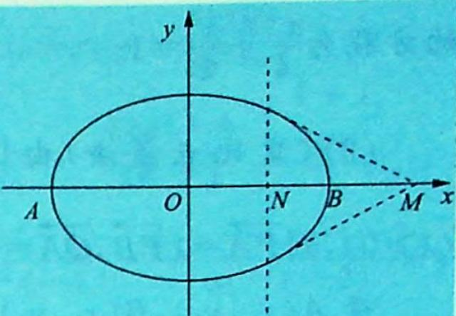
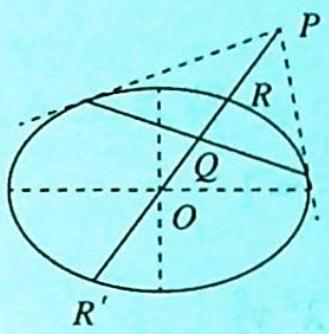
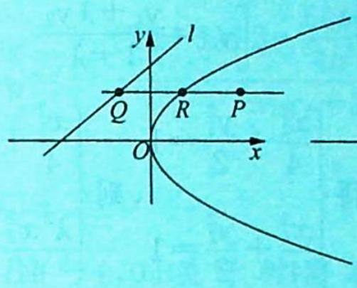
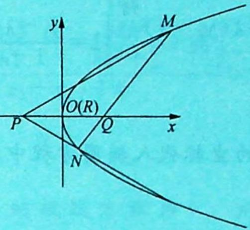
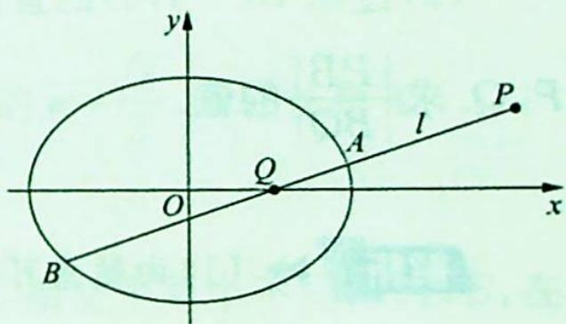
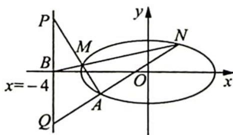
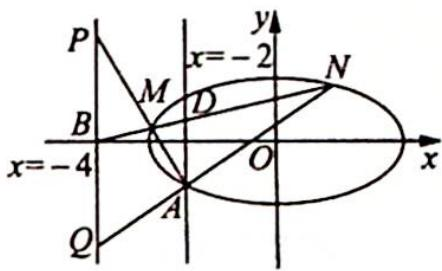
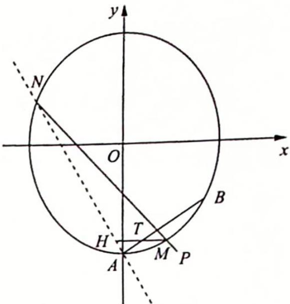
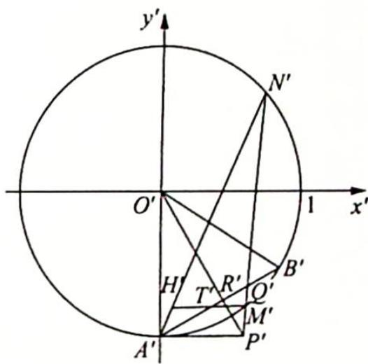

## 22.3 极点极线和调和分割

## 研究密钥

在《高等几何》中关于二次曲线的极点、极线的定义是通过“共轭点”的定义引进的。我们先给出“共轭点”的定义：给定二次曲线 $G: Ax^2 + Bxy + Cy^2 + Dx + Ey + F = 0$ 和点 $P, Q$ （点 $P, Q$ 不在曲线 $G$ 上），如果 $P, Q$ 两点的连线与二次曲线 $G$ 交于两点 $A, B$ ，且 $(PQ, AB) = \frac{PA}{QA} \cdot \frac{QB}{PB} = -1$ （即 $\frac{|PA|}{|PB|} = \frac{|QA|}{|QB|}$ 或 $\frac{2}{|PQ|} = \frac{1}{|PA|} + \frac{1}{|PB|}$ ），则称 $P, Q$ 关于二阶曲线 $G$ 调和共轭，或点 $P$ 与 $Q$ 关于二次曲线 $G$ 互为共轭点。

也就是说, 不在二次曲线上的一个定点 $P$ 关于二次曲线 $G$ 的调和共轭点的轨迹是一条直线, 这条直线叫作点 $P$ 关于此二次曲线的极线, $P$ 为这条直线关于此二次曲线的极点.

如图所示, 若 P, A, Q, B 成调和点列, 则有

(1) $\frac{2}{|PQ|}=\frac{1}{|PA|}+\frac{1}{|PB|}$ ;(2) $\frac{|PA|}{|PB|}=\frac{|QA|}{|QB|}$ .

①若 M 为 AB 的中点，则 $\left|MA\right|^{2}=\left|MP\right|\left|MQ\right|$ ;

②若 D=E=0，且 AB 过原点 O，则有 $\left|OA\right|^{2}=\left|OP\right|\left|OQ\right|$ .

【证明】①由 $\frac{|PA|}{|PB|} = \frac{|QA|}{|QB|}$ ，且 M 为 AB 的中点，得 $\frac{|MP| - |MA|}{|MP| + |MA|} = \frac{|MA| - |MQ|}{|MA| + |MQ|}$ ，即 $(|MP| - |MA|)(|MA| + |MQ|) = (|MA| - |MQ|)(|MP| + |MA|)$ ，得 $|MP||MA| + |MP||MQ| - |MA|^2 - |MA||MQ| = |MP||MA| + |MA|^2 - |MP||MQ| - |MA||MQ|$ ，即 $|MA|^2 = |MP||MQ|$ .

②由 $\frac{|PA|}{|PB|} = \frac{|QA|}{|QB|}$ 得 $\frac{|OP|-|OA|}{|OP|+|OA|} = \frac{|OA|-|OQ|}{|OA|+|OQ|}$ ，因此 $(|OP|-|OA|)$ $(|OA| + |OQ|) = (|OA| - |OQ|)(|OP| + |OA|)$ ，即 $|OP||OA| + |OP||OQ| - |OA|^2 - |OA||OQ| = |OP||OA| + |OA|^2 - |OP||OQ| - |OA||OQ|$ ，亦即 $|OA|^2 = |OP||OQ|$ .

例: 椭圆 $C: \frac{x^{2}}{8} + \frac{y^{2}}{4} = 1, M(4,0), M, N$ 关于曲线 C 共轭，则 $N(2,0)$ ，点 M 关于椭圆的极线方程为 x = 2.

解析:如图所示,因为直线 AB 经过原点 O,所以 $8=4 \cdot x_{N}, x_{N}=2, N(2,0)$ ,故点 M 关于椭圆的极线方程为 x=2.

推论：

(1)如图1所示,设点P关于有心圆锥曲线C的调和共轭点为点Q,PQ连线经过圆锥曲线的中心O,且与C交于两点R,

$R'$ ，则有 $OR^{2}=OP\cdot OQ$ ; 反之，若有此式成立，则点 P 与 Q 关于 C 调和共轭.

(2)如图2所示,设极点P关于抛物线 $y^{2}=2px$ 的极线为l,过点P作抛物线对称轴的平行线,分别交极线、抛物线于Q,R两点,则 $|RP|=|RQ|$ .

  
图 1

  
图 2

  
图 3

【证明】设 $P(x_{0},y_{0})$ ，则极线 $l:yy_{0}=p(x+x_{0})$ ，抛物线对称轴的平行线 PQ: $y=y_{0}$ .
联立 $\left\{\begin{aligned}yy_{0}&=p(x+x_{0})\\ y&=y_{0}\end{aligned}\right.$ ，可得 $Q\left(\frac{y_{0}^{2}}{p}-x_{0},y_{0}\right)$ ; 联立 $\left\{\begin{aligned}y^{2}&=2px\\ y&=y_{0}\end{aligned}\right.$ ，可得 $R\left(\frac{y_{0}^{2}}{2p},y_{0}\right)$ .
因为 $\frac{x_{Q}+x_{P}}{2}=\frac{\frac{y_{0}^{2}}{p}-x_{0}+x_{0}}{2}=\frac{y_{0}^{2}}{2p}=x_{R}$ ，所以点R为线段PQ的中点， $|RP|=|RQ|$ .
如图3所示，若极点在抛物线的对称轴上，则点R与坐标原点重合，此时 $|OP|=|OQ|$ .

例 22.5 设椭圆 $C: \frac{x^{2}}{a^{2}} + \frac{y^{2}}{b^{2}} = 1 (a > b > 0)$ 过点 $M(\sqrt{2}, 1)$ ，且左焦点为 $F_{1}(-\sqrt{2}, 0)$ .

(1) 求椭圆 C 的方程；

(2)如图所示,当过点 $P(4,1)$ 的动直线 $l$ 与椭圆 $C$ 相交于不

同点 $A, B$ 时, 在线段 $AB$ 上取点 $Q$ , 满足 $|\overrightarrow{AP}| |\overrightarrow{QB}| = |\overrightarrow{AQ}||\overrightarrow{PB}|$ . 证明: 点 $Q$ 总在某定直线上.

分析 $\gg\left|\overrightarrow{AP}\right|\left|\overrightarrow{QB}\right|=\left|\overrightarrow{AQ}\right|\left|\overrightarrow{PB}\right|$ ，即 $\frac{\left|\overrightarrow{PA}\right|}{\left|\overrightarrow{PB}\right|}=\frac{\left|\overrightarrow{QA}\right|}{\left|\overrightarrow{QB}\right|}$ ，所以 P 和 Q 关于椭圆调和共轭，则 Q 在点 P 关于椭圆 C 的极线上.

解析 (1)根据题意可得 $c = \sqrt{2}$ , 把 $M(\sqrt{2}, 1)$ 代入椭圆方程, 又 $a^2 = b^2 + c^2$ , 可得椭圆 $C$

的方程为 $\frac{x^{2}}{4}+\frac{y^{2}}{2}=1.$

(2)(定比点差法)由 $|\overrightarrow{AP}||\overrightarrow{QB}| = |\overrightarrow{AQ}||\overrightarrow{PB}|$ 得 $\frac{|\overrightarrow{PA}|}{|\overrightarrow{PB}|} = \frac{|\overrightarrow{QA}|}{|\overrightarrow{QB}|}$ , 令 $\lambda = \frac{|\overrightarrow{PA}|}{|\overrightarrow{PB}|} = \frac{|\overrightarrow{QA}|}{|\overrightarrow{QB}|}$ ( $\lambda > 0$ ), 则 $\overrightarrow{PA} = \lambda \overrightarrow{PB}, \overrightarrow{QA} = -\lambda \overrightarrow{QB}$ .

设 $A(x_{1},y_{1}),B(x_{2},y_{2}),P(4,1),Q(x_{0},y_{0}),\overrightarrow{PA} = (x_{1} - 4,y_{1} - 1),\overrightarrow{PB} = (x_{2} - 4,y_{2} - 1),$ $\overrightarrow{QA} = (x_1 - x_0,y_1 - y_0),\overrightarrow{QB} = (x_2 - x_0,y_2 - y_0).$

由 $\left\{\begin{aligned}x_{1}-4&=\lambda(x_{2}-4)\\ y_{1}-1&=\lambda(y_{2}-1)\end{aligned}\right.$ 得 $\left\{\begin{aligned}4&=\frac{x_{1}-\lambda x_{2}}{1-\lambda}\\ 1&=\frac{y_{1}-\lambda y_{2}}{1-\lambda}\end{aligned}\right.$ ，同理 $\left\{\begin{aligned}x_{0}&=\frac{x_{1}+\lambda x_{2}}{1+\lambda}\\ y_{0}&=\frac{y_{1}+\lambda y_{2}}{1+\lambda}\end{aligned}\right.$

将 $A, B$ 点的坐标代入椭圆方程中，得 $\left\{ \begin{array}{l} \frac{x_1^2}{4} + \frac{y_1^2}{2} = 1 \\ \frac{x_2^2}{4} + \frac{y_2^2}{2} = 1 \end{array} \right.$ ，则 $\left\{ \begin{array}{l} \frac{x_1^2}{4} + \frac{y_1^2}{2} = 1 \\ \frac{\lambda^2 x_2^2}{4} + \frac{\lambda^2 y_2^2}{2} = \lambda^2 \end{array} \right.$ .

因此 $\frac{x_1^2 - \lambda^2x_2^2}{4} +\frac{y_1^2 - \lambda^2y_2^2}{2} = 1 - \lambda^2$ ，即 $\frac{(x_1 + \lambda x_2)(x_1 - \lambda x_2)}{4(1 + \lambda)(1 - \lambda)} +\frac{(y_1 + \lambda y_2)(y_1 - \lambda y_2)}{2(1 + \lambda)(1 - \lambda)} = 1$ ，则 $\frac{1}{4}\times 4\cdot x_0 + \frac{1}{2}\times 1\cdot y_0 = 1$ ，即 $x_0 + \frac{y_0}{2} = 1.$

故点 Q 在定直线 $x + \frac{y}{2} = 1$ 上.

变式(1) (2020 北京卷理 20) 已知椭圆 $C: \frac{x^{2}}{a^{2}} + \frac{y^{2}}{b^{2}} = 1$ 过点 $A(-2, -1)$ , 且 $a = 2b$ .

(1)求椭圆 $C$ 的方程:

(2) 过点 $B(-4,0)$ 的直线 $l$ 交椭圆 $C$ 于点 $M, N$ , 直线 $MA, NA$ 分别交直线 $x = -4$ 于点 $P, Q$ . 求 $\frac{|PB|}{|BQ|}$ 的值.

解析 (1) 由题意可得 $\left\{ \begin{array}{l} \frac{(-2)^2}{a^2} + \frac{(-1)^2}{b^2} = 1 \\ a = 2b \end{array} \right.$ , 解得 $\left\{ \begin{array}{l} a^2 = 8 \\ b^2 = 2 \end{array} \right.$ , 所以椭圆 $C$ 的方程为 $\frac{x^2}{8} + \frac{y^2}{2} = 1$ .

(2)解法一:如图1所示,设直线l的方程为 $y=k(x+4)$ ,联立方程
组 $\left\{\begin{aligned}\frac{x^{2}}{8}+\frac{y^{2}}{2}&=1\\ y=k(x+4)\end{aligned}\right.$ ，得 $(4k^{2}+1)x^{2}+32k^{2}x+64k^{2}-8=0$ ，令 $\Delta=(32k^{2})^{2}-4(4k^{2}+1)(64k^{2}-8)>0$ ，解得 $-\frac{1}{2}<k<\frac{1}{2}$ .

  
图 1

设 $M(x_{1}, k(x_{1}+4))$ , $N(x_{2}, k(x_{2}+4))$ ，则根据韦达定理可得 $\left\{\begin{aligned}x_{1} + x_{2} &= -\frac{32k^{2}}{4k^{2}+1}\\ &x_{1}x_{2} = \frac{64k^{2}-8}{4k^{2}+1}\end{aligned}\right.$ (\*).

设 $P(-4, y_{P})$ , $Q(-4, y_{Q})$ ，则根据 P, M, A 三点共线，可得 $\frac{y_{P} - (-1)}{-4 - (-2)} = \frac{k(x_{1} + 4) - (-1)}{x_{1} - (-2)}$ ,

解得 $y_{P} = -\frac{(2k+1)(x_{1}+4)}{x_{1}+2}$ ，同理得 $y_{Q} = -\frac{(2k+1)(x_{2}+4)}{x_{2}+2}$ ，所以 $y_{P} + y_{Q} = -\frac{(2k+1)(x_{1}+4)}{x_{1}+2} - \frac{(2k+1)(x_{2}+4)}{x_{2}+2} = -\frac{(2k+1)(x_{1}+4)}{x_{1}+2}$ .

将 $(\ast)$ 式代入上式得 $y_{P} + y_{Q} = -\frac{(2k + 1)\left[2\cdot\frac{64k^{2} - 8}{4k^{2} + 1} - 6\cdot\frac{32k^{2}}{4k^{2} + 1} + 16\right]}{x_{1}x_{2} + 2(x_{1} + x_{2}) + 4} = 0$ ，所以 $\frac{|PB|}{|BQ|} = \left|\frac{y_P}{y_Q}\right| = 1.$

解法二: 如图 2 所示, 点 $B(-4,0)$ 关于椭圆 $C$ 的极线方程为 $\frac{(-4) \cdot x}{8} + \frac{0 \cdot y}{2} = 1$ , 即 $x = -2$ , 该直线经过点 $A(-2,-1)$ , 设该直线交 $MN$ 于点 $D$ , 则由极线的几何特性可知 $\frac{|BM|}{|BN|} = \frac{|DM|}{|DN|}$ (\*).

  
图2

因为 $PQ \parallel AD$ , 所以根据平行线分线段成比例定理, 可得 $\left\{ \begin{array}{l} \frac{|PB|}{|AD|} = \frac{|BM|}{|MD|} \\ \frac{|BQ|}{|AD|} = \frac{|BN|}{|DN|} \end{array} \right.$ .

故结合(\*)式可得 $\frac{|PB|}{|AD|}=\frac{|BQ|}{|AD|}$ ，即 $\frac{|PB|}{|BQ|=1}$ .

变式 2: (2022 广东二模)已知椭圆 $C: \frac{x^{2}}{a^{2}} + \frac{y^{2}}{b^{2}} = 1 (a > b > 0)$ 的 $e = \frac{\sqrt{2}}{2}$ , 短轴长是 4.

(1) 求 $C$ 的方程；

(2)过点 $P(-3,0)$ 作两条相互垂直的直线 $l_{1}$ 和 $l_{2}$ , 直线 $l_{1}$ 与 $C$ 相交于两个不同点 $A, B$ , 在线段 $AB$ 上取点 $Q$ , 满足 $\frac{|AQ|}{|QB|} = \frac{|AP|}{|PB|}$ , 直线 $l_{2}$ 交 $y$ 轴于点 $R$ , 求 $\triangle PQR$ 面积的最小值.

解析 (1) 由 $e = \frac{c}{a} = \frac{\sqrt{2}}{2}$ 得 $\frac{b}{a} = \sqrt{1 - e^2} = \frac{\sqrt{2}}{2}, 2b = 4, b = 2$ ，解得 $a = 2\sqrt{2}$ .

故椭圆 C 的方程为 $\frac{x^{2}}{8} + \frac{y^{2}}{4} = 1$ .

(2)由 $\left|\frac{AQ}{QB}\right|=\left|\frac{AP}{PB}\right|$ 得P,A,Q,B成调和点列,因此点Q位于定直线 $x=-\frac{8}{3}$ 上.

设直线 $AB$ 的斜率为 $k$ , 那么直线 $PR$ 的斜率为 $-\frac{1}{k} (k \neq 0)$ , 因此 $|PQ| = \sqrt{1 + k^2} \left| -\frac{8}{3} + 3 \right| = \frac{1}{3}\sqrt{1 + k^2}$ , $|PR| = 3\sqrt{1 + \frac{1}{k^2}} = \frac{3\sqrt{1 + k^2}}{|k|}$ , 所以 $S_{\triangle PQR} = \frac{1}{2}|PQ||PR| = \frac{1}{2} \times \frac{1}{3}\sqrt{1 + k^2} \cdot \frac{3\sqrt{1 + k^2}}{|k|} = \frac{1}{2} \cdot \frac{k^2 + 1}{|k|} = \frac{1}{2}\left(|k| + \frac{1}{|k|}\right) \geqslant \frac{1}{2} \times 2\sqrt{|k| \cdot \frac{1}{|k|}} = 1$ (当且仅当 $|k| = 1$ 时取“=”), 当直线 $AB$ 的斜率为 $\pm 1$ 时, $AB$ 的方程为 $y = \pm x + 3$ , 此时, 直线 $y = \pm x + 3$ 与椭圆有两个交点. 综上, $\triangle PQR$ 的面积最小值为 1.

变式(3) 在平面直角坐标系中, 已知 $D(-1,0), E(1,0), M(x,y) (x > 0)$ , 点 $M$ 满足 $k_{MD} \cdot k_{ME} = 3$ , 记 $M$ 的轨迹为 $C$ .

(1) 求 $C$ 的方程；

(2) 过点 $P\left(\frac{1}{2}, 0\right)$ 作两条相互垂直的直线 $l_1$ 和 $l_2$ , 直线 $l_1$ 与 $C$ 相交于两个不同点 $A, B$ , 在线段 $AB$ 上取点 $Q$ , 满足 $\frac{|AQ|}{|QB|} = \frac{|AP|}{|PB|}$ , 直线 $l_2$ 交直线 $x = 2$ 于点 $R$ , 探究 $\triangle PQR$ 面积是否存在最小值, 若存在, 请求出最小值; 若不存在, 请说明理由.

解析 (1) $D(-1,0), E(1,0), M(x,y), k_{MD} = \frac{-y}{-1 - x}, k_{ME} = \frac{-y}{1 - x}, k_{MD} \cdot k_{ME} = \frac{y^2}{x^2 - 1} = 3, x > 0$ , 得 $y^2 = 3x^2 - 3$ , 即 $x^2 - \frac{y^2}{3} = 1 (x > 0)$ .

$$
A \left(x _ {1}, y _ {1}\right), B \left(x _ {2}, y _ {2}\right), Q \left(x _ {0}, y _ {0}\right), P \left(\frac {1}{2}, 0\right), \overrightarrow {P A} = \lambda \overrightarrow {P B}, \overrightarrow {Q A} = - \lambda \overrightarrow {Q B}, \lambda > 0
$$

$$
\lambda \neq 1
$$

$$
\overrightarrow {P A} = \left(x _ {1} - \frac {1}{2}, y _ {1}\right), \overrightarrow {P B} = \left(x _ {2} - \frac {1}{2}, y _ {2}\right), \overrightarrow {Q A} = (x _ {1} - x _ {0}, y _ {1} - y _ {0}), \overrightarrow {Q B} = (x _ {2} - x _ {0}, y _ {2} - y _ {0})
$$

$$
\left\{ \begin{array}{l} x _ {1} - \frac {1}{2} = \lambda \left(x _ {2} - \frac {1}{2}\right) \\ y _ {1} = \lambda y _ {2} \end{array} \right.
$$

$$
\left\{ \begin{array}{l} \frac {x _ {1} - \lambda x _ {2}}{1 - \lambda} = \frac {1}{2} \\ \frac {y _ {1} - \lambda y _ {2}}{1 - \lambda} = 0 \end{array} , \left\{ \begin{array}{l} x _ {1} - x _ {0} = - \lambda (x _ {2} - x _ {0}) \\ y _ {1} - y _ {0} = - \lambda (y _ {2} - y _ {0}) \end{array} \right. \right.
$$

$$
\left\{ \begin{array}{l} x _ {0} = \frac {x _ {1} + \lambda x _ {2}}{1 + \lambda} \\ y _ {0} = \frac {y _ {1} + \lambda y _ {2}}{1 + \lambda} \end{array} \right.
$$

$$
0 \cdot \frac {1}{3} y _ {0} = \frac {x _ {1} ^ {2} - \lambda^ {2} x _ {2} ^ {2}}{1 - \lambda^ {2}} - \frac {1}{3} \cdot \frac {y _ {1} ^ {2} - \lambda^ {2} y _ {2} ^ {2}}{1 - \lambda^ {2}}
$$

$$
\frac {1}{2} x _ {0} -
$$

将 $A, B$ 两点的坐标代入双曲线 $x^{2} - \frac{y^{2}}{3} = 1 (x > 0)$ 中，得 $\left\{ \begin{array}{l} x_{1}^{2} - \frac{y_{1}^{2}}{3} = 1 \\ x_{2}^{2} - \frac{y_{2}^{2}}{3} = 1 \end{array} \right.$ ，即 $x_{1}^{2} - \frac{y_{1}^{2}}{3} - x_{2}^{2} - \frac{y_{2}^{2}}{3} = 1$ $\lambda^{2}\left(x_{2}^{2} - \frac{y_{2}^{2}}{3}\right) = 1 - \lambda^{2}, (x_{1}^{2} - \lambda^{2}x_{2}^{2}) - \frac{y_{1}^{2} - \lambda^{2}y_{2}^{2}}{3} = 1 - \lambda^{2}, \frac{x_{1}^{2} - \lambda^{2}x_{2}^{2}}{1 - \lambda^{2}} - \frac{1}{3} \cdot \frac{y_{1}^{2} - \lambda^{2}y_{2}^{2}}{1 - \lambda^{2}} = 1 (\lambda > 0$ 且 $\lambda \neq 1)$ ，则 $\frac{1}{2} x_{0} = 1$ ，可得动点 $Q$ 的轨迹方程为 $x = 2$ 。

设直线 $l_{1}$ 的斜率为 $k$ (由对称性不妨设 $k > 0$ ), 直线 $l_{2}$ 的斜率为 $-\frac{1}{k}, |PQ| = \sqrt{1 + k^{2}} \left|2 - \frac{1}{2}\right| = \frac{3}{2}\sqrt{1 + k^{2}}, |PR| = \sqrt{1 + \frac{1}{k^{2}}} \left|2 - \frac{1}{2}\right| = \frac{3}{2} \cdot \frac{\sqrt{1 + k^{2}}}{k}, S_{\triangle PQR} = \frac{1}{2} |PQ||PR| = \frac{9}{8} \cdot \frac{1 + k^{2}}{k} = \frac{9}{8} (k + \frac{1}{k}) \geqslant \frac{9}{8} \times 2\sqrt{k \cdot \frac{1}{k}} = \frac{9}{4}$ (当且仅当 $k = 1$ 时取“=”), 易验证, 此时直线 $l_{1}$ 与双曲线 $x^{2} - \frac{y^{2}}{3} = 1 (x > 0)$ 不相交于两点, 因此与题意不符, 故 $\triangle PQR$ 面积不存在最小值.

变式(4) 已知抛物线 $C: y = \frac{1}{2} x^2$ 与直线 $l: y = kx - 1$ 没有公共点, 设点 $P$ 为直线 $l$ 上的动点, 过点 $P$ 作抛物线 $C$ 的两条切线, $A, B$ 两点为切点.

(1)证明:直线AB恒过定点Q;

(2)若点 $P$ 与(1)中的定点 $Q$ 的连线交抛物线 $C$ 于 $M, N$ 两点, 证明: $\frac{|PM|}{|PN|} = \frac{|QM|}{|QN|}$

解析 (1) 证法一: 设 $P(x_{0}, kx_{0} - 1)$ , 则点 $P$ 关于抛物线的极线 $AB$ 的方程为 $\frac{y + kx_{0} - 1}{2} = \frac{1}{2} x_{0} x$ , 即 $x_{0}(x - k) - (y - 1) = 0$ , 所以直线 $AB$ 恒过定点 $Q(k, 1)$ .

证法二: 因为点 $Q(x_{Q}, y_{Q})$ 关于抛物线 $y = \frac{1}{2}x^{2}$ 的极线方程为 $\frac{y + y_{Q}}{2} = \frac{1}{2}x_{Q}x$ ，即 $y = x_{Q}x - y_{Q}$ ，将 $y = x_{Q}x - y_{Q}$ 与直线 l: y = kx - 1 比较系数可得 $\left\{\begin{aligned} x_{Q}&=k \\ y_{Q}&=1 \end{aligned}\right.$ .

所以当点 $Q$ 的坐标为 $(k,1)$ 时, 点 $P$ 在点 $Q$ 关于抛物线的极线上, 则根据配极原则, 可知点 $Q$ 在点 $P$ 关于抛物线的极线上.

又因为直线 ${AB}$ 是点 $P$ 关于抛物线的极线,所以直线 ${AB}$ 恒过定点 $Q\left( {k,1}\right)$ .

(2)证法一: 易知直线 PQ 的方程为 $y=\frac{kx_{0}-2}{x_{0}-k}(x-k)+1$ ，与抛物线的方程 $y=\frac{1}{2}x^{2}$ 联立，
得 $x^{2}-\frac{2kx_{0}-4}{x_{0}-k}x+\frac{(2k^{2}-2)x_{0}-2k}{x_{0}-k}=0$ ，设 $M(x_{3},y_{3})$ ， $N(x_{4},y_{4})$ ，则 $\left\{\begin{aligned}x_{3}+x_{4}&=\frac{2kx_{0}-4}{x_{0}-k}\\ x_{3}x_{4}&=\frac{(2k^{2}-2)x_{0}-2k}{x_{0}-k}\end{aligned}\right.$ ①.
要证 $\frac{|PM|}{|PN|}=\frac{|QM|}{|QN|}$ ，只需证 $\frac{x_{3}-x_{0}}{x_{4}-x_{0}}=\frac{k-x_{3}}{x_{4}-k}$ ，即 $2x_{3}x_{4}-(k+x_{0})(x_{3}+x_{4})+2kx_{0}=0$ ②.
将①式代入②式左边，得左边= $2\cdot\frac{(2k^{2}-2)x_{0}-2k}{x_{0}-k}-(k+x_{0})\cdot\frac{2kx_{0}-4}{x_{0}-k}+2kx_{0}=$ $\frac{2(2k^{2}-2)x_{0}-4k-(k+x_{0})(2kx_{0}-4)+2kx_{0}(x_{0}-k)}{x_{0}-k}=0$ ，所以②式成立，即原命题成立。

证法二: 因为直线 AB 是点 P 关于抛物线的极线, 所以 P, Q, M, N 是调和点列, 所以 $\frac{|PM|}{|PN|} = \frac{|QM|}{|QN|}$ 成立.

例 22.6 (2022 新课标全国乙卷理 20) 已知椭圆 E 的中心为坐标原点, 对称轴为 x 轴, y 轴, 且过 A(0, -2), B(3/2, -1) 两点.

(1) 求 E 的方程；

(2)设过点 $P(1,-2)$ 的直线交 E 于 M, N 两点, 过 M 且平行于 x 轴的直线与线段 AB 交于点 T, 点 H 满足 $\overrightarrow{MT} = \overrightarrow{TH}$ , 证明: 直线 HN 过定点.

分析 ▶ 从特殊入手, 即过点 $P(1, -2)$ 的直线斜率不存在时, 求出直线 $HN$ 所过的定点, 再证明直线斜率存在时, 直线 $HN$ 也过该定点.

解析 (1) 设 $E: \frac{x^2}{a^2} + \frac{y^2}{b^2} = 1$ , 将 $A, B$ 两点代入可得 $\left\{ \begin{array}{l} \frac{4}{b^2} = 1 \\ \frac{9}{4a^2} + \frac{1}{b^2} = 1 \end{array} \right.$ , 解得 $a^2 = 3, b^2 = 4$ , 故 $E$ 的方程为 $\frac{x^2}{3} + \frac{y^2}{4} = 1$ .

(2)解法一:因为 $A(0,-2)$ , $B\left(\frac{3}{2},-1\right)$ ，则直线 AB 的方程为 $y=\frac{2}{3}x-2$ .

①若过点 $P(1, -2)$ 的直线的斜率不存在，直线为 $x = 1$ 。代入 $\frac{x^2}{3} + \frac{y^2}{4} = 1$ ，可得 $M\left(1, -\frac{2\sqrt{6}}{3}\right), N\left(1, \frac{2\sqrt{6}}{3}\right)$ ，将直线 $y = -\frac{2\sqrt{6}}{3}$ 与直线 $AB$ 的方程 $y = \frac{2}{3} x - 2$ 联立可得 $T\left(3 - \sqrt{6}, -\frac{2\sqrt{6}}{3}\right)$ .

因为 $\overrightarrow{MT} = \overrightarrow{TH}$ , 则 $T$ 为线段 $MH$ 的中点, 故 $H\left(5 - 2\sqrt{6}, -\frac{2\sqrt{6}}{3}\right)$ , 此时直线 $HN$ 的方程为 $y - \frac{2\sqrt{6}}{3} = \frac{\frac{4\sqrt{6}}{3}}{2\sqrt{6} - 4} (x - 1)$ , 即 $y - \frac{2\sqrt{6}}{3} = \frac{6 + 2\sqrt{6}}{3} (x - 1), y = \frac{6 + 2\sqrt{6}}{3} x - 2$ , 所以过 $(0, -2)$ .

②若过点 $P(1,-2)$ 的直线的斜率存在, 设直线方程为 $y+2=k(x-1)$ , $M(x_{1},y_{1})$ , $N(x_{2},y_{2})$ , 如图 1 所示.

联立 $\left\{ \begin{array}{l} y = kx - k - 2 \\ \frac{x^2}{3} + \frac{y^2}{4} = 1 \end{array} \right.$ ，可得 $(4 + 3k^2)x^2 - 6k(k + 2)x + 3k(k + 4) = 0$ ，故 $\left\{ \begin{array}{l} x_1 + x_2 = \frac{6k(k + 2)}{4 + 3k^2} \\ x_1x_2 = \frac{3k(k + 4)}{4 + 3k^2} \end{array} \right.$ .

联立直线 $y = y_{1}$ 与 $y = \frac{2}{3} x - 2$ ，可得 $T\left(\frac{3y_1}{2} + 3, y_1\right)$ ，故 $H(3y_1 + 6 - x_1, y_1)$ .

此时直线 $HN$ 的方程为 $y - y_{2} = \frac{y_{1} - y_{2}}{3y_{1} + 6 - x_{1} - x_{2}} (x - x_{2})$ ，将点 $(0, -2)$ 代入，可得 $-2 - y_{2} = \frac{-x_{2}(y_{1} - y_{2})}{3y_{1} + 6 - x_{1} - x_{2}}$ ，即 $-3(y_{1} + 2)(y_{2} + 2) + (x_{1} + x_{2})(y_{2} + 2) = -x_{2}(y_{1} - y_{2})$ ， $-3(y_{1} + 2)(y_{2} + 2) + x_{1}y_{2} + 2(x_{1} + x_{2}) + x_{2}y_{2} = -x_{2}y_{1} + x_{2}y_{2}$ ，整理得 $2(x_{1} + x_{2}) - 6(y_{1} + y_{2}) + x_{1}y_{2} + x_{2}y_{1} - 3y_{1}y_{2} - 12 = 0.$

  
图 1

因为 $\left\{ \begin{array}{l} x_{1} + x_{2} = \frac{6k(k + 2)}{4 + 3k^{2}} \\ x_{1}x_{2} = \frac{3k(k + 4)}{4 + 3k^{2}} \end{array} \right.$ ，则 $\left\{ \begin{array}{l} y_{1} + y_{2} = \frac{-8(k + 2)}{4 + 3k^{2}} \\ y_{1}y_{2} = \frac{4(4 + 4k - 2k^{2})}{4 + 3k^{2}} \end{array} \right.$ ，且 $x_{1}y_{2} + x_{2}y_{1} = \frac{-24k}{4 + 3k^{2}}$ ，代入方程，得 $12k^{2} + 24k + 96 + 48k - 24k - 48 - 48k + 24k^{2} - 48 - 36k^{2} = 0$ 显然成立，由于直线 $HN$ 为动直线，故有且仅有一个定点满足题意，故直线 $HN$ 过定点 $(0, -2)$ .

解法二(仿射变换): 由(1)知, $E: \frac{x^2}{3} + \frac{y^2}{4} = 1$ , 如图 2 所示, 作仿射变换, $x' = \frac{x}{\sqrt{3}}, y' = \frac{y}{2}$ , 则 $E$ 化为单位圆 $x'^2 + y'^2 = 1$ , 且 $A'(0, -1), B'\left(\frac{\sqrt{3}}{2}, -\frac{1}{2}\right), P'\left(\frac{\sqrt{3}}{3}, -1\right)$ , 容易发现 $\triangle O'A'B'$ 为等边三角形.

我们猜想 $H^{\prime}N^{\prime}$ 恒过 $A^{\prime}$ ，故只需证 $H^{\prime}, N^{\prime}, A^{\prime}$ 三点共线，只需证 $\frac{M^{\prime}N^{\prime}}{P^{\prime}N^{\prime}} = \frac{H^{\prime}M^{\prime}}{A^{\prime}P^{\prime}}$ .

图2

由题意可知 $\frac{Q'M'}{P'Q'} = \frac{T'M'}{A'P'}$ , 即 $1 - \frac{P'M'}{P'Q'} = \frac{T'M'}{A'P'}$ , 两式相除, 得 $\frac{1 - \frac{M'P'}{P'Q'}}{\frac{T'M'}{A'P'}} = 1$ , 则 $\frac{1 - \frac{M'P'}{P'Q'}}{\frac{H'M'}{A'P'}} = \frac{1}{2}$ , 故 $\frac{1 - \frac{M'P'}{P'Q'}}{\frac{M'N'}{P'N'}} = \frac{1}{2}$ , 即 $\frac{P'N'}{M'N'} - \frac{P'M' \cdot P'N'}{P'Q' \cdot M'N'} = \frac{1}{2}$ ①.

由切割线定理: $P^{\prime} M^{\prime} \cdot P^{\prime} N^{\prime} = A^{\prime} P^{\prime 2} = \frac{1}{3}$ , ①式变为 $P^{\prime} N^{\prime} - \frac{1}{3 P^{\prime} Q^{\prime}} = \frac{1}{2} M^{\prime} N^{\prime}$ ②, $P^{\prime} A^{\prime}, P^{\prime} B^{\prime}$ 与圆相切, 则 $O^{\prime} P^{\prime} \perp A^{\prime} B^{\prime}$ , 设其交点为 $R^{\prime}$ .

在 Rt△P'Q'R' 中，P'Q' = $\frac{P'R'}{\cos\angle O'P'N'}$ = $\frac{\frac{\sqrt{3}}{6}}{\cos\angle O'P'N'}$ ，将 P'Q' 代入 ② 式得 P'N' -

$$
\frac {2 \sqrt {3}}{3} \cos \angle O ^ {\prime} P ^ {\prime} N ^ {\prime} = \frac {1}{2} M ^ {\prime} N ^ {\prime}, \text {即} P ^ {\prime} N ^ {\prime} - O ^ {\prime} P ^ {\prime} \cos \angle O ^ {\prime} P ^ {\prime} N ^ {\prime} = \frac {1}{2} M ^ {\prime} N ^ {\prime}.
$$

此式显然成立,故直线 $H^{\prime}N^{\prime}$ 恒过 $A^{\prime}(0,-1)$ , 则直线 HN 过定点 $A(0,-2)$ .

## 评注

本题的命题背景为调和线束.

首先, 直线 $MN$ 过定点 $P$ , 意味着 $M, N$ 是椭圆上以 $P$ 为对合中心的对合的一组对应点, (注: 两次射影变换后还原的射影变换称为对合变换, 它的特性是, 任意一个矢量变换两次后变回自身 (这里不关心矢量的长度), 对合变换的意义是, 它在所有的矢量之间进行了两两配对, 配成一对, 此时这两个元素称为互相对合). 按照常规的出题逻辑, 此时应该考查椭圆上某定点与 $M, N$ 相连后两条连线斜率的数量关系. 但这题新就新在它没有直接这样考, 而是进一步结合对合的性质, 得到点 (或线) 之间的调和关系.

不过细心一点的话容易发现直线 $AB$ 恰好为对合中心 $P$ 的极线, 它是对合轴, 那就意味着 $A, B$ 是对合不动点. 对于双曲型对合 (有两个不动点的对合), 我们有结论: 在双曲型对合中, 任意一组对应点被两个不动点调和分割, 即椭圆上的点列 $(A, B, M, N)$ 为调和点列.

连接 $AA, AB, AM, AN$ (其中 $AA$ 表示点 $A$ 处的切线) 得到一组调和线束 $A(A, B, M, N)$ , 根据调和性质, 有 $\frac{2}{k_{AB} - k_{AA}} = \frac{1}{k_{AM} - k_{AA}} + \frac{1}{k_{AN} - k_{AA}}$ .

又因为 $k_{AA}=0$ ，则 $\frac{2}{k_{AB}}=\frac{1}{k_{AM}}+\frac{1}{k_{AN}}$ .

记 $AN \cap MT = H'$ , 则有 $\frac{2x_T}{y_0 + 2} = \frac{x_M}{y_0 + 2} + \frac{x_{H'}}{y_0 + 2}$ , 即 $T$ 为 $MH'$ 中点, 而这恰好是题目的已知条件, 所以 $H = H'$ , 于是 $A, N, H$ 共线, 即 $HN$ 过定点 $A$ .
