## 22.4 等角问题

## 研究密钥

P, Q 是圆锥曲线 C 的一条对称轴 l 上的两点 (不在 C 上), 若 P, Q 关于 C 调和共轭, 过 Q 任作 C 的一条割线, 交 C 于 M, N 两点, 则 $\angle MPO = \angle NPO$ .

(1)在椭圆中的证明

【证明】如图1所示，设 $M(x_{1},y_{1}),N(x_{2},y_{2}),Q(q,0),P(p,0)$ ，则 $l_{MN}:y=k(x-q)$ ,联立 $\left\{ \begin{array}{l} y = k(x - q) \\ \frac{x^2}{a^2} + \frac{y^2}{b^2} = 1 \end{array} \right.$ ，可得 $(b^2 + a^2 k^2)x^2 - 2qa^2k^2x + a^2k^2q^2 - a^2b^2 = 0, x_1 + x_2 = \frac{2qa^2k^2}{b^2 + a^2k^2}, x_1x_2 = \frac{a^2(k^2q^2 - b^2)}{b^2 + a^2k^2}$ .

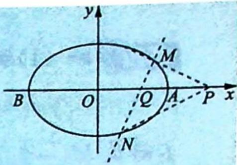
图1

因为 P, Q 关于椭圆调和共轭, 所以 $a^{2}=pq$ .

要证明 $\angle MPO = \angle NPO$ ，即证明 $k_{MP} + k_{NP} = 0$ 。

$$
\begin{array}{r l} k _ {M P} + k _ {N P} & = \frac {y _ {1} - 0}{x _ {1} - p} + \frac {y _ {2} - 0}{x _ {2} - p} = \frac {k (x _ {1} - q)}{x _ {1} - p} + \frac {k (x _ {2} - q)}{x _ {2} - p} = \frac {k [ 2 x _ {1} x _ {2} - (p + q) (x _ {1} + x _ {2}) + 2 p q ]}{(x _ {1} - p) (x _ {2} - p)} \\ & = \frac {k \frac {2 b ^ {2} (p q - a ^ {2})}{b ^ {2} + a ^ {2} k ^ {2}}}{(x _ {1} - p) (x _ {2} - p)} = 0. \end{array}
$$

得证.

(2)在抛物线中的证明

【证明】如图2所示，设 $O(0,0), M(x_1,y_1), N(x_2,y_2), Q(q,0)$ ， $P(p,0)$ ，则 $l_{MN}: y = k(x - q)$ ，联立 $\left\{ \begin{array}{l} y = k(x - q) \\ y^2 = 2px \end{array} \right.$ ，可得 $k^2 x^2 - (2qk^2 + 2p)x + k^2 q^2 = 0, x_1 + x_2 = \frac{2qk^2 + 2p}{k^2}, x_1x_2 = \frac{k^2q^2}{k^2} = q^2$ .

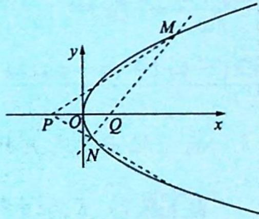

因为 P, Q 关于抛物线调和共轭, 所以 $p + q = 0$ .

要证明 $\angle MPO = \angle NPO$ ，即证明 $k_{MP} + k_{NP} = 0$ 。

图 2

$$
\begin{array}{r l} & {k _ {M P} + k _ {N P} = \frac {y _ {1} - 0}{x _ {1} - p} + \frac {y _ {2} - 0}{x _ {2} - p} = \frac {k (x _ {1} - q)}{x _ {1} - p} + \frac {k (x _ {2} - q)}{x _ {2} - p} = \frac {k [ 2 x _ {1} x _ {2} - (p + q) (x _ {1} + x _ {2}) + 2 p q ]}{(x _ {1} - p) (x _ {2} - p)}} \\ & {\qquad = \frac {k \frac {- 2 p (p + q)}{k ^ {2}}}{(x _ {1} - p) (x _ {2} - p)} = \frac {- 2 p (p + q)}{k (x _ {1} - p) (x _ {2} - p)} = 0. \text {得证}.} \end{array}
$$

例 22.7 (2015 新课标全国 I 卷理 20) 在直角坐标系 $xOy$ 中, 曲线 $C: y = \frac{x^2}{4}$ 与直线 $l: y = kx + a (a > 0)$ 交于 $M, N$ 两点.

(1) 当 k=0 时, 分别求 C 在点 M 和 N 处的切线方程;

(2) $y$ 轴上是否存在点 $P$ , 使得当 $k$ 变动时, 总存在 $\angle OPM = \angle OPN$ ? 说明理由.

分析 ▶ (1) 把 $y = a$ 代入曲线方程 $y = \frac{x^2}{4}$ , 可得 $M, N$ 的横坐标, 对曲线 $y = \frac{x^2}{4}$ 求导可得切线斜率, 将 $M, N$ 两点坐标代入可得切线方程. (2) 设 $P(0, p)$ , 因为 $\angle OPM = \angle OPN$ , 所以根据模型可得: $MN$ 与 $y$ 轴的交点和点 $P$ 关于抛物线调和共轭. 只要证明 $P$ 的坐标与 $k$ 无关即可.

解析 (1)联立 $\left\{ \begin{array}{l} y = \frac{x^2}{4}, \\ y = a \end{array} \right.$ , 可得 $(-2\sqrt{a}, a), (2\sqrt{a}, a)$ .

不妨设 $M(-2\sqrt{a}, a)$ , $N(2\sqrt{a}, a)$ ，对曲线 $C: y = \frac{x^{2}}{4}$ 求导，可得 $y' = \frac{1}{2}x$ ，所以曲线 C 在点 M 处的切线的斜率为 $-\sqrt{a}$ ，其切线方程为 $y = -\sqrt{a}x - a$ ，同理可得曲线 C 在点 N 处的切线的斜率为 $\sqrt{a}$ ，其切线方程为 $y = \sqrt{a}x - a$ 。

(2) 设 $P(0, p), M(x_1, y_1), N(x_2, y_2)$ , 联立 $\left\{ \begin{array}{l} y = \frac{x^2}{4} \\ y = kx + a \end{array} \right.$ , 可得 $x^2 - 4kx - 4a = 0, x_1 + x_2 = 4k, x_1x_2 = -4a$ .

因为 $\angle OPM = \angle OPN$ ，所以 $k_{PM} + k_{PN} = 0$ ，即 $k_{PM} + k_{PN} = \frac{y_1 - p}{x_1 - 0} +\frac{y_2 - p}{x_2 - 0} = \frac{kx_1 + a - p}{x_1} +$ $\frac{kx_2 + a - p}{x_2} = \frac{(kx_1 + a - p)x_2 + (kx_2 + a - p)x_1}{x_1x_2} = \frac{2kx_1x_2 + (a - p)(x_1 + x_2)}{x_1x_2} =$ $\frac{2k(-4a) + (a - p)(4k)}{x_1x_2} = \frac{(a + p)(-4k)}{x_1x_2} = 0$ ，则 $a + p = 0,P(0, - a).$

故 y 轴上存在点 $P(0, -a)$ ，使得当 k 变动时，总存在 $\angle OPM = \angle OPN$ .

变式(1) (2018 新课标全国卷 I 理 19) 如图所示, 设椭圆 $C: \frac{x^{2}}{2} + y^{2} = 1$ 的右焦点为 $F$ , 过点 $F$ 的直线 $l$ 与椭圆 $C$ 交于 $A, B$ 两点, 点 $M$ 的坐标为 $(2,0)$ .

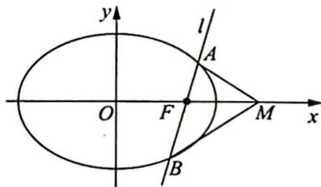

(1)当直线 l 与 x 轴垂直时,求直线 AM 的方程;

(2)设点 O 为坐标原点,求证: $\angle OMA = \angle OMB$ .

解析 ▶ (1) 易知点 F 的坐标为 $(1,0)$ ，当直线 l 与 x 轴垂直时，将 x=1 代入椭圆的方程 $\frac{x^{2}}{2} + y^{2} = 1$ ，得点 A 的坐标为 $\left(1, \frac{\sqrt{2}}{2}\right)$ .

由 $A\left(1, \frac{\sqrt{2}}{2}\right)$ , $M(2,0)$ 可得直线 $AM$ 的方程为 $y = -\frac{\sqrt{2}}{2} (x - 2)$ .

(2) 因为 $a^2 = 2, x_M = 2, x_F = 1$ , 根据椭圆的等角模型可知点 $F$ 和点 $M$ 关于椭圆 $C$ 调和共轭, 可知该结论正确.

设 $A(x_{1},y_{1}),B(x_{2},y_{2})$ ，联立 $\left\{ \begin{array}{l}y = k(x - 1)\\ \frac{x^2}{2} +y^2 = 1 \end{array} \right.$ ，可得 $(1 + 2k^{2})x^{2} - 4k^{2}x + 2k^{2} - 2 = 0$ ，由韦达定理可得 $x_{1} + x_{2} = \frac{4k^{2}}{1 + 2k^{2}},x_{1}x_{2} = \frac{2k^{2} - 2}{1 + 2k^{2}}.$

要证明 $\angle OMA = \angle OMB$ ，即证明 $k_{MA} + k_{MB} = 0$ 。

$$
\begin{array}{r l} & {k _ {M A} + k _ {M B} = \frac {y _ {1} - 0}{x _ {1} - 2} + \frac {y _ {2} - 0}{x _ {2} - 2} = \frac {k (x _ {1} - 1)}{x _ {1} - 2} + \frac {k (x _ {2} - 1)}{x _ {2} - 2}} \\ & {\qquad = \frac {k [ (x _ {1} - 1) (x _ {2} - 2) + (x _ {2} - 1) (x _ {1} - 2) ]}{(x _ {1} - 2) (x _ {2} - 2)} = \frac {k [ 2 \cdot x _ {1} x _ {2} - 3 \cdot (x _ {1} + x _ {2}) + 4 ]}{(x _ {1} - 2) (x _ {2} - 2)}} \\ & {\qquad = \frac {k (2 \cdot \frac {2 k ^ {2} - 2}{1 + 2 k ^ {2}} - 3 \cdot \frac {4 k ^ {2}}{1 + 2 k ^ {2}} + 4)}{(x _ {1} - 2) (x _ {2} - 2)} = \frac {k (4 k ^ {2} - 4 - 1 2 k ^ {2} + 4 + 8 k ^ {2})}{(1 + 2 k ^ {2}) (x _ {1} - 2) (x _ {2} - 2)} = 0. \text {得证}.} \end{array}
$$

探究总结

## 与极点极线有关的一个等角定理

如图所示, 已知椭圆 $\frac{x^2}{a^2} + \frac{y^2}{b^2} = 1 (a > b > 0)$ 的对称轴上有一点 $M\left(\frac{a^2}{m}, 0\right)$ , 那么点 $M$ 与过点 $N(m, 0) (0 < m < a)$ 的弦的两端点 $A, B$ 连线的斜率互为相反数.

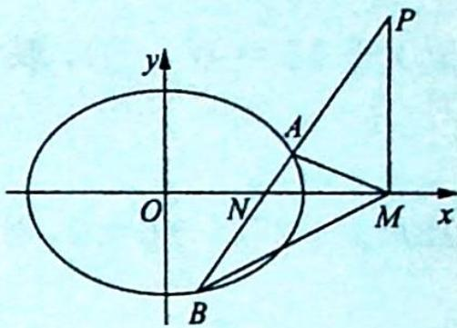

【证明】(1)当直线 $AB$ 与 $y$ 轴平行时, 结论显然成立;

(2)当直线 $AB$ 与 $y$ 轴不平行时, 如图所示, 设直线 $AB$ 与直线 $x = \frac{a^2}{m}$ 相交于点 $P$ .

因为点 $N(m,0)$ 关于椭圆 $\frac{x^{2}}{a^{2}}+\frac{y^{2}}{b^{2}}=1$ 的极线方程为 $\frac{m\cdot x}{a^{2}}+\frac{0\cdot y}{b^{2}}=1$ ，即 $x=\frac{a^{2}}{m}$ ，所以点 P 在点 N 关于椭圆的极线上.

根据配极原则可知点 N 在点 P 关于椭圆的极线上, 所以由极线的几何性质, 可知 P, N, A, B 是调和点列, 则 $\frac{|PA|}{|PB|} = \frac{|NA|}{|NB|}$ .

过点 $A$ 作 $AC \perp x$ 轴于点 $C$ , 过点 $B$ 作 $BD \perp x$ 轴于点 $D$ , 则根据平行线分线段成比例定理, 可得 $\frac{|MC|}{|MD|} = \frac{|PA|}{|PB|} = \frac{|NA|}{|NB|} = \frac{|AC|}{|BD|}$ , 所以 $\frac{BD}{MD} = \frac{AC}{MC}, \tan \angle AMC = \tan \angle BMD$ .

故直线 $MA$ 与直线 $MB$ 的斜率互为相反数.

变式(2) 已知椭圆 $W: \frac{x^2}{2m + 10} + \frac{y^2}{m^2 - 2} = 1$ 的左焦点为 $F(m,0)$ , 过点 $M(-3,0)$ 作一条斜率大于 0 的直线 $l$ 交椭圆 $W$ 于 $A, B$ 两点, 延长 $BF$ 交椭圆 $W$ 于点 $C$ .

(1) 求椭圆 W 的离心率;

(2) 若 $\angle MAC = 60^{\circ}$ , 求直线 $l$ 的斜率.

分析 (1) 根据 $2m + 10 = a^2, m^2 - 2 = b^2, c = m, a^2 = b^2 + c^2$ ，可以解出 $m$ ，代入 $e = \frac{c}{a}$ .

(2)由共轭点的推论:设椭圆左顶点 $T(-\sqrt{6},0)$ , $OT^{2}=OF\cdot OM$ , 则 F 和 M 调和共轭.

即 $\angle BMF = \angle CMF = 30^{\circ}$ ，则 $k = \tan 30^{\circ} = \frac{\sqrt{3}}{3}$ （根据画图也可猜出答案）

$$
2 m + 1 0 - (m ^ {2} - 2) = m ^ {2} (m <   0) \Rightarrow 2 m ^ {2} - 2 m - 1 2 = 0 \Rightarrow m ^ {2} - m - 6 = 0
$$

$\Rightarrow (m - 3)(m + 2) = 0$ ，所以 $m = 3$ （舍）或 $m = -2$ ，即 $W:\frac{x^2}{6} +\frac{y^2}{2} = 1,e = \frac{2}{\sqrt{6}} = \frac{\sqrt{6}}{3}$

(2)如图所示,设直线 $AB: y = k(x + 3)$ , $A(x_{1}, y_{1})$ , $B(x_{2}, y_{2})$ ,

点 $A$ 关于 $x$ 轴的对称点为 $C'(x_1, -y_1)$ , 证明 $B, F, C'$ 共线即可.

即证: $k_{BF}=k_{FC'}$ ，即 $\frac{k(x_{2}+3)}{x_{2}+2}=\frac{-k(x_{1}+3)}{x_{1}+2},2x_{1}x_{2}+5(x_{1}+x_{2})+12=0$ ①，联立直线与椭圆可得： $(3k^{2}+1)x^{2}+$

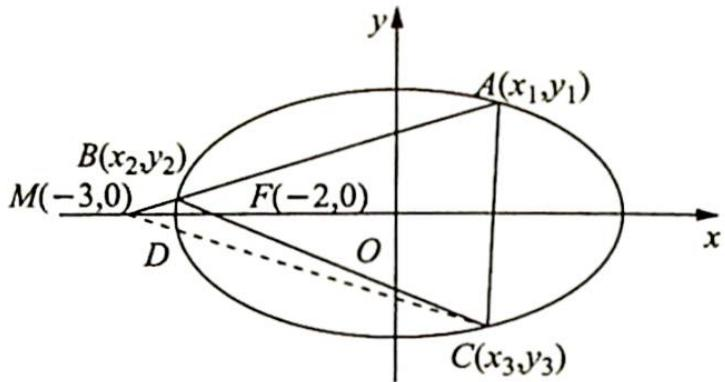

$18k^{2}x+27k^{2}-6=0$ ，则 $\left\{\begin{aligned}x_{1}+x_{2}&=\frac{-18k^{2}}{3k^{2}+1}\\ x_{1}x_{2}&=\frac{27k^{2}-6}{3k^{2}+1}\end{aligned}\right.$ ，代入整理发现①式成立.

则 C 与 $C'$ 重合, 即 $\triangle MAC$ 为等边三角形, 所以 $k = \tan \angle BMF = \frac{\sqrt{3}}{3}$ .

变式 3 已知双曲线 C 的渐近线方程为 $y = \pm \frac{\sqrt{3}}{3} x$ ，且过点 $P(3, \sqrt{2})$ .

(1) 求 $C$ 的方程；

(2) 设 $Q(1,0)$ , 直线 $x = t (t \in \mathbb{R})$ 不经过点 $P$ 且与 $C$ 相交于 $A, B$ 两点, 若直线 $BQ$ 与 $C$ 交于另一点 $D$ , 求证: 直线 $AD$ 过定点.

解析 (1)渐近线方程为 $y = \pm \frac{\sqrt{3}}{3} x$ ，且过点 $P(3, \sqrt{2})$ ，所以双曲线 $C$ 的焦点在 $x$ 轴上. 令 $\frac{x^2}{a^2} - \frac{y^2}{b^2} = 1$ ，则 $\frac{b}{a} = \frac{\sqrt{3}}{3}$ ，所以 $a^2 = 3b^2, \frac{9}{3b^2} - \frac{2}{b^2} = 1$ ，则 $b^2 = 1$ .

故双曲线 C 的方程为 $\frac{x^{2}}{3}-y^{2}=1$ .

(2)如图所示,设双曲线左、右顶点分别为M,N.

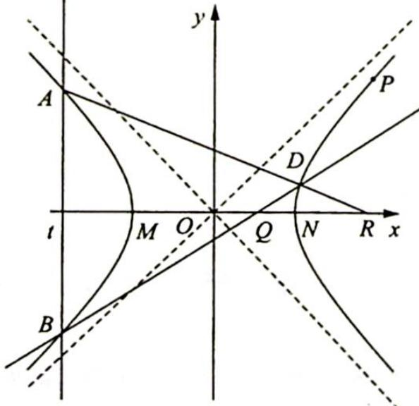

建立新坐标系 $x^{\prime}My^{\prime}$ ，则 $\left\{\begin{aligned}x&=x^{\prime}-\sqrt{3}\\ y&=y^{\prime}\end{aligned}\right.$ 所以双曲线 $C^{\prime}:\frac{(x^{\prime}-\sqrt{3})^{2}}{3}-y^{\prime2}=1,x^{\prime2}-2\sqrt{3}x^{\prime}-3y^{\prime2}=0.$ 令 $B^{\prime}D^{\prime}:mx^{\prime}+ny^{\prime}=1$ ，联立方程， $x^{\prime2}-3y^{\prime2}-2\sqrt{3}x^{\prime}(mx^{\prime}+ny^{\prime})=0,3\left(\frac{y^{\prime}}{x^{\prime}}\right)^{2}+2\sqrt{3}n\left(\frac{y^{\prime}}{x^{\prime}}\right)+2\sqrt{3}m-1=0.$ 令 $B^{\prime}(x_{1}^{\prime},y_{1}^{\prime}),D^{\prime}(x_{2}^{\prime},y_{2}^{\prime})$ ，则 $k_{MB^{\prime}}\cdot k_{MD^{\prime}}=\frac{y_{1}^{\prime}}{x_{1}^{\prime}}\cdot\frac{y_{2}^{\prime}}{x_{2}^{\prime}}=\frac{2\sqrt{3}m-1}{3}.$ 又直线 $B^{\prime}D^{\prime}$ 过点 $Q^{\prime}$ ，所以 $(\sqrt{3}+1)m=1,m=\frac{1}{\sqrt{3}+1}$ ，则 $k_{MB^{\prime}}\cdot k_{MD^{\prime}}=\frac{2-\sqrt{3}}{3}.$ 又 $x^{\prime}=t^{\prime}$ 与双曲线 $C^{\prime}$ 交于 $A^{\prime},B^{\prime}$ 两点，所以 $A^{\prime}(x_{1}^{\prime},-y_{1}^{\prime}),k_{MA^{\prime}}\cdot k_{MD^{\prime}}=\frac{\sqrt{3}-2}{3}.$ 同理，令直线 $A^{\prime}D^{\prime}:px^{\prime}+qy^{\prime}=1$ ，则 $\frac{2\sqrt{3}p-1}{3}=\frac{\sqrt{3}-2}{3}$ ，解得 $p=\frac{\sqrt{3}-1}{2\sqrt{3}}.$ 故直线 $A^{\prime}D^{\prime}$ 在新坐标系下过定点 $R^{\prime}\left(\frac{2\sqrt{3}}{\sqrt{3}-1},0\right).$ 在原平面直角坐标系下， $\frac{2\sqrt{3}}{\sqrt{3}-1}-\sqrt{3}=\frac{2\sqrt{3}-3+\sqrt{3}}{\sqrt{3}-1}=3$ ，故直线 AD 恒过定点 R(3,0).

(1) $\overrightarrow{OR}\cdot\overrightarrow{OQ}=a^{2}=3$ ;(2) $Q(1,0)$ 为极点，x=3 为极线.

## 训练 22

1. (多选题) 设 $P$ 为椭圆 $\frac{x^2}{4} + \frac{y^2}{3} = 1$ 上一动点, 过 $P$ 作椭圆的切线与圆 $O: x^2 + y^2 = 12$ 交于 $M$ , $N$ 两点, 圆 $O$ 在 $M, N$ 两点处的切线交于点 $Q$ , 则 ( ). A. $Q$ 点的轨迹方程为 $\frac{x^2}{48} + \frac{y^2}{36} = 1$ B. $Q$ 点的轨迹方程为 $\frac{x^2}{36} + \frac{y^2}{48} = 1$ C. 若点 $P$ 在第一象限, 则 $\triangle OPQ$ 的面积最大值为 $\frac{\sqrt{3}}{2}$

D. 若点 $P$ 在第一象限, 则 $\triangle OPQ$ 的面积最大值为 $\frac{\sqrt{3}}{3}$

2. 如图所示, 过异于原点的点 $P(x_0, y_0)$ 引椭圆 $E: \frac{x^2}{a^2} + \frac{y^2}{b^2} = 1 (a > b > 0)$ 的割线 $PAB$ , 其中点 $A$ , $B$ 在椭圆上, 点 $M$ 是割线 $PAB$ 上异于 $P$ 的一点, 且满足 $\frac{AM}{MB} = \frac{AP}{PB}$ , 求证: 点 $M$ 在直线 $\frac{x_0x}{a^2} + \frac{y_0y}{b^2} = 1$ 上.

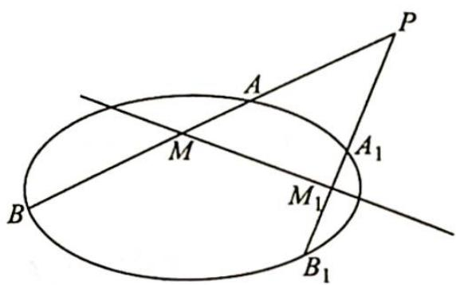

3. 如图所示, 已知椭圆 $C: \frac{x^{2}}{a^{2}} + \frac{y^{2}}{b^{2}} = 1 (a > b > 0)$ 过点 $A(-2,0), B(2,0)$ , 且离心率为 $\frac{1}{2}$ .

(1)求椭圆 C 的方程；

(2)设直线 l 与椭圆 C 有且仅有一个公共点 E，且与 x 轴交于点 $G(E, G$ 不重合）， $ET \perp x$ 轴，垂足为 T。求证： $\frac{|TA|}{|TB|} = \frac{|GA|}{|GB|}$ 。

4. 在平面直角坐标系中, $A_{1}, A_{2}$ 两点的坐标分别为 $(-2,0), (2,0)$ , 直线 $A_{1} M, A_{2} M$ 相交于点 $M$ , 且它们的斜率之积是 $-\frac{3}{4}$ , 记动点 $M$ 的轨迹为曲线 $E$ .

(1)求曲线 E 的方程；

(2) 过点 $F(1,0)$ 作直线 $l$ 交曲线 $E$ 于 $P, Q$ 两点, 且点 $P$ 位于 $x$ 轴上方, 记直线 $A_{1}Q, A_{2}P$ 的斜率分别为 $k_{1}, k_{2}$ .

①证明： $\frac{k_{1}}{k_{2}}$ 为定值；

②设点 Q 关于 x 轴的对称点为 $Q_{1}$ ，求 $\triangle PFQ_{1}$ 面积的最大值.

# 参考答案

## 训练 14

1.【分析】挖掘几何性质,建立关于 p 的方程.

【解析】如图所示, 过 M 作 $MM_{1} \perp l$ (l 为抛物线的准线), 连接 $FM_{1}$ 交 y 轴于点 E.

因为 $MF = MM_{1}$ ，以 MF 为直径的圆与 y 轴相切于点 E，所以 $ME \perp M_{1}F$ ，则 E 是 $M_{1}F$ 的中点，E 的坐标为 $(0, \sqrt{3})$ .

记 $l$ 与 $x$ 轴交于点 $G$ , 因为 $OE \parallel l, O$ 为 $FG$ 的中点, 所以 $OE$ 为 $\triangle FM_{1}G$ 的中位线, $M_{1}G = 2OE = 2\sqrt{3}$ .

由直线 $MF$ 的倾斜角为 $60^{\circ}$ , 所以 $\angle MFx = 60^{\circ}, \angle M_{1}MF = 60^{\circ}$ , 又 $\triangle MFM_{1}$ 为等腰三角形, 则 $\angle MM_{1}F = 60^{\circ}$ , 即 $\angle M_{1}FG = 60^{\circ}$ .

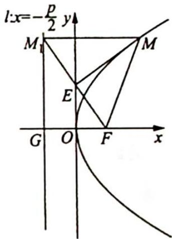

在 Rt△M₁FG 中，|FG| = $\frac{|M_{1}G|}{\tan60^{\circ}} = \frac{2\sqrt{3}}{\sqrt{3}} = 2 = p$ ，所以抛物线 C 的方程为 $y^{2} = 4x$ 。故选 B.

2.【解析】解法一:如图所示,过A作AP⊥MN,垂足为P.

因为圆 A 与双曲线 C 的一条渐近线交于 M, N 两点, 不妨设圆 A 与双曲线的一条渐近线 $l: y = \frac{b}{a}x$ 交于 M, N 两点, 且 $A(a, 0)$ , $|AM| = |AN| = b$ .

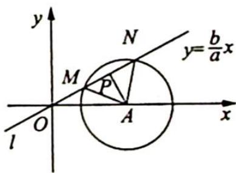

点 A 到渐近线 $l: y = \frac{b}{a}x$ 的距离 $|AP| = \frac{|b|}{\sqrt{1 + \frac{b^{2}}{a^{2}}}} = \frac{ab}{c}$ ，又 $\angle MAN = 60^{\circ}, AP \perp MN$ ，
所以 $\angle PAN = 30^{\circ}$ .

在 Rt△PAN 中，cos∠PAN= $\frac{|AP|}{|AN|}$ ，即 cos $30^{\circ}=\frac{a}{c}$ ，所以 $e=\frac{c}{a}=\frac{2}{\sqrt{3}}=\frac{2\sqrt{3}}{3}$ .

解法二(利用等边三角形的性质):如图所示, $A(a,0)$ ,不妨设双曲线的一条渐近线为 $l:y=\frac{b}{a}x$ ,则点 $(a,b)$ 必在l上,由三角函数定义可得 $\sin\angle AON=\frac{b}{\sqrt{a^{2}+b^{2}}}=\frac{b}{c}$ .

由于 $\angle MAN=60^{\circ},|AM|=|AN|$ ,所以 $\triangle AMN$ 是正三角形,即 $\angle ANO=60^{\circ}$ ,在 $\triangle AON$ 中,有 $\frac{|AN|}{\sin\angle AON}=\frac{|OA|}{\sin\angle ANO}$ ,即 $\frac{b}{\frac{b}{c}}=\frac{a}{\frac{\sqrt{3}}{2}}$ ,得 $\frac{c}{a}=\frac{2\sqrt{3}}{3}$ ,所以C的离心率为 $\frac{2\sqrt{3}}{3}$

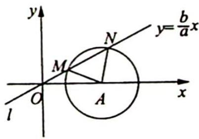

3.【解析】将 y=1 代入 $y^{2}=4x$ ，解得 $x=\frac{1}{4}$ ，即 $A\left(\frac{1}{4},1\right)$ 。由抛物线的光学性质知，直线 AB 经过焦点 $(1,0)$ ，所以直线 AB 的斜率 $k=\frac{1-0}{\frac{1}{4}-1}=-\frac{4}{3}$ 。故选 A。

4.【解析】设椭圆的右焦点为 $F'$ ，连接 $AF'$ ， $BF'$ ，则四边形 $AFBF'$ 为平行四边形。又 $AF \perp BF$ ，因此四边形 $AFBF'$ 为矩形，得 $|OA| = |OF'|$ ，且 $\angle AOF' = 60^\circ$ ，所以 $\triangle OAF'$ 为等边三角形，则 $|AF'| = c$ ， $|AF| = \sqrt{3}c$ 。

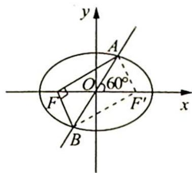

据椭圆的定义知 $|AF| + |AF'| = 2a$ ，即 $\sqrt{3} c + c = 2a$ ，因此 $e = \frac{c}{a} = \frac{2}{\sqrt{3} + 1} = \sqrt{3} - 1$ .

5.【解析】由椭圆的光学性质得到直线 $l'$ 平分角 $F_{1}PF_{2}$ .

故 $\frac{S_{\Delta PMF_1}}{S_{\Delta PMF_2}} = \frac{|F_1M|}{|F_2M|} = \frac{\frac{1}{2}|F_1P||PM|\sin\angle F_1PM}{\frac{1}{2}|F_2P||PM|\sin\angle F_2PM} = \frac{|PF_1|}{|PF_2|}$ ，由 $|PF_1| = 1, |PF_1| + |PF_2| = 4$ ，得到

$\left|PF_{2}\right|=3$ , 故 $\left|F_{1}M\right|:\left|F_{2}M\right|=1:3$ . 故选 C.

6.【解析】如图所示, 因为 $M(3,1)$ , 所以 $y_{A}=y_{M}=1, x_{A}=\frac{y_{A}^{2}}{4}=\frac{1}{4}, A\left(\frac{1}{4},1\right)$ .

又因为 $F(1,0)$ ，所以 $l_{AB}:y - 0 = \frac{1 - 0}{\frac{1}{4} - 1} (x - 1)$ ，即 $l_{AB}:y = -\frac{4}{3} (x - 1)$

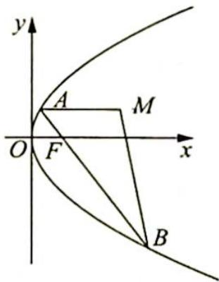

又 $\left\{ \begin{array}{l} y = -\frac{4}{3}(x - 1) \\ y^2 = 4x \end{array} \right.$ ，所以 $y^2 + 3y - 4 = 0, y = 1$ 或 $y = -4$ ，则 $y_B = -4, x_B = \frac{y_B^2}{4} = 4, B(4, -4)$ .

又因为 $|AB| = |AF| + |BF| = x_A + x_B + p = \frac{1}{4} + 4 + 2 = \frac{25}{4}, |AM| = x_M - x_A = 3 - \frac{1}{4} = \frac{11}{4}, |BM| = \sqrt{(4-3)^2 + (-4-1)^2} = \sqrt{26}$ ，所以 $\triangle ABM$ 的周长为 $|AB| + |AM| + |BM| = \frac{25}{4} + \frac{11}{4} + \sqrt{26} = 9 + \sqrt{26}$ ，故选 B.

7.【解析】因为 $e=\sqrt{2}$ ，所以 $c=\sqrt{2}a, a=b$ .

不妨设双曲线的标准方程为 $x^{2} - y^{2} = 1$ ，设 $\left|PF_2\right| = m$ ，则 $\left|PF_1\right| = 2 + m(m > 0)$ ，所以 $m^2 +(m + 2)^2 = (2\sqrt{2})^2$ ，解得 $m = \sqrt{3} -1(m = -\sqrt{3} -1$ 已舍去).

则 $\cos \angle F_{1}F_{2}P = \frac{\sqrt{3} - 1}{2\sqrt{2}} = \frac{\sqrt{6} - \sqrt{2}}{4},\angle F_{1}F_{2}P = 75^{\circ} = \frac{5\pi}{12}$ 故选D.

8.【解析】因为线段 AB 为圆 M 的一条弦, AB 的中点为 O, 所以 $AB \perp OM$ .

设 M 坐标为 $(x, y)$ ，则 $\left|OM\right|^{2} + \left|OA\right|^{2} = \left|MA\right|^{2}$ .

因为圆 $M$ 与直线 $x + 2 = 0$ 相切，所以 $|MA| = |x + 2|, |x + 2|^2 = x^2 + y^2 + 4$ ，化简得 $y^2 = 4x$ ，则 $M$ 的轨迹为一条以 $F(1,0)$ 为焦点， $x = -1$ 为准线的抛物线，即只需点 $P$ 与点 $F$ 重合，此时 $|MF| = x + 1$ .

故 $|MA| - |MP| = |MA| - |MF| = (x + 2) - (x + 1) = 1$ ，为定值.

9.【解析】如图所示,作 AM 垂直于 $PF_{1}$ 于点 M,作 $F_{2}N$ 垂直于 $PF_{1}$ 于点 N,则 $|AM|:|F_{2}N|=S_{\triangle PF_{1}A}:S_{\triangle PF_{1}F_{2}}=2:1.$

连接 $AF_{2}$ 交 $PF_{1}$ 于点 $B$ ，则由相似比知 $|AB|: |BF_{2}| = 2:1$ ，所以点 $B$ 是线段 $AF_{2}$ 的三等分点，又 $A(0,b), F_{2}(c,0)$ ，所以点 $B$ 坐标为 $\left(\frac{2c}{3}, \frac{b}{3}\right), k_{PF_{1}} = k_{BF_{1}} = \frac{\frac{b}{3} - 0}{\frac{2c}{3} + c} = \frac{b}{5c}$ . 又因为离心率为 $\frac{1}{2}$ ，即 $\frac{c}{a} = \frac{1}{2}$ ，又 $a^{2} - c^{2} = b^{2}$ ，所以 $\frac{b}{c} = \sqrt{3}$ ，则 $k_{PF_{1}} = \frac{\sqrt{3}}{5}$ .

10.【解析】如图所示,过 M 作直线 AB 垂直焦点轴所在的直线,直线 CE 与 DF 交直线 AB 于 P,Q,则根据圆锥曲线蝴蝶定理得 $\left|MP\right|=\left|MQ\right|$ . 设 CE 与 FD 相交于 G.

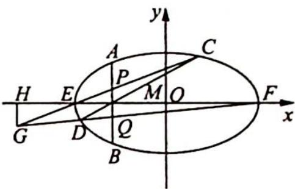

过 $G$ 作 $GH$ 垂直焦点轴所在直线于 $H$ , 得 $\frac{|EM|}{|HE|} = \frac{|MP|}{|HG|} = \frac{|MQ|}{|HG|} = \frac{|FM|}{|FH|}$ . 设 $M(m,0), H(n,0)$ , 焦点轴长为 $2a$ , 则有 $\frac{a + m}{-a - n} = \frac{a - m}{a - n}$ , 得 $mn = a^2$ . 所以 $G$ 在直线 $l: x = \frac{a^2}{m}$ 上.

【评注】在本题中, 当 $M$ 为焦点时, $l$ 就是准线; 当 $M$ 为准线与焦点轴所在直线的交点时, $l$ 就是过焦点的直线.

11.【解析】(1)由已知, $a=\sqrt{2}b$ ,则椭圆E的方程为 $\frac{x^{2}}{2b^{2}}+\frac{y^{2}}{b^{2}}=1$ .

由方程组 $\left\{\begin{aligned}\frac{x^{2}}{2b^{2}}+\frac{y^{2}}{b^{2}}=1\\ y=-x+3\end{aligned}\right.$ ，得 $3x^{2}-12x+(18-2b^{2})=0$ ①.

方程①的判别式为 $\Delta = 24(b^{2} - 3)$ , 由 $\Delta = 0$ , 得 $b^{2} = 3$ , 此时方程①的解为 $x = 2$ , 所以椭圆 $E$ 的方程为 $\frac{x^{2}}{6} + \frac{y^{2}}{3} = 1$ , 点 $T$ 坐标为 (2,1).

(2)由已知可设直线 $l'$ 的方程为 $y = \frac{1}{2} x + m (m \neq 0)$ .

由方程组 $\left\{ \begin{array}{l} y = \frac{1}{2} x + m \\ y = -x + 3 \end{array} \right.$ 可得 $\left\{ \begin{array}{l} x = 2 - \frac{2m}{3} \\ y = 1 + \frac{2m}{3} \end{array} \right.$ ，所以 $P$ 点坐标为 $\left(2 - \frac{2m}{3}, 1 + \frac{2m}{3}\right), |PT|^2 = \frac{8}{9} m^2$ . 设点 $A, B$ 的坐标分别为 $A(x_1, y_1), B(x_2, y_2)$ ，由方程组 $\left\{ \begin{array}{l} \frac{x^2}{6} + \frac{y^2}{3} = 1 \\ y = \frac{1}{2} x + m \end{array} \right.$ 可得 $3x^2 + 4mx + (4m^2 - 12) = 0$ ②. 方程②的判别式为 $\Delta = 16(9 - 2m^2)$ ，由 $\Delta > 0$ 解得 $-\frac{3\sqrt{2}}{2} < m < \frac{3\sqrt{2}}{2}$ . 由②得 $x_1 + x_2 = -\frac{4m}{3}, x_1x_2 = \frac{4m^2 - 12}{3}$ ，所以 $|PA| = \sqrt{\left(2 - \frac{2m}{3} - x_1\right)^2 + \left(1 + \frac{2m}{3} - y_1\right)^2}$ $\frac{\sqrt{5}}{2}\left|2 - \frac{2m}{3} - x_1\right|$ ，同理 $|PB| = \frac{\sqrt{5}}{2}\left|2 - \frac{2m}{3} -x_2\right|$ ，则

$$
\begin{array}{r l} | P A | | P B | & = \frac {5}{4} \left| (2 - \frac {2 m}{3} - x _ {1}) (2 - \frac {2 m}{3} - x _ {2}) \right| \\ & = \frac {5}{4} \left| (2 - \frac {2 m}{3}) ^ {2} - (2 - \frac {2 m}{3}) (x _ {1} + x _ {2}) + x _ {1} x _ {2} \right| \\ & = \frac {5}{4} \left| (2 - \frac {2 m}{3}) ^ {2} - (2 - \frac {2 m}{3}) (- \frac {4 m}{3}) + \frac {4 m ^ {2} - 1 2}{3} \right| = \frac {1 0}{9} m ^ {2}. \end{array}
$$

故存在常数 $\lambda = \frac{4}{5}$ , 使得 $|PT|^2 = \lambda |PA||PB|$ .

12.【解析】(1)设椭圆的半焦距为 c，由题意知 $2a=4, 2c=2\sqrt{2}$ ，所以 $a=2, b=\sqrt{a^{2}-c^{2}}=\sqrt{2}$ 。故椭圆 C 的方程为 $\frac{x^{2}}{4}+\frac{y^{2}}{2}=1$ 。

(2)(Ⅰ)设 $P(x_{0},y_{0})(x_{0}>0,y_{0}>0)$ ，由 $M(0,m)$ ，可得 $P(x_{0},2m),Q(x_{0},-2m)$ .

所以直线 $PM$ 的斜率 $k_{1} = \frac{2m - m}{x_{0}} = \frac{m}{x_{0}}$ ，直线 $QM$ 的斜率 $k_{2} = \frac{-2m - m}{x_{0}} = -\frac{3m}{x_{0}}$ .

此时 $\frac{k_2}{k_1} = -3$ ，所以 $\frac{k_2}{k_1}$ 为定值-3.

(Ⅱ)设 $A(x_{1},y_{1}), B(x_{2},y_{2})$ ，直线 PA 的方程为 $y=kx+m$ ，直线 QB 的方程为 $y=-3kx+m$ 。

联立 $\left\{ \begin{array}{l} y = kx + m \\ \frac{x^2}{4} + \frac{y^2}{2} = 1 \end{array} \right.$ ，整理得 $(2k^2 + 1)x^2 + 4mkx + 2m^2 - 4 = 0$

由 $x_0x_1 = \frac{2m^2 - 4}{2k^2 + 1}$ 可得 $x_{1} = \frac{2(m^{2} - 2)}{(2k^{2} + 1)x_{0}}$ ，所以 $y_{1} = kx_{1} + m = \frac{2k(m^{2} - 2)}{(2k^{2} + 1)x_{0}} + m$

同理 $x_{2} = \frac{2(m^{2} - 2)}{(18k^{2} + 1)x_{0}},y_{2} = \frac{-6k(m^{2} - 2)}{(18k^{2} + 1)x_{0}} + m$ ，则 $x_{2} - x_{1} = \frac{2(m^{2} - 2)}{(18k^{2} + 1)x_{0}} -\frac{2(m^{2} - 2)}{(2k^{2} + 1)x_{0}} =$

$\frac{-32k^2(m^2 - 2)}{(18k^2 + 1)(2k^2 + 1)x_0}, y_2 - y_1 = \frac{-6k(m^2 - 2)}{(18k^2 + 1)x_0} + m - \frac{2k(m^2 - 2)}{(2k^2 + 1)x_0} - m = \frac{-8k(6k^2 + 1)(m^2 - 2)}{(18k^2 + 1)(2k^2 + 1)x_0}$ , 所以 $k_{AB} = \frac{y_2 - y_1}{x_2 - x_1} = \frac{6k^2 + 1}{4k} = \frac{1}{4}(6k + \frac{1}{k})$ .

由 $m > 0, x_0 > 0$ 可知 $k > 0$ , 所以 $6k + \frac{1}{k} \geqslant 2\sqrt{6}$ , 当且仅当 $k = \frac{\sqrt{6}}{6}$ 时等号成立.

此时 $\frac{m}{\sqrt{4 - 8m^2}} = \frac{\sqrt{6}}{6}$ 即 $m = \frac{\sqrt{14}}{7}$ ，符合题意.

所以直线 $AB$ 的斜率的最小值为 $\frac{\sqrt{6}}{2}$ .

13.【解析】(1)因为椭圆 C 的一个焦点为 $F(\sqrt{2},0)$ ，其短轴上的一个端点到 F 的距离为 $\sqrt{3}$ ，所以 $c=\sqrt{2}$ ， $a=\sqrt{3}$ ， $b=\sqrt{a^{2}-c^{2}}=1$ ，椭圆方程为 $\frac{x^{2}}{3}+y^{2}=1$ ，故“准圆”方程为 $x^{2}+y^{2}=4$ 。

(2)证明:①当直线 $l_{1}, l_{2}$ 中有一条斜率不存在时,不妨设直线 $l_{1}$ 斜率不存在,则 $l_{1}: x = \pm \sqrt{3}$ .

当 $l_{1}: x = \sqrt{3}$ 时， $l_{1}$ 与“准圆”交于点 $(\sqrt{3}, 1), (\sqrt{3}, -1)$ ，此时 $l_{2}$ 为 $y = 1$ （或 $y = -1$ ），显然直线 $l_{1}, l_{2}$ 垂直；同理可证当 $l_{1}: x = -\sqrt{3}$ 时，直线 $l_{1}, l_{2}$ 垂直。

②当 $l_{1}, l_{2}$ 斜率存在时，设点 $P(x_{0}, y_{0})$ ，其中 $x_{0}^{2} + y_{0}^{2} = 4$ .

设经过点 $P(x_{0}, y_{0})$ 与椭圆相切的直线为 $y = t(x - x_{0}) + y_{0}$ .

由 $\left\{ \begin{array}{l} y = t(x - x_0) + y_0 \\ \frac{x^2}{3} + y^2 = 1 \end{array} \right.$ 得 $(1 + 3t^2)x^2 + 6t(y_0 - tx_0)x + 3(y_0 - tx_0)^2 - 3 = 0.$

由 $\Delta = 0$ 化简整理得 $(3 - x_0^2)t^2 + 2x_0y_0t + 1 - y_0^2 = 0$ ，因为 $x_0^2 + y_0^2 = 4$ ，所以有 $(3 - x_0^2)t^2 + 2x_0y_0t + (x_0^2 - 3) = 0$ . 设 $l_1, l_2$ 的斜率分别为 $t_1, t_2$ ，因为 $l_1, l_2$ 与椭圆相切，所以 $t_1, t_2$ 满足上述方程 $(3 - x_0^2)t^2 + 2x_0y_0t + (x_0^2 - 3) = 0$ ，则 $t_1 \cdot t_2 = -1$ ，即 $l_1, l_2$ 垂直.

综合①②知， $l_{1} \perp l_{2}$

因为 $l_{1}, l_{2}$ 经过点 $P(x_{0}, y_{0})$ , 又分别交其“准圆”于点 $M, N$ , 且 $l_{1}, l_{2}$ 垂直, 所以线段 $MN$ 为“准圆” $x^{2} + y^{2} = 4$ 的直径, $|MN| = 4$ , 故线段 $MN$ 的长为定值.

## 训练 15

1.【解析】(1)设动圆圆心 $P(x, y)$ , 则 $|PM|^2 = |PA|^2 = 4^2 + x^2$ , 即 $(x - 4)^2 + y^2 = 4^2 + x^2$ , 故动圆圆心的轨迹方程为 $y^2 = 8x$ .

(2)设两点 $P(x_{1},y_{1}), Q(x_{2},y_{2})$ ，设不垂直于 x 轴的直线 $l: x = ty + m (t \neq 0)$ ，联立 $\left\{\begin{aligned} x &= ty + m \\ y^{2} &= 8x \end{aligned}\right.$ ，消 x 得 $y^{2} - 8ty - 8m = 0$ ，所以 $y_{1} + y_{2} = 8t, y_{1}y_{2} = -8m$ .

又 $x$ 轴是 $\angle PBQ$ 的角平分线, 所以 $k_{BP} + k_{BQ} = 0$ , 即 $\frac{y_1}{x_1 + 3} + \frac{y_2}{x_2 + 3} = 0, 2ty_1y_2 + (m + 3)(y_1 + y_2) = 0$ , 则 $-16tm + (3 + m)8t = 0$ , 所以 $m = 3$ , 直线 $l$ 的方程为 $x = ty + 3$ , 故直线 $l$ 过定点(3,0).

2.【解析】(1)显然当直线斜率为0时,直线与抛物线交于一点,不符合题意.

设 $l: x = my + 2, A(x_1, y_1), B(x_2, y_2)$ ，联立 $\left\{ \begin{array}{l} y^2 = 2x \\ x = my + 2 \end{array} \right.$ ，得 $y^2 - 2my - 4 = 0, \Delta = 4m^2 + 16$ 恒大于 $0, y_1 + y_2 = 2m, y_1y_2 = -4$ .

$\overrightarrow{OA} \cdot \overrightarrow{OB} = x_{1}x_{2} + y_{1}y_{2} = (my_{1} + 2)(my_{2} + 2) + y_{1}y_{2} = (m^{2} + 1)y_{1}y_{2} + 2m(y_{1} + y_{2}) + 4 = -4(m^{2} + 1) + 2m \cdot 2m + 4 = 0$ ，所以 $\overrightarrow{OA} \perp \overrightarrow{OB}$ ，即点 $O$ 在圆 $M$ 上.

(2) 若圆 $M$ 过点 $P$ , 则 $\overrightarrow{AP} \cdot \overrightarrow{BP} = 0$ , 即 $(x_{1} - 4)(x_{2} - 4) + (y_{1} + 2)(y_{2} + 2) = 0, (my_{1} - 2)(my_{2} - 2) + (y_{1} + 2)(y_{2} + 2) = 0$ , 则 $(m^{2} + 1)y_{1}y_{2} - (2m - 2)(y_{1} + y_{2}) + 8 = 0$ ,

化简得 $2m^{2} - m - 1 = 0$ ，解得 $m = -\frac{1}{2}$ 或1.

①当 $m = -\frac{1}{2}$ 时， $l: 2x + y - 4 = 0$ ，设圆心为 $M(x_0, y_0)$ ，则 $y_0 = \frac{y_1 + y_2}{2} = -\frac{1}{2}, x_0 = -\frac{1}{2}y_0 + 2 = \frac{9}{4}$ ，半径 $r =$

$|OM|=\sqrt{\left(\frac{9}{4}\right)^{2}+\left(-\frac{1}{2}\right)^{2}}=\sqrt{\frac{85}{16}}$ ，则圆 $M:\left(x-\frac{9}{4}\right)^{2}+\left(y+\frac{1}{2}\right)^{2}=\frac{85}{16}$ .

②当 $m = 1$ 时， $l: x - y - 2 = 0$ ，设圆心为 $M(x_0, y_0), y_0 = \frac{y_1 + y_2}{2} = 1, x_0 = y_0 + 2 = 3$ ，半径 $r = |OM| = \sqrt{3^2 + 1^2} = \sqrt{10}$ ，则圆 $M$ 的方程为 $(x - 3)^2 + (y - 1)^2 = 10$ .

综上, 直线 $l$ 与圆 $M$ 的方程分别为直线 $l: 2x + y - 4 = 0$ 和圆 $M: \left(x - \frac{9}{4}\right)^2 + \left(y + \frac{1}{2}\right)^2 = \frac{85}{16}$ , 或直线 $l: x - y - 2 = 0$ 和圆 $M: (x - 3)^2 + (y - 1)^2 = 10$ .

3.【解析】(1)设 $M(x,y)$ ，则 $\frac{y}{x+2} \cdot \frac{y}{x-2} = -\frac{3}{4}$ ，故 $\frac{x^{2}}{4} + \frac{y^{2}}{3} = 1 (x \neq \pm 2)$ .

(2)如图所示,设 $M(x_{0},y_{0})$ .

①当 $x_0 = 1$ 时， $M\left(1, \frac{3}{2}\right), k_{AM} = \frac{1}{2}, N(4,3), k_{NF} = 1.$

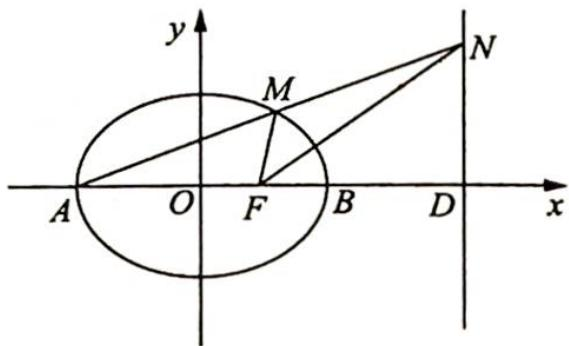

所以 $\angle MFD = 90^{\circ},\angle NFD = 45^{\circ},\lambda = 2.$

②当 $x_{0} \neq 1$ 时， $k_{MF} = \frac{y_{0}}{x_{0} - 1}, k_{AM} = \frac{y_{0}}{x_{0} + 2}$ ，直线 AM 的方程为 $y = \frac{y_{0}}{x_{0} + 2}(x + 2)$ ，令 x = 4，得 $N\left(4, \frac{6y_{0}}{x_{0} + 2}\right)$ ， $k_{NF}=\frac{y_{N}}{3}=\frac{2y_{0}}{x_{0}+2}.$

$$
\begin{array}{r l} \text {又} & \frac {2 k _ {N F}}{1 - k _ {N F} ^ {2}} = \frac {4 y _ {0}}{x _ {0} + 2} \cdot \frac {(x _ {0} + 2) ^ {2}}{(x _ {0} + 2) ^ {2} - 4 y _ {0} ^ {2}} = \frac {4 y _ {0} (x _ {0} + 2)}{x _ {0} ^ {2} + 4 x _ {0} + 4 - 4 y _ {0} ^ {2}} = \frac {4 y _ {0} (x _ {0} + 2)}{x _ {0} ^ {2} + 4 x _ {0} + 4 + 3 x _ {0} ^ {2} - 1 2} \\ & = \frac {4 y _ {0} (x _ {0} + 2)}{4 (x _ {0} + 2) (x _ {0} - 1)} = \frac {y _ {0}}{x _ {0} - 1} = k _ {M F}, \end{array}
$$

所以 $\tan \angle MFD = \frac{2\tan\angle NFD}{1 - \tan^2\angle NFD}$ 故 $\angle MFD = 2\angle NFD.$

即存在 $\lambda=2$ ，使得 $\angle MFD=\lambda\angle NFD.$

【评注】可由特值法,确定 $\lambda=2$ 后,再证明满足任意性.

4.【解析】(1)设 $F(c,0)$ ，由 $\frac{1}{|OF|} + \frac{1}{|OA|} = \frac{3e}{|FA|}$ ，即 $\frac{1}{c} + \frac{1}{a} = \frac{3c}{a(a-c)}$ ，可得 $a^{2} - c^{2} = 3c^{2}$ ，又 $a^{2} - c^{2} = b^{2} = 3$ ，
所以 $c^{2}=1$ ，因此 $a^{2}=4$ ，故椭圆的方程为 $\frac{x^{2}}{4}+\frac{y^{2}}{3}=1$ 。

(2)如图所示,设直线 l 的斜率为 $k(k \neq 0)$ , 则直线 l 的方程为 $y = k(x - 2)$ .

设 $B(x_{B},y_{B})$ ，由方程组 $\left\{ \begin{array}{l} \frac{x^2}{4} +\frac{y^2}{3} = 1\\ y = k(x - 2) \end{array} \right.$ 整理得 $(4k^{2} + 3)x^{2} - 16k^{2}x + 16k^{2}-$ $12 = 0.$

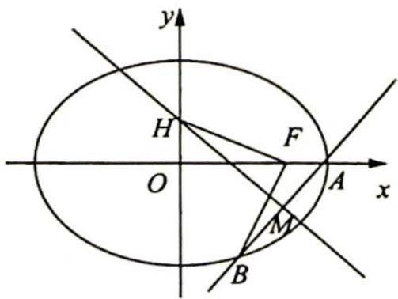

解得 $x = 2$ 或 $x = \frac{8k^2 - 6}{4k^2 + 3}$ , 由题意得 $x_B = \frac{8k^2 - 6}{4k^2 + 3}$ , 从而 $y_B = \frac{-12k}{4k^2 + 3}$ .

由(1)知 $F(1,0)$ ，设 $H(0,y_{H})$ ，有 $\overrightarrow{FH}=(-1,y_{H}),\overrightarrow{BF}=\left(\frac{9-4k^{2}}{4k^{2}+3},\frac{12k}{4k^{2}+3}\right)$ .

由 $BF \perp HF$ , 得 $\overrightarrow{BF} \cdot \overrightarrow{HF} = \frac{4k^2 - 9}{4k^2 + 3} + \frac{12ky_H}{4k^2 + 3} = 0$ , 解得 $y_H = \frac{9 - 4k^2}{12k}$ , 因此直线 $MH$ 的方程为 $y = -\frac{1}{k}x + \frac{9 - 4k^2}{12k}$ .

设 $M(x_M, y_M)$ , 由方程组 $\left\{ \begin{array}{l} y = -\frac{1}{k}x + \frac{9 - 4k^2}{12k} \\ y = k(x - 2) \end{array} \right.$ 消去 $y$ 解得 $x_M = \frac{20k^2 + 9}{12(k^2 + 1)}$ .

在 $\triangle MAO$ 中, $\angle MOA \leqslant \angle MAO \Leftrightarrow MA \leqslant MO$ , 即 $(x_M - 2)^2 + y_M^2 \leqslant x_M^2 + y_M^2$ , 化简得 $x_M \geqslant 1$ , 即 $x_M = \frac{20k^2 + 9}{12(k^2 + 1)} \geqslant 1$ , 解得 $k \leqslant -\frac{\sqrt{6}}{4}$ 或 $k \geqslant \frac{\sqrt{6}}{4}$ .

故直线 $l$ 的斜率的取值范围为 $(- \infty, -\frac{\sqrt{6}}{4}] \cup [\frac{\sqrt{6}}{4}, + \infty)$ .

【解析】(1)由 $C_1: x^2 = 4y$ 知其焦点 $F$ 的坐标为 (0,1).

因为 $F$ 也是椭圆 $C_2$ 的一个焦点, 所以 $a^2 - b^2 = 1$ ①.

又 $C_1$ 与 $C_2$ 的公共弦的长为 $2\sqrt{6}, C_1$ 与 $C_2$ 都关于 $y$ 轴对称, 且 $C_1$ 的方程为 $x^2 = 4y$ , 由此易知 $C_1$ 与 $C_2$ 的公共点的坐标为 $(\pm \sqrt{6}, \frac{3}{2})$ , 所以 $\frac{9}{4a^2} + \frac{6}{b^2} = 1$ ②.

联立①②式得 $a^2 = 9, b^2 = 8$ . 故 $C_2$ 的方程为 $\frac{y^2}{9} + \frac{x^2}{8} = 1$ .

(2)由题意可知, 直线 $l$ 的斜率存在, 设直线 $l$ 的方程为 $y = k(x + 1)$ .

联立方程 $\left\{ \begin{array}{l} 8y^2 + 9x^2 = 72 \\ y = kx + k \end{array} \right.$ , 整理得 $(9 + 8k^2)x^2 + 16k^2x + 8k^2 - 72 = 0$ .

设 $A(x_1, kx_1 + k), B(x_2, kx_2 + k)$ , 于是有 $x_1 + x_2 = \frac{-16k^2}{9 + 8k^2}, x_1x_2 = \frac{8k^2 - 72}{9 + 8k^2}$ .

因为 $\overrightarrow{OA} = (x_1, kx_1 + k), \overrightarrow{OB} = (x_2, kx_2 + k), \overrightarrow{OA} \cdot \overrightarrow{OB} = x_1x_2 + (kx_1 + k)(kx_2 + k) = (1 + k^2)x_1x_2 + k^2(x_1 + x_2) + k^2 = \frac{-55k^2 - 72}{9 + 8k^2} < 0$ , 所以 $\angle AOB > \frac{\pi}{2}$ , 可知 $O$ 恒在以 $AB$ 为直径的圆内.

故不存在实数 $k$ , 使 $O$ 在以 $AB$ 为直径的圆外.

【解析】设 $A(x_1, y_1), B(x_2, y_2), C(x_3, y_3), D(x_4, y_4)$ .

(1)因为 $\overrightarrow{AC}$ 与 $\overrightarrow{BD}$ 同向, 且 $|AC| = |BD|$ , 所以 $\overrightarrow{AC} = \overrightarrow{BD}$ , 从而 $x_3 - x_1 = x_4 - x_2$ , 即 $x_1 - x_2 = x_3 - x_4$ , 于是 $(x_1 + x_2)^2 - 4x_1x_2 = (x_3 + x_4)^2 - 4x_3x_4$ ①.

设直线 $l$ 的斜率为 $k$ , 则 $l$ 的方程为 $y = kx + 1$ , 由 $\left\{ \begin{array}{l} y = kx + 1 \\ x^2 = 4y \end{array} \right.$ 得 $x^2 - 4kx - 4 = 0$ , 而 $x_1, x_2$ 是这个方程的两根, 所以 $x_1 + x_2 = 4k, x_1x_2 = -4$ ②.

由 $\left\{ \begin{array}{l} y = kx + 1 \\ \frac{x^2}{8} + \frac{y^2}{9} = 1 \end{array} \right.$ 得 $(9 + 8k^2)x^2 + 16kx - 64 = 0$ , 而 $x_3, x_4$ 是这个方程的两根, 所以 $x_3 + x_4 = \frac{-16k}{9 + 8k^2}, x_3x_4 =$

$-\frac{64}{9+8k^{2}}$ ③.

将②③式代入①式, 得 $16(k^{2} + 1) = \frac{16^{2}k^{2}}{(9 + 8k^{2})^{2}} + \frac{4 \times 64}{9 + 8k^{2}}$ , 即 $16(k^{2} + 1) = \frac{16^{2} \times 9(k^{2} + 1)}{(9 + 8k^{2})^{2}}$ , 所以 $(9 + 8k^{2})^{2} = 16 \times 9$ , 解得 $k = \pm \frac{\sqrt{6}}{4}$ .

(2)由 $x^{2} = 4y$ ，得 $y^{\prime} = \frac{1}{2} x$ ，所以 $C_1$ 在点 $A$ 处的切线方程为 $y - y_{1} = \frac{1}{2} x_{1}(x - x_{1})$ ，即 $y = \frac{1}{2} x_{1}x - \frac{1}{4} x_{1}^{2}$ 令 $y = 0$ ，得 $x = \frac{1}{2} x_{1},M(\frac{1}{2} x_{1},0)$ ，所以 $\overrightarrow{FM} = (\frac{1}{2} x_1, - 1)$ ，而 $\overrightarrow{FA} = (x_1,y_1 - 1)$ ，于是 $\overrightarrow{FM}\cdot \overrightarrow{FA} = \frac{1}{2} x_1^2 -y_1 + 1 =$ $\frac{1}{4} x_1^2 +1 > 0$ ，因此∠AFM是锐角，从而∠MFD= $180^{\circ} - \angle AFM$ 是钝角.

故直线 l 绕点 F 旋转时, $\triangle MFD$ 总是钝角三角形.

7.【解析】(1)由题意得,抛物线 $C_{1}: x^{2} = 4y$ 和抛物线 $C_{2}: x^{2} = -y$ 的焦点分别为 $F(0,1)$ , $F'(0, -\frac{1}{4})$ , 所以 $|FF'| = \frac{5}{4}$ .

(2)设直线 l 的方程为: $y=kx+m$ , 联立方程组 $\left\{\begin{aligned} x^{2}=4y \\ y=kx+m \end{aligned}\right.$ , 消去 y, 得 $x^{2}-4kx-4m=0$ ,

因为直线 l 与 $C_{1}$ 相切，所以 $\Delta=16k^{2}+16m=0$ ，得 $m=-k^{2}$ ，且 N 的坐标为 $(2k,k^{2})$ .

联立方程组 $\left\{\begin{aligned}x^{2}&=-y\\ y&=kx-k^{2}\end{aligned}\right.$ ，消去y，得 $x^{2}+kx-k^{2}=0$ 。

设 $A(x_{1},y_{1}),B(x_{2},y_{2}),M(x_{0},y_{0})$ ，则 $x_{1} + x_{2} = -k,x_{1}\cdot x_{2} = -k^{2}$ ，所以 $x_0 = \frac{x_1 + x_2}{2} = -\frac{k}{2},y_0 = kx_0+$ $m = -\frac{3}{2} k^2.$

又点 $F$ 在以线段 $MN$ 为直径的圆上，所以 $\overrightarrow{FM} \cdot \overrightarrow{FN} = 0, N(2k, k^2), M(-\frac{k}{2}, -\frac{3}{2} k^2), F(0,1)$ ，故 $\left(-\frac{k}{2}, -\frac{3}{2} k^2 - 1\right) \cdot (2k, k^2 - 1) = 0$ ，即 $3k^4 + k^2 - 2 = 0$ ，解得 $k^2 = \frac{2}{3}$ .

经检验满足题意,故直线 l 的方程是 $y=\pm\frac{\sqrt{6}}{3}x-\frac{2}{3}$ .

8.【解析】(1)m=3,椭圆 $E:\frac{x^{2}}{9}+y^{2}=1$ ,两个焦点 $F_{1}(-2\sqrt{2},0)$ , $F_{2}(2\sqrt{2},0)$ .

设 $K(x, y), \overrightarrow{F_1K} = (x + 2\sqrt{2}, y), \overrightarrow{F_2K} = (x - 2\sqrt{2}, y), \overrightarrow{KF_1} \cdot \overrightarrow{KF_2} = \overrightarrow{F_1K} \cdot \overrightarrow{F_2K} = (x + 2\sqrt{2}, y) \cdot (x - 2\sqrt{2}, y) = x^2 + y^2 - 8 = -8y^2 + 1$ ，因为 $-1 \leqslant y \leqslant 1$ ，所以 $\overrightarrow{KF_1} \cdot \overrightarrow{KF_2}$ 的范围是 $[-7, 1]$ .

(2)设 $A, B$ 的坐标分别为 $(x_{1}, y_{1}), (x_{2}, y_{2})$ ，则 $\left\{ \begin{array}{l} x_{1}^{2} + 9y_{1}^{2} = m^{2} \\ x_{2}^{2} + 9y_{2}^{2} = m^{2} \end{array} \right.$ ，两式相减，得 $(x_{1} + x_{2})(x_{1} - x_{2}) + 9(y_{1} + y_{2})(y_{1} - y_{2}) = 0, 1 + 9\frac{(y_{1} + y_{2})(y_{1} - y_{2})}{(x_{1} + x_{2})(x_{1} - x_{2})} = 0$ ，则 $1 + 9k_{OM} \cdot k_{l} = 0$ ，即 $k_{OM} \cdot k_{l} = -\frac{1}{9}$ .

(3) 因为直线 $l$ 过点 $(m, \frac{m}{3})$ , 且不过原点 $O$ , 所以 $k \neq \frac{1}{3}$ .

设 $P(x_{P},y_{P})$ ，直线 $l:y = k(x - m) + \frac{m}{3} (m\neq 0,k\neq 0)$ ，即 $l:y = kx - km + \frac{m}{3}$

由(2)的结论可知 $OM: y = -\frac{1}{9k} x$ ，代入椭圆方程得 $x_{P}^{2} = \frac{9m^{2}k^{2}}{9k^{2} + 1}$ ，由 $y = k(x - m) + \frac{m}{3}$ 与 $y = -\frac{1}{9k} x$ ，联立得 $M\left(\frac{9k^{2}m - 3km}{9k^{2} + 1}, -\frac{km - \frac{m}{3}}{9k^{2} + 1}\right)$ .

若四边形 OAPB 为平行四边形, 那么 M 也是 OP 的中点, 所以 $2x_{M}=x_{P}$ , 即 $4\left(\frac{9k^{2}m-3km}{9k^{2}+1}\right)^{2}=\frac{9m^{2}k^{2}}{9k^{2}+1}$ , 整理得 $9k^{2}-8k+1=0$ , 解得 $k=\frac{4\pm\sqrt{7}}{9}$ .

故当 $k = \frac{4 \pm \sqrt{7}}{9}$ 时，四边形 OAPB 为平行四边形.

9.【解析】(1)证明:根据题意可得 $A_{1}(-2,0)$ , $A_{2}(2,0)$ .

设 $P(x_0, y_0), M(x_1, y_1), N(x_2, y_2)$ ，则直线 $A_1P$ 为 $x = \frac{x_0 + 2}{y_0} y - 2$ ，联立 $\left\{ \begin{array}{l} x = \frac{x_0 + 2}{y_0} y - 2 \\ y^2 = 2px \end{array} \right.$ ，消去 $x$ 得 $y^2 - \frac{2p(x_0 + 2)}{y_0} \cdot y + 4p = 0$ ，所以 $y_1y_0 = 4p$ ，则 $y_1 = \frac{4p}{y_0}, x_1 = \frac{y_1^2}{2p} = \frac{8p}{y_0^2}$ ，直线 $A_2P$ 的方程为 $x = \frac{x_0 - 2}{y_0} y + 2$ ，同理联立直线 $A_2P$ 与抛物线的方程，得 $y_2y_0 = -4p$ 。所以 $y_2 = -\frac{4p}{y_0}, x_2 = \frac{8p}{y_0^2}, x_1 = x_2$ ，故直线 $MN$ 垂直于 $x$ 轴。

(2) 设 $P(x_0, y_0)$ 是抛物线与椭圆的交点，所以 $\left\{ \begin{array}{l} \frac{x_0^2}{4} + y_0^2 = 1 \\ y_0^2 = 2px_0 \end{array} \right.$ ，则 $S_1 = S_{\triangle OPM} = S_{\triangle OA_1M} - S_{\triangle OA_1P} = \frac{1}{2}|OA_1||y_1| - \frac{1}{2}|OA_1||y_0|$ $= \frac{1}{2}|OA_1||y_0| = \frac{|4p - y_0^2|}{|y_0|}, S_2 = S_{\triangle OMN} = \frac{1}{2}|x_1||2y_1| = \left|\frac{32p^2}{y_0^3}\right|, \frac{S_1}{S_2} = \left|\frac{4p - y_0^2}{32p^2} \cdot y_0^2\right| = \frac{1}{2}\left| -\left(\frac{y_0^2}{4p}\right)^2 + \frac{y_0^2}{4p}\right| = \left| -\frac{x_0^2}{8} + \frac{x_0}{4}\right|$ .

因为 $\angle OPA_{2}$ 为钝角，所以 $\overrightarrow{OP} \cdot \overrightarrow{A_{2}P} < 0$ ，即 $x_{0}^{2} - 2x_{0} + y_{0}^{2} < 0$ ，将 $y_{0}^{2} = 1 - \frac{x_{0}^{2}}{4}$ 代入 $x_{0}^{2} - 2x_{0} + y_{0}^{2} < 0$ ，得 $x_{0}^{2} - 2x_{0} + 1 - \frac{x_{0}^{2}}{4} < 0$ ，解得 $\frac{2}{3} < x_{0} < 2$ .

令 $f(x) = \left| -\frac{x^2}{8} + \frac{x}{4} \right|$ , $\frac{2}{3} < x < 2$ , 当 $x = 1$ 时, $f(x)$ 的最大值为 $\frac{1}{8}$ .

故当 $x_0 = 1$ 时， $\frac{S_1}{S_2}$ 的最大值为 $\frac{1}{8}$

## 训练 16

1.【解析】解法一(几何法):圆的方程可化为 $(x-1)^{2}+(y-1)^{2}=4$ ,点M到直线l的距离 $d=\frac{|2\times1+1+2|}{\sqrt{2^{2}+1^{2}}}$ =

$\sqrt{5}>2$ ,所以直线 l 与圆相离.

根据圆的知识可知，A, P, B, M 四点共圆，且 $AB \perp MP$ ，所以 $|PM||AB| = 4S_{\triangle PAM} = 4 \times \frac{1}{2} \cdot |PA| \cdot |AM| = 4 |PA|$ ，而 $|PA| = \sqrt{|MP|^2 - 4}$ ，当直线 $MP \perp l$ 时， $|MP|_{\min} = \sqrt{5}$ ， $|PA|_{\min} = 1$ ，此时 $|PM||AB|$ 最小.

所以 $MP:y - 1 = \frac{1}{2} (x - 1)$ ，即 $y = \frac{1}{2} x + \frac{1}{2}$ ，由 $\left\{ \begin{array}{l}y = \frac{1}{2} x + \frac{1}{2}\\ 2x + y + 2 = 0 \end{array} \right.$ ，解得 $\left\{ \begin{array}{l}x = -1\\ y = 0 \end{array} \right.$

则 $P(-1,0)$ ，所以以 MP 为直径的圆的方程为 $(x-1)(x+1)+y(y-1)=0$ ，即 $x^{2}+y^{2}-y-1=0$ ，两圆的方程相减可得 $2x+y+1=0$ ，即为直线 AB 的方程。
故选 D.

解法二(代数法):依题意可得圆 M 的方程为 $(x-1)^{2}+(y-1)^{2}=4$ ,

设 $\angle APM = \alpha$ ，由图可知， $|PM| = \frac{|AM|}{\sin\alpha} = \frac{2}{\sin\alpha}, |AB| = 4\cos \alpha$ ，则 $|PM||AB| = \frac{8}{\tan\alpha}$

因为 $\sin \alpha = \frac{|AM|}{|PM|} = \frac{2}{|PM|} \in \left(0, \frac{2\sqrt{5}}{5}\right]$ , $\tan \alpha \in (0, 2]$ .

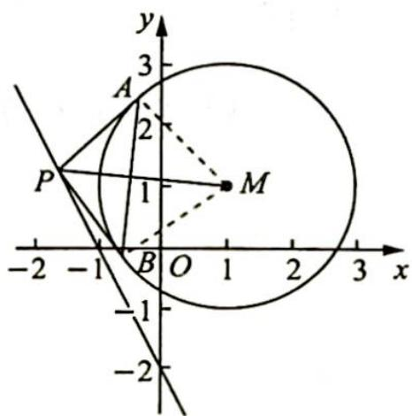

当 $\tan \alpha = 2$ 时，即过 $M$ 作直线 $l$ 的垂线，点 $P$ 取垂足 $P_{1}$ 时， $|PM||AB|$ 达到最小.

联立直线 $MP_{1}$ 与直线 $l$ ，得 $\left\{ \begin{array}{l}y - 1 = \frac{1}{2} (x - 1)\\ y = -2x - 2 \end{array} \right.\Rightarrow \left\{ \begin{array}{l}y = \frac{1}{2} x + \frac{1}{2}\\ y = -2x - 2 \end{array} \right.\Rightarrow \left\{ \begin{array}{l}x = -1\\ y = 0 \end{array} \right..$

AB 方程即为过点 $P_{1}$ 的两条切线的切点弦, 其方程为 $(x-1)(-1-1)+(y-1)(0-1)=4\Rightarrow2-2x+1-y=4\Rightarrow2x+y+1=0$ . 故选 D.

2.【解析】由于 $\left|3x-4y+a\right|+\left|3x-4y-9\right|=5\left(\frac{\left|3x-4y+a\right|}{\sqrt{3^{2}+4^{2}}}+\frac{\left|3x-4y-9\right|}{\sqrt{3^{2}+4^{2}}}\right)$ ，故 $\left|3x-4y+a\right|+\left|3x-4y-9\right|$ 可看作为点 P 到直线 m:3x-4y+a=0 和直线 l:3x-4y-9=0 距离之和的 5 倍。因为

$|3x - 4y + a| + |3x - 4y - 9|$ 的取值与 $x, y$ 无关，所以距离之和与点 $P$ 在圆上的位置无关. 如图所示，当直线 $m$ 平移时，点 $P$ 与 $m, l$ 的距离之和均为 $m, l$ 两条平行线间的距离，即此时圆在两直线内部，当直线 $m$ 与圆相切时， $\frac{|3 \times 1 - 4 \times 1 + a|}{\sqrt{3^2 + 4^2}} = 1$ ，解得 $a = 6$ 或

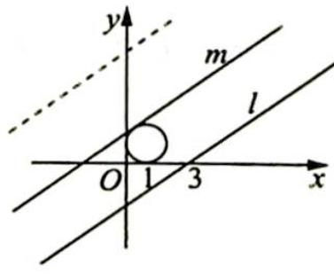

$a = -4$ （舍去），所以 $a \geqslant 6$ 。故选D.

3.【解析】如图所示, 设 $\angle BON = \theta$ , 过点 $M$ 作 $BO$ 延长线的垂线, 垂足为 $D$ , 与 $\odot M$ 的一个交点为 $A$ ; 则 $AD$ 为 $\odot M$ 上的点到直线 $BO$ 的距离的最大值, 这时相对于每一个确定的 $OB$ , $\triangle AOB$ 的面积最大. 又 $\angle CBO = 90^\circ$ , $OC = 6$ , 所以 $OB = 6\cos \theta$ .

又 $\angle MOD=\angle COB$ ,所以 $\angle MOD=\theta;OM=1$ ,所以 $MD=\sin\theta,AD=1+\sin\theta,$

则 $S_{\triangle AOB} = \frac{1}{2} OB\times AD = \frac{1}{2}\times 6\cos \theta \times (1 + \sin \theta) = 3\cos \theta (1 + \sin \theta).$

解法一(导数法): 设 $y = 3\cos\theta(1 + \sin\theta) = 3\cos\theta + \frac{3}{2}\sin2\theta$ ，则 $y' = -3\sin\theta + 3\cos2\theta = 3(1 - \sin\theta - 2\sin^{2}\theta) = 3(1 - 2\sin\theta)(1 + \sin\theta)$ ，故当 $\sin\theta = \frac{1}{2}$ ，即 $\theta = 30^{\circ}$ 时，y 最大，最大值为 $\frac{9\sqrt{3}}{4}$ .

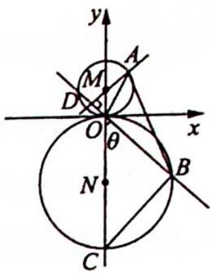

所以 $\triangle AOB$ 面积的最大值为 $\frac{9\sqrt{3}}{4}$ . 故选 B.

解法二(基本不等式法): 因为 $S_{\triangle AOB} = \frac{1}{2} |OB| \times |AD| = 3 \cos \theta (\sin \theta + 1)$ $= 3 \sqrt{1 - \sin^{2} \theta} \cdot (1 + \sin \theta) = 3 \sqrt{(1 + \sin \theta)^{3} (1 - \sin \theta)}$ $= 3 \sqrt{(1 - \sin \theta)(1 + \sin \theta)(1 + \sin \theta)(1 + \sin \theta)}$ $\leqslant 3 \sqrt{27(1 - \sin \theta) \cdot \frac{1 + \sin \theta}{3} \cdot \frac{1 + \sin \theta}{3} \cdot \frac{1 + \sin \theta}{3}}$ $= 3 \sqrt{27} \times \left( \frac{1 + \frac{1}{3} + \frac{1}{3} + \frac{1}{3}}{4} \right)^{2}$ $= \frac{9\sqrt{3}}{4}.$

当且仅当 $1 - \sin \theta = \frac{1 + \sin\theta}{3}$ 即 $\sin \theta = \frac{1}{2},\quad \theta = \frac{\pi}{6}$ 时取等号.故选B.

解法三(极坐标法):如图1所示,设 $\angle AOx=\alpha,\quad A:\rho_{1}=2\sin\alpha,\angle BOx=\beta,B:\rho_{2}=6\sin\beta.$ 由对称性可知当 $\alpha, \beta \in \left(0, \frac{\pi}{2}\right)$ 时， $S_{\triangle AOB}$ 有最大值.

$$
S _ {\triangle A O B} = \frac {1}{2} \rho_ {1} \cdot \rho_ {2} \cdot \sin (\alpha + \beta) = 6 \sin \alpha \cdot \sin \beta \cdot \sin (\alpha + \beta).
$$

如图2所示,在直径为1的圆O中,CD=1为直径, $\angle ADC=\alpha,\angle BDC=\beta$ ,则 $AC=\sin\alpha$ , $BC=\sin\beta,\sin\angle ACB=\sin(\pi-\alpha-\beta)=\sin(\alpha+\beta)$ ,

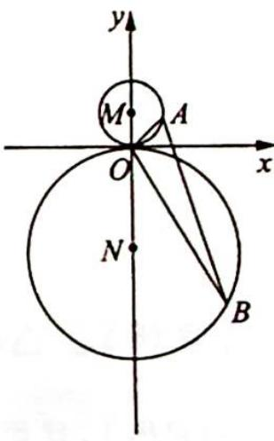
图1

$S_{\triangle ABC} = \frac{1}{2}\sin \alpha \sin \beta \sin (\alpha +\beta)\leqslant \frac{1}{2}\cdot \left(\frac{\sin\alpha + \sin\beta + \sin(\alpha + \beta)}{3}\right)^{3} =$ $\frac{1}{2}\cdot \left(\frac{\sin A + \sin B + \sin C}{3}\right)^{3}.$

由 $f(x) = \sin x$ 在 $(0, \pi)$ 上为凸函数可知， $\frac{\sin A + \sin B + \sin C}{3} \leqslant \sin \frac{A + B + C}{3} = \sin \frac{\pi}{3} = \frac{\sqrt{3}}{2}$ ，则 $S_{\triangle ABC} \leqslant \frac{1}{2} \times \left(\frac{\sqrt{3}}{2}\right)^3 = \frac{3\sqrt{3}}{16}$ ，即 $\sin \alpha \cdot \sin \beta \cdot \sin (\alpha + \beta) \leqslant \frac{3\sqrt{3}}{8}$ .

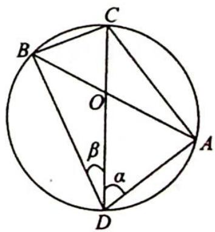
图2

当且仅当 A=B=C 时取等号，即 $\alpha=\beta=\frac{\pi}{3}$ 时取等号.

此时 $S_{\triangle AOB} = 6\sin \alpha \sin \beta \sin (\alpha +\beta)\leqslant 6\times \frac{3\sqrt{3}}{8} = \frac{9\sqrt{3}}{4}$ 故选B.

【评注】本题动点在圆上, 引入夹角变量, 建立一个关于 $\theta$ 的单变量的函数关系, 把一个双动态的情况转化为一个动点的情况.

4.【解析】由题意得圆心 $C(3,4)$ ，半径 r=1。

因为圆心 $C$ 到原点 $O$ 的距离为 5 , 所以圆 $C$ 上的点到原点 $O$ 的距离的最大值为 6 , 最小值为 4 .再由 $\angle APB = 90^{\circ}$ ，所以点 $P$ 在以 $AB$ 为直径的圆上，此圆的半径为 $\frac{1}{2} AB = m$ ，当两圆外切时， $m + 1 = 5$ ，解得 $m = 4$ ；当两圆内切时， $m - 1 = 5$ ，解得 $m = 6$ 要使圆 $C$ 上存在点 $P$ ，使得 $\angle APB = 90^{\circ}$ ，只需两圆有公共点，所以 $4 \leqslant m \leqslant 6$ 故 $m$ 的取值范围是[4,6].

5.【解析】若 $\angle APB=60^{\circ}$ ,则 $OP=2$ ,点 $P$ 的轨迹为 $x^{2}+y^{2}=4$ .

直线 $x + y + m = 0$ 上存在点 $P$ 可作 $O: x^2 + y^2 = 1$ 的两条切线 $PA, PB$ 等价于直线 $x + y + m = 0$ 与圆 $x^2 + y^2 = 4$ 有公共点，由圆心到直线的距离公式可得 $\frac{|m|}{\sqrt{2}} \leqslant 2$ ，解得 $-2\sqrt{2} \leqslant m \leqslant 2\sqrt{2}$ ，即 $m$ 的取值范围为 $[-2\sqrt{2}, 2\sqrt{2}]$ .

6.【解析】由圆的方程知, 圆心 $C(m,2)$ , 半径 $r = 2\sqrt{10}$ , 所以 $S_{\triangle ABC} = \frac{1}{2} r^2 \sin \angle ACB = 20 \sin \angle ACB$ , 则当 $\angle ACB = \frac{\pi}{2}$ 时, $S_{\triangle ABC}$ 取得最大值 20, 此时 $\triangle ABC$ 为等腰直角三角形, $|AB| = \sqrt{2} r = 4\sqrt{5}$ , 点 $C$ 到直线 $AB$ 的距离为 $2\sqrt{5}$ , 所以 $2\sqrt{5} \leqslant |PC| < 2\sqrt{10}$ , 即 $2\sqrt{5} \leqslant \sqrt{(m-3)^2 + 2^2} < 2\sqrt{10}$ , 解得 $-3 < m \leqslant -1$ 或 $7 \leqslant m < 9$ .

故实数 m 的取值范围是 $(-3, -1] \cup [7, 9)$ .

## 训练 17

1.【解析】在 $\triangle PF_{1}F_{2}$ 中，由正弦定理得 $\frac{|PF_2|}{\sin\angle PF_1F_2} = \frac{|PF_1|}{\sin\angle PF_2F_1}$ ，则 $\frac{|PF_2|}{a} = \frac{|PF_1|}{c}$ ，即 $c|PF_2| = a|PF_1|$ ，且可知 $|PF_1| > |PF_2|$ 。又因为 $|PF_1| - |PF_2| = 2a$ ，所以联立方程组 $\left\{ \begin{array}{l} c|PF_2| = a|PF_1| \\ |PF_1| - |PF_2| = 2a \end{array} \right.$ ，解得 $|PF_1| = \frac{2ac}{c - a}$ 。由双曲线的焦半径公式可知 $|PF_1| = a + ex \in [a + c, +\infty)$ ，又依题意，点 $P$ 不在 $x$ 轴上，所以 $|PF_1| > a + c$ ，即 $\frac{2ac}{c - a} > a + c$ ，整理得 $e^2 - 2e - 1 < 0$ ，解得 $-\sqrt{2} + 1 < e < \sqrt{2} + 1$ ，又因为 $e > 1$ ，所以双曲线的离心率 $e \in (1, \sqrt{2} + 1)$ 。

2.【解析】根据抛物线的焦半径的性质可得 $\frac{1}{|AF|} + \frac{1}{|BF|} = \frac{2}{p} = 1$ , 结合 $|AF| = 3$ , 解得 $|BF| = \frac{3}{2}$ . 不妨设点 $A$ 位于 $x$ 轴上方, 且 $\angle AFx = \theta (0^\circ < \theta < 90^\circ)$ , 则根据抛物线的焦半径公式得 $|AF| = \frac{p}{1 - \cos\theta} = \frac{2}{1 - \cos\theta} = 3$ ,解得 $\cos\theta=\frac{1}{3}$ ，则 $\sin\theta=\frac{2\sqrt{2}}{3}$ ，所以 $S_{\triangle AOB}=\frac{1}{2}|OF|\cdot|AF|\sin\theta+\frac{1}{2}|OF||BF|\sin\theta=\frac{1}{2}\times1\times\left(3+\frac{3}{2}\right)\times\frac{2\sqrt{2}}{3}=\frac{3\sqrt{2}}{2}$ 。故选 C.

3.【解析】由圆锥曲线的统一极坐标方程 $\rho=\frac{ep}{1-e\cos\theta}$ ，可以将上述四个极坐标方程化为标准形式，得 A： $\rho\cos\theta+\rho\sin\theta=1, B:\rho=\frac{\frac{1}{2}\times1}{1-\frac{1}{2}\cos\left(\theta+\frac{\pi}{2}\right)}, C:\rho=\frac{\frac{1}{2}\times1}{1-\frac{1}{2}\cos\theta}, D:\rho=\frac{2\times\frac{1}{2}}{1-2\cos(\theta+\pi)}$ ，其中选项 A 表示直线，
选项 B 表示将椭圆 $\rho=\frac{\frac{1}{2}\times1}{1-\frac{1}{2}\cos\theta}$ 绕极点逆时针旋转 $\frac{\pi}{2}$ 后所得的椭圆，选项 C 表示椭圆，选项 D 表示将双曲线 $\rho=\frac{2\times\frac{1}{2}}{1-2\cos\theta}$ 绕极点逆时针旋转 $\pi$ 后所得的双曲线。故选 BC。

4.【解析】设 $\angle AF_{2}x = \alpha$ ，则根据椭圆的焦半径公式可得 $|AF_{2}| = \frac{b^{2}}{a + c\cos\alpha}$ ， $|CF_{2}| = \frac{b^{2}}{a - c\cos\alpha}$ 。因为 $\overrightarrow{AF_2} = m_2\overrightarrow{F_2C}$ ，所以 $m_{2} = \frac{|AF_{2}|}{|F_{2}C|} = \frac{a - c\cos\alpha}{a + c\cos\alpha}$ ，解得 $c\cos\alpha = \frac{a(1 - m_{2})}{1 + m_{2}}$ 。同理设 $\angle AF_{1}x = \beta$ ，则由 $m_{1} = \frac{|AF_{1}|}{|F_{1}B|} = \frac{a + c\cos\beta}{a - c\cos\beta}$ ，可解得 $c\cos\beta = \frac{a(m_1 - 1)}{m_1 + 1}$ 。又 $|AF_{1}| + |AF_{2}| = 2a$ ，所以 $\frac{b^{2}}{a - c\cos\beta} + \frac{b^{2}}{a + c\cos\alpha} = 2a$ ，即 $\frac{b^{2}}{a - \frac{a(m_1 - 1)}{m_1 + 1}} + \frac{b^{2}}{a + \frac{a(1 - m_2)}{1 + m_2}} = 2a$ ，整理得 $m_{1} + m_{2} = \frac{4a^{2}}{b^{2}} - 2$ 。

5.【证明】如题图所示, 设线段 $PQ$ 的中点为 $M$ , $\angle PF_{1}x = \alpha$ , 则根据椭圆的焦半径公式可得 $|PF_{1}| = \frac{b^{2}}{a - c\cos\alpha}$ , $|QF_{1}| = \frac{b^{2}}{a + c\cos\alpha}$ .

因为 $|MF_{1}| = |MQ| - |QF_{1}| = \frac{1}{2} (|PF_{1}| + |QF_{1}|) - |QF_{1}| = \frac{1}{2} (|PF_{1}| - |QF_{1}|) = \frac{1}{2} \left( \frac{b^{2}}{a - c\cos\alpha} - \frac{b^{2}}{a + c\cos\alpha} \right) = \frac{b^{2}c\cos\alpha}{a^{2} - c^{2}\cos^{2}\alpha}$ , 所以 $|DF_{1}| = \frac{|MF_{1}|}{\cos\alpha} = \frac{b^{2}c}{a^{2} - c^{2}\cos^{2}\alpha}$ .

又根据焦点弦长公式得 $|PQ| = \frac{2ab^{2}}{a^{2} - c^{2}\cos^{2}\alpha}$ , 所以 $\frac{|DF_{1}|}{|PQ|} = \frac{b^{2}c}{2ab^{2}} = \frac{c}{2a}$ , 其值是一个常数.

6.【解析】(1)根据题意可得 $F(1,0)$ ，设直线 l 的倾斜角为 $\alpha(0^{\circ}<\alpha<90^{\circ})$ ，则根据抛物线的焦点弦长公式，有 $\left|AB\right|=\frac{2p}{\sin^{2}\alpha}=\frac{4}{\sin^{2}\alpha}=8$ ，所以 $\sin\alpha=\frac{\sqrt{2}}{2}\Rightarrow\alpha=45^{\circ}$ ，则直线 l 的斜率为 1，由此可得直线 l 的方程为 y=x-1。

(2)联立方程组 $\left\{ \begin{array}{l} y^{2} = 4x \\ y = x - 1 \end{array} \right.$ , 得 $x^{2} - 6x + 1 = 0$ , 设 $A(x_{1},y_{1}), B(x_{2},y_{2}), AB$ 的中点为 $M$ , 则 $x_{1} + x_{2} = 6, y_{1} +$ $y_{2}=x_{1}-1+x_{2}-1=4$ ，所以 $M\left(\frac{x_{1}+x_{2}}{2},\frac{y_{1}+y_{2}}{2}\right)=(3,2)$ ，直线 AB 的垂直平分线方程为 $y-2=-(x-3)$ ，即 $y=-x+5$ 。

如图所示, 设过点 $A, B$ 的圆的圆心为 $(a, 5 - a)$ , 因为该圆与 $C$ 的准线 $x = -1$ 相切, 所以半径 $r = a + 1$ , 圆心 $(a, 5 - a)$ 到直线 $AB: y = x - 1$ 的距离 $d = \frac{|2a - 6|}{\sqrt{2}}$ , $|AB| = 8$ , 所以 $\left(\frac{|2a - 6|}{\sqrt{2}}\right)^2 + 4^2 = (a + 1)^2$ , 解得 $a = 3$ 或 $a = 11$ . 则圆心的坐标为 $(3, 2)$ , 半径为 4, 或圆心的坐标为 $(11, -6)$ , 半径为 12, 故圆的方程为 $(x - 3)^2 + (y - 2)^2 = 16$ 或 $(x - 11)^2 + (y + 6)^2 = 144$ .

7.【解析】(1)由椭圆的离心率为 $\frac{\sqrt{3}}{2}$ , 可得 $\frac{c}{a} = \frac{\sqrt{a^2 - b^2}}{a} = \frac{\sqrt{3}}{2} \Rightarrow a^2 = 4b^2$ ①. 由椭圆的通径长为 1, 可得 $\frac{2b^2}{a} = 1$ ②, ①②联立, 可得 $a^2 = 4, b^2 = 1$ , 所以椭圆的方程为 $\frac{x^2}{4} + y^2 = 1$ . (2) 因为 $PM$ 平分 $\angle F_1PF_2$ , 所以 $\frac{|PF_1|}{|PF_2|} = \frac{|F_1M|}{|F_2M|}$ . 设点 $P$ 的坐标为 $(x_0, y_0)$ , 根据椭圆的焦半径公式的代数形式, 可得 $|PF_1| = a + ex_0, |PF_2| = a - ex_0$ , 所以 $\frac{a + ex_0}{a - ex_0} = \frac{m + c}{c - m}$ , 解得 $m = \frac{ec}{a} x_0 = \frac{c^2}{a^2} x_0 = \frac{3}{4} x_0$ . 又 $x_0 \in (-2, 2)$ , 所以 $m$ 的取值范围是 $\left(-\frac{3}{2}, \frac{3}{2}\right)$ .

8.【解析】(1)设椭圆方程为 $\frac{x^{2}}{a^{2}}+\frac{y^{2}}{b^{2}}=1(a>b>0)$ ，则联立方程组 $\left\{\begin{aligned}\frac{x^{2}}{a^{2}}+\frac{y^{2}}{b^{2}}&=1\\ y&=x-\sqrt{3}\end{aligned}\right.$ ，得 $(a^{2}+b^{2})x^{2}-2\sqrt{3}a^{2}x+3a^{2}-a^{2}b^{2}=0$ 。
因为椭圆 $\frac{x^{2}}{a^{2}}+\frac{y^{2}}{b^{2}}=1$ 与直线 $y=x-\sqrt{3}$ 相切，所以 $\Delta=(2\sqrt{3}a^{2})^{2}-4(a^{2}+b^{2})(3a^{2}-a^{2}b^{2})=0\Rightarrow a^{2}+b^{2}=3$ ，又 $a^{2}-b^{2}=1$ ，则解方程组 $\left\{\begin{aligned}a^{2}+b^{2}&=3\\ a^{2}-b^{2}&=1\end{aligned}\right.$ ，得 $\left\{\begin{aligned}a^{2}&=2\\ b^{2}&=1\end{aligned}\right.$ ，即椭圆的方程为 $\frac{x^{2}}{2}+y^{2}=1$ 。
(2)由椭圆的焦点弦长公式得椭圆的焦点弦长 $l=\frac{2ab^{2}}{a^{2}-c^{2}\cos^{2}\theta}=\frac{2\sqrt{2}}{2-\cos^{2}\theta}$ 设直线 $l_{1},l_{2}$ 与x轴正半轴所成的角分别为 $\theta,\theta+\frac{\pi}{2}$ ，其中 $\theta\in\left[0,\frac{\pi}{2}\right)$ ，则 $|PQ|=\frac{2\sqrt{2}}{2-\cos^{2}\theta}$ ， $|MN|=$ $\frac{2\sqrt{2}}{2-\cos^{2}\left(\theta+\frac{\pi}{2}\right)}=\frac{2\sqrt{2}}{2-\sin^{2}\theta}$ ，所以四边形PNQM的面积 $S=\frac{1}{2}|PQ||MN|=\frac{1}{2}\cdot\frac{2\sqrt{2}}{2-\cos^{2}\theta}\cdot\frac{2\sqrt{2}}{2-\sin^{2}\theta}=$ $\frac{1}{2}\cdot\frac{2\sqrt{2}}{1+\sin^{2}\theta}\cdot\frac{2\sqrt{2}}{1+\cos^{2}\theta}=\frac{4}{(1+\sin^{2}\theta)(1+\cos^{2}\theta)}=\frac{4}{2+\frac{1}{4}\sin^{2}2\theta}.$ 因为 $\theta\in\left[0,\frac{\pi}{2}\right)$ ，所以 $\sin^{2}2\theta\in[0,1]$ ，于是四边形PNQM的面积的最大值为2，最小值为 $\frac{16}{9}$ .

9.【解析】(1)由题中条件可得 A(a,0)，所以 $\triangle EFA$ 的面积为 $\frac{1}{2}|FA||OE|=\frac{1}{2}(|OF|+|OA|)|OE|=$ $\frac{1}{2}(c+a)c=\frac{b^{2}}{2}$ ，将 $b^{2}=a^{2}-c^{2}$ 代入得 $2c^{2}+ac-a^{2}=0$ ，解得 $e=\frac{1}{2}$ ，所以椭圆的离心率为 $\frac{c}{a}=\frac{1}{2}$ .

(2) (i) 不妨设直线 $FP$ 的倾斜角为 $\theta$ ( $0^\circ < \theta < 90^\circ$ ), 则根据 $F(-c,0)$ , $|FQ| = \frac{3}{2} c$ 可得 $Q\left(\frac{3}{2} c \cos \theta - c, \frac{3}{2} c \sin \theta\right)$ , 再根据 $E, Q, A$ 三点共线可得 $k_{QA} = k_{EA}$ , 即 $\frac{\frac{3}{2} c \sin \theta - 0}{\frac{3}{2} c \cos \theta - c - a} = \frac{c - 0}{0 - a}$ , 将 $a = 2c$ 代入得 $\sin \theta + \frac{1}{2} \cos \theta = 1$ , 结合 $\sin^2 \theta + \cos^2 \theta = 1$ , 可得 $\sin \theta = \frac{3}{5}, \cos \theta = \frac{4}{5}$ , 所以 $\tan \theta = \frac{3}{4}$ , 故直线 $FP$ 的斜率为 $\frac{3}{4}$ .

$$
\left\{ \begin{array}{l} \sin \theta = \frac {3}{5} \\ \cos \theta = \frac {4}{5} \end{array} \right.
$$

$$
Q \left(\frac {3}{2} c \cos \theta - c, \frac {3}{2} c \sin \theta\right) = \left(\frac {1}{5} c, \frac {9}{1 0} c\right)
$$

根据椭圆的焦半径公式, 可得 $\left|PF\right|=\frac{b^{2}}{a-c\cos\theta}=\frac{3c^{2}}{2c-\frac{4}{5}c}=\frac{5}{2}c$ , 所以 $P\left(\frac{5}{2}c\cos\theta-c,\frac{5}{2}c\sin\theta\right)=\left(c,\frac{3}{2}c\right)$ ，由两点间距离公式得 $\left|PQ\right|=\sqrt{\left(c-\frac{1}{5}c\right)^{2}+\left(\frac{3}{2}c-\frac{9}{10}c\right)^{2}}=c.$

又 $PM \parallel QN$ , 且直线 $PM$ 与直线 $QN$ 间的距离为 $c$ , 所以 $PM \perp FP, QN \perp FP$ , 则四边形 $PQNM$ 的面积 $S = S_{\triangle MPF} - S_{\triangle NQF} = \frac{1}{2} |FP||PM| - \frac{1}{2} |FQ||QN| = \frac{1}{2} |FP||FP|\tan \theta - \frac{1}{2} |FQ||FQ|\tan \theta = \frac{1}{2} \times \frac{3}{4} \cdot \left[\left(\frac{5}{2} c\right)^2 - \left(\frac{3}{2} c\right)^2\right] = \frac{3}{2} c^2 = 3c$ , 得 $c = 2$ , 故椭圆的方程为 $\frac{x^2}{16} + \frac{y^2}{12} = 1$ .

$$
\triangle P Q F _ {1}
$$

$$
4 a = 2 \sqrt {3} \cdot 2 b
$$

设 $b = \lambda$ ，则 $a = \sqrt{3}\lambda$ ，易得椭圆的方程为 $\frac{x^2}{3} + y^2 = \lambda^2 (\lambda >0)$ ，所以椭圆 $C$ 的离心率为 $\frac{c}{a} = \frac{\sqrt{(\sqrt{3}\lambda)^2 - \lambda^2}}{\sqrt{3}\lambda} = \frac{\sqrt{6}}{3}.$

(2) 假设存在点 $M$ , 使得 $\overrightarrow{OM} = 2\overrightarrow{OP} + \overrightarrow{OQ}$ , 设 $P(x_1, y_1), Q(x_2, y_2), M(x_0, y_0)$ , 且假设点 $P$ 在 $x$ 轴的上方. 根据 $\overrightarrow{OM} = 2\overrightarrow{OP} + \overrightarrow{OQ}$ 可得 $\left\{ \begin{array}{l} x_0 = 2x_1 + x_2 \\ y_0 = 2y_1 + y_2 \end{array} \right.$ . 依题意可知直线 $l$ 的倾斜角为 $\theta = 45^\circ$ , 又因为 $a = \sqrt{3}\lambda, b = \lambda$ , $c = \sqrt{2}\lambda$ , 所以根据椭圆的焦半径公式可得 $|PF_2| = \frac{b^2}{a + c\cos\theta} = \frac{\sqrt{3} - 1}{2}\lambda$ . 因为 $|PF_2| = a - ex_1 = \sqrt{3}\lambda - \frac{\sqrt{6}}{3}x_1$ , 所以 $\frac{\sqrt{3} - 1}{2}\lambda = \sqrt{3}\lambda - \frac{\sqrt{6}}{3}x_1$ , 解得 $x_1 = \frac{3 + \sqrt{3}}{2\sqrt{2}}\lambda$ . 又直线 $PQ$ 的方程为 $y = x - \sqrt{2}\lambda$ , 所以 $y_1 = \frac{\sqrt{3} - 1}{2\sqrt{2}}\lambda$ .

同理可得 $x_{2} = \frac{3 - \sqrt{3}}{2\sqrt{2}}\lambda ,y_{2} = -\frac{\sqrt{3} + 1}{2\sqrt{2}}\lambda$ ，所以 $x_0 = \frac{9 + \sqrt{3}}{2\sqrt{2}}\lambda ,y_0 = \frac{\sqrt{3} - 3}{2\sqrt{2}}\lambda ,\frac{x_0^2}{3} +y_0^2 = \frac{1}{3}\left(\frac{9 + \sqrt{3}}{2\sqrt{2}}\lambda\right)^2 +$ $\left(\frac{\sqrt{3} - 3}{2\sqrt{2}}\lambda\right)^2 = 5\lambda^2\neq \lambda^2.$

这说明点 $M$ 不在椭圆 $\frac{x^2}{3} + y^2 = \lambda^2$ 上，所以不存在满足题目要求的点 $M$ .

## 训练 18

1.【解析】由题意可得 $a^{2}=9, b^{2}=4$ ，则 $\left|MF_{1}\right|+\left|MF_{2}\right|=2a=6$ ，所以 $\left|MF_{1}\right|\left|MF_{2}\right|\leqslant\left(\frac{\left|MF_{1}\right|+\left|MF_{2}\right|}{2}\right)^{2}=$ 9(当且仅当 $\left|MF_{1}\right|=\left|MF_{2}\right|=3$ 时，等号成立).
故选 C.

2.【解析】由题意可知,线段 $MF_{2}$ 的中点 A 恰好在 y 轴上,如图所示.

O 是 $F_{1}F_{2}$ 的中点，则 OA 是 $\triangle MF_{1}F_{2}$ 的中位线，故 $MN \parallel OA$ ，即直线 $MN \perp x$ 轴，故点 M 横坐标为 -c，代入 $C: \frac{x^{2}}{a^{2}} - \frac{y^{2}}{b^{2}} = 1$ ，解得 $|MF_{1}| = \frac{b^{2}}{a}$ .

因为 $\cos \angle MF_2F_1 = \frac{1}{3}$ , 所以 $\sin \angle MF_2F_1 = \frac{2\sqrt{2}}{3}, \tan \angle MF_2F_1 = 2\sqrt{2}$ , 则在 $\triangle MF_1F_2$

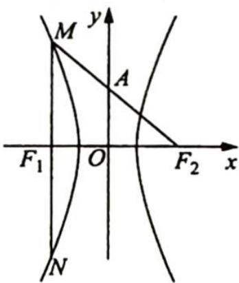

中， $\tan \angle MF_2F_1 = \frac{|MF_1|}{|F_1F_2|} = \frac{\frac{b^2}{a}}{2c} = \frac{b^2}{2ac} = 2\sqrt{2}, b^2 = 4\sqrt{2}ac$ ，即 $c^2 - a^2 = 4\sqrt{2}ac$ ，两边同除以 $a^2$ 得 $e^2 - 4\sqrt{2}e - 1 = 0$ ，而 $e > 1$ ，解得 $e = 2\sqrt{2} + 3$ 。故选B.

3.【解析】如图所示,设 $\left|A{F}_{1}\right| = {2m}\left( {m > 0}\right)$ ,因为 $\overrightarrow{A{F}_{1}} = 2\overrightarrow{{F}_{1}B}$ ,所以 $\left| B{F}_{1}\right|  = m$ .

又 $\overrightarrow{AF_2} \cdot \overrightarrow{AF_1} = 0, |F_1F_2| = 2c$ ，所以 $|AF_2| = \sqrt{|F_1F_2|^2 - |AF_1|^2} = 2\sqrt{c^2 - m^2}$ ， $|BF_2| = \sqrt{|AB|^2 + |AF_2|^2} = \sqrt{4c^2 + 5m^2}$ ，且 $|AF_1| + |AF_2| = |BF_1| + |BF_2| = 2a$ ，

所以 $2m + 2\sqrt{c^2 - m^2} = m + \sqrt{4c^2 + 5m^2}, m + 2\sqrt{c^2 - m^2} = \sqrt{4c^2 + 5m^2},$ $m^2 + 4c^2 - 4m^2 + 4m\sqrt{c^2 - m^2} = 4c^2 + 5m^2, c^2 = 5m^2,$ 即 $c = \sqrt{5} m.$

又 $2a = 2m + 2\sqrt{c^2 - m^2} = 6m$ ，所以 $a = 3m, e = \frac{c}{a} = \frac{\sqrt{5}m}{3m} = \frac{\sqrt{5}}{3}$ 故答案为 $\frac{\sqrt{5}}{3}$ .

4.【解析】如图所示，由 $(\overrightarrow{BA}+\overrightarrow{BF_{2}})\cdot\overrightarrow{AF_{2}}=(\overrightarrow{BA}+\overrightarrow{BF_{2}})\cdot(\overrightarrow{BF_{2}}-\overrightarrow{BA})=|\overrightarrow{BF_{2}}|^{2}-|\overrightarrow{BA}|^{2}=0$ 得 $|BF_{2}|=|BA|$ .

又由题意可得， $A$ 为双曲线左支上的点， $B$ 为双曲线右支上的点，根据双曲线的定义可得 $\vert BF_1\vert -\vert BF_2\vert = 2a,\vert AF_2\vert -\vert AF_1\vert = 2a,$

所以 $|AF_1| = |BF_1| - |BA| = |BF_1| - |BF_2| = 2a$ ，因此 $|AF_2| = 2a + |AF_1| = 4a$ .

因为直线 $AB$ 的斜率为 $\sqrt{3}$ , 所以 $\angle AF_{1}F_{2}=60^{\circ}$ , 又 $|F_{1}F_{2}|=2c$ , 所以 $\cos 60^{\circ}=$ $\frac{|AF_1|^2 + |F_1F_2|^2 - |AF_2|^2}{2|AF_1||F_1F_2|} = \frac{4a^2 + 4c^2 - 16a^2}{4a \cdot 2c} = \frac{c^2 - 3a^2}{2ac} = \frac{1}{2}$ , 即 $c^2 - ac - 3a^2 = 0$ , 所以 $e^2 - e - 3 = 0$ , 解得 $e = \frac{1 + \sqrt{13}}{2}$ 或 $e = \frac{1 - \sqrt{13}}{2}$ (舍去, 双曲线的离心率大于 1). 故答案为 $\frac{1 + \sqrt{13}}{2}$ .

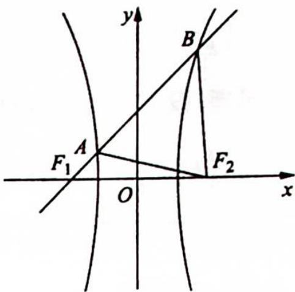

5.【解析】由题意可设 $B(0,b), F(c,0)$ , 线段 $AB$ 中点为 $K$ , 且 $CF=2FK$ , 可得 $F$ 为 $\triangle ABC$ 的重心, 设 $A(x_1,y_1), C(x_2,y_2)$ , 由重心坐标公式可得, $x_1+x_2+0=3c, y_1+y_2+b=0$ , 即有 $AC$ 的中点 $M(x,y)$ , 可得 $x=\frac{x_1+x_2}{2}=\frac{3c}{2}, y=\frac{y_1+y_2}{2}=-\frac{b}{2}$ . 由题意可得点 $M$ 在椭圆内, 可得 $\frac{9c^2}{4a^2}+\frac{1}{4}<1$ , 由 $e=\frac{c}{a}$ , 可得 $e^2<\frac{1}{3}$ , 即有 $0<e<\frac{\sqrt{3}}{3}$ . 故答案为 $(0,\frac{\sqrt{3}}{3})$ .

6.【解析】(1)由点 $P$ 在抛物线 $E$ 上知, $x_0 = \frac{2}{3}$ , 则 $P$ 到抛物线准线的距离为 $\frac{5}{3}$ , 所以 $|PF| = \frac{5}{3}$ ,

设椭圆左焦点为 $F_{1}$ , 则 $PF_{1} = \sqrt{\left(\frac{5}{3}\right)^{2} + \left(\frac{2\sqrt{6}}{3}\right)^{2}} = \frac{7}{3}$ , 所以 $2a = \frac{5}{3} + \frac{7}{3} = 4, a = 2$ , 又 $c = 1$ , 所以 $b = \sqrt{3}$ , 故椭圆 $C$ 的方程为 $\frac{x^2}{4} + \frac{y^2}{3} = 1$ .

(2)设直线 l 的方程为 $x=my+1$ ，当 m=0 时，易知与题意不符，所以 $m\neq0$ ，把直线 l 与椭圆 C 的方程联立得 $(3m^{2}+4)y^{2}+6my-9=0$ ，设 $A(x_{1},y_{1}), B(x_{2},y_{2})$ ，则 $y_{1}+y_{2}=\frac{-6m}{3m^{2}+4}, y_{1}y_{2}=\frac{-9}{3m^{2}+4}$ ，由 $AB\perp MN$ 知 $\frac{|AB|}{|MN|}=\frac{|y_{1}-y_{2}|}{|x_{M}-0|}, |y_{1}-y_{2}|=\sqrt{(y_{1}+y_{2})^{2}-4y_{1}y_{2}}=\frac{12\sqrt{m^{2}+1}}{3m^{2}+4}$ .
设 AB 中点坐标为 $(x_{0}, y_{0})$ ，则 $y_{0}=\frac{y_{1}+y_{2}}{2}=\frac{-3m}{3m^{2}+4}, x_{0}=my_{0}+1=\frac{4}{3m^{2}+4}$ ，故 AB 中垂线方程为 $y+\frac{3m}{3m^{2}+4}=-m\left(x-\frac{4}{3m^{2}+4}\right)$ ，令 y=0，得 $x_{M}=\frac{1}{3m^{2}+4}$ ，所以 $\frac{|AB|}{|MN|}=12\sqrt{m^{2}+1}\in(12,+\infty)$ .

7.【解析】(1)由题意可知 R 是线段 PF 的中点, 因为 $RQ \perp PF$ , 所以 RQ 所在直线为线段 PF 的垂直平分线, 连接 QF, 所以 $|QP| = |QF|$ , 又 $PQ \perp l$ , 所以点 Q 到点 F 的距离和到直线 l 的距离相等, 设 $Q(x, y)$ , 则 $|x + 1| = \sqrt{(x - 1)^2 + y^2}$ , 化简得 $y^2 = 4x$ , 所以动点 Q 的轨迹 E 的方程为 $y^2 = 4x$ .

(2)由题意可知直线 PF 的斜率存在且不为 0, 设直线 $PF: y = k(x - 1) (k \neq 0)$ , 则 $CD: y = -\frac{1}{k}(x - 1)$ , 联立方程, 得 $\begin{cases} y = k(x - 1) \\ y^2 = 4x \end{cases}$ , 消去 y, 得 $k^2 x^2 - (2k^2 + 4)x + k^2 = 0$ , 设 $A(x_1, y_1), B(x_2, y_2)$ , 则 $x_1 + x_2 = \frac{2k^2 + 4}{k^2}, x_1 \cdot x_2 = 1$ .

因为向量 $\overrightarrow{FA}, \overrightarrow{FB}$ 方向相反, 所以 $\overrightarrow{FA} \cdot \overrightarrow{FB} = -|\overrightarrow{FA}| |\overrightarrow{FB}| = -(x_1 + 1)(x_2 + 1) = -(x_1 x_2 + x_1 + x_2 + 1) =$

$$
- \left(\frac {4}{k ^ {2}} + 4\right).
$$

同理, 设 $C(x_{3}, y_{3}), D(x_{4}, y_{4})$ , 可得 $\overrightarrow{FC} \cdot \overrightarrow{FD} = -|\overrightarrow{FC}| |\overrightarrow{FD}| = -4k^{2} - 4$ , 所以 $\overrightarrow{FA} \cdot \overrightarrow{FB} + \overrightarrow{FC} \cdot \overrightarrow{FD} = -4(k^{2} + \frac{1}{k^{2}}) - 8$ , 因为 $k^{2} + \frac{1}{k^{2}} \geqslant 2$ , 当且仅当 $k^{2} = 1$ , 即 $k = \pm 1$ 时取等号. 所以 $\overrightarrow{FA} \cdot \overrightarrow{FB} + \overrightarrow{FC} \cdot \overrightarrow{FD}$ 的最大值为 -16.

3.【解析】(1)由题设条件可得,椭圆的方程为 $\frac{x^{2}}{4}+y^{2}=1$ ,直线AB的方程为 $x+2y-2=0$ .

设 $D(x_{0},kx_{0}),E(x_{1},kx_{1}),F(x_{2},kx_{2})$ ,其中 $x_{1}<x_{2}$ ,由 $\left\{\begin{aligned}y&=kx\\ \frac{x^{2}}{4}+y^{2}&=1\end{aligned}\right.$ 得 $(1+4k^{2})x^{2}=4$ ,解得 $x_{2}=-x_{1}=\frac{2}{\sqrt{1+4k^{2}}}$ ①.

由 $\overrightarrow{ED}=6\overrightarrow{DF}$ 得 $(x_{0}-x_{1},k(x_{0}-x_{1}))=6(x_{2}-x_{0},k(x_{2}-x_{0}))$ ,即 $x_{0}-x_{1}=6(x_{2}-x_{0})$ ,所以 $x_{0}=\frac{1}{7}(6x_{2}+x_{1})=\frac{5}{7}x_{2}=\frac{10}{7\sqrt{1+4k^{2}}}$ .由D在AB上得 $x_{0}+2kx_{0}-2=0$ ,所以 $x_{0}=\frac{2}{1+2k},\frac{2}{1+2k}=\frac{10}{7\sqrt{1+4k^{2}}}$ ,化简得 $24k^{2}-25k+6=0$ ,解得 $k=\frac{2}{3}$ 或 $k=\frac{3}{8}$ .

(2)根据点到直线的距离公式和①式可知,点E,F到AB的距离分别为 $d_{1}=\frac{|x_{1}+2kx_{1}-2|}{\sqrt{5}}=\frac{2(1+2k)+2\sqrt{1+4k^{2}}}{\sqrt{5(1+4k^{2})}},d_{2}=\frac{|x_{2}+2kx_{2}-2|}{\sqrt{5}}=\frac{2(1+2k)-2\sqrt{1+4k^{2}}}{\sqrt{5(1+4k^{2})}}$ .

又 $|AB|=\sqrt{2^{2}+1^{\prime}}=\sqrt{5}$ ,所以四边形AEBF的面积 $S=\frac{1}{2}|AB|(d_{1}+d_{2})=\frac{1}{2}\times\sqrt{5}\times\frac{4(1+2k)}{\sqrt{5(1+4k^{2})}}=\frac{2(1+2k)}{\sqrt{1+4k^{2}}}=2\sqrt{\frac{1+4k^{2}+4k}{1+4k^{2}}}=2\sqrt{1+\frac{4k}{1+4k^{2}}}=2\sqrt{\frac{1+\frac{4}{4k+\frac{1}{k}}}{\sqrt{4k}\cdot\frac{1}{k}}}\leqslant2\sqrt{\frac{1+\frac{4}{4k}\cdot\frac{1}{k}}{\sqrt{4k}\cdot\frac{1}{k}}}=2\sqrt{2}$ ,当且仅当 $4k=\frac{1}{k}(k>0)$ ,即 $k=\frac{1}{2}$ 或 $k=-\frac{1}{2}$ (舍去)时等号成立.

所以当 $k=\frac{1}{2}$ 时,等号成立.故四边形AEBF面积的最大值为 $2\sqrt{2}$ .

9.【解析】(1)由题意得 $\frac{p}{2}=1$ ，即p=2。所以抛物线的准线方程为x=-1。

(2) 设 $A(x_{A}, y_{A}), B(x_{B}, y_{B}), C(x_{C}, y_{C})$ ，重心 $G(x_{G}, y_{G})$ 。令 $y_{A} = 2t, t \neq 0$ ，则 $x_{A} = t^{2}$ 。

由于直线 $AB$ 过 $F$ , 故直线 $AB$ 方程为 $x = \frac{t^2 - 1}{2t} y + 1$ , 代入 $y^2 = 4x$ , 得 $y^2 - \frac{2(t^2 - 1)}{t} y - 4 = 0$ , 故 $y_A y_B = 2ty_B = -4$ , 即 $y_B = -\frac{2}{t}$ , 所以 $B\left(\frac{1}{t^2}, -\frac{2}{t}\right)$ .

又由于 $x_{G} = \frac{1}{3} (x_{A} + x_{B} + x_{C}), y_{G} = \frac{1}{3} (y_{A} + y_{B} + y_{C})$ 及重心 $G$ 在 $x$ 轴上，故 $2t - \frac{2}{t} + y_{C} = 0$

得 $C\left(\left(\frac{1}{t} - t\right)^2, 2\left(\frac{1}{t} - t\right)\right), G\left(\frac{2t^4 - 2t^2 + 2}{3t^2}, 0\right)$ .

所以直线 AC 方程为 $y-2t=2t(x-t^{2})$ ，得 $Q(t^{2}-1,0)$ .

由于 Q 在焦点 F 的右侧, 故 $t^{2} > 2$ .

$$
\frac {S _ {1}}{S _ {2}} = \frac {\frac {1}{2} | F G | | y _ {A} |}{\frac {1}{2} | Q G | | y _ {C} |} = \frac {\left| \frac {2 t ^ {4} - 2 t ^ {2} + 2}{3 t ^ {2}} - 1 \right| | 2 t |}{| t ^ {2} - 1 - \frac {2 t ^ {4} - 2 t ^ {2} + 2}{3 t ^ {2}} | | \frac {2}{t} - 2 t |} = \frac {2 t ^ {4} - t ^ {2}}{t ^ {4} - 1} = 2 - \frac {t ^ {2} - 2}{t ^ {4} - 1}.
$$

令 $m = t^2 - 2$ ，则 $m > 0$

$$
\frac {S _ {1}}{S _ {2}} = 2 - \frac {m}{m ^ {2} + 4 m + 3} = 2 - \frac {1}{m + \frac {3}{m} + 4} \geqslant 2 - \frac {1}{2 \sqrt {m \cdot \frac {3}{m}} + 4} = 1 + \frac {\sqrt {3}}{2}.
$$

当 $m = \sqrt{3}$ 时， $\frac{S_1}{S_2}$ 取得最小值 $1 + \frac{\sqrt{3}}{2}$ ，此时 $G(2,0)$ .

## 训练 19

1.【解析】(1)设 $P(x_{1},y_{1})$ , $Q(x_{2},y_{2})$ , OP: $y=k_{1}x$ , $OQ:y=k_{2}x$ ，则 $\left\{\begin{aligned}y&=k_{1}x\\ \frac{x^{2}}{a^{2}}+\frac{y^{2}}{b^{2}}=1\end{aligned}\right.$ ，消 y 得 $b^{2}x^{2}+a^{2}k_{1}^{2}x^{2}=a^{2}b^{2}$ ，即 $(a^{2}k_{1}^{2}+b^{2})x^{2}=a^{2}b^{2}$ ，得 $x_{1}^{2}=\frac{a^{2}b^{2}}{a^{2}k_{1}^{2}+b^{2}}$ ，同理可得 $x_{2}^{2}=\frac{a^{2}b^{2}}{a^{2}k_{2}^{2}+b^{2}}$ 。因为 $|OP|^{2}+|OQ|^{2}=x_{1}^{2}+k_{1}^{2}x_{1}^{2}+x_{2}^{2}+k_{2}^{2}x_{2}^{2}=(1+k_{1}^{2})x_{1}^{2}+(1+k_{2}^{2})x_{2}^{2}$ ，所以 $|OP|^{2}+|OQ|^{2}=(1+k_{1}^{2})\cdot\frac{a^{2}b^{2}}{a^{2}k_{1}^{2}+b^{2}}+(1+k_{2}^{2})\cdot\frac{a^{2}b^{2}}{a^{2}k_{2}^{2}+b^{2}}=a^{2}b^{2}\left(\frac{1+k_{1}^{2}}{a^{2}k_{1}^{2}+b^{2}}+\frac{1+k_{2}^{2}}{a^{2}k_{2}^{2}+b^{2}}\right)$ 。又 $k_{1}k_{2}=-\frac{b^{2}}{a^{2}}$ ，所以 $k_{1}^{2}k_{2}^{2}=\frac{b^{4}}{a^{4}}$ ，则 $k_{2}^{2}=\frac{b^{4}}{a^{4}k_{1}^{2}}$ ， $|OP|^{2}+|OQ|^{2}=a^{2}b^{2}\left(\frac{1+k_{1}^{2}}{a^{2}k_{1}^{2}+b^{2}}+\frac{1+\frac{b^{4}}{a^{4}k_{1}^{2}}}{\frac{b^{4}}{a^{2}k_{1}^{2}}+b^{2}}\right)=$ $a^{2}b^{2}\left(\frac{1+k_{1}^{2}}{a^{2}k_{1}^{2}+b^{2}}+\frac{a^{4}k_{1}^{2}+b^{4}}{a^{2}b^{4}+a^{4}b^{2}k_{1}^{2}}\right)=a^{2}b^{2}\cdot\frac{a^{2}b^{2}(1+k_{1}^{2})+a^{4}k_{1}^{2}+b^{4}}{a^{2}b^{2}(b^{2}+a^{2}k_{1}^{2})}=a^{2}b^{2}+a^{2}b^{2}k_{1}^{2}+a^{4}k_{1}^{2}+b^{4}=$ $\frac{b^{2}(a^{2}+b^{2})+a^{2}k_{1}^{2}(a^{2}+b^{2})}{b^{2}+a^{2}k_{1}^{2}}=a^{2}+b^{2}.$ (2)圆心 $M(x_{0},y_{0})$ 到直线 y=k\_{1}x 的距离为 r，则 $r=\frac{|k_{1}x_{0}-y_{0}|}{\sqrt{1+k_{1}^{2}}}=\frac{|k_{2}x_{0}-y_{0}|}{\sqrt{1+k_{2}^{2}}}$ ，得 $(k_{1}x_{0}-y_{0})^{2}=r^{2}(1+k_{1}^{2})$ ，即 $(x_{0}^{2}-r^{2})k_{1}^{2}-2x_{0}y_{0}k_{1}+y_{0}^{2}-r^{2}=0$ ，同理 $(x_{0}^{\prime}-r^{\prime})k_{1}^{\prime}-3x_{0}s_{0}s_{0}s_{0}s_{0}s_{0}s_{0}s_{0}s_{0}s_{0}s_{0}s_{0}s_{0}s_{0}s_{0}s_{0}s_{0}s_{0}s_{0}s_{0}s_{0}s_{0}s_{0}s_{0}s_{0}s_{0}s_{0}s_{0}s_{0}s_{0}s_{0}s_{0}s_{0}s_{0}s_0s_0s_0s_0s_0s_0s_0s_0s_0s_0s_0s_0s_0s_0s_0s_0s_0s_0s_0s_0s_0s_0s_0s_0s_0s_0s_0s_0s_0s_0s_0s_0s_0s_0s_n$ 因此 $k_{1}, k_{2}$ 是方程 $(x_{0}^{\prime}-r^{\prime})k^{\prime}-3x_{0}s_{0}\cdot k+y_{0}^{\prime}-r^{\prime}=0$ 的两根，故 $k_{1}s_{k_{1}}=\frac{y_{0}^{\prime}-r^{\prime}}{x_{0}^{\prime}-r^{\prime}}=-\frac{b^{\prime}}{a^{\prime}}$ ，即 $b^{\prime }x _ { 0 } ^ { ② } + a ^ { ② } y _ { 0 } ^ { ② } =$ $(a ^ { ② } + b ^ { ② } )r ^ { ② } = a ^ { ② } b ^ { ② }$ ，则 $r ^ { ② } = \frac { a ^ { ② } b ^ { ② } } { a ^ { ② } + b ^ { ② } } .$ 【解析】(1)因为 $\frac { c } { a } = \frac { \sqrt { 6 } } { 3 }$ ，所以 $\frac { c ^ { ② } } { a ^ { ② } } = \frac { ② } { 3 } , \frac { b ^ { ② } } { a ^ { ② } } = \frac { ① } { 3 }$ ，又椭圆过点 $(\sqrt { 2 },\frac {\sqrt { 3 }}{ 3 })$ ，所以 $\frac { ② } { 3 b ^ { ② } } + \frac { ① } { 3 b ^ { ② } } = 1$ ，故 $b ^ { ② } = 1$ 。

所以 $a^{2}=3$ ，即椭圆 C 的方程为 $\frac{x^{2}}{3}+y^{2}=1$ .

(2) $A, B$ 在 $x$ 轴同侧， $\overrightarrow{AF_2} = \lambda \overrightarrow{BF_1}$ ，所以 $AF_2 \parallel BF_1$ .

如图所示, 延长 $AF_{2}$ 交 $C$ 于点 $P$ , 由椭圆的对称性可得 $PF_{2} \parallel BF_{1}$ .

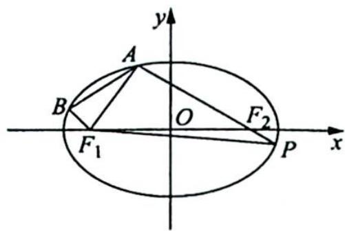

故四边形 $ABF_{1}F_{2}$ 的面积 $S = \frac{1}{2} (|BF_{1}| + |AF_{2}|) d = \frac{1}{2} |AP| d, d$ 为 $F_{1}$ 到 $AF_{2}$ 的距离.

令直线 $AF_{2}$ 的方程为 $x = ty + \sqrt{2}$ ，联立 $\left\{ \begin{array}{l} x = ty + \sqrt{2} \\ \frac{x^2}{3} + y^2 = 1 \end{array} \right. \Rightarrow (3 + t^2)y^2 + 2\sqrt{2}ty - 1 = 0.$

又 $\Delta > 0, A(x_1, y_1), P(x_2, y_2), y_1 + y_2 = \frac{-2\sqrt{2}t}{3 + t^2}, y_1y_2 = \frac{-1}{3 + t^2}, |AP| = |AF_2| + |BF_1| =$ $\sqrt{1 + t^2}|y_1 - y_2| = \sqrt{1 + t^2}\frac{\sqrt{8t^2 + 4(3 + t^2)}}{3 + t^2} = \frac{2\sqrt{3}(1 + t^2)}{3 + t^2}.$

又 $d = \frac{2\sqrt{2}}{\sqrt{1 + t^2}}$ ，所以 $S_{\triangle F_1AP} = \frac{1}{2}|AP|d = \frac{2\sqrt{6}\sqrt{1 + t^2}}{3 + t^2} = \frac{2\sqrt{6}\sqrt{1 + t^2}}{(t^2 + 1) + 2}$ ，令 $u = \sqrt{1 + t^2}\geqslant 1.$

则 $S_{\triangle F_1\triangle P} = \frac{2\sqrt{6}}{u + \frac{2}{u}}$ ，当且仅当 $u = \sqrt{2}$ 时，即 $|t| = 1$ 时， $S_{\max} = \frac{2\sqrt{6}}{2\sqrt{2}} = \sqrt{3}$ .

将 $t = \pm 1$ 代入韦达定理解出 $y_{1}, y_{2}, \lambda = \frac{|\overrightarrow{AF_{2}}|}{|\overrightarrow{BF_{1}}|} = \frac{|\overrightarrow{AF_{2}}|}{|\overrightarrow{PF_{2}}|} = \frac{|y_{1}|}{|y_{2}|}$ , 所以 $\lambda = \frac{\frac{\sqrt{6} + \sqrt{2}}{4}}{\frac{\sqrt{6} - \sqrt{2}}{4}} = 2 + \sqrt{3}$ 或 $\lambda = \frac{\frac{\sqrt{6} - \sqrt{2}}{4}}{\frac{\sqrt{6} + \sqrt{2}}{4}} = 2 - \sqrt{3}$ .

综上, 四边形 $ABF_{1}F_{2}$ 面积的最大值为 $\sqrt{3}$ , 此时 $\lambda = 2 \pm \sqrt{3}$ .

另 $S_{\triangle F_1AP} = \frac{1}{2}|F_1F_2||y_1 - y_2| = \sqrt{2}\cdot \frac{2\sqrt{3}\sqrt{1 + t^2}}{3 + t^2}\leqslant \sqrt{3}.$ 以下解法同上.

3.【解析】设直线 AB, CD 相交于点 $M(x_{0}, y_{0})$ ，直线 AB 的倾斜角为 $\alpha\left(0 < \alpha < \frac{\pi}{2}\right)$ ，则直线 CD 的倾斜角为 $\pi - \alpha$ ，则直线 AB, CD 的参数方程分别为： $\left\{\begin{aligned} x &= x_{0} + t\cos\alpha \\ y &= y_{0} + t\sin\alpha \end{aligned}\right.$ （其中 t 为参数）， $\left\{\begin{aligned} x &= x_{0} + t\cos(\pi - \alpha) \\ y &= y_{0} + t\sin(\pi - \alpha) \end{aligned}\right.$ （其中 t 为参数）.

将直线 $AB$ 的参数方程代入椭圆，可得 $b^{2}(x_{0} + t\cos \alpha)^{2} + a^{2}(y_{0} + t\sin \alpha)^{2} - a^{2}b^{2} = 0$ ，即 $(b^{2}\cos^{2}\alpha + a^{2}\sin^{2}\alpha)t^{2} + 2(b^{2}x_{0}\cos \alpha + a^{2}y_{0}\sin \alpha)t + b^{2}x_{0}^{2} + a^{2}y_{0}^{2} - a^{2}b^{2} = 0$ ，所以 $|MA||MB| = |t_1t_2| = \frac{a^2b^2 - b^2x_0^2 - a^2y_0^2}{b^2\cos^2\alpha + a^2\sin^2\alpha}.$

同理可得 $|MC||MD| = |t_3t_4| = \frac{a^2b^2 - b^2x_0^2 - a^2y_0^2}{b^2\cos^2\alpha + a^2\sin^2\alpha}$ ，所以 $|MC||MD| = |MA||MB|$ .

由相交弦定理可得 A, B, C, D 四点共圆.

4.【解析】如图所示,不妨设 F 为椭圆的左焦点,以 F 为极点,x 轴为极轴建立极坐标系.

则椭圆的极坐标方程为 $\rho = \frac{ep}{1 - e\cos\alpha} (\rho > 0)$ , 其中 $e = \frac{c}{a}, p = \frac{b^2}{c}, c = \sqrt{a^2 - b^2}$ .

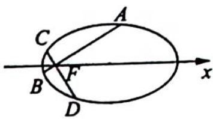

设 $A(\rho_1, \alpha), B(\rho_2, \pi + \alpha), C(\rho_3, \frac{\pi}{2} + \alpha), D(\rho_4, \frac{3\pi}{2} + \alpha), \alpha \in [0, \frac{\pi}{2}]$ , 则 $\frac{1}{|FA|} + \frac{1}{|FB|} =$

$\frac{1}{|\rho_1|} + \frac{1}{|\rho_2|} = \frac{1 - e\cos\alpha}{ep} + \frac{1 + e\cos\alpha}{ep} = \frac{2}{ep} = \frac{2a}{b^2}$ , 为定值; $\frac{1}{|AB|} + \frac{1}{|CD|} = \frac{1}{\rho_1 + \rho_2} + \frac{1}{\rho_3 + \rho_4} = \frac{1 - e^2\cos^2\alpha}{2ep} + \frac{1 - e^2\sin^2\alpha}{2ep} = \frac{2 - e^2}{2ep} = \frac{a^2 + b^2}{2ab^2}$ , 为定值.

(2) $|AB| + |CD| = \rho_1 + \rho_2 + \rho_3 + \rho_4$ $= \frac{ep}{1 - e\cos\alpha} + \frac{ep}{1 + e\cos\alpha} + \frac{ep}{1 + e\sin\alpha} + \frac{ep}{1 - e\sin\alpha}$ $= 2ep\left(\frac{1}{1 - e^2\cos^2\alpha} + \frac{1}{1 - e^2\sin^2\alpha}\right) = \frac{2ep(2 - e^2)}{1 - e^2 + e^4\sin^2\alpha\cos^2\alpha}$ $\geqslant \frac{2ep(2 - e^2)}{1 - e^2 + \frac{1}{4}e^4} = \frac{8ab^2}{a^2 + b^2}.$ 当且仅当 $\theta = \frac{\pi}{4}$ 时取到最小值 $\frac{8ab^2}{a^2 + b^2}.$

$|AB||CD| = \frac{|AB| + |CD|}{\frac{1}{|AB|} + \frac{1}{|CD|}} \geqslant \frac{\frac{8ab^2}{a^2 + b^2}}{\frac{a^2 + b^2}{2ab^2}} = \frac{16a^2b^4}{(a^2 + b^2)^2}$ , 当且仅当 $\theta = \frac{\pi}{4}$ 时取到最小值 $\frac{16a^2b^4}{(a^2 + b^2)^2}$ .

5.【解析】(1)设 $C(x_{1},y_{1})$ , $D(x_{2},y_{2})$ ，联立直线 l 与椭圆方程 $\left\{\begin{aligned}x^{2}+\frac{y^{2}}{4}&=1\\ kx-y+1&=0\end{aligned}\right.$ ，消去 y 得 $(4+k^{2})x^{2}+2kx-$ 3=0，则 $\left\{\begin{aligned}x_{1}+x_{2}&=\frac{-2k}{k^{2}+4}\\ x_{1}x_{2}&=\frac{-3}{k^{2}+4}\end{aligned}\right.$

已知 $E\left(-\frac{1}{k},0\right),F(0,1)$ ，又 $\overrightarrow{CE} = \overrightarrow{FD}$ ，所以 $\left(-\frac{1}{k} -x_1, - y_1\right) = (x_2,y_2 - 1), - \frac{1}{k} -x_1 = x_2$ ，即 $x_{2} + x_{1} =$ $-\frac{1}{k}$ ，则 $\frac{-2k}{k^2 + 4} = -\frac{1}{k}$ 解得 $k = \pm 2$ ，符合题意.

所以直线 l 的方程为 $2x - y + 1 = 0$ 或 $2x + y - 1 = 0$ .

(2)解法一(椭圆第三定义): 设 $C(x_{1}, y_{1})$ , $D(x_{2}, y_{2})$ ，联立直线 l 与椭圆方程 $\left\{\begin{aligned} x^{2} + \frac{y^{2}}{4} &= 1 \\ kx - y + 1 &= 0 \end{aligned}\right.$ ，消去 y 得

(4 + $k^{2}$ ) $x^{2} + 2kx - 3 = 0$ ，则 $\left\{\begin{aligned} x_{1} + x_{2} &= \frac{-2k}{k^{2} + 4} \\ x_{1}x_{2} &= \frac{-3}{k^{2} + 4} \end{aligned}\right.$ ， $\left\{\begin{aligned} y_{1} + y_{2} &= \frac{8}{k^{2} + 4} \\ y_{1}y_{2} &= \frac{4(1 - k^{2})}{k^{2} + 4}\end{aligned}\right.$ 又 A(-1,0), B(1,0)，由于 $k_{CA} \cdot k_{CB} = \frac{y_{1}}{x_{1} + 1} \cdot \frac{y_{1}}{x_{1} - 1} = \frac{y_{1}^{2}}{x_{1}^{2} - 1} = \frac{4(1 - x_{1}^{2})}{x_{1}^{2} - 1} = -4$ ，则 $k_{CB} = \frac{-4}{k_{CA}}$ .

又 $\frac{k_1}{k_2} = \frac{k_{AD}}{k_{CB}} = \frac{k_{AD}}{\frac{-4}{k_{CA}}} = 2$ ，即 $k_{CA} \cdot k_{AD} = \frac{y_1}{x_1 + 1} \cdot \frac{y_2}{x_2 + 1} = \frac{y_1 y_2}{x_1 x_2 + (x_1 + x_2) + 1} = -8$ （※），将根与系数的关系式代入（※）式得 $-8 = \frac{y_1 y_2}{x_1 x_2 + (x_1 + x_2) + 1} = \frac{4(1 - k^2)}{(-3) + (-2k) + (k^2 + 4)} = -4 \cdot \frac{k + 1}{k - 1}$ ，解得 $k = 3$ .

解法二：设 $C(x_1, y_1), D(x_2, y_2)$ ，联立直线 $l$ 与椭圆方程 $\left\{ \begin{array}{l} x^2 + \frac{y^2}{4} = 1 \\ kx - y + 1 = 0 \end{array} \right.$ ，消去 $y$ 得 $(4 + k^2)x^2 + 2kx - 3 = 0$ ，则 $\left\{ \begin{array}{l} x_1 + x_2 = \frac{-2k}{k^2 + 4} \\ x_1 x_2 = \frac{-3}{k^2 + 4} \end{array} \right.$ .

由 $\frac{k_1}{k_2} = \frac{\frac{y_2}{x_2 + 1}}{\frac{y_1}{x_1 - 1}} = \frac{y_2}{y_1} \cdot \frac{x_1 - 1}{x_2 + 1} = 2$ ，平方得 $\frac{y_2^2(x_1 - 1)^2}{y_1^2(x_2 + 1)^2} = 4$ （※）.

又 $x_1^2 + \frac{y_1^2}{4} = 1$ ，所以 $y_1^2 = 4(1 - x_1^2)$ ，同理 $y_2^2 = 4(1 - x_2^2)$ ，代入（※）式并化简得 $\frac{(1 - x_2)(1 - x_1)}{(1 + x_1)(1 + x_2)} = 4$ ，即 $3x_1x_2 + 5(x_1 + x_2) + 3 = 0$ ，将根与系数的关系式代入并化简得 $3k^2 - 10k + 3 = 0$ ，解得 $k = 3$ 或 $k = \frac{1}{3}$ .

因为 $\frac{y_2(x_1 - 1)}{y_1(x_2 + 1)} = \frac{2}{1}, x_1, x_2 \in (-1, 1)$ ，所以 $y_1, y_2$ 异号，故舍去 $k = \frac{1}{3}$ ，所以 $k = 3$ .

解法三：设 $C(x_1, y_1), D(x_2, y_2)$ ，联立直线 $l$ 与椭圆方程 $\left\{ \begin{array}{l} x^2 + \frac{y^2}{4} = 1 \\ kx - y + 1 = 0 \end{array} \right.$ ，消去 $y$ 得 $(4 + k^2)x^2 - 2kx - 3 = 0$ .

由 $2 = \frac{k_1}{k_2} = \frac{\frac{y_2}{x_2 + 1}}{\frac{y_1}{x_1 - 1}} = \frac{y_2}{y_1} \cdot \frac{x_1 - 1}{x_2 + 1} = \frac{kx_2 + 1}{kx_1 + 1} \cdot \frac{x_1 - 1}{x_2 + 1} = \frac{kx_2x_1 + x_1 - (kx_2 + 1)}{kx_2x_1 + x_2 + kx_1 + 1}$ （※），又 $\left\{ \begin{array}{l} x_1 + x_2 = \frac{-2k}{k^2 + 4} \\ x_1x_2 = \frac{-3}{k^2 + 4} \end{array} \right.$ ，则 $\left\{ \begin{array}{l} x_1 = \frac{-2k}{k^2 + 4} - x_2 \\ x_1x_2 = \frac{-3}{k^2 + 4} \end{array} \right.$ ，代入（※）式得 $2 = \frac{kx_2x_1 + x_1 - (kx_2 + 1)}{kx_2x_1 + x_2 + kx_1 + 1} = \frac{\frac{-3k}{k^2 + 4} + \frac{-2k}{k^2 + 4} - 1 - (k + 1)x_2}{\frac{-3k}{k^2 + 4} + \frac{-2k^2}{k^2 + 4} + 1 + (1 - k)x_2} =$

$(k-3)x_{2}+3=0$ (※).

联立直线 l 与椭圆方程 $\left\{\begin{aligned}x^{2}+\frac{y^{2}}{4}&=1\\ kx-y+1&=0\end{aligned}\right.$ ，得 $(4+k^{2})x^{2}+2kx-3=0$ ，故 $x_{1}+x_{2}=\frac{-2k}{k^{2}+4},x_{1}x_{2}=\frac{-3}{k^{2}+4},x_{2}=$ $\frac{-k+2\sqrt{k^{2}+3}}{k^{2}+4}$ ，代入（※）式得 $k\frac{-3}{k^{2}+4}+(2k-1)\frac{-2k}{k^{2}+4}-(k-3)\frac{-k+2\sqrt{k^{2}+3}}{k^{2}+4}+3=0.$ 化简得 $12-4k+(6-2k)\sqrt{k^{2}+3}=0$ ，即 $2(3-k)(2+\sqrt{k^{2}+3})=0$ ，解得 k=3。

6.【解析】(1)依题意可得 c=1，由 $\angle AF_{1}O=60^{\circ}$ ，得 $\frac{b}{c}=\sqrt{3}$ ，所以 $b=\sqrt{3}, a=2$ 。故椭圆 C 的方程为 $\frac{x^{2}}{4}+\frac{y^{2}}{3}=1$ 。

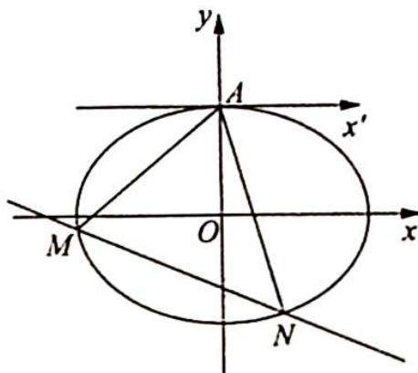

(2)如图所示,建立新平面直角坐标系 $x^{\prime}Ay^{\prime}$ , 则 $\left\{ \begin{array}{l} x = x^{\prime} \\ y = y^{\prime} + \sqrt{3} \end{array} \right.$ .

椭圆 $C: \frac{x'^{2}}{4} + \frac{(y' + \sqrt{3})^{2}}{3} = 1$ , 即 $3x'^{2} + 4y'^{2} + 8\sqrt{3}y' = 0$ .

令 $MN: mx' + ny' = 1$ , 则 $3x'^{2} + 4y'^{2} + 8\sqrt{3}y'(mx' + ny') = 0$ , 所以 $(4 + 8\sqrt{3}n)y'^{2} + 8\sqrt{3}mx'y' + 3x'^{2} = 0, (4 + 8\sqrt{3}n)\left(\frac{y'}{x'}\right)^{2} + 8\sqrt{3}m\left(\frac{y'}{x'}\right) + 3 = 0$ , 又 $k_{1} + k_{2} = \frac{-8\sqrt{3}m}{4 + 8\sqrt{3}n}$ , 即 $k_{1}k_{2} = \frac{3}{4 + 8\sqrt{3}n}$ .

因为 $k_{2} = \frac{k_{1}}{k_{1}-1}$ , 即 $k_{1}k_{2} = k_{1} + k_{2}$ , 所以 $-8\sqrt{3}m = 3$ , 即 $m = -\frac{\sqrt{3}}{8}$ .

直线 $MN: -\frac{\sqrt{3}}{8}x' + ny' = 1$ 在新坐标系下恒过定点 $\left(-\frac{8}{\sqrt{3}}, 0\right)$ , 则在原平面直角坐标系 $xOy$ 下, 直线 $MN$ 恒过定点 $\left(-\frac{8\sqrt{3}}{3}, \sqrt{3}\right)$ .

## 训练 20

$$
\left\{ \begin{array}{l} x + y \leqslant 1 \\ x \geqslant 0 \\ y \geqslant 0 \end{array} \right.
$$

$$
S _ {A} = \frac {1}{2}
$$

$$
\left\{ \begin{array}{l} x ^ {\prime} = x + y \\ y ^ {\prime} = x - y \end{array} \right.
$$

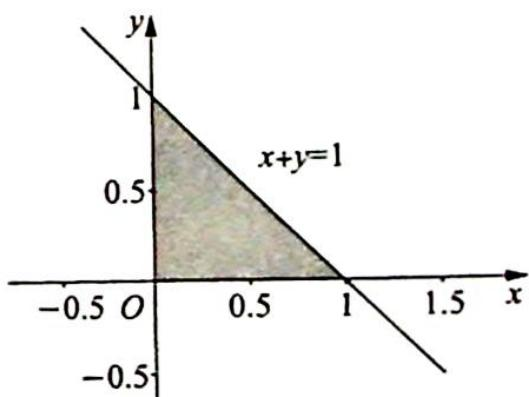

$$
\frac {S _ {B}}{S _ {A}} = \left| \left| \begin{array}{c c} 1 & 1 \\ 1 & - 1 \end{array} \right| \right| = 2
$$

$$
S _ {B} = 2 S _ {A} = 1
$$

2.【解析】画出题目的示意图如图所示：
①根据椭圆的第二定义可知应为 $e=\frac{|AF_{1}|}{d_{2}}=\frac{|AF_{2}|}{d_{1}}$ ，故①错误.

②如图所示，利用椭圆极坐标方程的推导方法得 $e = \frac{|AF_1|}{|AF_1|\cos\theta + |F_1K|} = \frac{|F_1B|}{|F_1B|\cos(\theta + \pi) + |F_1K|}$ ，解得 $\frac{1}{|AF_1|} + \frac{1}{|F_1B|} = \frac{1 - e\cos\theta}{e|F_1K|} + \frac{1 + e\cos\theta}{e|F_1K|} = \frac{2}{e|F_1K|} = \frac{2a}{b^2}$ ，同理可以求得 $\frac{1}{|AF_2|} + \frac{1}{|F_2C|} = \frac{2a}{b^2}$ ，所以 $\frac{|AF_1|}{|F_1B|} + \frac{|AF_2|}{|F_2C|} = \frac{2a}{b^2}|AF_1|-1 + \frac{2a}{b^2}|AF_2|-1 = \frac{2a}{b^2}$ （ $|AF_1| + |AF_2|)-2 = \frac{2(1 + e^2)}{1 - e^2}$ 为定值，故②错误.

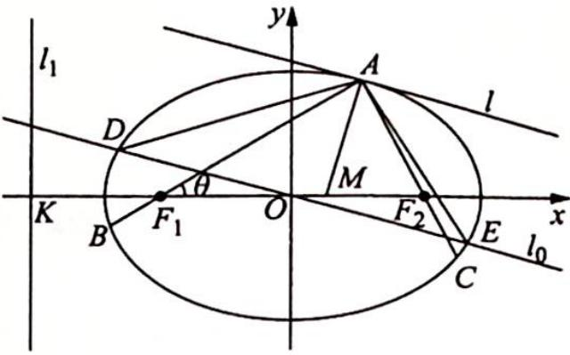

③已知椭圆的光学性质:入射光线 $F_{1}A$ 经椭圆的切线 l 反射后的反射光线为 $AF_{2}$ ，又因为 $\frac{|AF_{1}|}{|AF_{2}|} = \frac{|F_{1}M|}{|MF_{2}|}$ ，所以 $\angle F_{1}AM = \angle F_{2}AM, AM \perp l$ ，故③正确.

④设直线 $l_{0} //$ 直线 $l$ , 且直线 $l_{0}$ 过坐标原点交椭圆于 $D, E$ 两点, 作仿射变换: $\left\{ \begin{array}{l} x' = x \\ y' = \frac{a}{b} y \end{array} \right.$ , 则仿射变换将椭圆 $\frac{x^{2}}{a^{2}} + \frac{y^{2}}{b^{2}} = 1$ 变为圆 $x^{\prime 2} + y^{\prime 2} = a^{2}$ , 根据仿射变换的性质可知直线 $l_{0}$ 变为圆的一条直径 $l_{0}'$ , 切线 $l$ 变为圆的切线 $l'$ , 且 $l_{0}'$ 与 $l'$ 仍然平行, 所以 $S_{\triangle A'D'E'} = a^{2}$ .

因为 $S_{\triangle A^{\prime}D^{\prime}E^{\prime}}=\frac{a}{b}S_{\triangle ADE}$ ，所以 $S_{\triangle ADE}=ab$ 。设点 A 关于原点对称的点为 $A^{\prime}$ ，则四边形 $ADA^{\prime}E$ 的面积为 2ab，故④错误（另解：设过点 $A(x_{0},y_{0})$ 的切线方程为 $\frac{x_{0}x}{a^{2}}+\frac{y_{0}y}{b^{2}}=1$ ，直线 $l_{0}$ 的方程为 $\frac{x_{0}x}{a^{2}}+\frac{y_{0}y}{b^{2}}=0$ ，利用点到直线的距离以及弦长公式证明④错误）。故选 A。

3.【解析】把 $xOy$ 平面上所有点的横坐标不变, 纵坐标变为原来的 $\sqrt{3}$ 倍, 即作仿射变换 $\left\{\begin{array}{l} x' = x \\ y' = \sqrt{3} y \end{array}\right.$ , 得到 $x'Oy'$ 平面, 则椭圆 $\frac{x^2}{3} + y^2 = 1$ 变成圆 $x'^2 + y'^2 = 3$ , 任意一个平面图形的面积变为原来的 $\sqrt{3}$ 倍.

因为 $S_{\triangle A'OB'} = \frac{1}{2} |OA'| |OB'| \sin \angle A'OB' = \frac{3}{2} \sin \angle A'OB'$ , 所以当 $\angle A'OB' = 90^\circ$ 时, $S_{\triangle A'OB'}$ 取得最大值, 且最大值为 $\frac{3}{2}$ , 所以椭圆中 $\triangle AOB$ 面积的最大值为 $(S_{\triangle AOB})_{\max} = \frac{1}{\sqrt{3}} (S_{\triangle A'OB'})_{\max} = \frac{1}{\sqrt{3}} \times \frac{3}{2} = \frac{\sqrt{3}}{2}$ .

【评注】本题中 $|AB| = \sqrt{3}$ 是一个非本质的条件, 我们知道当 $\angle A'OB' = 90^\circ$ 时, $|A'B'| = \sqrt{6}$ , 若 $A'B' // x$ 轴, 则压缩成椭圆后 $|AB| = \sqrt{6}$ ; 若 $A'B' \perp x$ 轴, 则压缩成椭圆后 $|AB| = \sqrt{2}$ , 所以只要 $|AB|$ 在 $[\sqrt{2}, \sqrt{6}]$ 内取值, 本题的答案就不变.

4.【解析】如图所示,把 $xOy$ 平面上所有点的横坐标不变,纵坐标变为原来的 $\frac{2}{\sqrt{3}}$ 倍,即作仿射变换 $\left\{ \begin{array}{l} x' = x \\ y' = \frac{2}{\sqrt{3}} y \end{array} \right.$ , 得到 $x'Oy'$ 平面,于是椭圆 $\frac{x^2}{4} + \frac{y^2}{3} = 1$ 变成圆 $x'^2 + y'^2 = 4$ ,并且任意一个平面图形的面积变为原来的 $\frac{2}{\sqrt{3}}$ 倍.先求 $x^{\prime}Oy^{\prime}$ 平面上相应平行四边形 $A'B'C'D'$ 面积的最大值: 易知圆的内接平行四边形一定是矩形, 且圆心是矩形对角线的交点, 所以矩形 $A'B'C'D'$ 的面积等于三角形 $OA'B'$ 的面积的 4 倍, 如图所示, 作 $A'B'$ 边上的高 $OM'$ , 设 $|OM'| = d$ , 则 $S_{\triangle OA'B'} = d \sqrt{4 - d^2} = \sqrt{d^2(4 - d^2)}$ , 且 $0 < d \leqslant 1$ , 由二次函数的性质可知: 当 $d = 1$ 时, $S_{\triangle OA'B'}$ 取得最大值 $\sqrt{3}$ , 所以矩形 $A'B'C'D'$ 面积的最大值为 $4\sqrt{3}$ , 由仿射变换的性质知: 对应椭圆的内接平行四边形面积的最大值为 $4\sqrt{3} \div \frac{2}{\sqrt{3}} = 6$ .

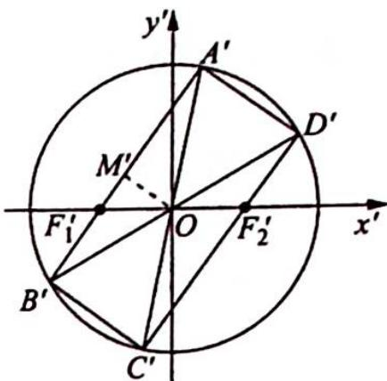

5.【解析】(1)如图所示,作仿射变换 $\left\{\begin{aligned}x^{\prime}&=\frac{x}{a}\\ &y^{\prime}&=\frac{y}{b}\end{aligned}\right.$ ,则椭圆 $\frac{x^{2}}{a^{2}}+\frac{y^{2}}{b^{2}}=1$ 变为单位圆 $x^{\prime 2}+y^{\prime 2}=1$ ,点A,B,T变换后对应的点分别为 $A^{\prime},B^{\prime},T^{\prime}$ ,且 $A^{\prime}\left(\frac{2}{a},0\right),B^{\prime}\left(0,\frac{1}{b}\right)$ .

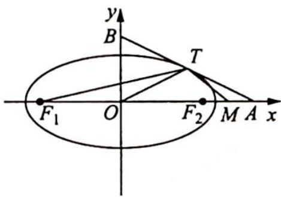

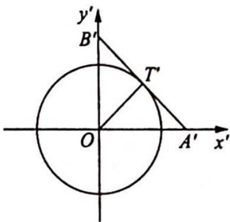

因为直线 $AB: \frac{x}{2} + y = 1$ 与椭圆 $\frac{x^{2}}{a^{2}} + \frac{y^{2}}{b^{2}} = 1$ 相切，所以直线 $A'B': \frac{ax'}{2} + by' = 1$ 与圆 $x'^{2} + y'^{2} = 1$ 相切， $\frac{1}{\sqrt{\left(\frac{a}{2}\right)^{2}+b^{2}}} = 1.$ 又 $\frac{c}{a} = \sqrt{\frac{a^{2}-b^{2}}{a^{2}}} = \frac{\sqrt{3}}{2}$ ，解得 $\left\{\begin{aligned}a^{2}&=2\\ b^{2}&=\frac{1}{2}\end{aligned}\right.$ ，所以椭圆的方程为 $\frac{x^{2}}{2} + 2y^{2} = 1$ .

(2)由(1)可知 $A'(\sqrt{2},0), B'(0,\sqrt{2})$ , 且直线 $A'B': x' + y' = \sqrt{2}$ 与圆 $x'^{2} + y'^{2} = 1$ 相切于点 $T'$ , 所以 $OT' \perp A'B'$ , 又 $OA' = OB'$ , 所以 $A'T' = B'T'$ , 即点 $T'$ 为线段 $A'B'$ 的中点.

由仿射变换的性质, 可知点 T 为线段 AB 的中点, 所以 $\left|AT\right|=\frac{1}{2}\left|AB\right|=\frac{\sqrt{5}}{2}$ .

又易求得 $F_{1}\left(-\frac{\sqrt{6}}{2},0\right),F_{2}\left(\frac{\sqrt{6}}{2},0\right),M\left(1 + \frac{\sqrt{6}}{4},0\right)$ ，所以 $\mid AF_1\mid = 2 + \frac{\sqrt{6}}{2},\mid AM\mid = 1 - \frac{\sqrt{6}}{4},$

$|AF_1||AM| = \left(2 + \frac{\sqrt{6}}{2}\right) \times \left(1 - \frac{\sqrt{6}}{4}\right) = 2 \times \left(1 + \frac{\sqrt{6}}{4}\right) \times \left(1 - \frac{\sqrt{6}}{4}\right) = \frac{5}{4} = |AT|^2$ ，即 $\frac{|AM|}{|AT|} = \frac{|AT|}{|AF_1|}$ ，又因为 $\angle MAT = \angle TAF_1$ ，所以 $\triangle MAT \sim \triangle TAF_1$ ，故 $\angle ATM = \angle AF_1T$ 。

6.【解析】(1)因为 $|\overrightarrow{BC}| = 2|\overrightarrow{AC}|$ , 且 $BC$ 过椭圆的中心 $O$ , 所以 $|\overrightarrow{OC}| = |\overrightarrow{AC}|$ . 因为 $\overrightarrow{AC} \cdot \overrightarrow{BC} = 0$ , 所以 $\angle ACO = \frac{\pi}{2}$ , 又 $A(2\sqrt{3}, 0)$ , 则点 $C$ 的坐标为 $(\sqrt{3}, \sqrt{3})$ . 因为 $A(2\sqrt{3}, 0)$ 是椭圆的右顶点, 所以 $a = 2\sqrt{3}$ , 椭圆的方程为 $\frac{x^2}{12} + \frac{y^2}{b^2} = 1$ .

将点 C 的坐标 $(\sqrt{3}, \sqrt{3})$ 代入 $\frac{x^{2}}{12} + \frac{y^{2}}{b^{2}} = 1$ 中，得 $b^{2} = 4$ ，故椭圆 E 的方程为 $\frac{x^{2}}{12} + \frac{y^{2}}{4} = 1$ .

(2)如图1所示,作点C关于x轴的对称点M,则直线CM的方程为 $x=\sqrt{3}$ .

如图2所示，作仿射变换 $\left\{ \begin{array}{l} x' = x \\ y' = \sqrt{3}y \end{array} \right.$ ，则椭圆 $\frac{x^2}{12} + \frac{y^2}{4} = 1$ 变为圆 $x'^2 + y'^2 = 12$ ，点 $A, B, C, P, Q, M$ 变换后对应的点分别为 $A', B', C', P', Q', M'$ ，且 $C'(\sqrt{3}, 3), M'(\sqrt{3}, -3)$ ， $\left\{ \begin{array}{l} k_{P'C'} = \sqrt{3}k_{PC} \\ k_{Q'C'} = \sqrt{3}k_{QC} \end{array} \right.$ .

因为直线 $PC$ 与直线 $QC$ 关于直线 $x = \sqrt{3}$ 对称, 所以 $k_{PC} = -k_{QC}, k_{P'C'} = -k_{Q'C'}$ , 即直线 $P'C'$ 与直线 $Q'C'$ 关于直线 $x' = \sqrt{3}$ 对称, 则 $\angle P'C'M' = \angle Q'C'M', \widehat{P'M'} = \widehat{Q'M'}$ . 由垂径定理的推论可得 $OM' \perp P'Q'$ , 即 $k_{P'Q'} = -\frac{1}{k_{OM'}} = \frac{\sqrt{3}}{3}$ , 故 $k_{PQ} = \frac{1}{\sqrt{3}} k_{P'Q'} = \frac{1}{3}$ .

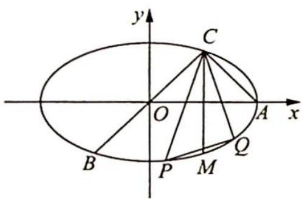
图1

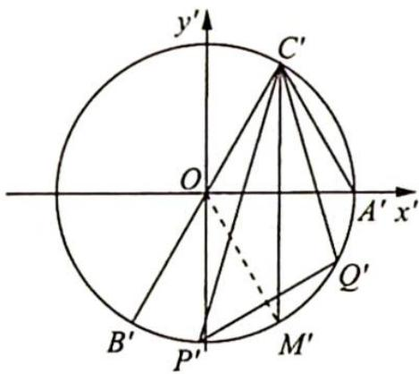
图2

7.【解析】(1)依题意可得 $e=\frac{c}{a}=\frac{1}{2}$ ，且 $\sqrt{(2+c)^{2}+1^{2}}=\sqrt{10}$ ，得 a=2, c=1, $b=\sqrt{3}$ ，故椭圆 C 的方程为 $\frac{x^{2}}{4}+\frac{y^{2}}{3}=1$ .

(2)在仿射变换 $\left\{ \begin{array}{l} x' = \frac{x}{2} \\ y' = \frac{y}{\sqrt{3}} \end{array} \right.$ 的作用下，椭圆 $\frac{x^2}{4} + \frac{y^2}{3} = 1$ 变成单位圆 $x'^2 + y'^2 = 1$ ，点 $P(2,1)$ 变成点 $P'\left(1, \frac{1}{\sqrt{3}}\right)$ ，如图1、图2所示。由仿射变换的性质可知线段 $A'B'$ 依然被直线 $OP'$ 平分。

设线段 $A^{\prime}B^{\prime}$ 与直线 $OP^{\prime}$ 相交于点 $Q^{\prime}$ ，则点 $Q^{\prime}$ 为 $A^{\prime}B^{\prime}$ 的中点，所以 $P^{\prime}Q^{\prime}\perp A^{\prime}B^{\prime}$ ，由 $k_{P^{\prime}Q^{\prime}}=\frac{1}{\sqrt{3}}$ 得 $k_{A^{\prime}B^{\prime}}=-\sqrt{3}$ ，可设直线 $A^{\prime}B^{\prime}$ 的方程为 $y^{\prime}=-\sqrt{3}x^{\prime}+m$ ，由点到直线的距离公式得 $|OQ^{\prime}|=\frac{|m|}{2}$ ， $|P^{\prime}Q^{\prime}|=\frac{-\sqrt{3}+m-\frac{1}{\sqrt{3}}}{2}=\frac{1}{2}\left|m-\frac{4\sqrt{3}}{3}\right|$ .

又直线 $A'B'$ 与圆 $x'^2 + y'^2 = 1$ 相交且不过原点，所以 $0 < |OQ'| = \frac{|m|}{2} < 1$ ，解得 $m \in (-2,0) \cup (0,2)$ .

根据圆中的垂径定理得 $|A'B'| = 2\sqrt{1 - |OQ'|^2} = \sqrt{4 - m^2}$ , 所以 $S_{\triangle A'B'P'} = \frac{1}{2}|A'B'||P'Q'| = \frac{1}{2} \cdot \sqrt{4 - m^2} \cdot \frac{1}{2} \left|m - \frac{4\sqrt{3}}{3}\right| = \frac{1}{4}\sqrt{(4 - m^2)(m - \frac{4\sqrt{3}}{3})^2}$ .

记 $u(m) = (4 - m^2)\left(m - \frac{4\sqrt{3}}{3}\right)^2$ ，则 $u'(m) = -4\left(m - \frac{4\sqrt{3}}{3}\right)\left(m - \frac{1 + \sqrt{7}}{\sqrt{3}}\right)\left(m - \frac{1 - \sqrt{7}}{\sqrt{3}}\right)$ ，讨论 $u(m)$ 在 $m \in (-2,0) \cup (0,2)$ 时的单调性可得：当且仅当 $m = \frac{1 - \sqrt{7}}{\sqrt{3}}$ 时， $S_{\triangle A'B'P'}$ 取得最大值， $S_{\triangle ABP}$ 也取得最大值，此时直线 $A'B'$ 的方程为 $y' = -\sqrt{3}x' + \frac{1 - \sqrt{7}}{\sqrt{3}}$ ，所以所求直线 $l$ 的方程为 $\frac{y}{\sqrt{3}} = -\sqrt{3} \cdot \frac{x}{2} + \frac{1 - \sqrt{7}}{\sqrt{3}}$ ，即 $y = -\frac{3}{2}x + 1 - \sqrt{7}$ .

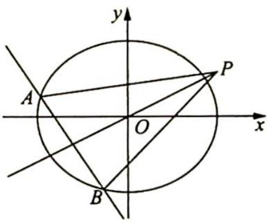
图1

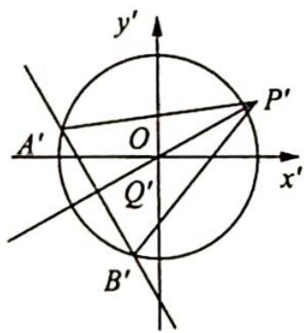
图2

## 训练 21

1.【解析】(1)易知抛物线 C 的方程为 $x^{2}=4cy$ ，由 $\frac{|0-c-2|}{\sqrt{1^{2}+1^{2}}}=\frac{3\sqrt{2}}{2}$ ，结合 c>0 可得 c=1，所以抛物线 C 的方程是 $x^{2}=4y$ .

(2)抛物线 C 的方程为 $x^{2}=4y$ ，即 $y=\frac{1}{4}x^{2}$ ，求导数得 $y'=\frac{1}{2}x$ .

设 $A(x_{1},y_{1}),B(x_{2},y_{2})$ （其中 $y_{1} = \frac{x_{1}^{2}}{4},y_{2} = \frac{x_{2}^{2}}{4})$ ，则切线 $PA,PB$ 的斜率分别为 $\frac{1}{2} x_1,\frac{1}{2} x_2$

所以切线 $PA$ 的方程为 $y - y_{1} = \frac{x_{1}}{2} (x - x_{1})$ ，即 $y = \frac{x_{1}}{2} x - \frac{x_{1}^{2}}{2} + y_{1}, x_{1}x - 2y - 2y_{1} = 0$ ，同理可得切线 $PB$ 的方程为 $x_{2}x - 2y - 2y_{2} = 0$ .

因为切线 $PA, PB$ 均过点 $P(x_0, y_0)$ , 所以 $x_1 x_0 - 2y_0 - 2y_1 = 0$ , $x_2 x_0 - 2y_0 - 2y_2 = 0$ , 则 $A(x_1, y_1)$ , $B(x_2, y_2)$ 两点均在直线 $x_0 x - 2y_0 - 2y = 0$ 上, 故直线 $AB$ 的方程为 $x_0 x - 2y - 2y_0 = 0$ .

(3)由抛物线的定义得 $|AF| = y_1 + 1$ , $|BF| = y_2 + 1$ , 所以 $|AF||BF| = (y_1 + 1)(y_2 + 1) = y_1y_2 + (y_1 + y_2) + 1$ .

当 $x_0 = 0$ 时， $y_0 = -2$ ，直线 $AB$ 的方程是 $y - 2 = 0$ ，联立方程组 $\left\{ \begin{array}{l} x^2 = 4y \\ y - 2 = 0 \end{array} \right.$ ，解得 $A(-2\sqrt{2}, 2), B(2\sqrt{2}, 2)$ 。所以 $|AF||BF| = y_1y_2 + (y_1 + y_2) + 1 = 2 \times 2 + (2 + 2) + 1 = 9$ 。

当 $x_0 \neq 0$ 时，联立方程组 $\left\{ \begin{array}{l} x^2 = 4y \\ x_0x - 2y - 2y_0 = 0 \end{array} \right.$ ，消去 $x$ 得 $y^2 + (2y_0 - x_0^2)y + y_0^2 = 0$ ，根据一元二次方程的根与系数的关系可得 $y_1 + y_2 = x_0^2 - 2y_0, y_1y_2 = y_0^2$ ，所以 $|AF||BF| = y_1y_2 + (y_1 + y_2) + 1 = y_0^2 + x_0^2 - 2y_0 + 1$ 。又因为点 $P(x_0, y_0)$ 在直线 $l: x - y - 2 = 0$ 上，所以 $x_0 = y_0 + 2, |AF||BF| = y_0^2 + (y_0 + 2)^2 - 2y_0 + 1 = 2(y_0 + \frac{1}{2})^2 + \frac{9}{2}$ ，当 $y_0 = -\frac{1}{2}$ 时， $|AF||BF|$ 取得最小值 $\frac{9}{2}$ 。

综上可得 $|AF||BF|$ 的最小值为 $\frac{9}{2}$ .

2.【解析】(1)设椭圆 E 的方程为 $\frac{x^{2}}{a^{2}} + \frac{y^{2}}{b^{2}} = 1 (a > b > 0)$ ，半焦距为 c.

由已知条件, 得 $F(0,1)$ , 所以 $\left\{\begin{aligned}b&=1\\ \frac{c}{a}&=\frac{\sqrt{3}}{2}\\ a^{2}&=b^{2}+c^{2}\end{aligned}\right.$ , 解得 $\left\{\begin{aligned}a&=2\\ b&=1\end{aligned}\right.$ .

故椭圆 E 的方程为 $\frac{x^{2}}{4} + y^{2} = 1$ .

(2)显然直线 $l$ 的斜率存在, 否则直线 $l$ 与抛物线 $C$ 只有一个交点, 不符合题意, 所以可设直线 $l$ 的方程为 $y = kx + 1$ , 且 $A(x_{1}, y_{1}), B(x_{2}, y_{2}) (x_{1} \neq x_{2})$ .

由 $\left\{\begin{aligned}y&=kx+1\\ x^{2}&=4y\end{aligned}\right.$ 消去 y 并整理得 $x^{2}-4kx-4=0$ ，所以 $x_{1}x_{2}=-4$ 。

因为抛物线 C 的方程为 $y=\frac{1}{4}x^{2}$ ，求导数得 $y'=\frac{1}{2}x$ ，所以过抛物线 C 上 A，B 两点的切线方程分别是 $y-y_{1}=\frac{1}{2}x_{1}(x-x_{1})$ ， $y-y_{2}=\frac{1}{2}x_{2}(x-x_{2})$ ，即 $y=\frac{1}{2}x_{1}x-\frac{1}{4}x_{1}^{2}$ ， $y=\frac{1}{2}x_{2}x-\frac{1}{4}x_{2}^{2}$ ，联立方程组 $\left\{\begin{aligned}&y=\frac{1}{2}x_{1}x-\frac{1}{4}x_{1}^{2}\\ &y=\frac{1}{2}x_{2}x-\frac{1}{4}x_{2}^{2}\end{aligned}\right.$ ，解得两条切线 $l_{1}, l_{2}$ 的交点 M 的坐标为 $\left(\frac{x_{1}+x_{2}}{2},\frac{x_{1}x_{2}}{4}\right)$ ，即 $M\left(\frac{x_{1}+x_{2}}{2},-1\right)$ .

所以 $\overrightarrow{FM} \cdot \overrightarrow{AB} = \left(\frac{x_1 + x_2}{2}, -2\right) \cdot (x_2 - x_1, y_2 - y_1) = \frac{1}{2}(x_2^2 - x_1^2) - 2\left(\frac{1}{4} x_2^2 - \frac{1}{4} x_1^2\right) = 0$ ，即 $AB \perp MF$ .

(3)假设存在点 $M'$ 满足题意, 由 (2) 知点 $M'$ 必在直线 $y = -1$ 上, 又直线 $y = -1$ 与椭圆 $E$ 有唯一交点, 所以点 $M'$ 的坐标为 $(0, -1)$ .

设过点 $M'$ 且与抛物线 C 相切的切线方程为 $y - y_{0} = \frac{1}{2} x_{0} (x - x_{0})$ ，其中 $(x_{0}, y_{0})$ 为切点，将点 $M'(0, -1)$ 的坐标代入得 $-1 - \frac{1}{4} x_{0}^{2} = \frac{1}{2} x_{0} (0 - x_{0})$ ，解得 $x_{0} = 2$ 或 $x_{0} = -2$ ，所以不妨取 $A'(-2, 1)$ ， $B'(2, 1)$ ，容易验证直线 $A'B'$ 过点 F.

综上所述, 椭圆 $E$ 上存在一点 $M'(0, -1)$ , 经过点 $M'$ 作抛物线 $C$ 的两条切线 $M'A', M'B'(A', B'$ 为切点), 能使直线 $A'B'$ 过点 $F$ , 此时两切线的方程分别为 $y = -x - 1$ 和 $y = x - 1$ , 抛物线 $C$ 与切线 $M'A', M'B'$ 所围成图形的面积 $S = 2\int_{0}^{2}\left[\frac{1}{4} x^{2} - (x - 1)\right]\mathrm{d}x = 2\left(\frac{1}{12} x^{3} - \frac{1}{2} x^{2} + x\right)\Bigg|_{0}^{2} = \frac{4}{3}$ .

【评注】本小题主要考查椭圆、抛物线、直线、定积分等知识,同时考查数形结合、化归与转化等数学思想以及推理论证能力和运算求解能力.

3.【解析】(1) 设 $A(x_{1}, y_{1}), B(x_{2}, y_{2})$ ，代入曲线 $C$ 的方程得 $y_{1} = \frac{x_{1}^{2}}{4}, y_{2} = \frac{x_{2}^{2}}{4}$ ，两式相减得 $y_{1} - y_{2} = \frac{1}{4}(x_{1} - x_{2})(x_{1} + x_{2})$ ，则 $k_{AB} = \frac{y_{1} - y_{2}}{x_{1} - x_{2}} = \frac{1}{4}(x_{1} + x_{2}) = 1$ ，即直线 $AB$ 的斜率为 1。

$$
y = \frac {x ^ {2}}{4}
$$

$$
y ^ {\prime} = \frac {x}{2}
$$

$$
y ^ {\prime} = \frac {x}{2} = 1
$$

平移坐标系, 将坐标原点平移到点 $M$ , 则任意一点的原坐标 $(x, y)$ 与新坐标 $(x', y')$ 的关系为 $\left\{ \begin{array}{l} x = x' + 2 \\ y = y' + 1 \end{array} \right.$ , 平移后直线 $AB$ 的斜率不变. 设直线 $AB$ 的方程为 $mx' - my' = 1$ , 平移后曲线 $C$ 的方程为 $\frac{(x' + 2)^2}{4} = y' + 1$ , 即 $x'^2 - 4y' + 4x' = 0$ .

将直线 $AB$ 的方程代入曲线 $C$ 的方程, 齐次化得 $x'^2 - 4(y' - x') (mx' - my') = 0$ , 化简得 $4my'^2 - 8my'x' + (4m + 1)x'^2 = 0$ , 该等式的左、右两边同时除以 $x'^2$ , 得 $4m \left(\frac{y'}{x'}\right)^2 - 8m \cdot \frac{y'}{x'} + 4m + 1 = 0$ , 方程的两根即为直线 $MA$ 与直线 $MB$ 的斜率, 所以由韦达定理得 $k_{MA} \cdot k_{MB} = \frac{y_1'}{x_1'} \cdot \frac{y_2'}{x_2'} = \frac{4m + 1}{4m} = -1$ , 解得 $m = -\frac{1}{8}$ , 所以直线 $AB: x' - y' = -8$ .

故直线 AB 在原坐标系中的方程为 $(x-2)-(y-1)=-8$ ，即 $y=x+7$ 。

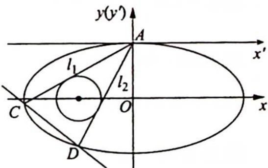

4.【解析】证明:如图所示,分别平移 $x$ 轴、 $y$ 轴,建立以 $A$ 为原点的直角坐标系 $x^{\prime} A y^{\prime}$ ,则任意一点的原坐标 $(x, y)$ 与新坐标 $(x^{\prime}, y^{\prime})$ 的关系为 $\left\{ \begin{array}{l} x = x^{\prime} + 0 \\ y = y^{\prime} + 1 \end{array} \right.$ . 在新坐标系 $x^{\prime} A y^{\prime}$ 下, $A(0,0)$ ,设 $C(x_1', y_1'), D(x_2', y_2')$ ,直线 $CD: mx^{\prime} + n y^{\prime} = 1$ ,椭圆的方程为 $\frac{x'^{2}}{4} + (y' + 1)^{2} = 1$ ,变形可得 $4y'^{2} + 8y' + x'^{2} = 0$ ,由 $\left\{ \begin{array}{l} 4y'^{2} + 8y' + x'^{2} = 0 \\ mx' + n y' = 1 \end{array} \right.$ ,联立可得 $4y'^{2} + 8y'(mx' + n y') + x'^{2} = 0$ ,展开得 $(4 + 8n)y'^{2} + 8mx'y' + x'^{2} = 0$ ,方程两边同除以 $x'^{2}$ ,得 $(4 + 8n)\left(\frac{y'}{x'}\right)^{2} + 8m\left(\frac{y'}{x'}\right) + 1 = 0$ (※). 因为直线 $l_{1}, l_{2}$ 的方程分别为 $y' = k_{1}'x'$ , $y' = k_{2}'x'$ ,且与动圆 $(x' + 1)^{2} + (y' + 1)^{2} = r^{2}$ 相切,所以由直线与圆相切的充要条件得 $\frac{|-k_{1}' + 1|}{\sqrt{1 + k_{1}'^{2}}} = \frac{|-k_{2}' + 1|}{\sqrt{1 + k_{2}'^{2}}} = r$ ,对 $\frac{|-k_{1}' + 1|}{\sqrt{1 + k_{1}'^{2}}} = \frac{|-k_{2}' + 1|}{\sqrt{1 + k_{2}'^{2}}}$ 两边平方整理,得 $(k_{1}' - k_{2}') (k_{1}'k_{2}' - 1) = 0$ ,显然 $k_{1}' \neq k_{2}'$ ,所以 $k_{1}'k_{2}' = 1$ . 由(※)及韦达定理得 $k_{1}'k_{2}' = \frac{y_{1}'}{x_{1}'} \cdot \frac{y_{2}'}{x_{2}'} = \frac{1}{4 + 8n} = 1$ ,解得 $n = -\frac{3}{8}$ ,所以直线 $CD$ 的方程为 $mx' - \frac{3}{8}y' = 1$ ,即

$$
m x ^ {\prime} - \frac {3}{8} \left(y ^ {\prime} + \frac {8}{3}\right) = 0.
$$

故直线 $CD$ 在直角坐标系 $x^{\prime}Ay^{\prime}$ 中过定点 $\left(0, -\frac{8}{3}\right)$ , 从而在原坐标系中过定点 $\left(0, -\frac{5}{3}\right)$ .

5.【解析】设 $P\left(\frac{y_{0}^{2}}{4},y_{0}\right)$ , $A\left(\frac{y_{1}^{2}}{4},y_{1}\right)$ , $P\left(\frac{y_{2}^{2}}{4},y_{2}\right)$ ，则 PA 的方程为 $y-y_{0}=\frac{y_{1}-y_{0}}{\frac{y_{1}^{2}}{4}-\frac{y_{0}^{2}}{4}}\left(x-\frac{y_{0}^{2}}{4}\right)$ ，即 $4x-(y_{1}+y_{0})y+y_{1}y_{0}=0$ .

由 $PA$ 与圆 $C_2$ 相切，得 $\frac{|12 + y_1y_0|}{\sqrt{4^2 + (y_1 + y_0)^2}} = r$ ，化简得 $(r^2 - y_0^2)y_1^2 + 2(r^2 - 12)y_1y_0 + r^2y_0^2 + 16r^2 - 144 = 0,$

即 $y_{1}$ 是方程 $(r^2 - y_0^2)y^2 + 2(r^2 - 12) \cdot y_0y + r^2y_0^2 + 16r^2 - 144 = 0$ 的解.

同理得 $y_{2}$ 也是该方程的解，所以 $y_{1} + y_{2} = -\frac{2(r^{2} - 12)y_{0}}{r^{2} - y_{0}^{2}}, y_{1}y_{2} = \frac{r^{2}y_{0}^{2} + 16r^{2} - 144}{r^{2} - y_{0}^{2}}$ ①，类似的方法得到AB方程为 $4x - (y_{1} + y_{2})y + y_{1}y_{2} = 0$ .

圆 $C_2$ 与 $AB$ 相切，即 $\frac{|12 + y_1y_2|}{\sqrt{4^2 + (y_1 + y_2)^2}} = r$ ，代入①得 $r = 2$

(注:为了计算简便,可只找到同类项的系数(例如找 $y_{0}^{4}$ 的系数),比较系数求出 r.)

6.【解析】(1)根据题意可得因为直线不平行于坐标轴,则斜率 $k$ 必然存在,故设直线 $l$ 为 $y = kx + b (k \neq 0, b \neq 0), A(x_1, y_1), B(x_2, y_2), M(x_M, y_M)$ .

将 $y = kx + b$ 代入 $C:9x^{2} + y^{2} = m^{2}$ ，得 $(k^2 +9)x^2 +2kbx + b^2 -m^2 = 0$ ，故 $x_{M} = \frac{x_{1} + x_{2}}{2} = -\frac{kb}{k^{2} + 9},y_{M} =$ $kx_{M} + b = \frac{9b}{k^{2} + 9}$ ，于是直线OM的斜率 $k_{OM} = \frac{y_M}{x_M} = -\frac{9}{k}$ 即 $k_{OM}\cdot k = -9.$

故直线 OM 的斜率与 l 的斜率的乘积为定值.

(2)不妨设四边形 OAPB 能为平行四边形.

因为直线 l 过点 $\left(\frac{m}{3}, m\right)$ ，所以 l 不过原点且与 C 有两个交点的充要条件是 k > 0 且 $k \neq 3$ .

由(1)得 $OM$ 的方程为 $y = -\frac{9}{k} x$ . 设点 $P$ 的横坐标为 $x_{P}$ . 由 $\left\{ \begin{array}{l} y = -\frac{9}{k} x \\ 9x^{2} + y^{2} = m^{2} \end{array} \right.$ , 得 $x_{P}^{2} = \frac{k^{2}m^{2}}{9k^{2} + 81}$ , 即 $x_{P} = \frac{\pm km}{3\sqrt{k^{2} + 9}}$ .

将点 $\left(\frac{m}{3},m\right)$ 的坐标代入直线l的方程得 $b=\frac{m(3-k)}{3}$ ，因此 $x_{M}=\frac{k(k-3)m}{3(k^{2}+9)}$ .

四边形 OAPB 为平行四边形, 当且仅当线段 AB 与线段 OP 互相平分, 即 $x_{P}=2x_{M}$ , 则 $\frac{\pm km}{3\sqrt{k^{2}+9}}=2\cdot\frac{k(k-3)m}{3(k^{2}+9)}$ , 解得 $k_{1}=4-\sqrt{7}, k_{2}=4+\sqrt{7}$ .

因为 $k_{i} > 0, k_{i} \neq 3, i = 1,2$ ，所以当 $l$ 的斜率为 $4 - \sqrt{7}$ 或 $4 + \sqrt{7}$ 时，四边形 OAPB 为平行四边形.

7.【解析】(1)由题意得椭圆 $E: \frac{x^2}{a^2} + \frac{y^2}{b^2} = 1 (a > b > 0)$ 过点 $M(2, \sqrt{2}), N(\sqrt{6}, 1)$ 两点，所以 $\left\{ \begin{array}{l} \frac{4}{a^2} + \frac{2}{b^2} = 1 \\ \frac{6}{a^2} + \frac{1}{b^2} = 1 \end{array} \right.$ ，解得 $a^2 = 8, b^2 = 4$ 。

故椭圆 $E$ 的方程为 $\frac{x^2}{8} + \frac{y^2}{4} = 1$ 。

(2)由(1)得椭圆 $E$ 的方程为 $\frac{x^2}{8} + \frac{y^2}{4} = 1$ ，则 $a = 2\sqrt{2}, b = 2$ ，假设存在符合题意的圆，且圆的半径为 $r$ ，则 $0 < r < 2$ ，圆的方程为 $x^2 + y^2 = r^2$ 。

①当切点为 $(r, 0)$ 时，直线 $AB$ 的方程为 $x = r$ 。

由于 $\overrightarrow{OA} \perp \overrightarrow{OB}$ ，而 $|\overrightarrow{OA}| = |\overrightarrow{OB}|$ ，所以三角形 $OAB$ 是等腰直角三角形。

不妨设 $A(r, r)$ ，代入 $\frac{x^2}{8} + \frac{y^2}{4} = 1$ ，得 $\frac{r^2}{8} + \frac{r^2}{4} = 1$ ，可得 $r^2 = \frac{8}{3}, r = \frac{2\sqrt{6}}{3}, |AB| = \frac{2\sqrt{6}}{3} \times 2 = \frac{4\sqrt{6}}{3}$ 。

当切点为 $(-r, 0), (0, r), (0, -r)$ 时，同理可求得 $r^2 = \frac{8}{3}, r = \frac{2\sqrt{6}}{3}, |AB| = \frac{2\sqrt{6}}{3} \times 2 = \frac{4\sqrt{6}}{3}$ 。

故猜想所求圆的方程为 $x^2 + y^2 = \frac{8}{3}$ 。

②当直线 $AB$ 的斜率存在时，设直线 $AB: y = kx + m$ ，则 $\frac{|m|}{\sqrt{1 + k^2}} = \frac{2\sqrt{6}}{3}$ ，即 $3m^2 - 8k^2 - 8 = 0$ 。

设 $A(x_1, y_1), B(x_2, y_2)$ ，由 $\left\{ \begin{array}{l} y = kx + m \\ x^2 + 2y^2 = 8 \end{array} \right.$ ，可得 $(1 + 2k^2) \cdot x^2 + 4kmx + 2m^2 - 8 = 0$ ，则 $\Delta = 64k^2 - 8m^2 + 32 = \frac{128k^2 + 32}{3} > 0, x_1 + x_2 = -\frac{4km}{1 + 2k^2}, x_1x_2 = \frac{2m^2 - 8}{1 + 2k^2}, \overrightarrow{OA} \cdot \overrightarrow{OB} = x_1x_2 + y_1y_2 = (1 + k^2)x_1x_2 + km(x_1 + x_2) + m^2 = (1 + k^2)\frac{2m^2 - 8}{1 + 2k^2} - \frac{4k^2m^2}{1 + 2k^2} + m^2 = \frac{3m^2 - 8k^2 - 8}{1 + 2k^2} = 0.$ 故 $OA \perp OB$ 。

此时 $|AB| = \sqrt{1 + k^2} \cdot \frac{\sqrt{\frac{128k^2 + 32}{3}}}{1 + 2k^2} = \frac{4\sqrt{6}}{3} \cdot \frac{\sqrt{(1 + k^2)(4k^2 + 1)}}{1 + 2k^2}$ 。

令 $t = 1 + 2k^2 > 1$ ，则 $|AB| = \frac{4\sqrt{6}}{3} \cdot \sqrt{\frac{2t^2 + t - 1}{2t^2}} = \frac{4\sqrt{6}}{3} \cdot \sqrt{-\frac{1}{2}\left(\frac{1}{t} - \frac{1}{2}\right)^2 + \frac{9}{8}}$ ，因为 $\frac{1}{t} \in (0, 1)$ ，则 $1 < \sqrt{-\frac{1}{2}\left(\frac{1}{t} - \frac{1}{2}\right)^2 + \frac{9}{8}} \leqslant \frac{3\sqrt{2}}{4}$ ，所以 $\frac{4\sqrt{6}}{3} < |AB| \leqslant 2\sqrt{3}$ 。

由猜测过程可得当 $AB$ 的斜率不存在时也满足 $OA \perp OB$ 且 $|AB| = \frac{4\sqrt{6}}{3}$ 。

综上所述， $|AB|$ 的取值范围是 $\left[\frac{4\sqrt{6}}{3}, 2\sqrt{3}\right]$ 。

8.【解析】(1)依题意得 $\left\{\begin{aligned}\frac{c}{a}&=\frac{1}{2}\\ \frac{1}{a^{2}}+\frac{9}{4b^{2}}&=1\end{aligned}\right.$ ，解得 $a^{2}=4,b^{2}=3$ ，故椭圆E的方程为 $\frac{x^{2}}{4}+\frac{y^{2}}{3}=1$ .

(2)如图所示, 设 $B(x_{1}, y_{1}), C(x_{2}, y_{2})$ , 因为点 $B$ 为椭圆 $E$ 上异于左、右顶点的动点, 则直线 $BC$ 不与 $x$ 轴重合, 则可设 $BC$ 为 $x = my + t$ , 与椭圆方程联立得 $(3m^{2} + 4)y^{2} + 6mty + 3t^{2} - 12 = 0$ , 则 $\Delta = 36m^{2}t^{2} - 12(3m^{2} + 4)(t^{2} - 4) > 0$ , 可得 $t^{2} < 3m^{2} + 4$ , 由韦达定理可得 $y_{1} + y_{2} = -\frac{6mt}{3m^{2} + 4}, y_{1}y_{2} = \frac{3t^{2} - 12}{3m^{2} + 4}$ . 直线 $BA$ 的方程为 $y = \frac{y_{1}}{x_{1} - 2}(x - 2)$ , 令 $x = t$ 得点 $M$ 的纵坐标 $y_{M} = \frac{y_{1}(t - 2)}{x_{1} - 2}$ .

同理可得, 点 N 纵坐标 $y_{N}=\frac{y_{2}(t-2)}{x_{2}-2}$ .

当 $O, A, M, N$ 四点共圆时，由割线定理可得 $\left|PA\right|\left|PO\right| = \left|PM\right|\left|PN\right|$ ，即 $t(t - 2) = \left|y_{M}y_{N}\right|$ .

$$
\begin{array}{r l} y _ {M} y _ {N} & = \frac {y _ {1} y _ {2} (t - 2) ^ {2}}{(x _ {1} - 2) (x _ {2} - 2)} = \frac {y _ {1} y _ {2} (t - 2) ^ {2}}{(m y _ {1} + t - 2) (m y _ {2} + t - 2)} \\ & = \frac {y _ {1} y _ {2} (t - 2) ^ {2}}{m ^ {2} y _ {1} y _ {2} + m (t - 2) (y _ {1} + y _ {2}) + (t - 2) ^ {2}} \\ & = \frac {3 (t ^ {2} - 4) (t - 2) ^ {2}}{3 m ^ {2} (t ^ {2} - 4) - 6 m ^ {2} t (t - 2) + (3 m ^ {2} + 4) (t - 2) ^ {2}} \\ & = \frac {3 (t + 2) (t - 2) ^ {2}}{3 m ^ {2} (t + 2) - 6 m ^ {2} t + (3 m ^ {2} + 4) (t - 2)} \\ & = \frac {3 (t + 2) (t - 2) ^ {2}}{3 m ^ {2} t + 6 m ^ {2} - 6 m ^ {2} t + 3 m ^ {2} t - 6 m ^ {2} + 4 t - 8} \\ & = \frac {3 (t + 2) (t - 2) ^ {2}}{4 (t - 2)} = \frac {3}{4} (t + 2) (t - 2). \end{array}
$$

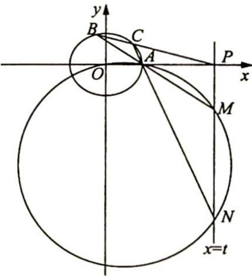

$t > 2$ ，故 $t(t - 2) = \frac{3}{4} (t + 2)(t - 2)$ ，解得 $t = 6$

## 训练 22

1.【解析】设 $P(x_{1},y_{1})$ , $Q(x_{0},y_{0})$ ，则直线 MN: $\left\{\begin{aligned}\frac{x_{1}x}{4}+\frac{y_{1}y}{3}&=1\\ x_{0}x+y_{0}y&=12\end{aligned}\right.\Rightarrow\left\{\begin{aligned}\frac{x_{1}x}{4}+\frac{y_{1}y}{3}&=1\\ \frac{x_{0}x}{12}+\frac{y_{0}y}{12}&=1\end{aligned}\right.$ ，即 $\left\{\begin{aligned}x_{0}&=3x_{1}\\ y_{0}&=4y_{1}\end{aligned}\right.$ ，又 P 在椭圆上，则 $\frac{x_{1}^{2}}{4}+\frac{y_{1}^{2}}{3}=1\Rightarrow\frac{x_{0}^{2}}{36}+\frac{y_{0}^{2}}{48}=1$ 。B 正确。
设 OQ: $y_{0}x - x_{0}y = 0$ , PK ⊥ OQ 于 K, 则 |PK| = $\frac{|y_{0}x_{1}-x_{0}y_{1}|}{\sqrt{x_{0}^{2}+y_{0}^{2}}}$ . 又 |OQ| = $\sqrt{x_{0}^{2}+y_{0}^{2}}$ , 则 $S_{\triangle OPQ} = \frac{1}{2}|OQ||PK|=\frac{1}{2}|y_{0}x_{1}-x_{0}y_{1}|$ , 即 $S=\frac{1}{2}|4x_{1}y_{1}-3x_{1}y_{1}|=\frac{1}{2}|x_{1}y_{1}|=\frac{1}{2}\sqrt{x_{1}^{2}y_{1}^{2}}=\frac{1}{2}\sqrt{12\cdot\frac{x_{1}^{2}}{4}\cdot\frac{y_{1}^{2}}{3}}\leqslant$

$\frac{1}{2}\sqrt{12 \times \frac{1}{4} \left( \frac{x_1^2}{4} + \frac{y_1^2}{3} \right)^2} = \frac{\sqrt{3}}{2}$ . C 正确. 故选 BC.

2.【解析】运用定比点差法证明.

令 $\lambda = \frac{AP}{PB} = \frac{MA}{MB}$ , 得 $\overrightarrow{PA} = \lambda \overrightarrow{PB}, \overrightarrow{MA} = -\lambda \overrightarrow{MB}$ , 设 $A(x_1, y_1), B(x_2, y_2), P(x_0, y_0), M(x, y)$ , 所以 $\left\{ \begin{array}{l} x_1 - x_0 = \lambda (x_2 - x_0) \\ y_1 - y_0 = \lambda (y_2 - y_0) \end{array} \right.$ , 即 $\left\{ \begin{array}{l} x_0 = \frac{x_1 - \lambda x_2}{1 - \lambda} \\ y_0 = \frac{y_1 - \lambda y_2}{1 - \lambda} \end{array} \right.$ , 即 $\left\{ \begin{array}{l} x_1 - x = -\lambda (x_2 - x) \\ y_1 - y = -\lambda (y_2 - y) \end{array} \right.$ , 即 $\left\{ \begin{array}{l} x = \frac{x_1 + \lambda x_2}{1 + \lambda} \\ y = \frac{y_1 + \lambda y_2}{1 + \lambda} \end{array} \right.$ .
将 $A, B$ 两点坐标代入椭圆方程 $\frac{x^2}{a^2} + \frac{y^2}{b^2} = 1$ 中, 得 $\left\{ \begin{array}{l} \frac{x_1^2}{a^2} + \frac{y_1^2}{b^2} = 1 \\ \frac{x_2^2}{a^2} + \frac{y_2^2}{b^2} = 1 \end{array} \right.$ , 即 $\left\{ \begin{array}{l} \frac{x_1^2}{a^2} + \frac{y_1^2}{b^2} = 1 \\ \frac{\lambda^2 x_2^2}{a^2} + \frac{\lambda^2 y_2^2}{b^2} = \lambda^2 \end{array} \right.$ .
两式作差得 $\frac{x_1^2 - \lambda^2 x_2^2}{a^2} + \frac{y_1^2 - \lambda^2 y_2^2}{b^2} = 1 - \lambda^2$ , 因此 $\frac{(x_1 + \lambda x_2)(x_1 - \lambda x_2)}{a^2(1 + \lambda)(1 - \lambda)} + \frac{(y_1 + \lambda y_2)(y_1 - \lambda y_2)}{b^2(1 + \lambda)(1 - \lambda)} = 1$ , 即 $\frac{x_0 x}{a^2} + \frac{y_0 y}{b^2} = 1$ .
故点 $M$ 在直线 $\frac{x_0 x}{a^2} + \frac{y_0 y}{b^2} = 1$ 上.

3.【解析】(1) $a = 2, e = \frac{1}{2}$ , 所以 $c = 1, b = \sqrt{3}$ , 则椭圆 $C: \frac{x^2}{4} + \frac{y^2}{3} = 1$ .

$$
l: x = t y + n
$$

$$
\left\{ \begin{array}{l} x = t y + n \\ \frac {x ^ {2}}{4} + \frac {y ^ {2}}{3} = 1 \end{array} \right.
$$

$$
3 (t y + n) ^ {2} + 4 y ^ {2} = 1 2
$$

$$
(3 t ^ {2} + 4) y ^ {2} + 6 n t y + 3 n ^ {2} - 1 2 = 0
$$

$\Delta = 36n^{2}t^{2} - 4(3t^{2} + 4)(3n^{2} - 12) = 12(12t^{2} + 16 - 4n^{2}) = 48(3t^{2} + 4 - n^{2}) = 0$ ，所以 $n^2 = 3t^2 +4,y_E =$ $\frac{-3nt}{3t^2 + 4} = -\frac{3t}{n}$ 则 $x_{E} = ty_{E} + n = n - \frac{3t^{2}}{n} = \frac{n^{2} - 3t^{2}}{n} = \frac{4}{n}.$

所以 $\frac{|TA|}{|TB|} = \frac{\left|\frac{4}{n} + 2\right|}{\left|\frac{4}{n} - 2\right|} = \frac{|4 + 2n|}{|4 - 2n|} = \frac{|2 + n|}{|2 - n|}$ , 又 $\frac{|GA|}{|GB|} = \frac{|n + 2|}{|n - 2|} = \frac{|TA|}{|TB|}$ .

【评注】由极点极线理论， $G(n,0)$ 关于椭圆： $\frac{x^{2}}{4}+\frac{y^{2}}{3}=1$ 对应的极线方程为 $\frac{nx}{4}+0=1$ ，所以 $x=\frac{4}{n}$ 。即直线 ET 的方程为 $x=\frac{4}{n}$ ，G，T 调和分割 AB，所以 $\left|\frac{GA}{GB}\right|=\left|\frac{TA}{TB}\right|$ 。

4.【解析】(1)由题意设 $M(x,y)$ ，则 $\frac{y}{x+2} \cdot \frac{y}{x-2} = -\frac{3}{4}, x \neq \pm 2$ ，化简得 $3x^{2} + 4y^{2} = 12$ 。即曲线 E 的方程为 $\frac{x^{2}}{4} + \frac{y^{2}}{3} = 1 (x \neq \pm 2)$ 。

(2) 设 $l: x = ty + 1$ , 代入椭圆 $E$ 的方程, 得 $(3t^2 + 4)y^2 + 6ty - 9 = 0, \Delta > 0$ , 如图所示, 令 $P(x_1, y_1)$ .

$Q(x_{2},y_{2})$ ，则 $y_{1} + y_{2} = \frac{-6t}{3t^{2} + 4},y_{1}y_{2} = \frac{-9}{3t^{2} + 4},ty_{1}y_{2} = \frac{3}{2} (y_{1} + y_{2}).$

又 $A_{1}(-2,0), A_{2}(2,0)$ .

$$
① \frac {k _ {1}}{k _ {2}} = \frac {y _ {2}}{x _ {2} + 2} \cdot \frac {x _ {1} - 2}{y _ {1}} = \frac {y _ {2} (t y _ {1} - 1)}{y _ {1} (t y _ {2} + 3)} = \frac {t y _ {1} y _ {2} - y _ {2}}{t y _ {1} y _ {2} + 3 y _ {1}} = \frac {\frac {3}{2} (y _ {1} + y _ {2}) - y _ {2}}{\frac {3}{2} (y _ {1} + y _ {2}) + 3 y _ {1}} = \frac {1}{3}.
$$

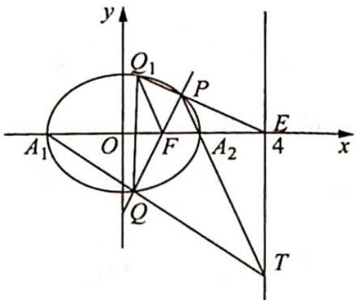

②由①知 $Q_{1}(x_{2},-y_{2})$ ，所以 $S_{\triangle PFQ_{1}}=S_{\triangle PQQ_{1}}-S_{\triangle FQQ_{1}}=\frac{1}{2}|QQ_{1}||x_{1}-1|=|y_{2}||x_{1}-1|=|ty_{1}y_{2}|=$ $\frac{|9t|}{3t^{2}+4}=\frac{9}{3|t|+\frac{4}{|t|}}.$

$3|t| + \frac{4}{|t|}\geqslant 4\sqrt{3}$ ，所以 $S_{\triangle PFQ_1}\leqslant \frac{9}{4\sqrt{3}} = \frac{3\sqrt{3}}{4}.$ 当且仅当 $t^2 = \frac{4}{3}$ 时，等号成立.

所以 $\triangle PFQ_{1}$ 面积最大值为 $\frac{3\sqrt{3}}{4}$ .

【评注】由极点极线理论可知,极点 $F(1,0)$ 关于椭圆 $\frac{x^{2}}{4} + \frac{y^{2}}{3} = 1$ 对应的极线为 x = 4.

①所以 $A_{1}Q$ 与 $A_{2}P$ 的交点 T 在直线 x=4 上，设 $T(4,n)$ ，则 $\frac{k_{1}}{k_{2}}=\frac{n}{6}\cdot\frac{2}{n}=\frac{1}{3}$ .

②设 $E(4,0)$ ，则 E, F 为调和共轭点，再由对称性（等角性质）知， $Q_{1}P$ 恒过定点 $E(4,0)$ ， $S_{\triangle PFQ_{1}} = S_{\triangle Q_{1}EF} - S_{\triangle PEF} = \frac{1}{2}|EF| |y_{1} + y_{2}| = \frac{|9t|}{3t^{2} + 4} \leqslant \frac{3\sqrt{3}}{4}$ .
