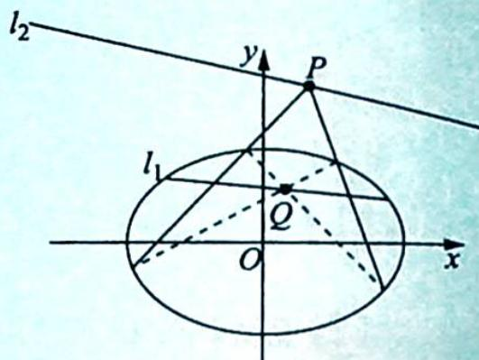

## 4. 配极性质

(1)如图所示,点 P 关于圆锥曲线 $\Gamma$ 的极线 $l_{1}$ 经过点 $Q \Leftrightarrow$ 点 Q 关于圆锥曲线 $\Gamma$ 的极线 $l_{2}$ 经过点 P;

(2) 直线 $l_{1}$ 关于圆锥曲线 $\Gamma$ 的极点 $P$ 在直线 $l_{2}$ 上 $\Leftrightarrow$ 直线 $l_{2}$ 关于圆锥曲线 $\Gamma$ 的极点 $Q$ 在直线 $l_{1}$ 上. 也就是说, 点 $P$ 和点 $Q$ 是圆锥曲线 $\Gamma$ 的一组调和共轭点.
