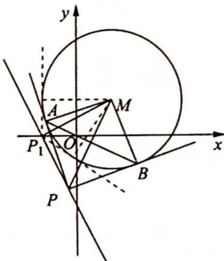
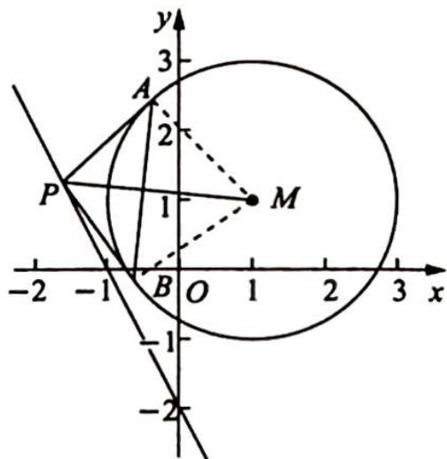
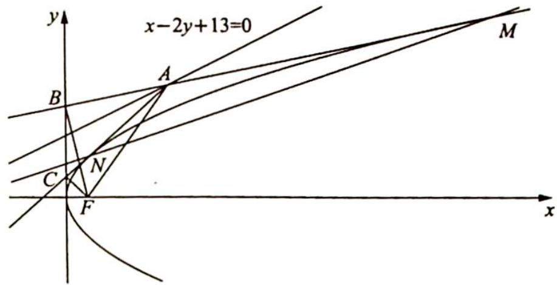

## 二、极点极线的定义

已知圆锥曲线 $\Gamma: Ax^2 + Cy^2 + 2Dx + 2Ey + F = 0$ ，则称点 $P(x_0, y_0)$ 和直线 $l: Ax_0x + Cy_0y + D(x + x_0) + E(y + y_0) + F = 0$ 是圆锥曲线 $\Gamma$ 的一对极点和极线。也称点 $P$ 为直线 $l$ 关于圆锥曲线 $\Gamma$ 的极点，直线 $l$ 为点 $P$ 关于圆锥曲线 $\Gamma$ 的极线。

事实上, 在圆锥曲线方程中, 以 $x_0 x$ 替换 $x^2$ , 以 $\frac{x_0 + x}{2}$ 替换 $x$ (另一变量 $y$ 也是如此) 即可得到点 $P(x_0, y_0)$ 对应的极线方程.

注:极点和极线一定是成对出现的.

(1)对于椭圆 $\frac{x^{2}}{a^{2}}+\frac{y^{2}}{b^{2}}=1$ ，与点 $P(x_{0},y_{0})$ 对应的极线方程为 $\frac{x_{0}x}{a^{2}}+\frac{y_{0}y}{b^{2}}=1$ ;

(2)对于双曲线 $\frac{x^{2}}{a^{2}}-\frac{y^{2}}{b^{2}}=1$ ，与点 $P(x_{0},y_{0})$ 对应的极线方程为 $\frac{x_{0}x}{a^{2}}-\frac{y_{0}y}{b^{2}}=1$ ;

(3)对于抛物线 $y^{2}=2px$ ，与点 $P(x_{0},y_{0})$ 对应的极线方程为 $y_{0}y=p(x_{0}+x)$ .

例 22.1 已知圆 $M: x^{2} + y^{2} - 2x - 2y - 2 = 0$ ，且直线 $l: 2x + y + 2 = 0$ ，P 为 l 上的动点，过点 P 作圆 M 的切线 PA, PB，切点为 A, B，当 $|PM||AB|$ 最小时，直线 AB 的方程为（）.
A. $2x - y - 1 = 0$ B. $2x + y - 1 = 0$ C. $2x - y + 1 = 0$ D. $2x + y + 1 = 0$

分析 考查圆及切线的相关性质,首先找到使 $|PM||AB|$ 最小时点P的坐标,然后利用切点弦可得AB的方程.

解析 ▶ 解法一(代数法): 依题意得圆 M 的方程为 $(x-1)^{2}+(y-1)^{2}=4$ , 由图可知, 设 $\angle APM=\alpha$ , 所以 $|PM|=\frac{|AM|}{\sin\alpha}=\frac{2}{\sin\alpha}, |AB|=2|AM|\sin\angle AMP=2|AM|\cos\angle APM=4\cos\alpha$ , 则 $|PM||AB|=\frac{8}{\tan\alpha}$ .

因为 $\sin \alpha = \frac{|AM|}{|PM|} = \frac{2}{|PM|}\in \left(0,\frac{2\sqrt{5}}{5}\right],\tan \alpha \in (0,2]$ ，当 $\tan \alpha = 2$ 时，

即过 M 作直线 l 的垂线, 点 P 取垂足 $P_{1}$ 时, $|PM||AB|$ 达到最小.

联立直线 $MP_{1}$ 与直线 $l$ ，得 $\left\{ \begin{array}{l}y - 1 = \frac{1}{2} (x - 1)\\ y = -2x - 2 \end{array} \right.\Rightarrow \left\{ \begin{array}{l}y = \frac{1}{2} x + \frac{1}{2}\\ y = -2x - 2 \end{array} \right.\Rightarrow \left\{ \begin{array}{l}x = -1\\ y = 0 \end{array} \right.$

AB 方程即为过点 $P_{1}$ 的两条切线的切点弦, 其方程为 $(x-1)\cdot(-1-1)+(y-1)\cdot(0-1)=4\Rightarrow2-2x+1-y=4\Rightarrow2x+y+1=0$ . 故选 D.

解法二(几何法): 圆的方程可化为 $(x-1)^{2}+(y-1)^{2}=4$ , 点 M 到直线 l 的距离 d= $\frac{|2\times1+1+2|}{\sqrt{2^{2}+1^{2}}}=\sqrt{5}>2$ , 所以直线 l 与圆相离.

根据圆的知识可知, $A, P, B, M$ 四点共圆, 且 $AB \perp MP$ , 如图所示, 所以 $|PM||AB| = 4S_{\triangle PAM} = 4 \times \frac{1}{2} \times |PA| \times |AM| = 4|PA|$ , 而 $|PA| = \sqrt{|MP|^2 - 4}$ , 当直线 $MP \perp l$ 时, $|MP|_{\min} = \sqrt{5}$ , $|PA|_{\min} = 1$ , 此时 $|PM||AB|$ 最小.

所以 $MP:y - 1 = \frac{1}{2} (x - 1)$ ，即 $y = \frac{1}{2} x + \frac{1}{2}$ ，由 $\left\{ \begin{array}{l} y = \frac{1}{2} x + \frac{1}{2} \\ 2x + y + 2 = 0 \end{array} \right.$ 解得

$\left\{ \begin{array} { l } { x = - 1 } \\ { y = 0 } \end{array} \right.$ ，即 $P(-1,0)$ ，所以以 $MP$ 为直径的圆的方程为 $(x - 1)(x + 1) + y(y - 1) = 0$ ，即 $x^{2}+$ $y^{2} - y - 1 = 0$

两圆的方程相减可得 $2x + y + 1 = 0$ ，即为直线 $AB$ 的方程。故选 D。

变式 1: 有如下结论:“圆 $x^{2}+y^{2}=r^{2}$ 上一点 $P(x_{0},y_{0})$ 处的切线方程为 $x_{0}x+y_{0}y=r^{2}$ .”类比也有结论:“椭圆 $\frac{x^{2}}{a^{2}}+\frac{y^{2}}{b^{2}}=1(a>b>0)$ 上一点 $P(x_{0},y_{0})$ 处的切线方程为 $\frac{x_{0}x}{a^{2}}+\frac{y_{0}y}{b^{2}}=1$ .”过椭圆 $C:\frac{x^{2}}{4}+y^{2}=1$ 的右准线 $l$ 上任意一点 $M$ 引椭圆 $C$ 的两条切线,切点为 $A,B$ .

(1)求证:直线AB恒过一定点;

(2)当点 M 的纵坐标为 1 时, 求 $\triangle ABM$ 的面积.

解析 ▶ (1) 设 $M\left(\frac{4\sqrt{3}}{3}, t\right) (t \in \mathbb{R}), A(x_1, y_1), B(x_2, y_2)$ , 则 $MA$ 的方程为 $\frac{x_1x}{4} + y_1y = 1$ . 因为点 $M$ 在 $MA$ 上, 所以 $\frac{\sqrt{3}}{3} x_1 + ty_1 = 1$ ①, 同理可得 $\frac{\sqrt{3}}{3} x_2 + ty_2 = 1$ ②. 由①②式知 $AB$ 的方程为 $\frac{\sqrt{3}}{3} x + ty = 1$ , 即 $x = \sqrt{3}(1 - ty)$ ③. 易知右焦点 $F(\sqrt{3}, 0)$ 满足③式, 故 $AB$ 恒过椭圆 $C$ 的右焦点 $F(\sqrt{3}, 0)$ .

(2)把直线 $AB$ 的方程 $x = \sqrt{3} (1 - y)$ 代入 $\frac{x^2}{4} + y^2 = 1$ ，化简得 $7y^2 - 6y - 1 = 0$ ，所以 $|AB| = \sqrt{1 + 3} \cdot \frac{\sqrt{36 + 28}}{7} = \frac{16}{7}$ ，又 $M$ 到 $AB$ 的距离 $d = \frac{\left|\frac{4\sqrt{3}}{3}\right|}{\sqrt{1 + 3}} = \frac{2\sqrt{3}}{3}$ ，故 $\triangle ABM$ 的面积 $S = \frac{1}{2} \cdot |AB| d = \frac{16\sqrt{3}}{21}$ .

变式(2) 如图所示, 过直线 $x - 2y + 13 = 0$ 上的动点 $A$ ( $A$ 不在 $y$ 轴上) 作抛物线 $y^{2} = 8x$ 的两条切线, $M, N$ 为切点, 直线 $A M, A N$ 分别与 $y$ 轴交于点 $B, C$ .

(1) 求证: 直线 MN 恒过一定点;

(2)求证: $\triangle ABC$ 的外接圆恒过一定点, 并求该圆半径的最小值.

解析 (1) 设 $A(x_0, y_0), M(x_1, y_1), N(x_2, y_2)$ , 则抛物线的过点 $M$ 的切线方程为 $AM: y_1y = 4(x + x_1)$ .

因为切线 $AM$ 过点 $A(x_0, y_0)$ , 所以 $y_1y_0 = 4(x_0 + x_1)$ , 此式说明直线 $y_0y = 4(x + x_0)$ 恒过点 $M$ , 同理可证直线 $y_0y = 4(x + x_0)$ 恒过点 $N$ , 所以直线 $y_0y = 4(x + x_0)$ 恒过 $M, N$ 两点, 直线 $MN$ 的方程为 $y_0y = 4(x + x_0)$ .

又因为 $x_0 = 2y_0 - 13$ ，代入直线 $MN$ 的方程得 $y_0(y - 8) = 4(x - 13)$ ，故直线 $MN$ 恒过定点(13,8).

(2) 易求得直线 $AM: y_1y = 4(x + x_1)$ 与 $y$ 轴的交点坐标为 $B\left(0, \frac{4x_1}{y_1}\right)$ , 抛物线 $y^2 = 8x$ 的焦点为 $F(2,0)$ , 所以 $k_{BF} = \frac{\frac{4x_1}{y_1} - 0}{0 - 2} = -\frac{2x_1}{y_1}$ .

又因为 $k_{BA} \cdot k_{BF} = \frac{4}{y_1} \cdot \left(-\frac{2x_1}{y_1}\right) = -\frac{8x_1}{y_1^2} = -1$ ，所以 $BA \perp BF$ .

同理可得 $CA \perp CF$ , 所以 $A, B, C, F$ 四点在以 $AF$ 为直径的圆上, 则 $\triangle ABC$ 的外接圆恒过定点 $F(2,0)$ .

当线段 $AF$ 与直线 $x - 2y + 13 = 0$ 垂直时, 圆的直径 $|AF|$ 取得最小值, 易求得此时直线 $AF$ 的方程为 $2x + y - 4 = 0$ .

联立方程组 $\left\{\begin{aligned}&2x+y-4=0\\ &x-2y+13=0\end{aligned}\right.$ ，解得 $A(-1,6)$ ，所以 $|AF|=3\sqrt{5}$ ，故△ABC的外接圆的半径的最小值为 $\frac{3\sqrt{5}}{2}$ .

变式(3) 已知 $B, C$ 是抛物线 $W: y = x^{2}$ 上的两个点, 且 $AB \perp AC$ , 点 $A(1,1), O$ 为坐标原点, 过 $B, C$ 两点分别作 $W$ 的切线, 记两切线的交点为 $D, |OD|$ 的最小值为 ( ).

A. $\frac{\sqrt{5}}{5}$ B. $\frac{2\sqrt{5}}{5}$ C. $\frac{3\sqrt{5}}{5}$ D. $\frac{4\sqrt{5}}{5}$

解析 ▶ 抛物线开口向上, 且由 $AB \perp AC$ , $A(1,1)$ , 根据定点定值模型可知直线 $BC$ 过定点 $H(-x_0, y_0 + 2p)$ , 即 $(-1, 2)$ . 由极点极线基本理论可知 $H$ 关于抛物线 $W$ 的极线过 $D$ , 即点 $D$ 在 $\frac{2+y}{2} = -x \Rightarrow 2x + y + 2 = 0$ 上.

当 $OD$ 垂直于直线 $2x + y + 2 = 0$ 时， $|OD|$ 有最小值为 $\frac{2}{\sqrt{4 + 1}} = \frac{2}{5}\sqrt{5}$ . 故选 B.
