<!-- source-part:1 pages:1-200 -->

张永辉 主编

# 高考数学 培优40讲

# 解析几何

## 内容简介

《高考数学培优 40 讲》针对高考数学中的重难点内容,分为四个分册:函数与导数;解析几何;三角、向量、数列、不等式与复数;立体几何与概率统计.全套书用高观点的视角、联系变化的眼光分析问题,洞悉问题背后的本质,达到“万理归一,大道至简”的境界.

本书为“解析几何”分册,重点研究解析几何中数与形的转化、系统的计算方法与规律、圆锥曲线中的模型等重点问题,丰富的方法和技巧贯穿始末,精彩纷呈.本书适合数学成绩优秀的学生挑战高分甚至满分使用,也适合高中数学教师、高考数学研究者,以及广大数学爱好者参考使用.

本书封面贴有清华大学出版社防伪标签、封底贴有刮刮卡，无标签和刮刮卡者不得销售。

版权所有,侵权必究.举报:010-62782989,beiqinquan@tup.tsinghua.edu.cn.

图书在版编目(CIP)数据

高考数学培优 40 讲. 解析几何/张永辉主编. — 北京: 清华大学出版社, 2023.2

ISBN 978-7-302-62782-1

I. ①高… II. ①张… III. ①中学数学课一高中一升学参考资料 IV. ①G634.603

中国国家版本馆 CIP 数据核字(2023)第 022229 号

责任编辑: 汪 操

封面设计:常雪影

责任校对:王淑云

责任印制: 沈露

出版发行:清华大学出版社

网址:http://www.tup.com.cn,http://www.wqbook.com

地址:北京清华大学学研大厦 A 座 邮编:100084

社总机:010-83470000

邮购:010-62786544

投稿与读者服务:010-62776969,c-service@tup.tsinghua.edu.cn

质量反馈:010-62772015,zhiliang@tup.tsinghua.edu.cn

印装者:保定市中画美凯印刷有限公司

经销:全国新华书店

开 本:210mm×285mm

印 张:20.75

字 数:433 千字

版次:2023年2月第1版

印 次:2023年2月第1次印刷

定 价:69.00元

产品编号:099106-01

# 《高考数学培优 40 讲》编委会

主 编

张永辉

副主编

张宏卫 余臣

## 编委

彭剑平 章世骏 蒋新峰 高艳山 张喜金 李拴柱

何龙 董家兴 周逸飞 于明辉 孙光磊 黄垠超

袁 志 颜亚冰 张 潇 李明红 赵晓翠 李艳丽

## 前言

《高考数学培优 40 讲》是一套诞生于新高考时代,面向数学培优的教辅作品.

自 2017 年教育部实行新课程标准以来,我国高中数学的教学和考试发生了根本性的变化.新课程标准明确提出将“学科素养”作为培养人、选拔人的最重要指标,无论是教学还是考试都贯穿“基础性、综合性、创新性和应用性”四大特征,这意味着未来的数学考题,将从偏重经验归纳,转向加强思维品质考查,加强考查思维的灵活性,发挥数学学科的高考选拔功能.如何在教学中渗透对数学思维的培养?这对广大教师和学生提出了新的要求.

2019 年起新教材在部分省市被陆续使用. 由于各地教学规划不同, 近几年出现了新教材新高考、老教材老高考、新教材老高考等多种教学现状, 这无疑进一步增加了教学备考的复杂度. 与此同时, 数学高考也从过去的多省市独自命题, 逐步转向教育部统一命题. 随着山东省、江苏省、浙江省等一大批高考强省陆续加入全国卷的队伍, 高考大军竞争异常激烈.

在过去的两年中,我们团队的老师们深入全国10多个省份,陆续为接近100所重点高中作了300多场数学培优讲座.在与广大一线师生的交流中,很多教师最关心的问题就是:“未来高考会怎么考,我们的数学课堂该如何教,高考培优应该讲什么?”由此可见,在新的时代背景下,如何能组织好教学过程,真正的培养出国家需要的人才让学生具备较高的数学素养进而在高考中脱颖而出,成为了最核心的问题.

这套书最大的亮点就是完全出自教学实践。由于我们的课程是面向数学功底较好的学生开展进行，所以在300多场讲座中经历了无数次教师和学生之间、学生和学生之间的思想交锋。甚至在一些互动交流过程中，出现了学生和老师分成不同阵营，相互辩论的场面。而每一次的交流辩论都让我们更加接近数学解题的本质，更加明白数学培优课程应该讲什么、怎么讲。所以书中的内容既包含了团队老师的辛勤付出，也包含了很多一线教师和数学尖子生的集体智慧。综上所述，本套图书的内容不是一蹴而就的，它经历了原创研发——教学实践——反思优化，再教学实践——反思优化……这样一个又一个的轮回，在这样螺旋式上升的迭代过程中，内容的质量与实用性都达到了我们前所未有的高度。

本套图书的另一大亮点便是其深邃的思想性,主要体现在以下几个方面:

1. 启迪智慧, 知所以然

好的教育永远都不是告知,而是启发引导.在本套讲义的编写过程中充分尊重了这一规律,例如通过分而治之的策略拆分函数实现不等式证明时,我们没有止步于题目本身的解答,而是设置了一系列的问题进行反思,甚至陪同读者一起走过错路与弯路,在知识的探索与内化过程中,这些都是必经之路,通过抛出一系列的问题,引导学生的思维步步深入,达到知其然也知其所以然的境界.

## 2. 深入本质, 返璞归真

比勤奋更重要的是深度思考的能力,在纷繁复杂的题目背后抽丝剥茧或追本溯源以接近问题的本质,这是数学精神,也是在书中带领并帮助读者习得的一项能力.例如在解析几何的开篇,讲义一针见血地点明了数与形的辩证关系,即以形助数和以数化形,抓住这一本源如同获取一把钥匙.大道至简,衍化至繁,本套图书一直在通往道的层面上前进不息.

## 3. 引申触类, 远见卓识

在学习过程中,有纵向的“深”与横向的“伸”两个维度,本书兼顾这两个维度并加以挖掘和拓展.在许多例题后面设置了探究总结等版块,引申出了更多的定理与推论,它们将带领读者进入一个更广阔的领域.

## 4. 高数视角,知己知彼

会当凌绝顶,一览众山小.当我们身处高一级的层面,再反观原有的层面时,我们会发现问题的布局或背景等原来看不到的事物.本书中有的内容,例如泰勒展开、极点极线等专题就是在高等数学的视角下来俯视问题,进入命题人的思维,这样真是知己知彼,百战不殆.

《高考数学培优 40 讲》共含《函数与导数》《解析几何》《三角、向量、数列、不等式与复数》以及《立体几何与概率统计》四本分册。从初稿到出版，我们不断在教学实践中调整、完善，历经了四个版本的迭代，积极采纳各方意见，数易其稿。同时，为了满足部分尖子生的学习需要，我们在内容编写的过程中，有选择的加入了一定比例的清北强基考试题目。这部分题目与高考题目相结合，呈现出更加完整且富于变化的知识体系，对培养数学思维能力和综合能力大有裨益。

在本书的创作过程中,团队的老师们付出了很多,感谢张宏卫、余臣、孙光磊、李艳丽、张潇等各位老师的不懈努力,也感谢清华大学出版社给予的大力支持.

路漫漫其修远兮，吾将上下而求索。

在追求教学创新和培优精进的道路上,注定没有尽头.限于编写水平有限,书中错漏难免.欢迎各位读者帮我们纠正错误,我们也将在后续版本中不断修订、调整.

张永辉

2022年12月

## 目录

第14讲 以形助数——圆锥曲线中几何性质研究 …… 1
挖掘平面几何性质多想少算 …… 2
14.1 挖掘三角形的几何性质 …… 2
14.2 挖掘圆的几何性质 …… 7
14.3 挖掘平行线的几何性质 …… 9
圆锥曲线的几何性质 …… 12
14.4 圆锥曲线的圆幂定理 …… 12
14.5 圆锥曲线的蝴蝶定理 …… 19
圆锥曲线的光学性质及其应用 …… 22
14.6 圆锥曲线的光学性质 …… 22
14.7 光学性质应用 …… 25
14.8 圆锥曲线的蒙日圆 …… 29
训练 14 …… 31
第15讲 以数化形——圆锥曲线中几何条件的转化策略 …… 35
15.1 以向量为背景的转化 …… 36
15.2 以斜率为背景的转化 …… 43
15.3 以几何图形为背景的转化 …… 49
训练 15 …… 59
第16讲 直线与圆的动态问题探究 …… 63
16.1 动点在已知轨迹上求最值 …… 64
显现隐圆,研究最值 …… 65
16.2 模型一:90°的圆周角 …… 65
16.3 模型二:蒙日圆 …… 70
16.4 模型三:阿波罗尼斯圆 …… 72
16.5 模型四:矩形性质 …… 73
训练 16 …… 74

第17讲 圆锥曲线的焦半径、焦点弦和焦点三角形问题 …… 75
相关性质研究 …… 76
17.1 圆锥曲线的极坐标方程 …… 76
17.2 焦半径公式的应用 …… 77
17.3 焦半径、焦点弦的性质 …… 83
17.4 焦点三角形的性质 …… 86
相关例题研究 …… 89
17.5 焦半径和焦点弦问题 …… 89
17.6 焦点三角形问题 …… 96
训练 17 …… 99
第18讲 圆锥曲线中离心率的求解和最值问题 …… 103
圆锥曲线离心率的计算 …… 104
18.1 利用定义与几何性质 …… 104
18.2 构造齐次式 …… 106
18.3 离心率的取值范围 …… 107
圆锥曲线中的最值问题 …… 109
18.4 距离最值问题 …… 109
18.5 面积最值问题 …… 112
18.6 向量相关最值问题 …… 117
训练 18 …… 118
第19讲 解析几何计算方法的系统研究 …… 121
设线与设点 …… 122
19.1 设线:圆锥曲线硬解公式 …… 122
19.2 设点消元 …… 126
对称与非对称 …… 129
19.3 对称结构的简化计算 …… 129
19.4 非对称问题的处理策略 …… 131
参数方程与极坐标 …… 136
19.5 应用参数方程简化 …… 136
19.6 应用极坐标简化 …… 140
坐标平移齐次化 …… 142
19.7 化齐次求斜率之积 …… 143
19.8 坐标平移化齐次求斜率之积 …… 144
19.9 坐标平移化齐次求斜率之和 …… 145

19.10 曲线系及其应用 …… 146
训练 19 …… 150

第20讲 仿射变换 …… 153

仿射变换的概念与性质 …… 154
20.1 仿射变换的定义 …… 154
20.2 仿射变换的基本性质 …… 154
20.3 常用的仿射变换 …… 156
20.4 仿射变换性质应用 …… 158

巧用仿射变换 椭圆问题圆中解 …… 166
20.5 化椭圆为圆 …… 166
20.6 化椭圆为单位圆 …… 176
训练 20 …… 181

第21讲 圆锥曲线中常考六大模型及延伸 …… 184
21.1 直线定向或过定点模型及延伸 …… 185
21.1.1 斜率之积为定值 …… 185
21.1.2 斜率之和为定值 …… 198
21.2 垂直弦模型及延伸 …… 214
21.3 中点弦模型及延伸 …… 221
21.4 阿基米德三角形及延伸 …… 227
21.4.1 阿基米德三角形模型及其性质 …… 227
21.4.2 阿基米德三角形模型的拓展 …… 233
21.5 彭色列闭合定理及延伸 …… 241
21.6 圆锥曲线四点共圆及延伸 …… 244
21.6.1 重要性质 …… 244
21.6.2 常用方法 …… 247
训练 21 …… 251

第22讲 圆锥曲线的命题背景揭秘——极点与极线 …… 255
22.1 切线与切点弦问题 …… 256
22.2 割线的极点极线 …… 260
22.3 极点极线和调和分割 …… 270
22.4 等角问题 …… 278
训练 22 …… 283

参考答案 …… 287

# 第 14 讲

# 以形助数——圆锥曲线中几何性质研究

当年笛卡儿发明了直角坐标系,整个数学界为之欢欣鼓舞,大家认为一切几何问题都可以归结为代数问题,但之后数学家费马提出了一个难题:已知 $\triangle ABC$ ,在平面内求点 $P$ ,如何使得 $PA+PB+PC$ 的值最小.这里点 $P$ 就是赫赫有名的费马点.如果用代数方法,就是求函数 $f(x,y)=\sqrt{(x-x_A)^2+(y-y_A)^2}+\sqrt{(x-x_B)^2+(y-y_B)^2}+\sqrt{(x-x_C)^2+(y-y_C)^2}$ 的最小值.虽表述不难,但对这一复杂函数求解最小值却极其困难.其实,如果能巧妙运用几何方法,那么费马点的求解就十分简单,有兴趣的读者可以查阅资料,在此不再赘述.

这也启示我们,代数方法是解析几何问题最常见、最基本的方法,是一类通用方法,解析几何归根结底是几何,如果只用代数方法生搬硬套或盲目计算,解题就会十分烦琐,甚至无法解出.因此,在计算之前,不妨仔细看一看,图形里有没有什么几何特征,要充分挖掘图形的几何性质及隐含条件,结合平面几何的相关知识求解这么做往往能另辟蹊径,化难为易.

圆锥曲线是高考数学的重难点内容,以其为背景命制的考题常作为解答题甚至压轴题出现.近年来,一类结合几何知识求解的圆锥曲线问题层出不穷,该类考题的破解需要学生敏锐地发现其几何性质,巧妙地将几何条件转化为代数条件,从而构建解题思路、简化计算过程,这对学生处理综合问题的能力也提出了很高的要求.

本讲以高考题为主,对结合几何性质求解的圆锥曲线问题进行展示和剖析,并作概括和总结.希望读者能够触类旁通,擦亮双眼,在以后的解题中,不仅能熟练掌握代数方法,而且能巧妙运用几何性质.

## 挖掘平面几何性质多想少算

## 14.1 挖掘三角形的几何性质

研究密钥

关于直线与圆锥曲线的综合性解答题中常常会有三角形的身影出现,此时不要把注意力一味地集中在求点、求方程的代数运算上,而应先把图形中的点、线、角度、三角形等分析清楚.在初中我们学习了许多三角形的性质,如三角形中线性质、中位线定理、直角三角形斜边上的中线性质、等腰三角形性质、等边三角形性质、中垂线性质、全等三角形性质、相似三角形性质、三角形的“四心”等.在解题时,要紧扣题设中的图形特征和数量关系,充分应用三角形的有关性质,便可化难为易、化繁为简.

## 1. 三角形的中位线的性质

例 14.1 (2019 新课标全国 I 卷理 16) 已知双曲线 $C: \frac{x^{2}}{a^{2}} - \frac{y^{2}}{b^{2}} = 1 (a > 0, b > 0)$ 的左、右焦点分别为 $F_{1}, F_{2}$ , 过 $F_{1}$ 的直线与 $C$ 的两条渐近线分别交于 $A, B$ 两点. 若 $\overrightarrow{F_{1}A} = \overrightarrow{AB}, \overrightarrow{F_{1}B} \cdot \overrightarrow{F_{2}B} = 0$ , 则 $C$ 的离心率为 \_\_\_\_.

分析 ▶ 将向量条件转化为几何条件, 向量 $\overrightarrow{F_1A} = \overrightarrow{AB}$ 说明两条线段平行且等长, $\overrightarrow{F_1B} \cdot \overrightarrow{F_2B} = 0$ 说明两线段垂直, 结合双曲线的对称性挖掘几何性质, 求出特殊角度.

解析 如图所示,由向量关系可知, $F_{1}A=AB,F_{1}B\perp F_{2}B.$

又 $F_{1}O = F_{2}O$ ，可知 $OA$ 是 $\triangle F_{1}F_{2}B$ 的中位线，所以 $OA / / F_{2}B, OA \perp F_{1}B$ ，则 $OA$ 是线段 $F_{1}B$ 的垂直平分线，故 $\angle F_{1}OA = \angle BOA$ .

又由于直线 $OA, OB$ 为双曲线的两条渐近线，所以 $\angle F_{1}OA = \angle F_{2}OB, \angle F_{1}OA = \angle BOA = \angle F_{2}OB = \frac{\pi}{3}$ ，则直线 $OB$ 的斜率为 $\tan \frac{\pi}{3} = \sqrt{3}$ ，即 $\frac{b}{a} = \sqrt{3}$ ，故离心率 $e = \frac{c}{a} = \sqrt{1 + \left(\frac{b}{a}\right)^2} = 2$ .

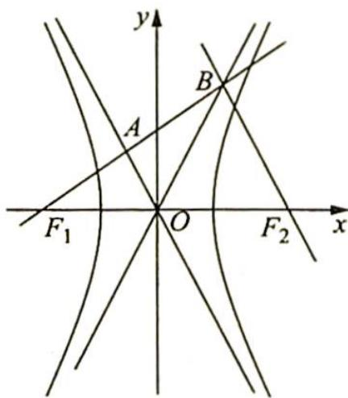

本题充分利用了已知条件的几何性质,通过中位线推出角相等,进而直接计算出 $\angle F_{2}OB$ 的值,这样其正切值就是渐近线 $OB$ 的斜率,最终计算得出离心率.本题过程简洁,几乎不需要计算,可见活用几何性质的巧妙性与重要性.

变式(1) 已知双曲线 $C: \frac{x^2}{a^2} - \frac{y^2}{b^2} = 1 (a > 0, b > 0)$ 的左、右焦点分别为 $F_1, F_2$ , 过 $F_1$ 的直线与 C 的一条渐近线交于点 A (点 A 在第二象限), 且与双曲线的右支交于点 B, 若 $\overrightarrow{F_1A} = \overrightarrow{AB}$ , $\overrightarrow{F_1B} \cdot \overrightarrow{F_2B} = 0$ , 则 C 的离心率为 \_\_\_\_.

分析 ▶ 求解椭圆或双曲线的离心率一般运用“定义+几何性质”或“方程+几何性质”，但凡涉及焦半径 $|PF_{1}|$ ， $|PF_{2}|$ 的关系，优先考虑用“定义+几何性质”。

解析 ▶ 解法一: 如图所示, $\overrightarrow{F_1A} = \overrightarrow{AB}$ , 且 $\overrightarrow{F_1B} \cdot \overrightarrow{F_2B} = 0$ , 则 $\triangle F_1BF_2$ 为直角三角形, 又 $\overrightarrow{F_1A} = \overrightarrow{AB}$ , $A$ 为 $F_1B$ 中点, $AO$ 为 $\triangle F_1BF_2$ 的中位线, 所以 $OA \parallel BF_2$ , 因此 $OA \perp BF_1$ , 而双曲线的一条渐近线方程为 $y = -\frac{b}{a}x$ , 故 $k_{BF_1} = \frac{a}{b} = \tan \angle BF_1F_2$ .

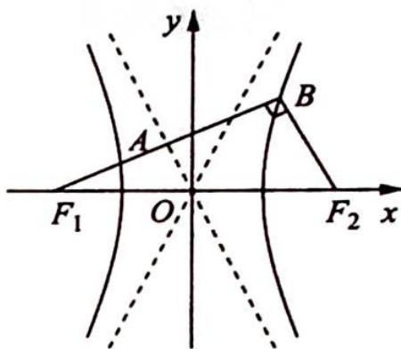

又在 Rt $\triangle BF_{1}F_{2}$ 中， $|F_{1}F_{2}| = 2c$ ， $\tan \angle BF_{1}F_{2} = \frac{a}{b}$ ，则 $\sin \angle BF_{1}F_{2} = \frac{a}{c} = \frac{|BF_{2}|}{|F_{1}F_{2}|}$ ，故 $|BF_{2}| = 2a$ ， $|BF_{1}| = 2b$ 。

根据双曲线定义知 $\left|BF_{1}\right|-\left|BF_{2}\right|=2a$ ，因此2b-2a=2a，即b=2a，所以 $\frac{b}{a}=2$ ，则 $e=\frac{c}{a}=$ $\sqrt{1+\frac{b^{2}}{a^{2}}}=\sqrt{5}.$

解法二(利用焦渐距):由焦渐距为 b 可知 $\left|F_{1}A\right|=b$ , 又 $\overrightarrow{F_{1}A}=\overrightarrow{AB}$ , 则 A 为 $F_{1}B$ 的中点, 所以 $\left|F_{1}B\right|=2b$ .

由双曲线定义可得 $|BF_{2}| = 2b - 2a$ ，在 $\mathrm{Rt}\triangle BF_1F_2$ 中，由勾股定理得 $(2b)^{2} + (2b - 2a)^{2} = (2c)^{2}$ ，化简得 $\frac{b}{a} = 2$ ，则 $e = \sqrt{5}$ 。

本题中点 $B$ 在双曲线上, 因此 $BF_{1}$ 和 $BF_{2}$ 为焦半径, 在离心率的计算时优先考虑用定义, 即 $|BF_{1}| - |BF_{2}| = 2a$ , 通过这一组试题, 是否能领悟出求离心率的思路和规律呢?

变式(2) 已知双曲线 $M: \frac{x^{2}}{a^{2}} - \frac{y^{2}}{b^{2}} = 1 (a, b > 0)$ 的左焦点为 $F_{1}, A, B$ 分别为双曲线 $M$ 左、右两支上的两点， $O$ 为坐标原点，若四边形 $F_{1}ABO$ 为菱形，则双曲线 $M$ 的离心率为（ ）.

A. $\sqrt{2}$ B. $\sqrt{3}$ C. $\sqrt{2} + 1$ D. $\sqrt{3} + 1$

解析 ▶ 定义+几何性质求解离心率.

如图所示， $|F_{1}F_{2}| = 2c, \angle OBF_{2} = \angle BOF_{2} = \angle OF_{2}B = 60^{\circ}$ ，且 $\angle F_{1}BF_{2} = 90^{\circ}$ ，则 $|BF_{1}| = \sqrt{3} c, |BF_{2}| = c$ ，由双曲线的定义得 $|BF_{1}| - |BF_{2}| = 2a$ ，即$(\sqrt{3} - 1)c = 2a$ ，得 $e = \frac{c}{a} = \frac{2}{\sqrt{3} - 1} = \sqrt{3} + 1.$ 故选D.

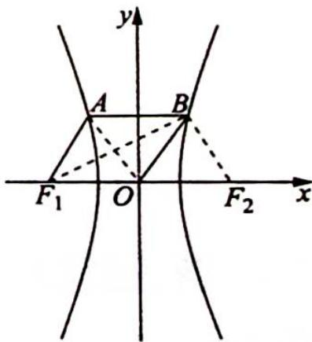

## 2. 直角三角形的性质

例 14.2 (2018 新课标全国 I 卷理 11) 已知双曲线 $C: \frac{x^2}{3} - y^2 = 1, O$ 为坐标原点, $F$ 为 $C$ 的右焦点, 过 $F$ 的直线与 $C$ 的两条渐近线的交点分别为 $M, N$ . 若 $\triangle OMN$ 为直角三角形, 则 $|MN| = (\quad)$ .

A. $\frac{3}{2}$ B. 3

C. $2\sqrt{3}$ D. 4

分析 ▶ 充分挖掘图形的几何性质以获取角度与边长。由双曲线方程可知, 每条渐近线与 $x$ 轴的夹角为 $30^{\circ}$ , 两条渐近线的夹角为 $60^{\circ}$ 。由角度可知, $\triangle ONF$ 为等腰三角形, $\triangle OMF$ 为 $30^{\circ}$ 与 $60^{\circ}$ 的特殊的直角三角形, 由此求 $|MN|$ 的长。

解析 如图所示, 设 $l_{1}, l_{2}$ 是 C 的两条渐近线, 方程为 $\frac{x}{\sqrt{3}} \pm y = 0$ .

右焦点为 $F(2,0)$ ，于是 $\angle MOF = \angle NOF = 30^{\circ}$ ，则 $\angle MON = 60^{\circ}$ .

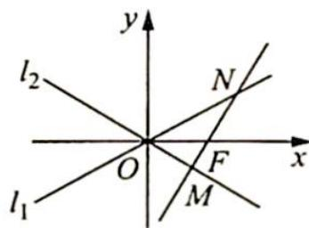

因为 $l_{1}, l_{2}$ 关于 x 轴对称, 所以不失一般性, 可设 $\angle OMN = 90^{\circ}$ .

在 Rt△OMN 中，∠ONF=90°-60°=30°；在 Rt△OMF 中，|OF|=2，∠MOF=30°，所以 |MF|=1。

在 $\triangle ONF$ 中， $\angle ONF=\angle NOF=30^{\circ}$ ，所以 $|NF|=|OF|=2$ 。

则 $|MN| = |MF| + |NF| = 1 + 2 = 3$ ，故选B.

变式(1) 已知双曲线 $C: \frac{x^{2}}{a^{2}} - \frac{y^{2}}{b^{2}} = 1 (a, b > 0)$ 的左、右焦点分别为 $F_{1}, F_{2}$ , 过 $F_{2}$ 作一条渐近线的垂线, 垂足为 $A$ , 并延长交另一条渐近线于点 $B$ , 且 $2 \overrightarrow{AF_{2}} = \overrightarrow{F_{2} B}$ , 则 $C$ 的离心率是

$$
F _ {2}
$$

由于 $\angle AOF_{2} = \angle BOF_{2}$ ，则 $|AF_2| = |F_2M|$

因为 $2\overrightarrow{AF_2} = \overrightarrow{F_2B}$ ，所以 $2|AF_2| = |F_2B|, 2|F_2M| = |F_2B|$ ，则 $\angle OBA = 30^\circ, \angle AOF_2 =$

$$
3 0 ^ {\circ}
$$

$$
\frac {b}{a} = \frac {\sqrt {3}}{3}
$$

因此 $e = \frac{c}{a} = \sqrt{\frac{c^2}{a^2}} = \sqrt{\frac{a^2 + b^2}{a^2}} = \sqrt{1 + \frac{1}{3}} = \frac{2\sqrt{3}}{3}$ .

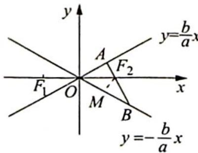

## 3. 等腰(等边)三角形的性质

例 14.3 过抛物线 C: $y^{2}=4x$ 的焦点 F，且斜率为 $\sqrt{3}$ 的直线交 C 于点 M (M 在 x 轴的上方)，l 为 C 的准线，点 N 在 l 上且 $MN \perp l$ ，则 M 到直线 NF 的距离为（）.

A. $\sqrt{5}$ B. $2\sqrt{2}$ C. $2\sqrt{3}$ D. $3\sqrt{3}$

分析 ▶ MF 的斜率为 $\sqrt{3}$ ，说明 $\angle FMN = \frac{\pi}{3}$ ，又由抛物线定义有 $|MF| = |MN|$ ，所以 $\triangle MNF$ 是等边三角形。由抛物线 p 的几何意义求其边长，求高得解。

解析 如图所示, 过 $F$ 作 $FA \perp MN$ , 垂足为 $A, l$ 与 $x$ 轴的交点为 $B, |FB| = 2$ .

由于直线 FM 的斜率为 $\sqrt{3}$ ，故有 $\angle MFx = \frac{\pi}{3}$ ，即 $\angle FMN = \frac{\pi}{3}$ .

根据抛物线定义可得 $|MF| = |MN|$ , 故 $\triangle MNF$ 是等边三角形, 从而 $A$ 是 $MN$ 的中点, 即有 $|AN| = |FB| = 2$ .

在 Rt△FAN 中，|FA|=2tan π/3=2√3，因为等边三角形每条边上的高相等，所以 M 到 NF 的距离为 2√3。

故选C.

变式(1) 设抛物线 $C: y^{2} = 2px (p > 0)$ 的焦点为 $F$ , 点 $M$ 在 $C$ 上, $|MF| = 5$ , 若以 $MF$ 为直径的圆过点 $(0,2)$ , 则 $C$ 的方程为 ( ).

A. $y^{2} = 4x$ 或 $y^{2} = 8x$ B. $y^{2} = 2x$ 或 $y^{2} = 8x$ C. $y^{2} = 4x$ 或 $y^{2} = 16x$ D. $y^{2} = 2x$ 或 $y^{2} = 16x$

解析 如图所示, 过点 $M$ 作准线 $x = -\frac{p}{2}$ 的垂线于点 $M_{1}$ , 连接 $M_{1}F$ 交 $y$ 轴于点 $N$ .

由抛物线的定义知 $|MM_1| = |MF|$ , $\triangle MM_1F$ 为等腰三角形, 且点 $N$ 为 $M_1F$ 的中点, 故 $MN \perp M_1F$ , 因此 $N(0,2), y_M = 4$ , 则 $x_M = \frac{8}{p}, |MM_1| = \frac{8}{p} + \frac{p}{2} = 5$ , 即 $16 + p^2 - 10p = 0$ , 得 $p = 2$ 或 $p = 8$ , 所以抛物线 $C$ 的方程为 $y^2 = 4x$ 或 $y^2 = 16x$ .

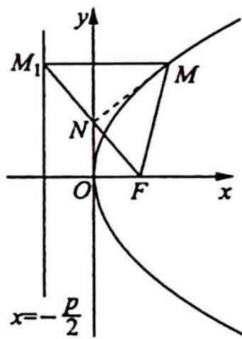

故选C.

## 4. 全等三角形的性质

例 14.4 (2020 新课标全国Ⅲ卷理 20) 已知椭圆 $C: \frac{x^{2}}{25} + \frac{y^{2}}{m^{2}} = 1 (0 < m < 5)$ 的离心率为 $\frac{\sqrt{15}}{4}, A, B$ 分别为 $C$ 的左、右顶点.

(1) 求 C 的方程；

(2)若点 $P$ 在 $C$ 上,点 $Q$ 在直线 $x = 6$ 上,且 $\left| {BP}\right|  = \left| {BQ}\right| ,{BP}\bot {BQ}$ ,求 $\bigtriangleup  {APQ}$ 的面积.

分析 ▶ (1)根据离心率的公式求出 m 的值即可; (2)本题可用已知三角形三顶点的坐标, 求三角形的面积, 但计算量较大。所以转换方向, 尝试从平面几何的角度思考: 过点 P 作 x轴的垂线, 设交点为 $M, x = 6$ 与 $x$ 轴交点为 $N$ , 由 $|BP| = |BQ|$ , $BP \perp BQ$ 易证 $\triangle PMB \cong \triangle BNQ$ , 由全等可得三角形中一些边的长, 再利用割补法求面积, 这样求解非常简洁.

解析 (1) 由 $e = \frac{c}{a} = \frac{\sqrt{25 - m^2}}{5} = \frac{\sqrt{15}}{4}$ 可得 $m = \frac{5}{4}$ , 故 $C$ 的方程为 $\frac{x^2}{25} + \frac{16y^2}{25} = 1$ .

(2)由椭圆的对称性,不妨设点P在第一象限,如图所示.

过点 $P$ 作 $x$ 轴的垂线, 垂足为 $M$ , 设 $x = 6$ 与 $x$ 轴的交点为 $N$ , 由 $|BP| = |BQ|$ , $BP \perp BQ$ 易证 $\triangle PMB \cong \triangle BNQ$ , 所以 $PM = BN = 1$ .

则可得 P 点纵坐标为 $y_{P}=1$ ，将其代入椭圆方程解得 $x_{P}=3$ 或 $x_{P}=-3$ ，因为设点 P 在第一象限，所以 $x_{P}=3$ ，所以 QN=MB=5-3=2。

因为 $PM = 1, QN = 2, AQ$ 的直线方程为 $y = \frac{2}{11} (x + 5)$ , 所以点 $P$ 在 $AQ$ 的下方, 则

$$
\begin{array}{r l} S _ {\triangle A P Q} & = S _ {\triangle A Q N} - S _ {\triangle P A N} - S _ {\triangle P N Q} \\ & = \frac {1}{2} \times 2 \times (5 + 6) - \frac {1}{2} \times 1 \times (5 + 6) - \frac {1}{2} \times 2 \times (6 - 3) \\ & = 1 1 - \frac {1 1}{2} - 3 = \frac {5}{2}. \end{array}
$$

所以 $\triangle APQ$ 的面积为 $\frac{5}{2}$ .

由已知条件容易想到初中常见的全等模型,用割补法求三角形面积省去繁杂的计算,由此可见运用平面几何知识可以减轻计算负担.历年高考题,尤其是客观题,经常可以数形结合,找到图形规律再“秒杀”,值得我们深入研究.

## 5. 相似三角形的性质

例 14.5 椭圆 $C: \frac{x^2}{a^2} + \frac{y^2}{b^2} = 1 (a > b > 0)$ 的右焦点和左焦点分别为 $F_1, F_2, E$ 是椭圆 $C$ 上一点，且 $|F_1 F_2| = 2, |EF_1| + |EF_2| = 4$ .

(1) 求椭圆 C 的方程；

(2) $M, N$ 是 $y$ 轴上的两个动点 (点 $M$ 与点 $E$ 位于 $x$ 轴的两侧), $\angle MF_{1}N = \angle MEN = 90^{\circ}$ , 直线 $EM$ 交 $x$ 轴于点 $P$ , 求 $\frac{|EP|}{|PM|}$ 的值.

分析 ▶ 本题可从代数、几何两个角度入手考虑。代数角度:由条件进行坐标运算,将 $\frac{|EP|}{|PM|}$ 的值转化为E与M纵坐标的比;几何角度:证明 $\triangle MF_{1}P\sim\triangle MEF_{1}$ ,得到对应边的相似比, 再由 $\frac{PM}{ME} = \frac{PM}{MF_1} \cdot \frac{MF_1}{ME}$ 求出 $PM$ 与 $ME$ 的比, 进而得出 $\frac{|EP|}{|PM|}$ 的值.

解析 (1) $2 c = 2, 2 a = 4$ , 得 $a = 2, c = 1, b = \sqrt {3}$ , 所以椭圆 $C$ 的方程为 $\frac{x^2}{4} + \frac{y^2}{3} = 1$ .

(2)解法一(代数方法): 设 $M(0,m)$ , $N(0,n)$ (不妨设 m<0, n>0), $E(x_{0},y_{0})$ , 因为 $\angle MF_{1}N=90^{\circ}$ , 所以 mn=-1, 则 $\overrightarrow{EM}=(-x_{0},m-y_{0}),\overrightarrow{EN}=(-x_{0},n-y_{0})$ .

又 $\overrightarrow{EM} \cdot \overrightarrow{EN} = x_0^2 + (m - y_0)(n - y_0) = 0$ ，即 $x_0^2 + mn - (m + n)y_0 + y_0^2 = 0$ ，亦即 $x_0^2 - 1 - (m + n)y_0 + y_0^2 = 0$ ，整理得 $x_0^2 + y_0^2 - 1 - \left(n - \frac{1}{n}\right)y_0 = 0$ ①.

又 $\frac{x_0^2}{4} +\frac{y_0^2}{3} = 1$ ，得 $x_0^2 = 4\left(1 - \frac{y_0^2}{3}\right) = 4 - \frac{4}{3} y_0^2$ ，代入①式得 $4 - \frac{4}{3} y_0^2 +y_0^2 -1 - \left(n - \frac{1}{n}\right)y_0 = 0,$

即 $-\frac{1}{3} y_0^2 - (n - \frac{1}{n}) y_0 + 3 = 0$ ，亦即 $y_0^2 + 3(n - \frac{1}{n}) y_0 - 9 = 0$ ，可得 $(y_0 + 3n)(y_0 - \frac{3}{n}) = 0$ ，即 $y_0 = -3n$ 或 $\frac{3}{n}$ .

又 $y_0 > 0$ ，得 $y_0 = \frac{3}{n}$ 所以 $\frac{|EP|}{|PM|} = \left|\frac{\frac{3}{n}}{\frac{-1}{n}}\right| = 3.$

解法二(几何法): $\angle MEN = \angle MF_{1}N = 90^{\circ}$ , 得 $N, E, F_{1}, M$ 四点共圆. 连接 $EF_{2}, EF_{1}$ , 如图所示.

$\angle F_{2}EM = \angle F_{1}EM$ ，所以 $\frac{EF_2}{EF_1} = \frac{F_2P}{PF_1}\Rightarrow \frac{EF_2 + EF_1}{EF_2} = \frac{F_2P + PF_1}{F_2P},$

可得 $\frac{2a}{2c} = \frac{EF_2}{F_2P} = \frac{1}{e} = 2$ ，故 $\frac{EF_2}{F_2P} = 2$ 或 $\frac{EF_1}{F_1P} = 2.$

$\triangle MF_{1}P \sim \triangle MEF_{1}$ , 得 $\frac{MP}{MF_{1}} = \frac{MF_{1}}{ME} = \frac{PF_{1}}{EF_{1}} = \frac{1}{2}, \frac{PM}{MF_{1}} \cdot \frac{MF_{1}}{ME} = \frac{PM}{ME}$ , 所以 $\frac{PM}{ME} = \frac{1}{4}$ , 则 $|PM| = \frac{1}{3} |PE|$ , 故 $\frac{|EP|}{|PM|} = 3$ .

## 14.2 挖掘圆的几何性质

## 研究密钥

圆是非常重要且内涵丰富的图形,当圆锥曲线与圆相结合时,应当充分利用已知条件和图形特征,灵活运用圆的几何性质,如对称性、切线性质、垂径定理、直径所对圆周角为直角等.解题时多思考、多发现,就能少计算、省时间.

例 14.6 (2019 浙江卷)已知椭圆 $C: \frac{x^2}{9} + \frac{y^2}{5} = 1$ 的左焦点为 $F$ , 点 $P$ 在椭圆上且在 $x$ 轴上方, 若线段 $PF$ 的中点在以原点为圆心, $OF$ 的长为半径的圆上, 则直线 $PF$ 的斜率为 \_\_\_\_.

分析 ▶ PF 的中点在圆上, 直径所对圆周角为 $90^{\circ}$ , 所以存在垂直条件. 由等腰三角形三线合一知 $|AP| = |AF| = 4$ (其中 $A$ 为右焦点), 则可得 $|BF|$ 与 $|AB|$ , 再由 $k_{PF} = \tan \angle PFA = \frac{|AB|}{|BF|}$ 得解.

解析 ▶ 设椭圆的右焦点为 A, PF 的中点为点 B, 连接 AB, AP, 如图所示.

由已知 $\left| {AF}\right|  = {2c} = 4$ ,因为点 $B$ 在以原点为圆心, ${OF}$ 长为半径的圆上, 所以 $\angle {ABF} = {90}^{ \circ  }$ ,又点 $B$ 为 ${PF}$ 的中点,所以 ${AB}$ 为线段 ${PF}$ 的垂直平分

线, 所以 $|AP| = |AF| = 4$ , 则 $|PF| = 2a - |AP| = 2$ , $|BF| = 1$ , $|AB| = \sqrt{|AF|^2 - |BF|^2} = \sqrt{15}$ .

故直线 $PF$ 的斜率 $k_{PF} = \tan \angle PFA = \frac{|AB|}{|BF|} = \sqrt{15}$ .

## 评注

本题为填空题,题中出现了圆的条件,且 $\angle ABF$ 恰为直径所对的圆周角,所以利用直径所对圆周角为 $90^{\circ}$ ,我们就得出了重要的垂直条件,进而顺利解决了本题.

变式(1) 已知 $F_{1}, F_{2}$ 为椭圆 $\frac{x^{2}}{a^{2}} + \frac{y^{2}}{b^{2}} = 1 (a > b > 0)$ 的两焦点, 点 $P$ 在椭圆上, 线段 $PF_{1}$ 的中点在以 $F_{1} F_{2}$ 为直径的圆上, 直线 $PF_{1}$ 的斜率为 $\frac{4}{3}$ , 则椭圆的离心率为 \_\_\_\_.

解析 ▶ 设 $PF_{1}$ 的中点为 M，连接 $MF_{2}$ ，不妨设 $\left|MF_{2}\right|=4$ ， $\left|MF_{1}\right|=3$ ，则 $\left|PM\right|=\left|MF_{1}\right|=3,\left|PF_{2}\right|=\left|F_{1}F_{2}\right|=5$ ，故椭圆离心率 $e=\frac{c}{a}=\frac{2c}{2a}=\frac{\left|F_{1}F_{2}\right|}{\left|PF_{1}\right|+\left|PF_{2}\right|}=\frac{5}{11}$ .

## 评注

焦点三角形的研究也是常考内容,本题是将焦点三角形与图形几何关系相结合研究.

## 14.3 挖掘平行线的几何性质

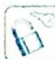

## 研究密钥

当题设条件出现平行线或可挖掘出平行线的条件时,可根据平行线的性质进一步获取诸多信息,如斜率相等、角相等、中点、平行线分线段成比例及三角形相似等,知晓这些条件可以更深入地认识图形结构特征,以避免复杂的代数运算.

例 14.7 (2019 江苏卷) 如图所示, 在平面直角坐标系 $xOy$ 中, 椭圆 $C: \frac{x^2}{a^2} + \frac{y^2}{b^2} = 1 (a > b > 0)$ 的焦点为 $F_1(-1,0), F_2(1,0)$ . 过 $F_2$ 作 $x$ 轴的垂线 $l$ , 在 $x$ 轴的上方, $l$ 与圆 $F_2: (x - 1)^2 +$

$y^{2}=4a^{2}$ 交于点 A，与椭圆 C 交于点 D。连接 $AF_{1}$ 并延长交圆 $F_{2}$ 于点 B，连接 $BF_{2}$ 交椭圆 C 于点 E，连接 $DF_{1}$ 。已知 $DF_{1}=\frac{5}{2}$ 。

(1) 求椭圆 C 的标准方程；

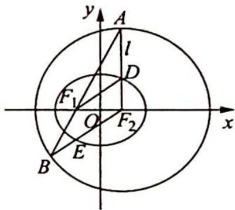

(2) 求点 E 的坐标.

分析 ▶ (1) 根据焦点坐标可得 $c$ , 已知 $DF_{1} = \frac{5}{2}$ , 根据勾股定理可得 $|DF_{2}| = \sqrt{|DF_{1}|^{2} - |F_{1}F_{2}|^{2}}$ , 根据椭圆的定义可得 $a$ , 根据 $b = \sqrt{a^{2} - c^{2}}$ 可得 $b$ . (2) 求点 $E$ 的坐标, 若用直线和椭圆联立方程求解计算量太大, 设法从其他角度突破. 利用椭圆上的点到两个焦点的距离和为 $2a$ 及圆的半径也是 $2a$ 推出边相等, 进而角相等, 由此发现等腰三角形以及平行、垂直关系, 打开“解题之门”.

解析 ▶ (1)设椭圆 C 的焦距为 2c，因为 $F_{1}(-1,0)$ ， $F_{2}(1,0)$ ，所以 $F_{1}F_{2}=2$ ，c=1，又因为 $\left|DF_{1}\right|=\frac{5}{2}$ ， $AF_{2}\perp x$ 轴，所以 $\left|DF_{2}\right|=\sqrt{\left|DF_{1}\right|^{2}-\left|F_{1}F_{2}\right|^{2}}=\frac{3}{2}$ .

因此 $2a = |DF_{2}| + |DF_{1}| = 4$ ，从而 $a = 2$ ，所以 $b = \sqrt{a^2 - c^2} = \sqrt{3}$ ，所以椭圆 $C$ 的标准方程为 $\frac{x^2}{4} +\frac{y^2}{3} = 1.$

(2)由(1)知,椭圆 $C: \frac{x^2}{4} + \frac{y^2}{3} = 1$ , 连接 $EF_1$ , 如图所示.

因为 $|BF_{2}| = 2a, |EF_{2}| + |EF_{1}| = 2a$ ，所以 $|EF_{1}| = |EB|, \angle BF_{1}E = \angle B.$

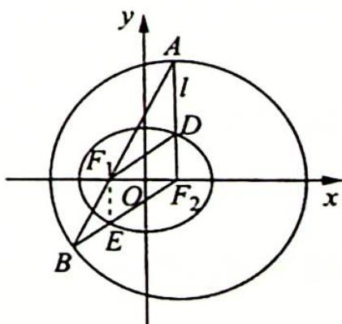

又 $|F_2A| = |F_2B|$ ，所以 $\angle A = \angle B, \angle A = \angle BF_1E, EF_1 \parallel F_2A.$

因为 $AF_{2} \perp x$ 轴, 所以 $EF_{1} \perp x$ 轴, E 点横坐标 $x_{E} = x_{F_{1}} = -1$ .

代入椭圆方程, 即 $\frac{(-1)^2}{4} + \frac{y^2}{3} = 1$ , 解得 $y = \pm \frac{3}{2}$ .

因为 E 是线段 $BF_{2}$ 与椭圆的交点, 所以 $y_{E} = -\frac{3}{2}$ , 因此 $E\left(-1, -\frac{3}{2}\right)$ .

## 评注

本题通过挖掘图形特征, 发现平行的隐藏条件, 进而通过同位角相等加以证明. 利用平行关系, 可推出 $E$ 点的横坐标, 代入椭圆方程, 就得到了 $E$ 点的纵坐标. 本题再次说明了充分挖掘圆锥曲线中图形的几何性质, 对解题大有作用.

例 14.8 如图所示, 在平面直角坐标系 $xOy$ 中, 点 $B$ 与点 $A(-1,1)$ 关于原点 $O$ 对称, $P$ 是动点, 且直线 $AP$ 与 $BP$ 的斜率之积等于 $-\frac{1}{3}$ .

(1) 求动点 P 的轨迹方程；

(2)设直线 $AP$ 与 $BP$ 分别与直线 $x = 3$ 交于点 $N, M$ . 是否存在点 $P$ , 使得 $\triangle PAB$ 与 $\triangle PMN$ 的面积相等? 若存在, 求出点 $P$ 的坐标; 若不存在, 请说明理由.

分析 ▶ (1)已知点 $A$ 的坐标, 根据对称可得点 $B$ 的坐标, 设 $P(x,y)$ , 分别表示出直线 $AP$ 与 $BP$ 的斜率, 根据乘积为 $-\frac{1}{3}$ 可得点 $P$ 的轨迹方程; (2)挖掘图形几何性质, 若使 $\triangle PAB$ 与 $\triangle PMN$ 的面积相等, 即 $\triangle ABN$ 与 $\triangle MBN$ 的面积相等, 那么 $AM \parallel BN$ . 延长 $AB$ 交直线 $x = 3$ 于点 $Q$ , 由 $A,B,Q$ 三点横坐标知点 $B$ 为线段 $AQ$ 的中点, 结合中位线定理, $N$ 为线段 $MQ$ 的中点, 则 $P$ 是 $\triangle AMQ$ 的重心.

解析 (1)由点 $B$ 与点 $A(-1,1)$ 关于原点 $O$ 对称, 则 $B(1,-1)$ .

设 $P(x,y), x \neq \pm 1$ . 由题设可得 $\frac{y-1}{x+1} \cdot \frac{y+1}{x-1} = -\frac{1}{3}$ ，整理得动点 P 的轨迹方程为 $x^{2} + 3y^{2} = 4 (x \neq \pm 1)$ .

(2) 连接 BN, AM, 如图所示.

若 $S_{\triangle PAB} = S_{\triangle PMN}$ ，则 $S_{\triangle ABN} = S_{\triangle MBN}$

因为 $\triangle ABN$ 与 $\triangle MBN$ 同底 $BN$ , 所以点 $A$ 与点 $M$ 到 $BN$ 的距离相等, 故 $AM \parallel BN$ .

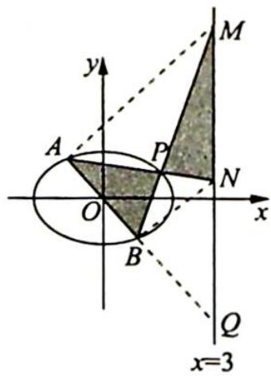

$$
x = 3
$$

的中点, 所以点 $N$ 为线段 $MQ$ 的中点, 因此, 点 $P$ 是 $\triangle AMQ$ 两条中线 $AN$ 与 $BM$ 的交点, 即点 $P$ 是 $\triangle AMQ$ 的重心, 由重心坐标公式得 $x_{P} = \frac{x_{A} + x_{M} + x_{Q}}{3} = \frac{5}{3}$ .

将点 $P$ 的横坐标代入椭圆方程 $x^{2} + 3y^{2} = 4$ 中，得 $y_{P}^{2} = \frac{11}{27}$ ，即 $y_{P} = \pm \frac{\sqrt{33}}{9}$ .

所以存在点 $P$ ，使得 $\triangle PAB$ 与 $\triangle PMN$ 的面积相等，其坐标为 $\left[\frac{5}{3},\pm \frac{\sqrt{33}}{9}\right]$

变式 1: 已知椭圆 $W: \frac{x^{2}}{a^{2}} + \frac{y^{2}}{b^{2}} = 1 (a > b > 0)$ 的离心率为 $\frac{\sqrt{3}}{2}$ , 且经过点 $C(2, \sqrt{3})$ .

(1)求椭圆 W 的方程及其长轴长；

(2) $A, B$ 分别为椭圆 $W$ 的左、右顶点, 点 $D$ 在椭圆 $W$ 上, 且位于 $x$ 轴下方, 直线 $C D$ 交 $x$ 轴于点 $Q$ , 若 $\triangle A C Q$ 的面积比 $\triangle B D Q$ 的面积大 $2 \sqrt{3}$ , 求点 $D$ 的坐标.

分析 ▶ (1) 解方程 $\frac{4}{a^2} + \frac{3}{b^2} = 1$ 和 $\frac{c}{a} = \frac{\sqrt{3}}{2}, a^2 = b^2 + c^2$ , 求出 $a, b$ 的值即可得椭圆 $W$ 的方程和长轴 $2a$ 的值; (2) 由已知条件可计算 $\triangle AOC$ 的面积为 $\frac{1}{2} \times 4 \times \sqrt{3} = 2\sqrt{3}$ . 而 $\triangle ACQ$ 的面积比 $\triangle BDQ$ 的面积大 $2\sqrt{3}$ , $\triangle ACQ$ 的面积等于 $\triangle AOC$ 的面积与 $\triangle COQ$ 面积之和, 可得 $\triangle OCQ$ 的面积等于 $\triangle BDQ$ 的面积, 进而可得 $\triangle OCB$ 的面积等于 $\triangle BCD$ 的面积, 所以 $OD \parallel BC$ . 设 $D(m, n)$ , 利用点 $D$ 在椭圆上以及 $k_{OD} = k_{BC}$ 可求出点 $D$ 的坐标.

解析 (1) 因为椭圆 $W$ 经过点 $C(2, \sqrt{3})$ , 所以 $\frac{4}{a^2} + \frac{3}{b^2} = 1$ .

又椭圆 W 的离心率为 $\frac{\sqrt{3}}{2}$ ，所以 $\frac{c}{a} = \frac{\sqrt{3}}{2}$ ，且 $a^{2} = b^{2} + c^{2}$ ，于是解得 $\left\{\begin{aligned}a &= 4 \\ b &= 2\end{aligned}\right.$ .

故椭圆 W 的方程为 $\frac{x^{2}}{16} + \frac{y^{2}}{4} = 1$ ，长轴长 2a = 8。

(2)因为点 $D$ 在 $x$ 轴下方,所以点 $Q$ 在线段 ${AB}$ (不包括端点)上.

由(1)可知 $A(-4,0)$ , $B(4,0)$ ，所以 $\triangle AOC$ 的面积为 $\frac{1}{2} \times 4 \times \sqrt{3} = 2\sqrt{3}$ .

因为 $\triangle ACQ$ 的面积比 $\triangle BDQ$ 的面积大 $2\sqrt{3}$ ,所以点 $Q$ 在线段 $OB$ (不包括端点)上,且 $\triangle OCQ$ 的面积等于 $\triangle BDQ$ 的面积,则 $\triangle OCB$ 的面积等于 $\triangle BCD$ 的面积, $OD \parallel BC$ .

设 $D(m,n)$ , n<0，则 $\frac{n}{m}=\frac{0-\sqrt{3}}{4-2}=-\frac{\sqrt{3}}{2}$ ①；因为点 D 在椭圆 W 上，所以 $\frac{m^{2}}{16}+\frac{n^{2}}{4}=1$ ②.
由①②解得 $\left\{\begin{aligned}m=2\\n=-\sqrt{3}\end{aligned}\right.$ ，所以D的坐标为 $(2,-\sqrt{3})$ .

## 评注

本题解题的关键是由 $\triangle ACQ$ 的面积比 $\triangle BDQ$ 的面积大 $2\sqrt{3}$ , 得出 $\triangle OCQ$ 的面积等于 $\triangle BDQ$ 的面积, 进而可得 $\triangle OCB$ 的面积等于 $\triangle BCD$ 的面积, 从而 $OD \parallel BC$ .

## 14.4 圆锥曲线的圆幂定理

## 研究密钥

圆锥曲线的统一的极坐标方程为 $\rho=\frac{ep}{1-ecos\theta}$ ，其中 e 为离心率，p 为焦参数（焦点 F 到准线 l 的距离），具体推导过程如下：如图所示，设点 F 到直线 l 的距离为 p，点 F 在直线 l 上的射影为点 K，以 F 为极点，向量 $\overrightarrow{KF}$ 的方向为极轴的正方向建立极坐标系，点 $P(\rho,\theta)$ 为圆

锥曲线上任意一点,其在直线 $l$ 上的投影为点 $M$ , 在极轴上的投影为点 $N$ , 则由圆锥曲线的定义知 $\frac{|PF|}{|PM|} = e$ . 因为 $|PF| = \rho$ , $|PM| = |KF| + |FN| = p + \rho \cos \theta$ , 所以 $\frac{\rho}{p + \rho \cos \theta} = e$ , 化简得 $\rho = \frac{ep}{1 - e \cos \theta}$ .

根据圆锥曲线的统一的极坐标方程,可得如下定理:

## 1. 引理

设过圆锥曲线的焦点 F 的弦 PQ 与 x 轴正半轴的夹角为 $\alpha$ ，则 $|PQ|=\frac{2ep}{1-e^{2}\cos^{2}\alpha}$ .

【证明】由圆锥曲线的统一的极坐标方程可得

$$
| P Q | = | P F | + | Q F | = \frac {e p}{1 - e \cos \alpha} + \frac {e p}{1 - e \cos (\alpha + \pi)} = \frac {e p}{1 - e \cos \alpha} + \frac {e p}{1 + e \cos \alpha} = \frac {2 e p}{1 - e ^ {2} \cos^ {2} \alpha}.
$$

## 2. 相交弦、割线定理

已知点 M 不在圆锥曲线 $\Gamma$ 上, 过点 M 作两条直线分别交曲线 $\Gamma$ 于 A, B 两点和 C, D 两点.

(1)当圆锥曲线 $\Gamma$ 是椭圆或双曲线时, 过坐标原点 $O$ 作 $OP \parallel AB$ , $OQ \parallel CD$ , 分别交曲线 $\Gamma$ 于 $P, Q$ 两点, 过焦点 $F$ 作 $A_{1}B_{1} \parallel AB$ , $C_{1}D_{1} \parallel CD$ , 分别交曲线 $\Gamma$ 于 $A_{1}, B_{1}$ 两点和 $C_{1}, D_{1}$ 两点, 则 $\frac{|MA||MB|}{|MC||MD|} = \frac{|OP|^2}{|OQ|^2} = \frac{|A_1B_1|}{|C_1D_1|}$ ;

(2)当圆锥曲线 $\Gamma$ 是抛物线时, 过焦点 $F$ 作 $A_{1}B_{1} \parallel AB, C_{1}D_{1} \parallel CD$ , 分别交曲线 $\Gamma$ 于 $A_{1}$ , $B_{1}$ 两点和 $C_{1}, D_{1}$ 两点, 则 $\frac{|MA||MB|}{|MC||MD|} = \frac{|A_{1}B_{1}|}{|C_{1}D_{1}|}$ .

【证明】(1)如图所示,当圆锥曲线 $\Gamma$ 是椭圆时,设椭圆的方程为 $\frac{x^{2}}{a^{2}}+\frac{y^{2}}{b^{2}}=1(a>b>0)$ ,

$M(x_{0},y_{0})$ ，直线 AB 的参数方程为 $\left\{\begin{aligned}x&=x_{0}+t\cos\alpha\\ y&=y_{0}+t\sin\alpha\end{aligned}\right.$ （其中 t 为参数），直线 CD 的参数方程为 $\left\{\begin{aligned}x&=x_{0}+t\cos\beta\\ y&=y_{0}+t\sin\beta\end{aligned}\right.$ （其中 t 为参数）.

将直线 AB 的参数方程代入椭圆的方程中, 得

$(b^{2}\cos^{2}\alpha + a^{2}\sin^{2}\alpha)t^{2} + 2(b^{2}x_{0}\cos \alpha + a^{2}y_{0}\sin \alpha)t + b^{2}x_{0}^{2} + a^{2}y_{0}^{2} - a^{2}b^{2} = 0$ ，所以由参数 $t$ 的

几何意义, 可知 $\left|MA\right|\left|MB\right|=\left|t_{1}t_{2}\right|=\left|\frac{b^{2}x_{0}^{2}+a^{2}y_{0}^{2}-a^{2}b^{2}}{b^{2}\cos^{2}\alpha+a^{2}\sin^{2}\alpha}\right|$ .

同理可得 $|MC||MD| = \left|\frac{b^2x_0^2 + a^2y_0^2 - a^2b^2}{b^2\cos^2\beta + a^2\sin^2\beta}\right|$ ，所以 $\frac{|MA||MB|}{|MC||MD|} = \frac{b^2\cos^2\beta + a^2\sin^2\beta}{b^2\cos^2\alpha + a^2\sin^2\alpha}$ .

根据上述推导过程,同理可得 $\frac{|OP|^{2}}{|OQ|^{2}}=\frac{b^{2}\cos^{2}\beta+a^{2}\sin^{2}\beta}{b^{2}\cos^{2}\alpha+a^{2}\sin^{2}\alpha}.$

又根据引理可知 $|A_{1}B_{1}| = \frac{2ep}{1 - e^{2}\cos^{2}\alpha} = \frac{2\cdot\frac{c}{a}\cdot\left(\frac{a^{2}}{c} - c\right)}{1 - \frac{c^{2}}{a^{2}}\cdot\cos^{2}\alpha} = \frac{2ab^{2}}{b^{2}\cos^{2}\alpha + a^{2}\sin^{2}\alpha}, |C_{1}D_{1}| =$

$\frac{2ab^{2}}{b^{2}\cos^{2}\beta+a^{2}\sin^{2}\beta}$ ，所以 $\frac{|A_{1}B_{1}|}{|C_{1}D_{1}|}=\frac{b^{2}\cos^{2}\beta+a^{2}\sin^{2}\beta}{b^{2}\cos^{2}\alpha+a^{2}\sin^{2}\alpha},\frac{|MA||MB|}{|MC||MD|}=\frac{|OP|^{2}}{|OQ|^{2}}=\frac{|A_{1}B_{1}|}{|C_{1}D_{1}|}$ ，即原结论成立.

当圆锥曲线 $\Gamma$ 是双曲线时, 同理可证结论正确.

(2)如图所示,当圆锥曲线 $\Gamma$ 是抛物线时,设抛物线的方程为 $y^{2}=2px(p>0)$ , $M(x_{0},y_{0})$ , 直线 AB 的参数方程为 $\left\{\begin{aligned}x&=x_{0}+t\cos\alpha\\ y&=y_{0}+t\sin\alpha\end{aligned}\right.$ (其中 t 为参数), 直线 CD 的参数方程为 $\left\{\begin{aligned}x&=x_{0}+t\cos\beta\\ y&=y_{0}+t\sin\beta\end{aligned}\right.$ (其中 t 为参数).

将直线 AB 的参数方程代入抛物线的方程中, 得 $t^{2}\sin^{2}\alpha + 2(y_{0}\sin\alpha - p\cos\alpha)t + y_{0}^{2} - 2px_{0} = 0$ , 所以由参数 t 的几何意义, 可知 $\left|MA\right|\left|MB\right| = \left|t_{1}t_{2}\right| = \left|\frac{y_{0}^{2} - 2px_{0}}{\sin^{2}\alpha}\right|$ .

同理可得 $|MC||MD| = \left|\frac{y_0^2 - 2px_0}{\sin^2\beta}\right|$ ，所以 $\frac{|MA||MB|}{|MC||MD|} = \frac{\sin^2\beta}{\sin^2\alpha}$ .

根据引理可知 $\left|A_{1}B_{1}\right|=\frac{2ep}{1-e^{2}\cos^{2}\alpha}=\frac{2p}{\sin^{2}\alpha},\left|C_{1}D_{1}\right|=\frac{2p}{\sin^{2}\beta}$ ，所以 $\frac{\left|A_{1}B_{1}\right|}{\left|C_{1}D_{1}\right|}=\frac{\sin^{2}\beta}{\sin^{2}\alpha}$ $\frac{|MA||MB|}{|MC||MD|}=\frac{|A_{1}B_{1}|}{|C_{1}D_{1}|}$ ，即原结论成立.

## 3. 切割线定理

已知点 M 在圆锥曲线 $\Gamma$ 的外部, 过点 M 作两条直线, 其中一条直线与曲线 $\Gamma$ 相切于点 A, 另一条直线交曲线 $\Gamma$ 于 C, D 两点.

(1)当圆锥曲线 $\Gamma$ 是椭圆或双曲线时, 过坐标原点 $O$ 作 $OP \parallel MA$ , $OQ \parallel CD$ , 分别交曲线 $\Gamma$ 于 $P, Q$ 两点, 过焦点 $F$ 作 $A_{1}B_{1} \parallel MA$ , $C_{1}D_{1} \parallel CD$ , 分别交曲线 $\Gamma$ 于 $A_{1}, B_{1}$ 两点和 $C_{1}, D_{1}$ 两点, 则 $\frac{|MA|^{2}}{|MC||MD|} = \frac{|OP|^{2}}{|OQ|^{2}} = \frac{|A_{1}B_{1}|}{|C_{1}D_{1}|}$ ;

(2)当圆锥曲线 $\Gamma$ 是抛物线时, 过焦点 F 作 $A_{1}B_{1} \parallel MA, C_{1}D_{1} \parallel CD$ , 分别交曲线 $\Gamma$ 于 $A_{1}, B_{1}$ 两点和 $C_{1}, D_{1}$ 两点, 则 $\frac{|MA|^{2}}{|MC||MD|} = \frac{|A_{1}B_{1}|}{|C_{1}D_{1}|}$ .

## 4. 切线定理

已知点 M 在圆锥曲线 $\Gamma$ 的外部, 过点 M 作两条直线, 分别与曲线 $\Gamma$ 相切于 A, C 两点.

(1)当圆锥曲线 $\Gamma$ 是椭圆或双曲线时, 过坐标原点 $O$ 作 $OP \parallel MA$ , $OQ \parallel MC$ , 分别交曲线 $\Gamma$ 于 $P, Q$ 两点, 过焦点 $F$ 作 $A_{1}B_{1} \parallel MA$ , $C_{1}D_{1} \parallel MC$ , 分别交曲线 $\Gamma$ 于 $A_{1}, B_{1}$ 两点和 $C_{1}, D_{1}$ 两点, 则 $\frac{|MA|^{2}}{|MC|^{2}} = \frac{|OP|^{2}}{|OQ|^{2}} = \frac{|A_{1}B_{1}|}{|C_{1}D_{1}|}$ ;

(2)当圆锥曲线 $\Gamma$ 是抛物线时, 过焦点 F 作 $A_{1}B_{1} \parallel MA, C_{1}D_{1} \parallel MC$ , 分别交曲线 $\Gamma$ 于 $A_{1}, B_{1}$ 两点和 $C_{1}, D_{1}$ 两点, 则 $\frac{|MA|^{2}}{|MC|^{2}} = \frac{|A_{1}B_{1}|}{|C_{1}D_{1}|}$ .

【特别说明】当过点 M 所作的两条直线的斜率互为相反数时, 易得 $\left|A_{1}B_{1}\right|=\left|C_{1}D_{1}\right|$ , 所以 $\left|MA\right|\left|MB\right|=\left|MC\right|\left|MD\right|$ 或 $\left|MA\right|^{2}=\left|MC\right|\left|MD\right|$ 或 $\left|MA\right|^{2}=\left|MC\right|^{2}$ .

例 14.9 已知椭圆 $E: \frac{x^{2}}{a^{2}} + \frac{y^{2}}{b^{2}} = 1 (a > b > 0)$ 的一个顶点为 $(0, \sqrt{3})$ ，离心率为 $\frac{1}{2}$ .

(1) 求椭圆 E 的方程：

(2)设过椭圆右焦点的直线 $l_{1}$ 交椭圆于 $A, B$ 两点, 过原点的直线 $l_{2}$ 交椭圆于 $C, D$ 两点, 若 $l_{1} \parallel l_{2}$ , 求证: $\frac{|CD|^{2}}{|AB|}$ 为定值.

分析 ▶ (1) 根据题意可得 $\left\{ \begin{array}{l} b = \sqrt{3} \\ \frac{c}{a} = \frac{1}{2} \end{array} \right.$ , 结合 $a^2 - b^2 = c^2$ , 可得 $a, b, c$ ; (2) 可直接应用椭圆的相交弦定理, 根据其结论可得 $\frac{|OC||OD|}{a^2} = \frac{|AB|}{2a}$ , 而 $|CD|^2 = 4|OC||OD|$ , 综合起来可得 $\frac{|CD|^2}{|AB|}$ 为定值.

解析 (1)根据题意可得 $\left\{ \begin{array}{l} b = \sqrt{3} \\ \frac{c}{a} = \frac{1}{2} \end{array} \right.$ , 结合 $a^2 - b^2 = c^2$ , 可得 $\left\{ \begin{array}{l} a = 2 \\ b = \sqrt{3} \end{array} \right.$ , 所以椭圆 $E$ 的方程为 $\frac{x^2}{4} + \frac{y^2}{3} = 1$ .

(2)根据结论可得 $\frac{|CD|^{2}}{|AB|}=\frac{4|OC||OD|}{|AB|}$ . 又 $\frac{|OC||OD|}{a^{2}}=\frac{|AB|}{2a}$ ，则 $\frac{|OC||OD|}{|AB|}=\frac{a}{2}$ ，因此 $\frac{|CD|^{2}}{|AB|}=2a=4$ （定值）.

例 14.10 已知点 O 为坐标原点, 点 F 为椭圆 $C: x^{2} + \frac{y^{2}}{2} = 1$ 在 y 轴正半轴上的焦点, 过点 F 且斜率为 $-\sqrt{2}$ 的直线 l 与椭圆 C 交于 A, B 两点, 点 P 满足 $\overrightarrow{OA} + \overrightarrow{OB} + \overrightarrow{OP} = 0$ .

(1)证明: 点 P 在椭圆 C 上;

(2)设点 $P$ 关于坐标原点 $O$ 的对称点为点 $Q$ ,证明: $A,P,B,Q$ 四点在同一个圆上.

分析 ▶ (1) $\overrightarrow{OA} + \overrightarrow{OB} + \overrightarrow{OP} = 0 \Rightarrow (x_{1} + x_{2} + x_{P}, y_{1} + y_{2} + y_{P}) = (0,0)$ , 求出点 $P$ 坐标, 看是否满足椭圆方程; (2) 要证明四点共圆, 根据目前掌握的条件可尝试使用圆的相交弦定理的逆定理. 设 $AB$ 和 $PQ$ 交于点 $M$ , 即证明 $|MA||MB| = |MP||MQ|$ , 过焦点 $F$ 作 $C_{1}D_{1} // PQ$ 交椭圆于 $C_{1}, D_{1}$ 两点, 则根据椭圆的相交弦定理, 有 $\frac{|MA||MB|}{|MP||MQ|} = \frac{|AB|}{|C_{1}D_{1}|}$ , 由椭圆对称性有 $|AB| = |C_{1}D_{1}|$ , 因此得证.

解析 (1) 易求得 $F(0,1)$ , 所以直线 $l$ 的方程为 $y = -\sqrt{2} x + 1$ .

联立方程组 $\left\{ \begin{array}{l} x^{2} + \frac{y^{2}}{2} = 1 \\ y = -\sqrt{2}x + 1 \end{array} \right.$ ，得 $4x^{2} - 2\sqrt{2}x - 1 = 0$ ，解得 $x_{1} + x_{2} = \frac{\sqrt{2}}{2}$ ，所以 $y_{1} + y_{2} = -\sqrt{2}(x_{1} + x_{2}) + 2 = 1$ .

因为 $\overrightarrow{OA} +\overrightarrow{OB} +\overrightarrow{OP} = 0$ ，即 $(x_{1} + x_{2} + x_{P},y_{1} + y_{2} + y_{P}) = (0,0)$ ，所以 $P\left[-\frac{\sqrt{2}}{2}, - 1\right].$

又点 $P$ 的坐标满足椭圆 $C$ 的方程, 所以点 $P$ 在椭圆 $C$ 上.

(2)如图所示,连接 PQ, 设 AB 和 PQ 交于点 M, 过焦点 F 作 $C_{1}D_{1} \parallel PQ$ 交椭圆于 $C_{1}, D_{1}$ 两点, 则根据椭圆的相交弦定理, 可得 $\frac{|MA||MB|}{|MP||MQ|} = \frac{|AB|}{|C_{1}D_{1}|}$ .

因为 $k_{PQ}=k_{OP}=\frac{-1}{-\frac{\sqrt{2}}{2}}=\sqrt{2}$ ，所以 $k_{AB}=-k_{PQ}$ ，直线 AB, $C_{1}D_{1}$ 的斜率互为相反数，则由椭圆

的对称性可知 $|AB|=|C_{1}D_{1}|$ ，即 $\frac{|MA||MB|}{|MP||MQ|}=\frac{|AB|}{|C_{1}D_{1}|}=1,|MA||MB|=|MP||MQ|$ .

故由圆的相交弦定理的逆定理, 可知 $A, P, B, Q$ 四点在同一个圆上.

变式(1) 已知椭圆 $E: \frac{x^2}{a^2} + \frac{y^2}{b^2} = 1 (a > b > 0)$ 的一个焦点与短轴的两个端点是正三角形的三个顶点, 点 $P(\sqrt{3}, \frac{1}{2})$ 在椭圆 $E$ 上.

(1)求椭圆 E 的方程；

(2)设不过原点 O 且斜率为 $\frac{1}{2}$ 的直线 l 与椭圆 E 交于不同的两点 A, B, 线段 AB 的中点为 M, 直线 OM 与椭圆 E 交于 C, D 两点, 证明: $|MA||MB|=|MC||MD|$ .

解析 ▶ (1) 因为椭圆的一个焦点与短轴的两个端点是正三角形的三个顶点, 且点 $P\left(\sqrt{3}, \frac{1}{2}\right)$ 在椭圆上, 所以 $\left\{\begin{array}{l} 2b = a \\ \frac{3}{a^2} + \frac{1}{4b^2} = 1 \end{array}\right.$ , 结合 $a^2 = b^2 + c^2$ , 可得 $\left\{\begin{array}{l} a^2 = 4 \\ b^2 = 1 \end{array}\right.$ , 所以椭圆 $E$ 的方程为 $\frac{x^2}{4} + y^2 = 1$ .

(2)如图所示,过左焦点 F 作 $A_{1}B_{1} \parallel AB$ 交椭圆于 $A_{1}, B_{1}$ 两点,作 $C_{1}D_{1} \parallel CD$ 交椭圆于 $C_{1}, D_{1}$ 两点,则根据椭圆的相交弦定理,可得 $\frac{|MA||MB|}{|MC||MD|} = \frac{|A_{1}B_{1}|}{|C_{1}D_{1}|}$ .

因为点 M 是 AB 的中点, 所以由椭圆的垂径定理, 可得 $k_{OM} \cdot k_{AB} = -\frac{b^{2}}{a^{2}} = -\frac{1}{4}$ , 又 $k_{AB} = \frac{1}{2}$ , 所以 $k_{OM} = -\frac{1}{2}$ , 直线 $A_{1}B_{1}, C_{1}D_{1}$ 的斜率分别为 $\frac{1}{2}, -\frac{1}{2}$ , 即直线 $A_{1}B_{1}, C_{1}D_{1}$ 的斜率互为相反数, 所以由椭圆的对称性可知 $|A_{1}B_{1}| = |C_{1}D_{1}|$ , $\frac{|MA||MB|}{|MC||MD|} = \frac{|A_{1}B_{1}|}{|C_{1}D_{1}|} = 1$ , 即 $|MA||MB| = |MC||MD|$ .

解后反思

## 圆锥曲线相交弦结论的推广

【推广】已知 AB 和 CD 是圆锥曲线 $\Gamma$ 的两条相交弦, 证明: 当且仅当直线 AB 和直线 CD 的倾斜角互补时, A, B, C, D 四点共圆.

【证明】设 AB 和 CD 交于点 M，直线 AB, CD 的倾斜角分别为 $\alpha$ 、 $\beta$ 。过焦点 F 作 $A_{1}B_{1} \parallel AB, C_{1}D_{1} \parallel CD$ ，分别交曲线 $\Gamma$ 于 $A_{1}, B_{1}$ 两点和 $C_{1}, D_{1}$ 两点，则由圆锥曲线的相交弦定理，可得 $\frac{|MA||MB|}{|MC||MD|} = \frac{|A_{1}B_{1}|}{|C_{1}D_{1}|}$ 。

又根据圆锥曲线的焦点弦长公式 $l = \frac{2ep}{1 - e^2\cos^2\alpha}$ ，可得 $\left\{ \begin{array}{l} |A_1B_1| = \frac{2ep}{1 - e^2\cos^2\alpha} \\ |C_1D_1| = \frac{2ep}{1 - e^2\cos^2\beta} \end{array} \right.$ ，所以 $A, B, C, D$ 四点共圆 $\Leftrightarrow |MA||MB| = |MC||MD| \Leftrightarrow |A_1B_1| = |C_1D_1| \Leftrightarrow \cos^2\alpha = \cos^2\beta \Leftrightarrow \cos \alpha = -\cos \beta \Leftrightarrow \alpha = \pi - \beta \Leftrightarrow$ 直线 $AB$ 和直线 $CD$ 的倾斜角互补.

变式(2) (2021 新高考全国 I 卷 21) 在平面直角坐标系 $xOy$ 中, 已知点 $F_{1}(-\sqrt{17},0)$ , $F_{2}(\sqrt{17},0)$ , 点 $M$ 满足 $|MF_{1}|-|MF_{2}|=2$ . 记 $M$ 的轨迹为 $C$ .

(1) 求 $C$ 的方程；

(2)设点 $T$ 在直线 $x = \frac{1}{2}$ 上, 过 $T$ 的两条直线分别交 $C$ 于 $A, B$ 两点和 $P, Q$ 两点, 且 $|TA||TB| = |TP||TQ|$ , 求直线 $AB$ 的斜率与直线 $PQ$ 的斜率之和.

解析 ▶ (1) 因为 $|MF_1| - |MF_2| = 2 < 2\sqrt{17} = |F_1F_2|$ , 所以轨迹 $C$ 为双曲线的右半支, $c^2 = 17, 2a = 2$ ,

所以 $a^{2}=1, b^{2}=16$ ，故 C 的方程为 $x^{2}-\frac{y^{2}}{16}=1(x\geqslant1)$ .

(2) 如图所示, 设 $T\left(\frac{1}{2}, n\right)$ , $AB: y - n = k_{1}\left(x - \frac{1}{2}\right)$ , 联立 $\left\{ \begin{array}{l} y - n = k_{1}\left(x - \frac{1}{2}\right) \\ x^{2} - \frac{y^{2}}{16} = 1 \end{array} \right.$ , 可得 $(16 - k_{1}^{2})x^{2} + (k_{1}^{2} - 2k_{1}n)x - \frac{1}{4}k_{1}^{2} - n^{2} + k_{1}n -$

16=0, 所以 $x_{1}+x_{2}=\frac{k_{1}^{2}-2k_{1}n}{k_{1}^{2}-16}$ , $x_{1}x_{2}=\frac{\frac{1}{4}k_{1}^{2}+n^{2}-k_{1}n+16}{k_{1}^{2}-16}$ , $|TA|=\sqrt{1+k_{1}^{2}}\left(x_{1}-\frac{1}{2}\right)$ , $|TB|=$ $\sqrt{1+k_{1}^{2}}\left(x_{2}-\frac{1}{2}\right)$ ，则 $|TA||TB|=(1+k_{1}^{2})\left(x_{1}-\frac{1}{2}\right)\left(x_{2}-\frac{1}{2}\right)=\frac{(n^{2}+12)(1+k_{1}^{2})}{k_{1}^{2}-16}$ .

设 $PQ: y - n = k_{2}\left(x - \frac{1}{2}\right)$ , 同理 $|TP||TQ| = \frac{(n^{2} + 12)(1 + k_{2}^{2})}{k_{2}^{2} - 16}$ .

因为 $|TA||TB| = |TP||TQ|$ ，所以 $\frac{1 + k_1^2}{k_1^2 - 16} = \frac{1 + k_2^2}{k_2^2 - 16}, 1 + \frac{17}{k_1^2 - 16} = 1 + \frac{17}{k_2^2 - 16}$ ，则 $k_1^2 - 16 = k_2^2 - 16$ ，即 $k_1^2 = k_2^2$ .

又 $k_{1} \neq k_{2}$ , 所以 $k_{1} + k_{2} = 0$ .

## 评注

运用直线的参数方程求解线段的乘积,计算效率更高,大家可以试试.

变式 3 如图所示, 已知抛物线 $C: y^{2} = 2px (p > 0)$ 的焦点为点 $F$ , 直线 $y = 4$ 与 $y$ 轴的交点为点 $P$ , 与抛物线 $C$ 的交点为点 $Q$ , 且 $|QF| = \frac{5}{4} |PQ|$ .

(1)求抛物线 C 的方程；

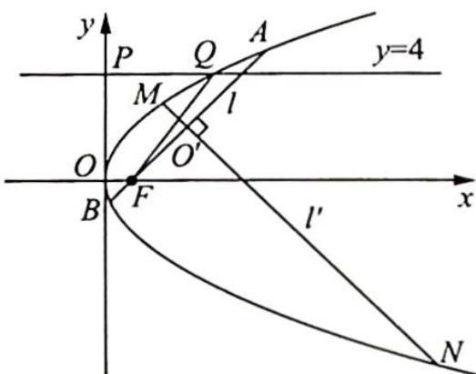

(2)过点 $F$ 的直线 $l$ 与抛物线 $C$ 相交于 $A, B$ 两点, 若线段 $AB$ 的垂直平分线 $l'$ 与抛物线 $C$ 相交于 $M, N$ 两点, 且 $A, M, B, N$ 四点在同一个圆上, 求直线 $l$ 的方程.

解析 ▶ (1) 设 $Q(x_{Q}, 4)$ ，代入抛物线 C 的方程中，可得 $4^{2} = 2px_{Q}$ ，所以 $x_{Q} = \frac{8}{p}$ .

根据抛物线的定义可得 $|QF| = x_{Q} + \frac{p}{2} = \frac{8}{p} + \frac{p}{2}$ , 又 $|PQ| = x_{Q} = \frac{8}{p}$ , 所以根据 $|QF| = \frac{5}{4} |PQ|$ , 可得 $\frac{8}{p} + \frac{p}{2} = \frac{5}{4} \times \frac{8}{p}$ , 解得 $p = 2$ (舍去负值).

故抛物线 C 的方程为 $y^{2}=4x$ .

(2)设 ${AB}$ 和 ${MN}$ 交于点 ${O}^{\prime }$ ,过点 $F$ 作 ${C}_{1}{D}_{1}//{MN}$ 交抛物线于 ${C}_{1},{D}_{1}$ 两点.

因为 A, M, B, N 四点在同一个圆上, 所以 $\left|O^{\prime}A\right|\left|O^{\prime}B\right| = \left|O^{\prime}M\right|\left|O^{\prime}N\right|$ , 根据抛物线的相交弦定理, 可得 $\frac{\left|O^{\prime}A\right|\left|O^{\prime}B\right|}{\left|O^{\prime}M\right|\left|O^{\prime}N\right|} = \frac{|AB|}{\left|C_{1}D_{1}\right|} = 1$ , 即 $\left|AB\right| = \left|C_{1}D_{1}\right|$ .

设直线 $AB$ 的倾斜角为 $\theta$ , 则直线 $C_1D_1$ 的倾斜角为 $\theta + \frac{\pi}{2}$ , 由抛物线的焦点弦长 $l = \frac{2ep}{1 - e^2\cos^2\alpha}$ , 可得 $\left\{ \begin{array}{l} |AB| = \frac{4}{1 - \cos^2\theta} \\ |C_1D_1| = \frac{4}{1 - \cos^2\left(\theta + \frac{\pi}{2}\right)} = \frac{4}{1 - \sin^2\theta} \end{array} \right.$ , 所以 $\frac{4}{1 - \cos^2\theta} = \frac{4}{1 - \sin^2\theta}$ , 解得 $\tan \theta = \pm 1$ .

又 $F(1,0)$ ，故直线 l 的方程为 y=x-1 或 $y=-(x-1)$ ，即 x-y-1=0 或 $x+y-1=0$ 。

## 14.5 圆锥曲线的蝴蝶定理

## 研究密钥

蝴蝶定理最开始是一个关于圆的定理,因其图形像一只翩翩起舞的蝴蝶,故被称为蝴蝶定理.后来被推广到任意二次曲线之中,一些试题的命题背景颇具蝴蝶定理的特色.

蝴蝶定理:如图所示,在圆锥曲线 $\Gamma$ 中,过弦 AB 的中点 M 任意作两条弦 CD 和 EF,直线 CE 与直线 DF 分别交直线 AB 于 P,Q 两点,则有 $|MP|=|MQ|$ .

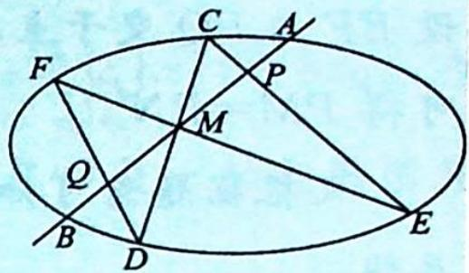

【证明】如图所示,以点 M 为原点,弦 AB 所在的直线为 y 轴,垂直 AB 的直线为 x 轴,建立直角坐标系.

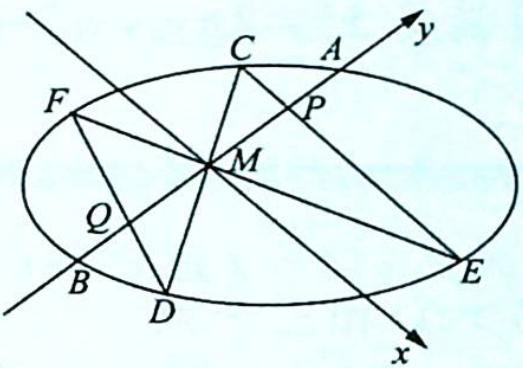

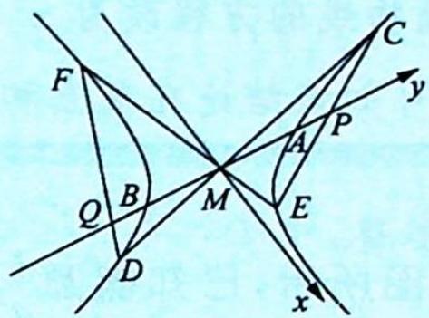

设圆锥曲线 $\Gamma$ 的方程为 $ax^{2}+2bxy+cy^{2}+2dx+2ey+f=0(*), A(0,t), B(0,-t)$ ，可知 t, -t 是关于 y 的方程 $cy^{2}+2ey+f=0$ 的两个根，所以 e=0。

①若直线 $CD, EF$ 中有一条直线的斜率不存在, 则 $P, Q$ 两点和 $A, B$ 两点重合, 结论成立;

②若直线 $CD, EF$ 的斜率都存在, 则设直线 $CD, EF$ 的方程分别为 $y = k_{1}x, y = k_{2}x$ , 且 $C(x_{1}, k_{1}x_{1}), D(x_{2}, k_{1}x_{2}), E(x_{3}, k_{2}x_{3}), F(x_{4}, k_{2}x_{4})$ , 则直线 $CE$ 的方程为 $y = \frac{k_{2}x_{3} - k_{1}x_{1}}{x_{3} - x_{1}} (x - x_{1}) + k_{1}x_{1}$ , 令 $x = 0$ , 可得 $y_{P} = \frac{x_{1}x_{3}(k_{1} - k_{2})}{x_{3} - x_{1}}$ .

同理可得 $y_{Q}=\frac{x_{2}x_{4}(k_{1}-k_{2})}{x_{4}-x_{2}}$ ，所以 $y_{P}+y_{Q}=\frac{(k_{1}-k_{2})\left[x_{3}x_{4}(x_{1}+x_{2})-x_{1}x_{2}(x_{3}+x_{4})\right]}{(x_{3}-x_{1})(x_{4}-x_{2})}$ .

将 $y = k_{1}x$ 代入 $(\ast)$ 式，得 $(a + 2bk_{1} + ck_{1}^{2})x^{2} + (2d + 2ek_{1})x + f = 0$ ，由 $e = 0$ ，可得 $\left\{ \begin{array}{l}x_{1} + x_{2} = -\frac{2d}{a + 2bk_{1} + ck_{1}^{2}}\\ x_{1}x_{2} = \frac{f}{a + 2bk_{1} + ck_{1}^{2}} \end{array} \right.$ ，同理可得 $\left\{ \begin{array}{l}x_3 + x_4 = -\frac{2d}{a + 2bk_2 + ck_2^2}\\ x_3x_4 = \frac{f}{a + 2bk_2 + ck_2^2} \end{array} \right.$

所以 $y_{P} + y_{Q} = 0$ ，即 $|MP| = |MQ|$ .

例14.11 已知抛物线 $y = x^2$ 和三个点 $M(x_0, y_0), P(0, y_0), N(-x_0, y_0) (y_0 \neq x_0^2, y_0 > 0)$ ，过点 $M$ 的一条直线交抛物线于 $A, B$ 两点， $AP, BP$ 的延长线分别交抛物线于 $E, F$ 两点，证明： $E, F, N$ 三点共线。

分析 ▶ 连接 EF 与 $y = y_{0}$ 交于一点, 证明这个点与 N 点为同一点即可. 根据圆锥曲线的蝴蝶定理结合线段长度的等量关系确定此两点为同一点.

解析 如图所示,作直线 $y=y_{0}$ 交抛物线于 Q,R 两点,连接 EF,设 EF 与 PQ 交于点 $N'$ , 因为 PQ=PR, 所以根据圆锥曲线的蝴蝶定理,可得 $PM=PN'$ .

又根据题意可知 $PM = PN$ ，所以 $N'$ ， $N$ 两点重合，故 $E, F, N$ 三点共线。

## 评注

如果将抛物线的方程改为 $x^{2} = 2py (p > 0)$ , 且满足 $x_{0}^{2} \neq 2py_{0}, y_{0} > 0$ , 那么结论仍然成立, 同理可知该结论在椭圆和双曲线中也成立.

变式 1 如图所示, 已知椭圆 $\frac{x^{2}}{a^{2}} + \frac{y^{2}}{b^{2}} = 1 (a > b > 0)$ 和三个点 $M(x_{0}, y_{0}), P(0, y_{0}), N(-x_{0}, y_{0}) \left( \frac{x_{0}^{2}}{a^{2}} + \frac{y_{0}^{2}}{b^{2}} < 1, -b < y_{0} < 0 \right)$ , 过点 $M$ 的一条直线交椭圆于 $A, B$ 两点, $AP, BP$ 的延长线分别交椭圆于 $E, F$ 两点, 证明: $E, F, N$ 三点共线.

证明 如图所示,作直线 $y=y_{0}$ 交椭圆于 Q,R 两点,连接 EF,设 EF 与 PQ 交于点 $N'$ .

因为 PQ=PR，所以根据圆锥曲线的蝴蝶定理，可得 $PM=PN'$ ，又根据题意可知 PM=PN，所以 $N'$ ，N 两点重合，点 N 在直线 EF 上.

故 $E, F, N$ 三点共线.

例 14.12 (2003 北京卷理 18) 如图所示, 已知椭圆的长轴 $A_{1}A_{2}$ 与 $x$ 轴平行, 短轴 $B_{1}B_{2}$ 在 $y$ 轴上, 中心为 $M(0,r)(b>r>0)$ .

(1) 写出椭圆的方程并求出焦点坐标和离心率；

(2) 设直线 $y = k_{1}x$ 与椭圆交于 $C(x_{1}, y_{1})$ ,

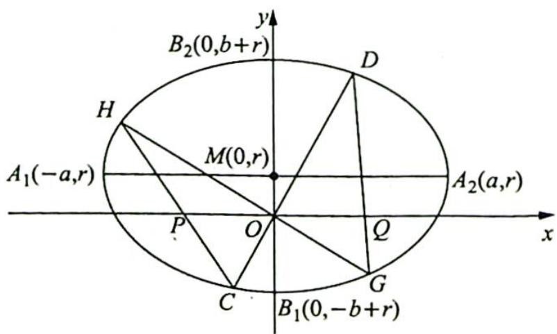

$D(x_{2},y_{2})(y_{2}>0)$ ，直线 $y=k_{2}x$ 与椭圆交于 $G(x_{3},y_{3})$ ， $H(x_{4},y_{4})(y_{4}>0)$ ，求证： $\frac{k_{1}x_{1}x_{2}}{x_{1}+x_{2}}=\frac{k_{2}x_{3}x_{4}}{x_{3}+x_{4}}$ ;

(3)对于(2)中的 C, D, G, H 四点, 设 CH 交 x 轴于点 P, GD 交 x 轴于点 Q, 求证: $|OP| = |OQ|$ (证明过程不考虑 GH 或 CD 垂直于 x 轴的情形).

分析 (1)通过平移得焦点坐标,离心率同中心在原点的椭圆;(2)曲直联立后进行坐标运算,得出 $\frac{k_{1}x_{1}x_{2}}{x_{1}+x_{2}}$ 与 $\frac{k_{2}x_{3}x_{4}}{x_{3}+x_{4}}$ 的相等关系;(3)思路一:要证|OP|=|OQ|,即证|x $_{P}$ |=|x $_{Q}$ |,也即证 $x_{P}$ +x $_{Q}$ =0,所以分别表示出 $x_{P}$ ,x $_{Q}$ ,证明 $x_{P}$ +x $_{Q}$ =0;思路二:因为点O是x轴与椭圆相交所得弦的中点,直接应用圆锥曲线的蝴蝶定理.

解析 (1) 椭圆的方程为 $\frac{x^2}{a^2} + \frac{(y - r)^2}{b^2} = 1$ , 焦点坐标为 $(\pm \sqrt{a^2 - b^2}, r)$ , 离心率为 $\frac{\sqrt{a^2 - b^2}}{a}$ .

(2) 将直线 $CD$ 的方程 $y = k_{1}x$ 代入椭圆的方程 $\frac{x^{2}}{a^{2}} + \frac{(y - r)^{2}}{b^{2}} = 1$ 中, 整理得 $(b^{2} + a^{2}k_{1}^{2})x^{2} - 2k_{1}a^{2}rx + (a^{2}r^{2} - a^{2}b^{2}) = 0$ .

根据韦达定理, 得 $\left\{\begin{aligned}x_{1}+x_{2}&=\frac{2k_{1}a^{2}r}{b^{2}+a^{2}k_{1}^{2}}\\ x_{1}x_{2}&=\frac{a^{2}r^{2}-a^{2}b^{2}}{b^{2}+a^{2}k_{1}^{2}}\end{aligned}\right.$ ，所以 $\frac{x_{1}x_{2}}{x_{1}+x_{2}}=\frac{r^{2}-b^{2}}{2k_{1}r}$ .

同理可得 $\frac{x_3x_4}{x_3 + x_4} = \frac{r^2 - b^2}{2k_2r}$ ，则 $\frac{k_1x_1x_2}{x_1 + x_2} = \frac{r^2 - b^2}{2r} = \frac{k_2x_3x_4}{x_3 + x_4}$ .

(3)证法一(坐标运算): 根据 C, P, H 三点共线, 可得 $\frac{y_{4}}{x_{4}-x_{P}} = \frac{y_{1}}{x_{1}-x_{P}}$ , 即 $\frac{k_{2}x_{4}}{x_{4}-x_{P}} = \frac{k_{1}x_{1}}{x_{1}-x_{P}}$ , 解得 $x_{P} = \frac{(k_{1}-k_{2})x_{1}x_{4}}{k_{1}x_{1}-k_{2}x_{4}}$ , 同理可得 $x_{Q} = \frac{(k_{1}-k_{2})x_{2}x_{3}}{k_{1}x_{2}-k_{2}x_{3}}$ .

根据(2)中的结论 $\frac{k_1x_1x_2}{x_1 + x_2} = \frac{k_2x_3x_4}{x_3 + x_4}$ , 可得

$$
x _ {P} + x _ {Q} = \frac {(k _ {1} - k _ {2}) [ k _ {1} x _ {1} x _ {2} (x _ {3} + x _ {4}) - k _ {2} x _ {3} x _ {4} (x _ {1} + x _ {2}) ]}{(k _ {1} x _ {1} - k _ {2} x _ {4}) (k _ {1} x _ {2} - k _ {2} x _ {3})} = 0,
$$

所以 $|x_{P}| = |x_{Q}|$ ，即 $|OP| = |OQ|$ .

证法二(蝴蝶定理): 因为点 O 是 x 轴与椭圆相交所得弦的中点, 且 CH 交 x 轴于点 P, GD 交 x 轴于点 Q, 所以根据圆锥曲线的蝴蝶定理, 可得 $\left|OP\right| = \left|OQ\right|$ .

# 圆锥曲线的光学性质及其应用

## 14.6 圆锥曲线的光学性质

## 研究密钥

圆锥曲线的光学性质背后蕴含着奇妙的数学关系. 要探究圆锥曲线的光学性质, 首先必须将这样一个光学实际问题, 转化为数学问题, 用我们学过的知识进行解释论证.

## 1. 椭圆的光学性质

从椭圆一个焦点发出的光,经过椭圆反射后,反射光线都汇聚到椭圆的另一个焦点上.椭圆的这种光学特性,常被用来设计一些照明设备或聚热装置.

## 2. 双曲线的光学性质

从双曲线一个焦点发出的光,经过双曲线反射后,反射光线的反向延长线都汇聚到双曲线的另一个焦点. 双曲线的这种反向虚聚焦性质,常被用在天文望远镜的设计等方面.

## 3. 抛物线的光学性质

从抛物线的焦点发出的光,经过抛物线反射后,反射光线都平行于抛物线的轴.抛物线这种聚焦特性,成为聚能装置或定向发射装置的最佳选择.

以下就将圆锥曲线的光学性质用数学的方法进行解释论证.

例 14.13（椭圆的光学性质）: 如图所示, 从椭圆的一个焦点发出的光, 经过椭圆反射后, 反射光线都汇聚到椭圆的另一个焦点上. 用数学语言描述为: 设椭圆的方程为 $\frac{x^{2}}{a^{2}} + \frac{y^{2}}{b^{2}} = 1 (a > b > 0)$ , 左、右焦点分别为 $F_{1}, F_{2}$ , 直线 $l$ 是过椭圆上任意一点 $P$ 处的切线, 直线 $l'$ 为

垂直于直线 l 且过点 P 的椭圆的法线，交 x 轴于点 D，则 $\angle F_{1}PD = \angle F_{2}PD$ .

分析 思路一: 将角的关系转化为边的关系, 考虑三角形的角平分线的判定定理, 要证 $\angle F_{1}PD = \angle F_{2}PD$ , 即证 $\frac{|F_{1}D|}{|DF_{2}|} = \frac{|PF_{1}|}{|PF_{2}|}$ , 结合椭圆的焦半径公式证明此等式; 思路二: 将角的关系转化为坐标的关系, 利用两条直线的到角公式将 $\tan \angle F_{1}PD$ 与 $\tan \angle F_{2}PD$ 用坐标表示出来进行比较.

解析 ▶ 证法一: 设点 $P(x_0, y_0)$ , 则切线 $l$ 的方程为 $\frac{x_0 x}{a^2} + \frac{y_0 y}{b^2} = 1$ .

利用直线的点斜式可知法线 $l'$ 的方程为 $\frac{y_0}{b^2} (x - x_0) - \frac{x_0}{a^2} (y - y_0) = 0$ ，在 $l'$ 的方程中，令 $y =$

0 得 $x = \frac{c^2}{a^2} x_0$ ，所以 $D\left(\frac{c^2}{a^2} x_0, 0\right), \frac{|F_1 D|}{|DF_2|} = \frac{\left|\frac{c^2}{a^2} x_0 + c\right|}{\left|c - \frac{c^2}{a^2} x_0\right|} = \frac{|a^2 + cx_0|}{|a^2 - cx_0|}$ .

由椭圆焦半径公式得 $|PF_1| = a + ex_0 = \frac{a^2 + cx_0}{a}, |PF_2| = a - ex_0 = \frac{a^2 - cx_0}{a}$ , 所以 $\frac{|F_1D|}{|DF_2|} = \frac{|PF_1|}{|PF_2|}$ , 则由三角形的角平分线的判定定理可知 $\angle F_1PD = \angle F_2PD$ .

证法二:设点 $P(x_{0},y_{0})$ ，则切线 l 的方程为 $\frac{x_{0}x}{a^{2}}+\frac{y_{0}y}{b^{2}}=1$ ，所以法线 $l'$ 的斜率为 $k_{l'}=\frac{a^{2}y_{0}}{b^{2}x_{0}}$ .
又因为直线 $PF_{1}$ 和直线 $PF_{2}$ 的斜率分别为 $k_{PF_{1}}=\frac{y_{0}}{x_{0}+c}, k_{PF_{2}}=\frac{y_{0}}{x_{0}-c}$ ，所以利用两条直线的到角公式可得 $\tan\angle F_{1}PD=\frac{k_{l'}-k_{PF_{1}}}{1+k_{l'}k_{PF_{1}}}=\frac{\frac{a^{2}y_{0}}{b^{2}x_{0}}-\frac{y_{0}}{x_{0}+c}}{1+\frac{a^{2}y_{0}}{b^{2}x_{0}}\cdot\frac{y_{0}}{x_{0}+c}}=\frac{c^{2}x_{0}y_{0}+a^{2}cy_{0}}{b^{2}x_{0}^{2}+a^{2}y_{0}^{2}+b^{2}cx_{0}}=$ $\frac{c^{2}x_{0}y_{0}+a^{2}cy_{0}}{a^{2}b^{2}+b^{2}cx_{0}}=\frac{cy_{0}}{b^{2}}.$

同理可得 $\tan \angle F_{2}PD = \frac{cy_{0}}{b^{2}}$ ，所以 $\tan \angle F_{1}PD = \tan \angle F_{2}PD$ ，即 $\angle F_{1}PD = \angle F_{2}PD$ .

例 14.14 (双曲线的光学性质) 如图所示, 从双曲线的一个焦点发出的光, 经过双曲线反射后, 反射光线的反向延长线都经过双曲线的另一个焦点. 用数学语言描述为设双曲线的方程为 $\frac{x^{2}}{a^{2}} - \frac{y^{2}}{b^{2}} = 1 (a, b > 0)$ , 左、右焦点分别为 $F_{1}, F_{2}$ , 直线 $l$ 是过双曲线上任意一点 $P$ 处的切线, 交 $x$ 轴于点 $D$ , 则 $\angle F_{1}PD = \angle F_{2}PD$ .

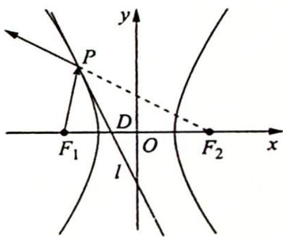

分析 ▶ 思路一: 将角的关系转化为边的关系, 考虑三角形的角平分线的判定定理, 要证 $\angle F_{1}PD = \angle F_{2}PD$ , 即证 $\frac{|F_{1}D|}{|DF_{2}|} = \frac{|PF_{1}|}{|PF_{2}|}$ , 结合双曲线的焦半径公式证明此等式; 思路二: 将角的关系转化为坐标的关系, 利用两条直线的到角公式将 $\tan\angle F_{1}PD$ 与 $\tan\angle F_{2}PD$ 用坐标表示出来进行比较.

解析 ▶ 证法一: 设点 $P(x_0, y_0)$ , 则切线 $l$ 的方程为 $\frac{x_0 x}{a^2} - \frac{y_0 y}{b^2} = 1$ , 令 $y = 0$ 得 $x = \frac{a^2}{x_0}$ , 则 $D\left(\frac{a^2}{x_0}, 0\right)$ , 所以 $\frac{|F_1 D|}{|DF_2|} = \frac{\left|\frac{a^2}{x_0} + c\right|}{\left|c - \frac{a^2}{x_0}\right|} = \frac{|a^2 + cx_0|}{|a^2 - cx_0|}$ .

由双曲线的焦半径公式得 $\left\{\begin{aligned}|PF_{1}|&=|-a-ex_{0}|=\left|-\frac{a^{2}+cx_{0}}{a}\right|\\ |PF_{2}|&=|a-ex_{0}|=\left|\frac{a^{2}-cx_{0}}{a}\right|\end{aligned}\right.$ ，所以 $\frac{|F_{1}D|}{|DF_{2}|}=\frac{|PF_{1}|}{|PF_{2}|}$ .

故由三角形的角平分线的判定定理可知 $\angle F_{1}PD = \angle F_{2}PD.$

证法二:设点 $P(x_{0},y_{0})$ ，则切线 l 的方程为 $\frac{x_{0}x}{a^{2}}-\frac{y_{0}y}{b^{2}}=1$ ，其斜率为 $k_{l}=\frac{b^{2}x_{0}}{a^{2}y_{0}}$ .

又因为直线 $PF_{1}$ 和直线 $PF_{2}$ 的斜率分别为 $k_{PF_1} = \frac{y_0}{x_0 + c}, k_{PF_2} = \frac{y_0}{x_0 - c}$ , 所以由两条直线的

到角公式得 $\tan \angle F_{1}PD = \frac{k_{l} - k_{PF_{1}}}{1 + k_{l}k_{PF_{1}}} = \frac{\frac{b^{2}x_{0}}{a^{2}y_{0}} - \frac{y_{0}}{x_{0} + c}}{1 + \frac{b^{2}x_{0}}{a^{2}y_{0}}\cdot\frac{y_{0}}{x_{0} + c}} = \frac{b^{2}x_{0}^{2} - a^{2}y_{0}^{2} + b^{2}cx_{0}}{(a^{2} + b^{2})x_{0}y_{0} + a^{2}cy_{0}} =$ $\frac{a^2b^2 + b^2cx_0}{c^2x_0y_0 + a^2cy_0} = \frac{b^2}{cy_0}.$

同理得 $\tan \angle F_{2}PD = \frac{b^{2}}{cy_{0}}$ ，所以 $\tan \angle F_{1}PD = \tan \angle F_{2}PD$ ，即 $\angle F_{1}PD = \angle F_{2}PD$ .

例 14.15 (抛物线的光学性质) 如图所示, 从抛物线的一个焦点发出的光, 经过抛物线反射后, 反射光线平行于抛物线的对称轴. 用数学语言描述为设抛物线的方程为 $y^{2} = 2px (p > 0)$ , 焦点为 $F$ , 直线 $l$ 是过抛物线上任意一点 $P$ 处的切线, 交 $x$ 轴于点 $D$ , 则 $\angle FDP = \angle FPD$ .

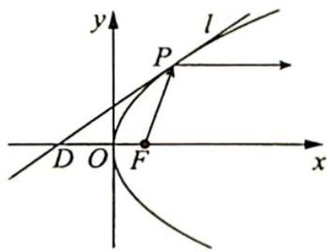

分析 ▶ 思路一: 将角的关系转化为边的关系, 要证 $\angle FDP = \angle FPD$ , 即证 $|DF| = |PF|$ , 结合抛物线焦半径公式证明此等式; 思路二: 将角的关系转化为坐标的关系, 利用两条直线的到角公式将 $\tan \angle FDP$ 与 $\tan \angle FPD$ 用坐标表示出来进行比较来证明.

解析 ▶ 证法一: 设点 $P(x_0, y_0)$ , 则切线 $l$ 的方程为 $y_0y = p(x + x_0)$ , 令 $y = 0$ 得 $x = -x_0$ , 所以 $D(-x_0, 0), |DF| = \frac{p}{2} + x_0$ .

由抛物线的焦半径公式得 $|PF| = x_0 - \left(-\frac{p}{2}\right) = x_0 + \frac{p}{2}$ , 所以 $|DF| = |PF|$ , 则 $\angle FDP = \angle FPD$ .

证法二:设点 $P(x_{0},y_{0})$ ，则切线 l 的方程为 $y_{0}y=p(x+x_{0})$ ，所以 $\tan\angle FDP=k_{l}=\frac{p}{y_{0}}$ .

又因为直线 $PF$ 的斜率为 $k_{PF} = \frac{y_0}{x_0 - \frac{p}{2}}$ , 所以由两条直线的到角公式得 $\tan \angle FPD =$ $\frac{k_{PF} - k_l}{1 + k_{PF}k_l} = \frac{\frac{y_0}{x_0 - \frac{p}{2}} - \frac{p}{y_0}}{1 + \frac{y_0}{x_0 - \frac{p}{2}} \cdot \frac{p}{y_0}} = \frac{y_0^2 - px_0 + \frac{p^2}{2}}{x_0y_0 + \frac{py_0}{2}} = \frac{\frac{y_0^2}{2} + \frac{p^2}{2}}{\frac{y_0^3}{2p} + \frac{py_0}{2}} = \frac{p}{y_0}$ , 则 $\tan \angle FDP = \tan \angle FPD$ , 即 $\angle FDP = \angle FPD$ .

## 14.7 光学性质应用

## 研究密钥

近年来, 涉及圆锥曲线的焦半径、切线等相关的问题在高考、自主招生及各类数学竞赛中频频出现. 对于这类问题, 如果利用解析法求解, 运算量较大, 正确率也并不高, 但利用圆锥曲线的光学性质求解, 思路简洁, 会给人耳目一新的感觉, 同时以圆锥曲线的光学性质为背景还可以编拟有趣的新命题, 也便于学生理解和掌握. 把圆锥曲线的切线想象成一面小小的平面镜, 不失为一种好办法, 在应用圆锥曲线的光学性质时, 还要注意应用光线的路程最短、光路可逆等性质.

例14.16 已知点 $P$ 在抛物线 $y = x^{2} (x > 0)$ 上，点 $A$ 的坐标为 $\left(-\frac{1}{3}, 0\right)$ ，抛物线在点 $P$ 处的切线与 $y$ 轴及直线 $PA$ 的夹角相等，求点 $P$ 的坐标。

分析 ▶ 由夹角相等的条件及抛物线的光学性质可知焦点 F 在直线 PA 上, 设出点 P 坐标, 由 $k_{FA} = k_{PF}$ 列方程求 P 点横坐标.

解析 如图所示, 设抛物线的焦点为 $F$ , 则 $F\left(0, \frac{1}{4}\right)$ , 因为抛物线在点 $P$ 处的切线与 $y$ 轴及直线 $PA$ 的夹角相等, 即 $\angle 1 = \angle 2$ , 所以平行于 $y$ 轴的入射光线 $BP$ 经抛物线反射后的反射光线为射线 $PA$ . 根据抛物线的光学性质及光路的可逆性知: 焦点 $F$ 在直线 $PA$ 上.

设 $P(x_0, x_0^2)(x_0 > 0)$ , 则 $\frac{x_0^2 - \frac{1}{4}}{x_0 - 0} = \frac{0 - \frac{1}{4}}{-\frac{1}{3} - 0}$ , 解得 $x_0 = 1$ 或 $x_0 = -\frac{1}{4}$ (舍去), 所以点 $P$ 的坐为(1,1).

标为 $(1,1)$ .

例 14.17 (2010 安徽卷理 19) 已知椭圆 E 经过点 A(2,3)，对称轴为坐标轴，焦点 $F_{1}, F_{2}$ 在 x 轴上，离心率 $e = \frac{1}{2}$ .

(1) 求椭圆 E 的方程；

(2) 求 $\angle F_{1}AF_{2}$ 的平分线所在直线 l 的方程；

(3)在椭圆 $E$ 上是否存在关于直线 $l$ 对称的相异两点？若存在，请找出；若不存在，说明理由.

分析 ▶ (1) 已知椭圆基本量, 待定系数法求椭圆方程. (2) 由椭圆的光学性质可知 $\angle F_{1} A F_{2}$ 的平分线为椭圆 $E$ 在点 $A$ 处的法线, 而在该点处的切线易求, 则此法线也易求. (3) 假设在椭圆 $E$ 上存在关于直线 $l$ 对称的相异两点, 设出两点所在方程, 将中点坐标用引入的参数表示出来. 另一方面, 该中点又在法线 $l$ 上, 将坐标代入法线 $l$ 的方程, 若能求出满足要求的解, 则存在; 否则, 则不存在.

解析 (1) 设椭圆 $E$ 的方程为 $\frac{x^2}{a^2} + \frac{y^2}{b^2} = 1 (a > b > 0)$ .

根据题意可得 $\left\{ \begin{array}{l} \frac{4}{a^2} + \frac{9}{b^2} = 1 \\ \frac{c}{a} = \frac{1}{2} \\ a^2 - b^2 = c^2 \end{array} \right.$ ，解得 $\left\{ \begin{array}{l} a^2 = 16 \\ b^2 = 12 \end{array} \right.$ ，所以椭圆 $E$ 的方程为 $\frac{x^2}{16} + \frac{y^2}{12} = 1$ .

(2)如图所示,由椭圆的光学性质可知直线 l 为椭圆 E 在点 A(2,3) 处的法线,易求得椭圆 E 在点 A(2,3) 处的切线方程为 $\frac{2x}{16} + \frac{3y}{12} = 1$ , 其斜率为 $-\frac{1}{2}$ , 所以法线 l 的斜率为 $k_{l} = -\frac{1}{-\frac{1}{2}} = 2$ , 其方程为 y - 3 = 2(x - 2), 即 2x - y - 1 = 0.

(3)假设在椭圆 $E$ 上存在关于直线 $l$ 对称的相异两点 $B(x_{1},y_{1}),C(x_{2},y_{2})$ ，则直线 $BC$ 的斜率为 $-\frac{1}{k_l} = -\frac{1}{2}$ ，设其方程为 $y = -\frac{1}{2} x + m$ ，联立方程组 $\left\{ \begin{array}{l} \frac{x^2}{16} +\frac{y^2}{12} = 1 \\ y = -\frac{1}{2} x + m \end{array} \right.$ ，得 $x^{2} - mx + m^{2} - 12 = 0$ ，则由 $\Delta = (-m)^{2} - 4(m^{2} - 12) > 0$ 解得 $m\in (-4,4)$ .且 $x_{1} + x_{2} = m$ ，所以 $y_{1} + y_{2} =$ $-\frac{1}{2} (x_1 + x_2) + 2m = \frac{3m}{2}$

$BC$ 的中点坐标为 $\left(\frac{x_1 + x_2}{2}, \frac{y_1 + y_2}{2}\right)$ , 即 $\left(\frac{m}{2}, \frac{3m}{4}\right)$ , 该点在直线 $l$ 上, 则 $2 \cdot \frac{m}{2} - \frac{3m}{4} - 1 = 0$ , 解得 $m = 4$ , 与 $m \in (-4, 4)$ 矛盾, 所以假设不正确, 即在椭圆 $E$ 上不存在关于直线 $l$ 对称的相异两点.

变式(1) (东北三省 2020 届高三一模理 12) 已知双曲线 $x^{2} - \frac{y^{2}}{3} = 1$ 的左、右焦点分别为

$F_{1}, F_{2}$ ，点 P 在双曲线上，且 $\angle F_{1}PF_{2}=120^{\circ}$ ， $\angle F_{1}PF_{2}$ 的平分线交 x 轴于点 A，则 $|PA|=(\quad)$ .
A. $\frac{\sqrt{5}}{5}$ B. $\frac{2\sqrt{5}}{5}$ C. $\frac{3\sqrt{5}}{5}$ D. $\sqrt{5}$

解析 ▶ 由双曲线的对称性, 不妨设 $P$ 在右支上, 如图所示, 设 $|PF_{1}| = m$ , $|PF_{2}| = m - 2$ , $|F_{1}F_{2}| = 2c = 4$ , 则 $\cos 120^{\circ} = -\frac{1}{2} = \frac{m^{2} + (m - 2)^{2} - 16}{2m(m - 2)}$ , 得 $m^{2} + m^{2} - 4m + 4 - 16 = -m(m - 2)$ , 即 $2m^{2} - 4m - 12 + m^{2} - 2m = 0$ , $3m^{2} - 6m - 12 = 0$ , $m^{2} - 2m - 4 = 0$ , $m = \frac{2 \pm 2\sqrt{5}}{2} = 1 \pm \sqrt{5}$ , 因此 $|PF_{1}| = 1 + \sqrt{5}$ , $|PF_{2}| = \sqrt{5} = 1$

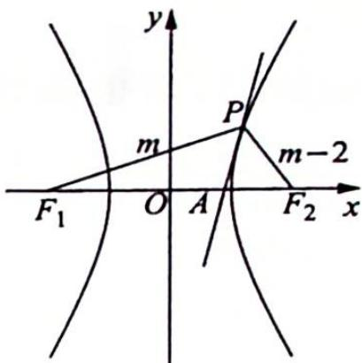

$$
\left| P F _ {1} \right| = 1 + \sqrt {5}, \left| P F _ {2} \right| = \sqrt {5} - 1
$$

$$
S _ {\triangle P F _ {1} F _ {2}} = \frac {b ^ {2}}{\tan \frac {\theta}{2}} = \frac {3}{\tan \frac {\pi}{3}} = \sqrt {3} = \frac {1}{2} | P F _ {1} | | P A | \sin 6 0 ^ {\circ} + \frac {1}{2} | P F _ {2} | | P A | \sin 6 0 ^ {\circ} =
$$

$\frac{\sqrt{3}}{4} |PA| (|PF_1| + |PF_2|)$ , 又 $|PF_1| = 1 + \sqrt{5}$ , $|PF_2| = \sqrt{5} - 1$ , 则 $\sqrt{3} = \frac{\sqrt{3}}{4} |PA| \cdot 2\sqrt{5}$ , 因此 $|PA| = \frac{2}{\sqrt{5}} = \frac{2\sqrt{5}}{5}$ . 故选 B.

例14.18 (2013 山东卷理 22) 椭圆 $C: \frac{x^2}{a^2} + \frac{y^2}{b^2} = 1 (a > b > 0)$ 的左、右焦点分别是 $F_1, F_2$ ，离心率为 $\frac{\sqrt{3}}{2}$ ，过点 $F_1$ 且垂直于 $x$ 轴的直线被椭圆 $C$ 截得的线段长为 1。

(1) 求椭圆 C 的方程；

(2) 点 $P$ 是椭圆 $C$ 上除长轴端点外的任一点, 连接 $PF_{1}, PF_{2}$ , 设 $\angle F_{1}PF_{2}$ 的角平分线 $PM$ 交椭圆 $C$ 的长轴于点 $M(m,0)$ , 求 $m$ 的取值范围;

(3)在(2)的条件下,过点 $P$ 作斜率为 $k$ 的直线 $l$ ,使得直线 $l$ 与椭圆 $C$ 有且只有一个公共点.设直线 $PF_{1},PF_{2}$ 的斜率分别为 $k_{1},k_{2}$ ,若 $k \neq 0$ ,试证明 $\frac{1}{kk_1} + \frac{1}{kk_2}$ 为定值,并求出这个定值.

分析 ▶ (1)已知椭圆基本量,用待定系数法求椭圆方程;(2)根据椭圆的光学性质知PM是法线,其方程易求.令y=0,将m表示为P点横坐标 $x_{0}$ 的函数,借 $x_{0}$ 范围得出m的范围.(3)证明 $\frac{1}{kk_{1}}+\frac{1}{kk_{2}}$ 为定值并求得这个定值,需将其用 $x_{0},y_{0}$ 表示并整理,看参数是否约去得出定值.表示斜率k时,由于l是点P处的切线,其方程和斜率易得.

解析 (1)由题意可得点 $\left(-c, \pm \frac{1}{2}\right)$ 均在椭圆 $C$ 上, 所以有 $\frac{c^2}{a^2} + \frac{1}{4b^2} = 1$ .

再结合 $\left\{\begin{aligned}\frac{c}{a}&=\frac{\sqrt{3}}{2}\\ a^{2}-b^{2}&=c^{2}\end{aligned}\right.$ ，可得 $\left\{\begin{aligned}a^{2}&=4\\ b^{2}&=1\end{aligned}\right.$ ，所以椭圆C的方程为 $\frac{x^{2}}{4}+y^{2}=1$ 。

(2)如图所示,设 $P(x_0,y_0)$ , 过点 $P$ 作椭圆的切线 $l$ , 其方程为 $\frac{x_0x}{4} + y_0y = 1$ , 则根据椭圆的光学性质可得: 直线 $PM$ 是椭圆在点 $P$ 处的法线, 其斜率为 $-\frac{1}{k_l} = \frac{4y_0}{x_0}$ , 方程为 $y - y_0 = \frac{4y_0}{x_0}(x - x_0)$ .

令 $y = 0$ ，可得 $m = \frac{3}{4} x_0$ ，因为 $-2 < x_0 < 2$ ，所以 $m$ 的取值范围是 $\left(-\frac{3}{2}, \frac{3}{2}\right)$ .

(3)因为直线 l 与椭圆 C 有且只有一个公共点,所以直线 l 是椭圆 C 在点 P 处的切线,其方程为 $\frac{x_{0}x}{4} + y_{0}y = 1$ , 斜率为 $k = -\frac{x_{0}}{4y_{0}}$ .

又因为 $k_{1}=\frac{y_{0}}{x_{0}+c}, k_{2}=\frac{y_{0}}{x_{0}-c}$ ，所以 $\frac{1}{kk_{1}}+\frac{1}{kk_{2}}=-\frac{4y_{0}}{x_{0}}\left(\frac{x_{0}+c}{y_{0}}+\frac{x_{0}-c}{y_{0}}\right)=-\frac{4y_{0}}{x_{0}}\cdot\frac{2x_{0}}{y_{0}}=-8$ ，故 $\frac{1}{kk_{1}}+\frac{1}{kk_{2}}$ 的值为定值，定值为 -8.

变式1 双曲线 $C: \frac{x^2}{a^2} - \frac{y^2}{b^2} = 1 (a, b > 0)$ 的左、右焦点分别是 $F_1, F_2$ ，点 $P$ 是双曲线 $C$ 上除实轴端点外的任一点，连接 $PF_1, PF_2$ ，设 $\angle F_1PF_2$ 的角平分线 $PM$ 交双曲线 $C$ 的实轴于点 $M(m, 0)$ .

(1) 求 m 的取值范围；

(2)过点 P 作斜率为 k 的直线 l，使得直线 l 与双曲线 C 有且只有一个公共点。设直线 $PF_{1}$ ， $PF_{2}$ 的斜率分别为 $k_{1}, k_{2}$ ，若 $k \neq 0$ ，试证明 $\frac{1}{kk_{1}} + \frac{1}{kk_{2}}$ 为定值，并求出这个定值。

解析 (1)如图所示, 设 $P(x_{0}, y_{0})$ , 因为 $PM$ 是 $\angle F_{1}PF_{2}$ 的角平分线, 所以根据双曲线的光学性质可得: 直线 $PM$ 是双曲线在点 $P$ 处的切线, 其方程为 $\frac{x_{0}x}{a^{2}} - \frac{y_{0}y}{b^{2}} = 1$ .

令 $y = 0$ ，可得 $m = \frac{a^2}{x_0}$ ，又 $x_0 \in (-\infty, -a) \cup (a, +\infty)$ ，所以 $m$ 的取值范围是 $(-a, 0) \cup (0, a)$ .

(2)因为直线 l 与双曲线 C 有且只有一个公共点,所以直线 l 是双曲线 C 在点 P 处的切线,其方程为 $\frac{x_{0}x}{a^{2}} - \frac{y_{0}y}{b^{2}} = 1$ , 斜率为 $k = \frac{b^{2}x_{0}}{a^{2}y_{0}}$ .

又因为 $k_{1} = \frac{y_{0}}{x_{0} + c}, k_{2} = \frac{y_{0}}{x_{0} - c}$ , 所以 $\frac{1}{kk_{1}} + \frac{1}{kk_{2}} = \frac{a^{2}y_{0}}{b^{2}x_{0}}\left(\frac{x_{0} + c}{y_{0}} + \frac{x_{0} - c}{y_{0}}\right) = \frac{a^{2}y_{0}}{b^{2}x_{0}} \cdot \frac{2x_{0}}{y_{0}} = \frac{2a^{2}}{b^{2}}$ , 为定值.

## 14.8 圆锥曲线的蒙日圆

## 研究密钥

我们从小学开始接触圆,在初中从图形(几何法)上定性研究圆的基本性质,进入高中后在直角坐标系中用坐标(代数法)定量研究并得到了圆的标准方程及一般方程.定性与定量的有机结合、数与形的完美互补,使得我们对圆有了较为完善的认识.其实,圆有更丰富的内涵,比如阿波罗尼斯圆、蒙日圆等,下面就浅谈蒙日圆的相关定理、证明及应用.

引理: 已知点 P 为矩形 ABCD 所在平面上任意一点, 则有 $\left|PA\right|^{2} + \left|PC\right|^{2} = \left|PB\right|^{2} + \left|PD\right|^{2}$ .

【证明】在平面直角坐标系中, 设 $P(x,y), A(0,0), B(a,0), C(a,b), D(0,b) (a > 0, b > 0)$ , 则 $\left\{ \begin{array}{l} |PA|^2 + |PC|^2 = x^2 + y^2 + (x - a)^2 + (y - b)^2 \\ |PB|^2 + |PD|^2 = (x - a)^2 + y^2 + x^2 + (y - b)^2 \end{array} \right.$ , 所以 $|PA|^2 + |PC|^2 = |PB|^2 + |PD|^2$ .

定理 1(椭圆的蒙日圆): 过椭圆 $\frac{x^{2}}{a^{2}} + \frac{y^{2}}{b^{2}} = 1 (a > b > 0)$ 上任意不同两点 A, B 作椭圆的切线, 如果两条切线垂直且相交于点 P, 那么动点 P 的轨迹为圆, 其方程为 $x^{2} + y^{2} = a^{2} + b^{2}$ .

【证明】如图所示, 设 $P(x,y)$ , 作点 $F_{1}$ 关于直线 PA, PB 的对称点 $F_{1}^{\prime}, F_{1}^{\prime\prime}$ , 设 $F_{1}F_{1}^{\prime}$ 和直线 PA 交于点 M, $F_{1}F_{1}^{\prime\prime}$ 和直线 PB 交于点 N, 根据椭圆的光学性质可知 $F_{1}^{\prime}, A, F_{2}$ 三点共线, 且 $\left|F_{1}^{\prime}F_{2}\right| = \left|F_{1}^{\prime}A\right| + \left|AF_{2}\right| = \left|F_{1}A\right| + \left|AF_{2}\right| = 2a$ , 又 $\left\{\begin{aligned}|F_{1}M| &= |MF_{1}^{\prime}| \\ |F_{1}O| &= |OF_{2}| \end{aligned}\right.$ , 所以 OM 是

$\triangle F_{1}F_{1}^{\prime}F_{2}$ 的中位线, 所以 $|OM| = \frac{1}{2}|F_{1}^{\prime}F_{2}| = a$ , 同理可得 $|ON| = a$ , 易证四边形 $F_{1}MPN$ 为矩形, 所以根据引理可得 $|OP|^2 + |OF_1|^2 = |OM|^2 + |ON|^2$ , 即 $x^2 + y^2 = |OP|^2 = |OM|^2 + |ON|^2 - |OF_1|^2 = a^2 + b^2$ .

故动点 P 的轨迹为圆, 其方程为 $x^{2} + y^{2} = a^{2} + b^{2}$ .

定理2(双曲线的蒙日圆): 过双曲线 $\frac{x^{2}}{a^{2}} - \frac{y^{2}}{b^{2}} = 1 (a > 0, b > 0)$ 上任意不同两点 $A, B$ 作双曲线的切线, 如果两条切线垂直且相交于点 $P$ , 那么动点 $P$ 的轨迹为圆, 其方程为 $x^{2} + y^{2} = a^{2} - b^{2}$ .

【证明】如图①所示, 当 $A, B$ 两点位于双曲线的两支上时, 设 $P(x, y)$ , 作点 $F_{1}$ 关于直线 $PA, PB$ 的对称点 $F_{1}^{\prime}, F_{1}^{\prime \prime}$ , 设 $F_{1}F_{1}^{\prime}$ 和直线 $PA$ 交于点 $M, F_{1}F_{1}^{\prime \prime}$ 和直线 $PB$ 交于点 $N$ , 根据双曲线的光学性质可知 $A, F_{1}^{\prime}, F_{2}$ 三点共线, 且 $|F_{1}^{\prime}F_{2}| = |AF_{2}| - |AF_{1}^{\prime}| = |AF_{2}| - |AF_{1}| = 2a$ ,又 $\left\{\begin{aligned}|F_{1}M|&=|MF_{1}^{\prime}|\\ |F_{1}O|= &|OF_{2}|\end{aligned}\right.$ ，所以OM是 $\triangle F_{1}F_{1}^{\prime}F_{2}$ 的中位线，所以 $|OM|=\frac{1}{2}|F_{1}^{\prime}F_{2}|=a$ ，同理可得 $|ON|=a.$

易证四边形 $F_{1}MPN$ 为矩形, 所以根据引理可得 $|OP|^{2} + |OF_{1}|^{2} = |OM|^{2} + |ON|^{2}$ , 即 $x^{2} + y^{2} = |OP|^{2} = |OM|^{2} + |ON|^{2} - |OF_{1}|^{2} = a^{2} - b^{2}$ .

故动点 P 的轨迹为圆, 其方程为 $x^{2} + y^{2} = a^{2} - b^{2}$ .

如图②所示,当 $A,B$ 两点位于双曲线的同一支上时,可得到相同的结论.

①

②

定理 3(圆的蒙日圆): 过圆 $x^{2} + y^{2} = a^{2} (a > 0)$ 上任意不同两点 A, B 作圆的切线, 如果两条切线垂直且相交于点 P, 那么动点 P 的轨迹为圆, 其方程为 $x^{2} + y^{2} = 2a^{2}$ .

【证明】这是椭圆为蒙日圆的特殊情形. 令 b=a, 得出圆的蒙日圆方程为 $x^{2}+y^{2}=2a^{2}$ .

例 14.19 (2014 广东卷理 20) 已知椭圆 $C: \frac{x^2}{a^2} + \frac{y^2}{b^2} = 1 (a > b > 0)$ 的一个焦点为 $(\sqrt{5}, 0)$ , 离心率为 $\frac{\sqrt{5}}{3}$ .

(1) 求椭圆 C 的标准方程；

(2)若动点 $P(x_0, y_0)$ 为椭圆 $C$ 外一点, 且点 $P$ 到椭圆 $C$ 的两条切线互相垂直, 求点 $P$ 的轨迹方程.

分析 ▶ (1)已知椭圆基本量、待定系数法求椭圆方程；(2)点 $P$ 到椭圆 $C$ 的两条切线互相垂直, 那么动点 $P$ 的轨迹方程就是椭圆的蒙日圆方程, 解答过程需正常书写.

解析 (1)由题意得 $\left\{ \begin{array}{l} c = \sqrt{5} \\ \frac{c}{a} = \frac{\sqrt{5}}{3} \end{array} \right.$ , 结合 $a^2 - b^2 = c^2$ , 可得 $\left\{ \begin{array}{l} a^2 = 9 \\ b^2 = 4 \end{array} \right.$ , 所以椭圆 $C$ 的标准方程为 $\frac{x^2}{9} + \frac{y^2}{4} = 1$ .

(2)①若两条切线的斜率都存在,则设切线方程为 $y = k(x - x_0) + y_0$ , 将其代入椭圆的方程 $\frac{x^2}{9} + \frac{y^2}{4} = 1$ 中, 可得 $4x^2 + 9 [k(x - x_0) + y_0]^2 - 36 = 0$ , 即 $(9k^2 + 4)x^2 + 18k(y_0 - kx_0)x +$

$9[(y_0 - kx_0)^2 - 4] = 0.$

根据 $\Delta = [18k(y_0 - kx_0)]^2 - 36(9k^2 + 4)[(y_0 - kx_0)^2 - 4] = 0$ ，化简得 $(y_0 - kx_0)^2 - (9k^2 + 4) = 0$ ，整理成关于 $k$ 的一元二次方程为 $(x_0^2 - 9)k^2 - 2x_0y_0k + y_0^2 - 4 = 0$ .

因为两条切线互相垂直,所以由韦达定理可得 $k_{1}k_{2} = \frac{y_{0}^{2} - 4}{x_{0}^{2} - 9} = -1$ , 即 $x_{0}^{2} + y_{0}^{2} = 13$ , $(x_{0} \neq \pm 3)$ .

②若一条切线垂直于 $x$ 轴, 另一条切线垂直于 $y$ 轴, 则点 $P$ 的坐标为 $(-3, -2)$ 或 $(-3, 2)$ 或 $(3, 2)$ 或 $(3, -2)$ , 显然这四点也满足方程 $x^{2} + y^{2} = 13$ .

综上可得, 点 P 的轨迹方程为 $x^{2} + y^{2} = 13$ .

变式(1) 已知椭圆 $C: \frac{x^2}{24} + \frac{y^2}{12} = 1$ , 设 $R(x_0, y_0)$ 为椭圆上任意一点. 过原点作圆 $R: (x - x_0)^2 + (y - y_0)^2 = 8$ 的两条切线, 分别交椭圆于 $P$ , $Q$ . 试问 $|OP|^2 + |OQ|^2$ 是否为定值? 若是, 求出该定值; 若不是, 请说明理由.

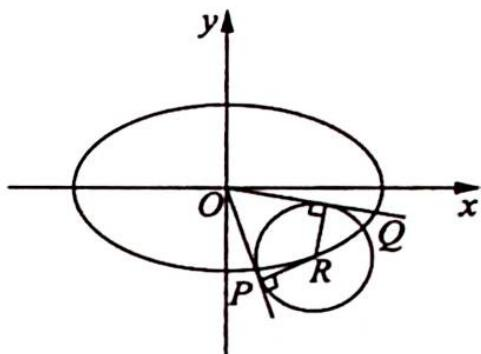

解析 设 $P(x_{1},y_{1})$ , $Q(x_{2},y_{2})$ , OP: $y=k_{1}x$ , $OQ: y=k_{2}x$ .

$|OP|^{2}+|OQ|^{2}=x_{1}^{2}+y_{1}^{2}+x_{2}^{2}+y_{2}^{2},\left\{\begin{aligned}y=k_{1}x\\ x^{2}+2y^{2}&=24\end{aligned}\right.$ ，消 y 得 $x^{2}+2k_{1}^{2}x^{2}=24$ ，即 $x_{1}^{2}=\frac{24}{2k_{1}^{2}+1}$ ， $x_{1}^{2}+y_{1}^{2}=x_{1}^{2}+12\times\left(1-\frac{x_{1}^{2}}{24}\right)=12+\frac{x_{1}^{2}}{2}=12+\frac{12}{2k_{1}^{2}+1}$ ，同理 $|OQ|^{2}=12+\frac{12}{2k_{2}^{2}+1}$ .

又 $d = 2\sqrt{2}, \frac{|kx_0 - y_0|}{\sqrt{1 + k^2}} = 2\sqrt{2}, (kx_0 - y_0)^2 = 8k^2 + 8$ ，即 $k^2 x_0^2 + y_0^2 - 2kx_0y_0 - 8k^2 - 8 = 0$ ，则

关于 $k$ 的一元二次方程为 $k^2 (x_0^2 -8) - 2x_0y_0\cdot k + y_0^2 -8 = 0$ ，得 $k_{1}k_{2} = \frac{y_{0}^{2} - 8}{x_{0}^{2} - 8} = \frac{y_{0}^{2} - 8}{16 - 2y_{0}^{2}} = -\frac{1}{2},$ $k_{2} = \frac{.1}{-2k_{1}}.$

$$
\left| O P \right| ^ {2} + \left| O Q \right| ^ {2} = 2 4 + \frac {1 2}{2 k _ {1} ^ {2} + 1} + \frac {1 2}{2 k _ {2} ^ {2} + 1} = 2 4 + 1 2 \left(\frac {1}{2 k _ {1} ^ {2} + 1} + \frac {1}{2 k _ {2} ^ {2} + 1}\right) = 2 4 +
$$

$12\left(\frac{1}{2k_{1}^{2}+1}+\frac{1}{2\cdot\frac{1}{4k_{1}^{2}}+1}\right)=24+12\left(\frac{1}{2k_{1}^{2}+1}+\frac{2k_{1}^{2}}{2k_{1}^{2}+1}\right)=36$ ，为定值.

## 训练 14

1. 过抛物线 C: $y^{2}=2px (p>0)$ 的焦点 F，且倾斜角为 $60^{\circ}$ 的直线交 C 于点 M (M 在 x 轴上方)，若以 MF 为直径的圆过点 $(0, \sqrt{3})$ ，则 C 的方程为（）.
A. $y^{2}=2x$ B. $y^{2}=4x$ C. $y^{2}=6x$ D. $y^{2}=8x$

2. (2017 新课标全国 I 卷理 15) 已知双曲线 $C: \frac{x^{2}}{a^{2}} - \frac{y^{2}}{b^{2}} = 1 (a > 0, b > 0)$ 的右顶点为 $A$ , 以 $A$ 为圆心, $b$ 为半径作圆 $A$ , 圆 $A$ 与双曲线 $C$ 的一条渐近线交于 $M, N$ 两点. 若 $\angle MAN = 60^{\circ}$ , 则 $C$ 的离心率为 \_\_\_\_.

3. 抛物线有如下光学性质: 过焦点的光线(光线不同过抛物线对称轴上任意两点)经抛物线反射后平行于抛物线的对称轴; 平行于抛物线对称轴的入射光线经抛物线反射后必过抛物线的焦点. 若一条平行于 $x$ 轴的光线从 $M(3,1)$ 射出, 经过抛物线 $y^{2}=4x$ 上的点 $A$ 反射后, 再经抛物线上的另一点 $B$ 反射出, 则直线 $AB$ 的斜率为 ( ).

A. $-\frac{4}{3}$ B. $\frac{4}{3}$ C. $\pm\frac{4}{3}$ D. $-\frac{16}{9}$

4. 已知椭圆 $C: \frac{x^2}{a^2} + \frac{y^2}{b^2} = 1 (a > b > 0)$ 的左焦点为 $F$ , 直线 $y = \sqrt{3}x$ 与 $C$ 相交于 $A, B$ 两点, 且 $AF \perp BF$ , 则 $C$ 的离心率为 \_\_\_\_.

5.(椭圆光学性质)如图所示,椭圆有这样的光学性质:从椭圆的一个焦点出发的光线,经椭圆反射后,反射光线经过椭圆的另一个焦点.根据椭圆的光学性质解决下题:已知曲线C的方程为 $x^{2}+4y^{2}=4$ ,其左、右焦点分别是 $F_{1},F_{2}$ ,直线l与椭圆C切于点P,且 $|PF_{1}|=1$ ,过

点 $P$ 且与直线 $l$ 垂直的直线 $l'$ 与椭圆长轴交于点 $M$ , 则 $\left|F_{1} M\right|: \left|F_{2} M\right| = (\quad)$ .

A. $\sqrt{2}: \sqrt{3}$ B. $1: \sqrt{2}$ C. $1: 3$ D. $1: \sqrt{3}$

6. 抛物线有如下光学性质: 过焦点的光线经抛物线反射后得到的光线平行于抛物线的对称轴; 反之, 平行于抛物线对称轴的入射光线经抛物线反射后必过抛物线的焦点. 已知抛物线 $y^{2}=4x$ 的焦点为 F, 一条平行于 x 轴的光线从点 M(3,1) 射出, 经过抛物线上的点 A 反射后, 再经抛物线上的另一点 B 射出, 则 $\triangle ABM$ 的周长为 ( ). A. $9 + \sqrt{10}$ B. $9 + \sqrt{26}$ C. $\frac{71}{12} + \sqrt{26}$ D. $\frac{83}{12} + \sqrt{26}$

7. 智慧的人们在进行工业设计时, 巧妙地利用了圆锥曲线的光学性质, 比如电影放映机利用椭圆镜面反射出聚焦光线, 探照灯利用抛物线镜面反射出平行光线. 如图所示, 从双曲线右焦点 $F_{2}$ 发出的光线通过双曲线镜面反射出发散光线, 且反射光线的反向延长线经过左焦点 $F_{1}$ . 已知双曲线的离心率为 $\sqrt{2}$ , 则当入射光线 $F_{2}P$ 和反射光线 $PE$ 相互垂直时 (其中 $P$ 为入射点), $\angle F_{1}F_{2}P$ 的大小为 ( ). A. $\frac{\pi}{12}$ B. $\frac{\pi}{6}$ C. $\frac{\pi}{3}$ D

$$
\frac {5 \pi}{1 2}
$$

8. 已知点 $A, B$ 关于坐标原点对称, $|AB| = 4$ , 圆 $M$ 过点 $A, B$ 且与直线 $x + 2 = 0$ 相切, 是否存在定点 $P$ , 使得当 $A$ 运动时, $|MA| - |MP|$ 为定值? 并说明理由.

9. 已知椭圆 $C: \frac{x^2}{a^2} + \frac{y^2}{b^2} = 1 (a > b > 0)$ 的左、右焦点分别为 $F_1, F_2$ , 上顶点为 $A$ , 离心率为 $\frac{1}{2}$ , 点 $P$ 为第一象限内椭圆上的一个点, 且 $S_{\triangle PF_1A}: S_{\triangle PF_1F_2} = 2: 1$ , 求直线 $PF_1$ 的斜率.

10. (圆锥曲线蝴蝶定理推论) 过点 $M(m,0)$ 作椭圆 $\frac{x^2}{a^2} + \frac{y^2}{b^2} = 1$ 的弦 $CD, E, F$ 分别是椭圆的左、右顶点, 则直线 $CE, DF$ 的连线交点 $G$ 在直线 \_\_\_\_ 上.

11. 已知椭圆 $E: \frac{x^2}{a^2} + \frac{y^2}{b^2} = 1 (a > b > 0)$ 的两个焦点与短轴的一个端点是直角三角形的三个顶点，直线 $l: y = -x + 3$ 与椭圆 $E$ 有且只有一个公共点 $T$ .

(1)求椭圆 E 的方程及点 T 的坐标；

(2)设 O 是坐标原点, 直线 $l'$ 平行于 OT, 与椭圆 E 交于不同的两点 A, B, 且与直线 l 交于点 P, 证明: 存在常数 $\lambda$ , 使得 $|PT|^{2} = \lambda |PA||PB|$ , 并求 $\lambda$ 的值.

12. 已知椭圆 $C: \frac{x^2}{a^2} + \frac{y^2}{b^2} = 1 (a > b > 0)$ 的长轴长为 4，焦距为 $2\sqrt{2}$ .

(1)求椭圆 C 的方程；

(2)过动点 $M(0, m) (m > 0)$ 的直线交 $x$ 轴于点 $N$ , 交 $C$ 于点 $A$ , $P$ ( $P$ 在第一象限), 且 $M$ 是线段 $PN$ 的中点. 过点 $P$ 作 $x$ 轴的垂线交椭圆 $C$ 于另一点 $Q$ , 延长 $QM$ 交 $C$ 于点 $B$ .

(i) 设直线 $PM, QM$ 的斜率分别为 $k_{1}, k_{2}$ , 证明: $\frac{k_{2}}{k_{1}}$ 为定值;

(ii) 求直线 $AB$ 的斜率的最小值.

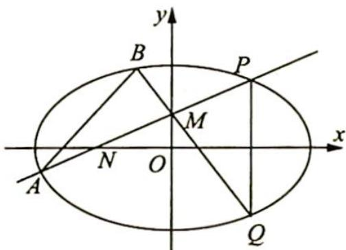

13. 给定椭圆 $C: \frac{x^2}{a^2} + \frac{y^2}{b^2} = 1 (a > b > 0)$ , 称圆心在原点 $O$ , 半径为 $\sqrt{a^2 + b^2}$ 的圆为椭圆 $C$ 的“准圆”. 若椭圆 $C$ 的一个焦点为 $F(\sqrt{2}, 0)$ , 其短轴上的一个端点到 $F$ 的距离为 $\sqrt{3}$ .

(1)求椭圆 C 的方程和其“准圆”方程；

(2)若点 $P$ 是椭圆 $C$ 的“准圆”上的动点, 过点 $P$ 作椭圆的切线 $l_{1}, l_{2}$ 交“准圆”于点 $M, N$ . 证明: $l_{1} \perp l_{2}$ , 且线段 $MN$ 的长为定值.

![[高中/总复习/专题/高考数学培优40讲/高考数学培优40讲-02-解析几何/01_第15讲/01_第15讲.md]]
![[高中/总复习/专题/高考数学培优40讲/高考数学培优40讲-02-解析几何/02_第16讲/02_第16讲.md]]
![[高中/总复习/专题/高考数学培优40讲/高考数学培优40讲-02-解析几何/03_第17讲/03_第17讲.md]]
![[高中/总复习/专题/高考数学培优40讲/高考数学培优40讲-02-解析几何/04_第20讲/04_第20讲.md]]
![[高中/总复习/专题/高考数学培优40讲/高考数学培优40讲-02-解析几何/05_第21讲/05_第21讲.md]]
![[高中/总复习/专题/高考数学培优40讲/高考数学培优40讲-02-解析几何/06_第22讲/06_第22讲.md]]
