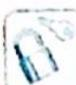

## 14.6 圆锥曲线的光学性质

## 研究密钥

圆锥曲线的光学性质背后蕴含着奇妙的数学关系. 要探究圆锥曲线的光学性质, 首先必须将这样一个光学实际问题, 转化为数学问题, 用我们学过的知识进行解释论证.

## 1. 椭圆的光学性质

从椭圆一个焦点发出的光,经过椭圆反射后,反射光线都汇聚到椭圆的另一个焦点上.椭圆的这种光学特性,常被用来设计一些照明设备或聚热装置.

## 2. 双曲线的光学性质

从双曲线一个焦点发出的光,经过双曲线反射后,反射光线的反向延长线都汇聚到双曲线的另一个焦点. 双曲线的这种反向虚聚焦性质,常被用在天文望远镜的设计等方面.

## 3. 抛物线的光学性质

从抛物线的焦点发出的光,经过抛物线反射后,反射光线都平行于抛物线的轴.抛物线这种聚焦特性,成为聚能装置或定向发射装置的最佳选择.

以下就将圆锥曲线的光学性质用数学的方法进行解释论证.

![[高中/总复习/专题/高考数学培优40讲/高考数学培优40讲-02-解析几何/第14讲_以形助数__圆锥曲线中几何性质研究/圆锥曲线的光学性质及其应用/14_6_圆锥曲线的光学性质/例题/Q00019441.md]]
![[高中/总复习/专题/高考数学培优40讲/高考数学培优40讲-02-解析几何/第14讲_以形助数__圆锥曲线中几何性质研究/圆锥曲线的光学性质及其应用/14_6_圆锥曲线的光学性质/例题/Q00019442.md]]
![[高中/总复习/专题/高考数学培优40讲/高考数学培优40讲-02-解析几何/第14讲_以形助数__圆锥曲线中几何性质研究/圆锥曲线的光学性质及其应用/14_6_圆锥曲线的光学性质/例题/Q00019443.md]]
