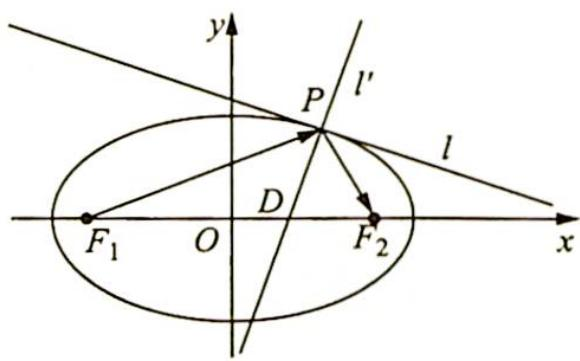

<!-- question-source:start -->
例 14.13（椭圆的光学性质）: 如图所示, 从椭圆的一个焦点发出的光, 经过椭圆反射后, 反射光线都汇聚到椭圆的另一个焦点上. 用数学语言描述为: 设椭圆的方程为 $\frac{x^{2}}{a^{2}} + \frac{y^{2}}{b^{2}} = 1 (a > b > 0)$ , 左、右焦点分别为 $F_{1}, F_{2}$ , 直线 $l$ 是过椭圆上任意一点 $P$ 处的切线, 直线 $l'$ 为

垂直于直线 l 且过点 P 的椭圆的法线，交 x 轴于点 D，则 $\angle F_{1}PD = \angle F_{2}PD$ .
<!-- question-source:end -->

![[高中/总复习/专题/高考数学培优40讲/高考数学培优40讲-02-解析几何/第14讲_以形助数__圆锥曲线中几何性质研究/圆锥曲线的光学性质及其应用/14_6_圆锥曲线的光学性质/例题/answers/Q00019441A1.md]]
