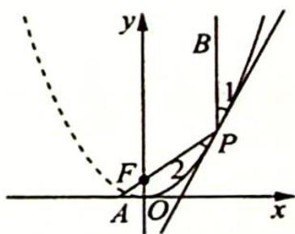

> [!faq]- 《高考数学培优40讲》例题解析
>
> > [!success]- **【答案】** 详见解析
>
> > [!note]- **【分析】**
> > 分析 ▶ 由夹角相等的条件及抛物线的光学性质可知焦点 F 在直线 PA 上, 设出点 P 坐标, 由 $k_{FA} = k_{PF}$ 列方程求 P 点横坐标.
>
> > [!note]- **【解析】**
> > 解析 如图所示, 设抛物线的焦点为 $F$ , 则 $F\left(0, \frac{1}{4}\right)$ , 因为抛物线在点 $P$ 处的切线与 $y$ 轴及直线 $PA$ 的夹角相等, 即 $\angle 1 = \angle 2$ , 所以平行于 $y$ 轴的入射光线 $BP$ 经抛物线反射后的反射光线为射线 $PA$ . 根据抛物线的光学性质及光路的可逆性知: 焦点 $F$ 在直线 $PA$ 上.
> > 
> > 设 $P(x_0, x_0^2)(x_0 > 0)$ , 则 $\frac{x_0^2 - \frac{1}{4}}{x_0 - 0} = \frac{0 - \frac{1}{4}}{-\frac{1}{3} - 0}$ , 解得 $x_0 = 1$ 或 $x_0 = -\frac{1}{4}$ (舍去), 所以点 $P$ 的坐为(1,1).
> > 标为 $(1,1)$ .
