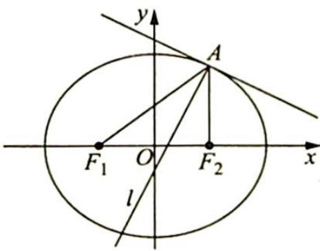

> [!faq]- 《高考数学培优40讲》例题解析
>
> > [!success]- **【答案】** 详见解析
>
> > [!note]- **【分析】**
> > 分析 ▶ (1) 已知椭圆基本量, 待定系数法求椭圆方程. (2) 由椭圆的光学性质可知 $\angle F_{1} A F_{2}$ 的平分线为椭圆 $E$ 在点 $A$ 处的法线, 而在该点处的切线易求, 则此法线也易求. (3) 假设在椭圆 $E$ 上存在关于直线 $l$ 对称的相异两点, 设出两点所在方程, 将中点坐标用引入的参数表示出来. 另一方面, 该中点又在法线 $l$ 上, 将坐标代入法线 $l$ 的方程, 若能求出满足要求的解, 则存在; 否则, 则不存在.
>
> > [!note]- **【解析】**
> > 解析 (1) 设椭圆 $E$ 的方程为 $\frac{x^2}{a^2} + \frac{y^2}{b^2} = 1 (a > b > 0)$ .
> > 根据题意可得 $\left\{ \begin{array}{l} \frac{4}{a^2} + \frac{9}{b^2} = 1 \\ \frac{c}{a} = \frac{1}{2} \\ a^2 - b^2 = c^2 \end{array} \right.$ ，解得 $\left\{ \begin{array}{l} a^2 = 16 \\ b^2 = 12 \end{array} \right.$ ，所以椭圆 $E$ 的方程为 $\frac{x^2}{16} + \frac{y^2}{12} = 1$ .
> > (2)如图所示,由椭圆的光学性质可知直线 l 为椭圆 E 在点 A(2,3) 处的法线,易求得椭圆 E 在点 A(2,3) 处的切线方程为 $\frac{2x}{16} + \frac{3y}{12} = 1$ , 其斜率为 $-\frac{1}{2}$ , 所以法线 l 的斜率为 $k_{l} = -\frac{1}{-\frac{1}{2}} = 2$ , 其方程为 y - 3 = 2(x - 2), 即 2x - y - 1 = 0.
> > 
> > (3)假设在椭圆 $E$ 上存在关于直线 $l$ 对称的相异两点 $B(x_{1},y_{1}),C(x_{2},y_{2})$ ，则直线 $BC$ 的斜率为 $-\frac{1}{k_l} = -\frac{1}{2}$ ，设其方程为 $y = -\frac{1}{2} x + m$ ，联立方程组 $\left\{ \begin{array}{l} \frac{x^2}{16} +\frac{y^2}{12} = 1 \\ y = -\frac{1}{2} x + m \end{array} \right.$ ，得 $x^{2} - mx + m^{2} - 12 = 0$ ，则由 $\Delta = (-m)^{2} - 4(m^{2} - 12) > 0$ 解得 $m\in (-4,4)$ .且 $x_{1} + x_{2} = m$ ，所以 $y_{1} + y_{2} =$ $-\frac{1}{2} (x_1 + x_2) + 2m = \frac{3m}{2}$
> > $BC$ 的中点坐标为 $\left(\frac{x_1 + x_2}{2}, \frac{y_1 + y_2}{2}\right)$ , 即 $\left(\frac{m}{2}, \frac{3m}{4}\right)$ , 该点在直线 $l$ 上, 则 $2 \cdot \frac{m}{2} - \frac{3m}{4} - 1 = 0$ , 解得 $m = 4$ , 与 $m \in (-4, 4)$ 矛盾, 所以假设不正确, 即在椭圆 $E$ 上不存在关于直线 $l$ 对称的相异两点.
