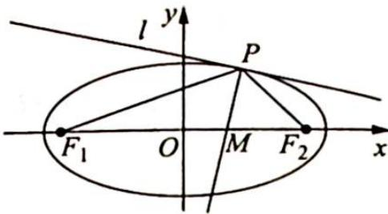

> [!faq]- 《高考数学培优40讲》例题解析
>
> > [!success]- **【答案】** 详见解析
>
> > [!note]- **【分析】**
> > 分析 ▶ (1)已知椭圆基本量,用待定系数法求椭圆方程;(2)根据椭圆的光学性质知PM是法线,其方程易求.令y=0,将m表示为P点横坐标 $x_{0}$ 的函数,借 $x_{0}$ 范围得出m的范围.(3)证明 $\frac{1}{kk_{1}}+\frac{1}{kk_{2}}$ 为定值并求得这个定值,需将其用 $x_{0},y_{0}$ 表示并整理,看参数是否约去得出定值.表示斜率k时,由于l是点P处的切线,其方程和斜率易得.
>
> > [!note]- **【解析】**
> > 解析 (1)由题意可得点 $\left(-c, \pm \frac{1}{2}\right)$ 均在椭圆 $C$ 上, 所以有 $\frac{c^2}{a^2} + \frac{1}{4b^2} = 1$ .
> > 再结合 $\left\{\begin{aligned}\frac{c}{a}&=\frac{\sqrt{3}}{2}\\ a^{2}-b^{2}&=c^{2}\end{aligned}\right.$ ，可得 $\left\{\begin{aligned}a^{2}&=4\\ b^{2}&=1\end{aligned}\right.$ ，所以椭圆C的方程为 $\frac{x^{2}}{4}+y^{2}=1$ 。
> > (2)如图所示,设 $P(x_0,y_0)$ , 过点 $P$ 作椭圆的切线 $l$ , 其方程为 $\frac{x_0x}{4} + y_0y = 1$ , 则根据椭圆的光学性质可得: 直线 $PM$ 是椭圆在点 $P$ 处的法线, 其斜率为 $-\frac{1}{k_l} = \frac{4y_0}{x_0}$ , 方程为 $y - y_0 = \frac{4y_0}{x_0}(x - x_0)$ .
> > 
> > 令 $y = 0$ ，可得 $m = \frac{3}{4} x_0$ ，因为 $-2 < x_0 < 2$ ，所以 $m$ 的取值范围是 $\left(-\frac{3}{2}, \frac{3}{2}\right)$ .
> > (3)因为直线 l 与椭圆 C 有且只有一个公共点,所以直线 l 是椭圆 C 在点 P 处的切线,其方程为 $\frac{x_{0}x}{4} + y_{0}y = 1$ , 斜率为 $k = -\frac{x_{0}}{4y_{0}}$ .
> > 又因为 $k_{1}=\frac{y_{0}}{x_{0}+c}, k_{2}=\frac{y_{0}}{x_{0}-c}$ ，所以 $\frac{1}{kk_{1}}+\frac{1}{kk_{2}}=-\frac{4y_{0}}{x_{0}}\left(\frac{x_{0}+c}{y_{0}}+\frac{x_{0}-c}{y_{0}}\right)=-\frac{4y_{0}}{x_{0}}\cdot\frac{2x_{0}}{y_{0}}=-8$ ，故 $\frac{1}{kk_{1}}+\frac{1}{kk_{2}}$ 的值为定值，定值为 -8.
