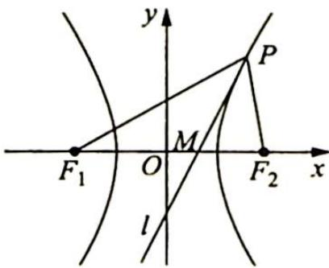

> [!faq]- 《高考数学培优40讲》例题解析
>
> > [!success]- **【答案】** 详见解析
>
> > [!note]- **【分析】**
> > 本题未单列分析。
>
> > [!note]- **【解析】**
> > 解析 (1)如图所示, 设 $P(x_{0}, y_{0})$ , 因为 $PM$ 是 $\angle F_{1}PF_{2}$ 的角平分线, 所以根据双曲线的光学性质可得: 直线 $PM$ 是双曲线在点 $P$ 处的切线, 其方程为 $\frac{x_{0}x}{a^{2}} - \frac{y_{0}y}{b^{2}} = 1$ .
> > 
> > 令 $y = 0$ ，可得 $m = \frac{a^2}{x_0}$ ，又 $x_0 \in (-\infty, -a) \cup (a, +\infty)$ ，所以 $m$ 的取值范围是 $(-a, 0) \cup (0, a)$ .
> > (2)因为直线 l 与双曲线 C 有且只有一个公共点,所以直线 l 是双曲线 C 在点 P 处的切线,其方程为 $\frac{x_{0}x}{a^{2}} - \frac{y_{0}y}{b^{2}} = 1$ , 斜率为 $k = \frac{b^{2}x_{0}}{a^{2}y_{0}}$ .
> > 又因为 $k_{1} = \frac{y_{0}}{x_{0} + c}, k_{2} = \frac{y_{0}}{x_{0} - c}$ , 所以 $\frac{1}{kk_{1}} + \frac{1}{kk_{2}} = \frac{a^{2}y_{0}}{b^{2}x_{0}}\left(\frac{x_{0} + c}{y_{0}} + \frac{x_{0} - c}{y_{0}}\right) = \frac{a^{2}y_{0}}{b^{2}x_{0}} \cdot \frac{2x_{0}}{y_{0}} = \frac{2a^{2}}{b^{2}}$ , 为定值.
> > 
