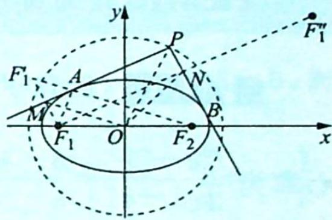
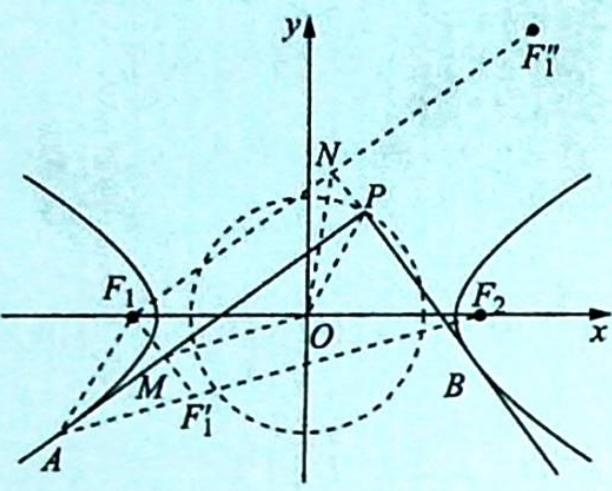
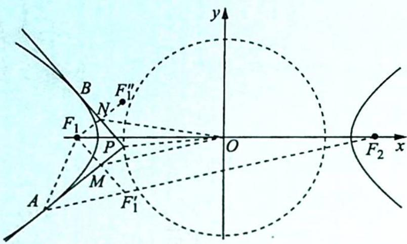

## 14.8 圆锥曲线的蒙日圆

## 研究密钥

我们从小学开始接触圆,在初中从图形(几何法)上定性研究圆的基本性质,进入高中后在直角坐标系中用坐标(代数法)定量研究并得到了圆的标准方程及一般方程.定性与定量的有机结合、数与形的完美互补,使得我们对圆有了较为完善的认识.其实,圆有更丰富的内涵,比如阿波罗尼斯圆、蒙日圆等,下面就浅谈蒙日圆的相关定理、证明及应用.

引理: 已知点 P 为矩形 ABCD 所在平面上任意一点, 则有 $\left|PA\right|^{2} + \left|PC\right|^{2} = \left|PB\right|^{2} + \left|PD\right|^{2}$ .

【证明】在平面直角坐标系中, 设 $P(x,y), A(0,0), B(a,0), C(a,b), D(0,b) (a > 0, b > 0)$ , 则 $\left\{ \begin{array}{l} |PA|^2 + |PC|^2 = x^2 + y^2 + (x - a)^2 + (y - b)^2 \\ |PB|^2 + |PD|^2 = (x - a)^2 + y^2 + x^2 + (y - b)^2 \end{array} \right.$ , 所以 $|PA|^2 + |PC|^2 = |PB|^2 + |PD|^2$ .

定理 1(椭圆的蒙日圆): 过椭圆 $\frac{x^{2}}{a^{2}} + \frac{y^{2}}{b^{2}} = 1 (a > b > 0)$ 上任意不同两点 A, B 作椭圆的切线, 如果两条切线垂直且相交于点 P, 那么动点 P 的轨迹为圆, 其方程为 $x^{2} + y^{2} = a^{2} + b^{2}$ .

【证明】如图所示, 设 $P(x,y)$ , 作点 $F_{1}$ 关于直线 PA, PB 的对称点 $F_{1}^{\prime}, F_{1}^{\prime\prime}$ , 设 $F_{1}F_{1}^{\prime}$ 和直线 PA 交于点 M, $F_{1}F_{1}^{\prime\prime}$ 和直线 PB 交于点 N, 根据椭圆的光学性质可知 $F_{1}^{\prime}, A, F_{2}$ 三点共线, 且 $\left|F_{1}^{\prime}F_{2}\right| = \left|F_{1}^{\prime}A\right| + \left|AF_{2}\right| = \left|F_{1}A\right| + \left|AF_{2}\right| = 2a$ , 又 $\left\{\begin{aligned}|F_{1}M| &= |MF_{1}^{\prime}| \\ |F_{1}O| &= |OF_{2}| \end{aligned}\right.$ , 所以 OM 是

$\triangle F_{1}F_{1}^{\prime}F_{2}$ 的中位线, 所以 $|OM| = \frac{1}{2}|F_{1}^{\prime}F_{2}| = a$ , 同理可得 $|ON| = a$ , 易证四边形 $F_{1}MPN$ 为矩形, 所以根据引理可得 $|OP|^2 + |OF_1|^2 = |OM|^2 + |ON|^2$ , 即 $x^2 + y^2 = |OP|^2 = |OM|^2 + |ON|^2 - |OF_1|^2 = a^2 + b^2$ .

故动点 P 的轨迹为圆, 其方程为 $x^{2} + y^{2} = a^{2} + b^{2}$ .

定理2(双曲线的蒙日圆): 过双曲线 $\frac{x^{2}}{a^{2}} - \frac{y^{2}}{b^{2}} = 1 (a > 0, b > 0)$ 上任意不同两点 $A, B$ 作双曲线的切线, 如果两条切线垂直且相交于点 $P$ , 那么动点 $P$ 的轨迹为圆, 其方程为 $x^{2} + y^{2} = a^{2} - b^{2}$ .

【证明】如图①所示, 当 $A, B$ 两点位于双曲线的两支上时, 设 $P(x, y)$ , 作点 $F_{1}$ 关于直线 $PA, PB$ 的对称点 $F_{1}^{\prime}, F_{1}^{\prime \prime}$ , 设 $F_{1}F_{1}^{\prime}$ 和直线 $PA$ 交于点 $M, F_{1}F_{1}^{\prime \prime}$ 和直线 $PB$ 交于点 $N$ , 根据双曲线的光学性质可知 $A, F_{1}^{\prime}, F_{2}$ 三点共线, 且 $|F_{1}^{\prime}F_{2}| = |AF_{2}| - |AF_{1}^{\prime}| = |AF_{2}| - |AF_{1}| = 2a$ ,又 $\left\{\begin{aligned}|F_{1}M|&=|MF_{1}^{\prime}|\\ |F_{1}O|= &|OF_{2}|\end{aligned}\right.$ ，所以OM是 $\triangle F_{1}F_{1}^{\prime}F_{2}$ 的中位线，所以 $|OM|=\frac{1}{2}|F_{1}^{\prime}F_{2}|=a$ ，同理可得 $|ON|=a.$

易证四边形 $F_{1}MPN$ 为矩形, 所以根据引理可得 $|OP|^{2} + |OF_{1}|^{2} = |OM|^{2} + |ON|^{2}$ , 即 $x^{2} + y^{2} = |OP|^{2} = |OM|^{2} + |ON|^{2} - |OF_{1}|^{2} = a^{2} - b^{2}$ .

故动点 P 的轨迹为圆, 其方程为 $x^{2} + y^{2} = a^{2} - b^{2}$ .

如图②所示,当 $A,B$ 两点位于双曲线的同一支上时,可得到相同的结论.

①

②

定理 3(圆的蒙日圆): 过圆 $x^{2} + y^{2} = a^{2} (a > 0)$ 上任意不同两点 A, B 作圆的切线, 如果两条切线垂直且相交于点 P, 那么动点 P 的轨迹为圆, 其方程为 $x^{2} + y^{2} = 2a^{2}$ .

【证明】这是椭圆为蒙日圆的特殊情形. 令 b=a, 得出圆的蒙日圆方程为 $x^{2}+y^{2}=2a^{2}$ .

![[高中/总复习/专题/高考数学培优40讲/高考数学培优40讲-02-解析几何/第14讲_以形助数__圆锥曲线中几何性质研究/圆锥曲线的光学性质及其应用/14_8_圆锥曲线的蒙日圆/例题/Q00019449.md]]
![[高中/总复习/专题/高考数学培优40讲/高考数学培优40讲-02-解析几何/第14讲_以形助数__圆锥曲线中几何性质研究/圆锥曲线的光学性质及其应用/14_8_圆锥曲线的蒙日圆/例题/Q00019450.md]]
