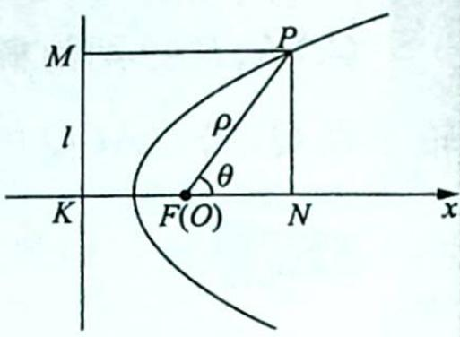
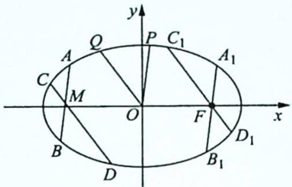
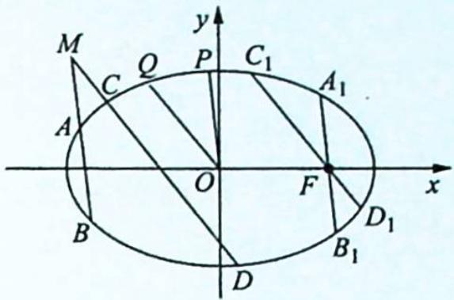
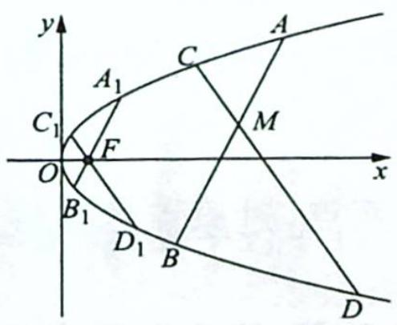
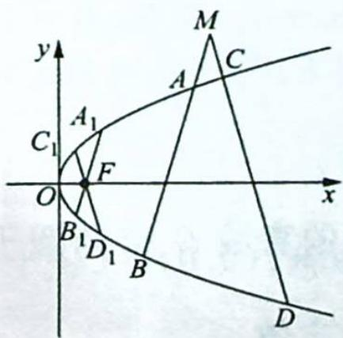

## 14.4 圆锥曲线的圆幂定理

## 研究密钥

圆锥曲线的统一的极坐标方程为 $\rho=\frac{ep}{1-ecos\theta}$ ，其中 e 为离心率，p 为焦参数（焦点 F 到准线 l 的距离），具体推导过程如下：如图所示，设点 F 到直线 l 的距离为 p，点 F 在直线 l 上的射影为点 K，以 F 为极点，向量 $\overrightarrow{KF}$ 的方向为极轴的正方向建立极坐标系，点 $P(\rho,\theta)$ 为圆

锥曲线上任意一点,其在直线 $l$ 上的投影为点 $M$ , 在极轴上的投影为点 $N$ , 则由圆锥曲线的定义知 $\frac{|PF|}{|PM|} = e$ . 因为 $|PF| = \rho$ , $|PM| = |KF| + |FN| = p + \rho \cos \theta$ , 所以 $\frac{\rho}{p + \rho \cos \theta} = e$ , 化简得 $\rho = \frac{ep}{1 - e \cos \theta}$ .

根据圆锥曲线的统一的极坐标方程,可得如下定理:

## 1. 引理

设过圆锥曲线的焦点 F 的弦 PQ 与 x 轴正半轴的夹角为 $\alpha$ ，则 $|PQ|=\frac{2ep}{1-e^{2}\cos^{2}\alpha}$ .

【证明】由圆锥曲线的统一的极坐标方程可得

$$
| P Q | = | P F | + | Q F | = \frac {e p}{1 - e \cos \alpha} + \frac {e p}{1 - e \cos (\alpha + \pi)} = \frac {e p}{1 - e \cos \alpha} + \frac {e p}{1 + e \cos \alpha} = \frac {2 e p}{1 - e ^ {2} \cos^ {2} \alpha}.
$$

## 2. 相交弦、割线定理

已知点 M 不在圆锥曲线 $\Gamma$ 上, 过点 M 作两条直线分别交曲线 $\Gamma$ 于 A, B 两点和 C, D 两点.

(1)当圆锥曲线 $\Gamma$ 是椭圆或双曲线时, 过坐标原点 $O$ 作 $OP \parallel AB$ , $OQ \parallel CD$ , 分别交曲线 $\Gamma$ 于 $P, Q$ 两点, 过焦点 $F$ 作 $A_{1}B_{1} \parallel AB$ , $C_{1}D_{1} \parallel CD$ , 分别交曲线 $\Gamma$ 于 $A_{1}, B_{1}$ 两点和 $C_{1}, D_{1}$ 两点, 则 $\frac{|MA||MB|}{|MC||MD|} = \frac{|OP|^2}{|OQ|^2} = \frac{|A_1B_1|}{|C_1D_1|}$ ;

(2)当圆锥曲线 $\Gamma$ 是抛物线时, 过焦点 $F$ 作 $A_{1}B_{1} \parallel AB, C_{1}D_{1} \parallel CD$ , 分别交曲线 $\Gamma$ 于 $A_{1}$ , $B_{1}$ 两点和 $C_{1}, D_{1}$ 两点, 则 $\frac{|MA||MB|}{|MC||MD|} = \frac{|A_{1}B_{1}|}{|C_{1}D_{1}|}$ .

【证明】(1)如图所示,当圆锥曲线 $\Gamma$ 是椭圆时,设椭圆的方程为 $\frac{x^{2}}{a^{2}}+\frac{y^{2}}{b^{2}}=1(a>b>0)$ ,

$M(x_{0},y_{0})$ ，直线 AB 的参数方程为 $\left\{\begin{aligned}x&=x_{0}+t\cos\alpha\\ y&=y_{0}+t\sin\alpha\end{aligned}\right.$ （其中 t 为参数），直线 CD 的参数方程为 $\left\{\begin{aligned}x&=x_{0}+t\cos\beta\\ y&=y_{0}+t\sin\beta\end{aligned}\right.$ （其中 t 为参数）.

将直线 AB 的参数方程代入椭圆的方程中, 得

$(b^{2}\cos^{2}\alpha + a^{2}\sin^{2}\alpha)t^{2} + 2(b^{2}x_{0}\cos \alpha + a^{2}y_{0}\sin \alpha)t + b^{2}x_{0}^{2} + a^{2}y_{0}^{2} - a^{2}b^{2} = 0$ ，所以由参数 $t$ 的

几何意义, 可知 $\left|MA\right|\left|MB\right|=\left|t_{1}t_{2}\right|=\left|\frac{b^{2}x_{0}^{2}+a^{2}y_{0}^{2}-a^{2}b^{2}}{b^{2}\cos^{2}\alpha+a^{2}\sin^{2}\alpha}\right|$ .

同理可得 $|MC||MD| = \left|\frac{b^2x_0^2 + a^2y_0^2 - a^2b^2}{b^2\cos^2\beta + a^2\sin^2\beta}\right|$ ，所以 $\frac{|MA||MB|}{|MC||MD|} = \frac{b^2\cos^2\beta + a^2\sin^2\beta}{b^2\cos^2\alpha + a^2\sin^2\alpha}$ .

根据上述推导过程,同理可得 $\frac{|OP|^{2}}{|OQ|^{2}}=\frac{b^{2}\cos^{2}\beta+a^{2}\sin^{2}\beta}{b^{2}\cos^{2}\alpha+a^{2}\sin^{2}\alpha}.$

又根据引理可知 $|A_{1}B_{1}| = \frac{2ep}{1 - e^{2}\cos^{2}\alpha} = \frac{2\cdot\frac{c}{a}\cdot\left(\frac{a^{2}}{c} - c\right)}{1 - \frac{c^{2}}{a^{2}}\cdot\cos^{2}\alpha} = \frac{2ab^{2}}{b^{2}\cos^{2}\alpha + a^{2}\sin^{2}\alpha}, |C_{1}D_{1}| =$

$\frac{2ab^{2}}{b^{2}\cos^{2}\beta+a^{2}\sin^{2}\beta}$ ，所以 $\frac{|A_{1}B_{1}|}{|C_{1}D_{1}|}=\frac{b^{2}\cos^{2}\beta+a^{2}\sin^{2}\beta}{b^{2}\cos^{2}\alpha+a^{2}\sin^{2}\alpha},\frac{|MA||MB|}{|MC||MD|}=\frac{|OP|^{2}}{|OQ|^{2}}=\frac{|A_{1}B_{1}|}{|C_{1}D_{1}|}$ ，即原结论成立.

当圆锥曲线 $\Gamma$ 是双曲线时, 同理可证结论正确.

(2)如图所示,当圆锥曲线 $\Gamma$ 是抛物线时,设抛物线的方程为 $y^{2}=2px(p>0)$ , $M(x_{0},y_{0})$ , 直线 AB 的参数方程为 $\left\{\begin{aligned}x&=x_{0}+t\cos\alpha\\ y&=y_{0}+t\sin\alpha\end{aligned}\right.$ (其中 t 为参数), 直线 CD 的参数方程为 $\left\{\begin{aligned}x&=x_{0}+t\cos\beta\\ y&=y_{0}+t\sin\beta\end{aligned}\right.$ (其中 t 为参数).

将直线 AB 的参数方程代入抛物线的方程中, 得 $t^{2}\sin^{2}\alpha + 2(y_{0}\sin\alpha - p\cos\alpha)t + y_{0}^{2} - 2px_{0} = 0$ , 所以由参数 t 的几何意义, 可知 $\left|MA\right|\left|MB\right| = \left|t_{1}t_{2}\right| = \left|\frac{y_{0}^{2} - 2px_{0}}{\sin^{2}\alpha}\right|$ .

同理可得 $|MC||MD| = \left|\frac{y_0^2 - 2px_0}{\sin^2\beta}\right|$ ，所以 $\frac{|MA||MB|}{|MC||MD|} = \frac{\sin^2\beta}{\sin^2\alpha}$ .

根据引理可知 $\left|A_{1}B_{1}\right|=\frac{2ep}{1-e^{2}\cos^{2}\alpha}=\frac{2p}{\sin^{2}\alpha},\left|C_{1}D_{1}\right|=\frac{2p}{\sin^{2}\beta}$ ，所以 $\frac{\left|A_{1}B_{1}\right|}{\left|C_{1}D_{1}\right|}=\frac{\sin^{2}\beta}{\sin^{2}\alpha}$ $\frac{|MA||MB|}{|MC||MD|}=\frac{|A_{1}B_{1}|}{|C_{1}D_{1}|}$ ，即原结论成立.

## 3. 切割线定理

已知点 M 在圆锥曲线 $\Gamma$ 的外部, 过点 M 作两条直线, 其中一条直线与曲线 $\Gamma$ 相切于点 A, 另一条直线交曲线 $\Gamma$ 于 C, D 两点.

(1)当圆锥曲线 $\Gamma$ 是椭圆或双曲线时, 过坐标原点 $O$ 作 $OP \parallel MA$ , $OQ \parallel CD$ , 分别交曲线 $\Gamma$ 于 $P, Q$ 两点, 过焦点 $F$ 作 $A_{1}B_{1} \parallel MA$ , $C_{1}D_{1} \parallel CD$ , 分别交曲线 $\Gamma$ 于 $A_{1}, B_{1}$ 两点和 $C_{1}, D_{1}$ 两点, 则 $\frac{|MA|^{2}}{|MC||MD|} = \frac{|OP|^{2}}{|OQ|^{2}} = \frac{|A_{1}B_{1}|}{|C_{1}D_{1}|}$ ;

(2)当圆锥曲线 $\Gamma$ 是抛物线时, 过焦点 F 作 $A_{1}B_{1} \parallel MA, C_{1}D_{1} \parallel CD$ , 分别交曲线 $\Gamma$ 于 $A_{1}, B_{1}$ 两点和 $C_{1}, D_{1}$ 两点, 则 $\frac{|MA|^{2}}{|MC||MD|} = \frac{|A_{1}B_{1}|}{|C_{1}D_{1}|}$ .

## 4. 切线定理

已知点 M 在圆锥曲线 $\Gamma$ 的外部, 过点 M 作两条直线, 分别与曲线 $\Gamma$ 相切于 A, C 两点.

(1)当圆锥曲线 $\Gamma$ 是椭圆或双曲线时, 过坐标原点 $O$ 作 $OP \parallel MA$ , $OQ \parallel MC$ , 分别交曲线 $\Gamma$ 于 $P, Q$ 两点, 过焦点 $F$ 作 $A_{1}B_{1} \parallel MA$ , $C_{1}D_{1} \parallel MC$ , 分别交曲线 $\Gamma$ 于 $A_{1}, B_{1}$ 两点和 $C_{1}, D_{1}$ 两点, 则 $\frac{|MA|^{2}}{|MC|^{2}} = \frac{|OP|^{2}}{|OQ|^{2}} = \frac{|A_{1}B_{1}|}{|C_{1}D_{1}|}$ ;

(2)当圆锥曲线 $\Gamma$ 是抛物线时, 过焦点 F 作 $A_{1}B_{1} \parallel MA, C_{1}D_{1} \parallel MC$ , 分别交曲线 $\Gamma$ 于 $A_{1}, B_{1}$ 两点和 $C_{1}, D_{1}$ 两点, 则 $\frac{|MA|^{2}}{|MC|^{2}} = \frac{|A_{1}B_{1}|}{|C_{1}D_{1}|}$ .

【特别说明】当过点 M 所作的两条直线的斜率互为相反数时, 易得 $\left|A_{1}B_{1}\right|=\left|C_{1}D_{1}\right|$ , 所以 $\left|MA\right|\left|MB\right|=\left|MC\right|\left|MD\right|$ 或 $\left|MA\right|^{2}=\left|MC\right|\left|MD\right|$ 或 $\left|MA\right|^{2}=\left|MC\right|^{2}$ .

![[高中/总复习/专题/高考数学培优40讲/高考数学培优40讲-02-解析几何/第14讲_以形助数__圆锥曲线中几何性质研究/圆锥曲线的几何性质/14_4_圆锥曲线的圆幂定理/例题/Q00019433.md]]
![[高中/总复习/专题/高考数学培优40讲/高考数学培优40讲-02-解析几何/第14讲_以形助数__圆锥曲线中几何性质研究/圆锥曲线的几何性质/14_4_圆锥曲线的圆幂定理/例题/Q00019434.md]]
![[高中/总复习/专题/高考数学培优40讲/高考数学培优40讲-02-解析几何/第14讲_以形助数__圆锥曲线中几何性质研究/圆锥曲线的几何性质/14_4_圆锥曲线的圆幂定理/例题/Q00019435.md]]
![[高中/总复习/专题/高考数学培优40讲/高考数学培优40讲-02-解析几何/第14讲_以形助数__圆锥曲线中几何性质研究/圆锥曲线的几何性质/14_4_圆锥曲线的圆幂定理/例题/Q00019436.md]]
![[高中/总复习/专题/高考数学培优40讲/高考数学培优40讲-02-解析几何/第14讲_以形助数__圆锥曲线中几何性质研究/圆锥曲线的几何性质/14_4_圆锥曲线的圆幂定理/例题/Q00019437.md]]
