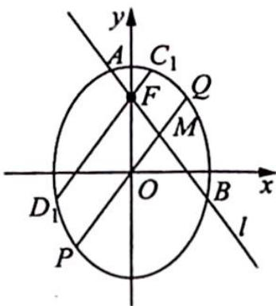

> [!faq]- 《高考数学培优40讲》例题解析
>
> > [!success]- **【答案】** 详见解析
>
> > [!note]- **【分析】**
> > 分析 ▶ (1) $\overrightarrow{OA} + \overrightarrow{OB} + \overrightarrow{OP} = 0 \Rightarrow (x_{1} + x_{2} + x_{P}, y_{1} + y_{2} + y_{P}) = (0,0)$ , 求出点 $P$ 坐标, 看是否满足椭圆方程; (2) 要证明四点共圆, 根据目前掌握的条件可尝试使用圆的相交弦定理的逆定理. 设 $AB$ 和 $PQ$ 交于点 $M$ , 即证明 $|MA||MB| = |MP||MQ|$ , 过焦点 $F$ 作 $C_{1}D_{1} // PQ$ 交椭圆于 $C_{1}, D_{1}$ 两点, 则根据椭圆的相交弦定理, 有 $\frac{|MA||MB|}{|MP||MQ|} = \frac{|AB|}{|C_{1}D_{1}|}$ , 由椭圆对称性有 $|AB| = |C_{1}D_{1}|$ , 因此得证.
>
> > [!note]- **【解析】**
> > 解析 (1) 易求得 $F(0,1)$ , 所以直线 $l$ 的方程为 $y = -\sqrt{2} x + 1$ .
> > 联立方程组 $\left\{ \begin{array}{l} x^{2} + \frac{y^{2}}{2} = 1 \\ y = -\sqrt{2}x + 1 \end{array} \right.$ ，得 $4x^{2} - 2\sqrt{2}x - 1 = 0$ ，解得 $x_{1} + x_{2} = \frac{\sqrt{2}}{2}$ ，所以 $y_{1} + y_{2} = -\sqrt{2}(x_{1} + x_{2}) + 2 = 1$ .
> > 因为 $\overrightarrow{OA} +\overrightarrow{OB} +\overrightarrow{OP} = 0$ ，即 $(x_{1} + x_{2} + x_{P},y_{1} + y_{2} + y_{P}) = (0,0)$ ，所以 $P\left[-\frac{\sqrt{2}}{2}, - 1\right].$
> > 又点 $P$ 的坐标满足椭圆 $C$ 的方程, 所以点 $P$ 在椭圆 $C$ 上.
> > (2)如图所示,连接 PQ, 设 AB 和 PQ 交于点 M, 过焦点 F 作 $C_{1}D_{1} \parallel PQ$ 交椭圆于 $C_{1}, D_{1}$ 两点, 则根据椭圆的相交弦定理, 可得 $\frac{|MA||MB|}{|MP||MQ|} = \frac{|AB|}{|C_{1}D_{1}|}$ .
> > 
> > 因为 $k_{PQ}=k_{OP}=\frac{-1}{-\frac{\sqrt{2}}{2}}=\sqrt{2}$ ，所以 $k_{AB}=-k_{PQ}$ ，直线 AB, $C_{1}D_{1}$ 的斜率互为相反数，则由椭圆
> > 的对称性可知 $|AB|=|C_{1}D_{1}|$ ，即 $\frac{|MA||MB|}{|MP||MQ|}=\frac{|AB|}{|C_{1}D_{1}|}=1,|MA||MB|=|MP||MQ|$ .
> > 故由圆的相交弦定理的逆定理, 可知 $A, P, B, Q$ 四点在同一个圆上.
