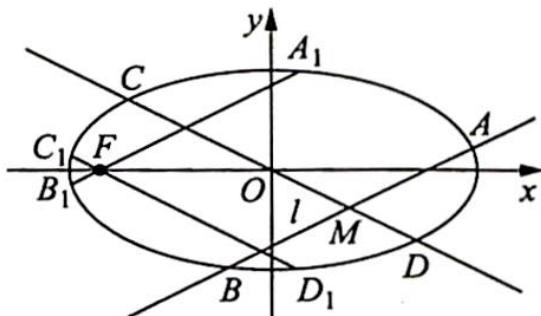

> [!faq]- 《高考数学培优40讲》例题解析
>
> > [!success]- **【答案】** 详见解析
>
> > [!note]- **【分析】**
> > 本题未单列分析。
>
> > [!note]- **【解析】**
> > 解析 ▶ (1) 因为椭圆的一个焦点与短轴的两个端点是正三角形的三个顶点, 且点 $P\left(\sqrt{3}, \frac{1}{2}\right)$ 在椭圆上, 所以 $\left\{\begin{array}{l} 2b = a \\ \frac{3}{a^2} + \frac{1}{4b^2} = 1 \end{array}\right.$ , 结合 $a^2 = b^2 + c^2$ , 可得 $\left\{\begin{array}{l} a^2 = 4 \\ b^2 = 1 \end{array}\right.$ , 所以椭圆 $E$ 的方程为 $\frac{x^2}{4} + y^2 = 1$ .
> > (2)如图所示,过左焦点 F 作 $A_{1}B_{1} \parallel AB$ 交椭圆于 $A_{1}, B_{1}$ 两点,作 $C_{1}D_{1} \parallel CD$ 交椭圆于 $C_{1}, D_{1}$ 两点,则根据椭圆的相交弦定理,可得 $\frac{|MA||MB|}{|MC||MD|} = \frac{|A_{1}B_{1}|}{|C_{1}D_{1}|}$ .
> > 
> > 因为点 M 是 AB 的中点, 所以由椭圆的垂径定理, 可得 $k_{OM} \cdot k_{AB} = -\frac{b^{2}}{a^{2}} = -\frac{1}{4}$ , 又 $k_{AB} = \frac{1}{2}$ , 所以 $k_{OM} = -\frac{1}{2}$ , 直线 $A_{1}B_{1}, C_{1}D_{1}$ 的斜率分别为 $\frac{1}{2}, -\frac{1}{2}$ , 即直线 $A_{1}B_{1}, C_{1}D_{1}$ 的斜率互为相反数, 所以由椭圆的对称性可知 $|A_{1}B_{1}| = |C_{1}D_{1}|$ , $\frac{|MA||MB|}{|MC||MD|} = \frac{|A_{1}B_{1}|}{|C_{1}D_{1}|} = 1$ , 即 $|MA||MB| = |MC||MD|$ .
> > 解后反思
> > ## 圆锥曲线相交弦结论的推广
> > 【推广】已知 AB 和 CD 是圆锥曲线 $\Gamma$ 的两条相交弦, 证明: 当且仅当直线 AB 和直线 CD 的倾斜角互补时, A, B, C, D 四点共圆.
> > 【证明】设 AB 和 CD 交于点 M，直线 AB, CD 的倾斜角分别为 $\alpha$ 、 $\beta$ 。过焦点 F 作 $A_{1}B_{1} \parallel AB, C_{1}D_{1} \parallel CD$ ，分别交曲线 $\Gamma$ 于 $A_{1}, B_{1}$ 两点和 $C_{1}, D_{1}$ 两点，则由圆锥曲线的相交弦定理，可得 $\frac{|MA||MB|}{|MC||MD|} = \frac{|A_{1}B_{1}|}{|C_{1}D_{1}|}$ 。
> > 又根据圆锥曲线的焦点弦长公式 $l = \frac{2ep}{1 - e^2\cos^2\alpha}$ ，可得 $\left\{ \begin{array}{l} |A_1B_1| = \frac{2ep}{1 - e^2\cos^2\alpha} \\ |C_1D_1| = \frac{2ep}{1 - e^2\cos^2\beta} \end{array} \right.$ ，所以 $A, B, C, D$ 四点共圆 $\Leftrightarrow |MA||MB| = |MC||MD| \Leftrightarrow |A_1B_1| = |C_1D_1| \Leftrightarrow \cos^2\alpha = \cos^2\beta \Leftrightarrow \cos \alpha = -\cos \beta \Leftrightarrow \alpha = \pi - \beta \Leftrightarrow$ 直线 $AB$ 和直线 $CD$ 的倾斜角互补.
