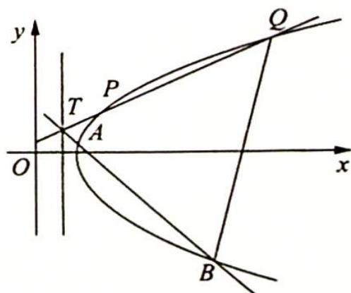

> [!faq]- 《高考数学培优40讲》例题解析
>
> > [!success]- **【答案】** 详见解析
>
> > [!note]- **【分析】**
> > 本题未单列分析。
>
> > [!note]- **【解析】**
> > 解析 ▶ (1) 因为 $|MF_1| - |MF_2| = 2 < 2\sqrt{17} = |F_1F_2|$ , 所以轨迹 $C$ 为双曲线的右半支, $c^2 = 17, 2a = 2$ ,
> > 所以 $a^{2}=1, b^{2}=16$ ，故 C 的方程为 $x^{2}-\frac{y^{2}}{16}=1(x\geqslant1)$ .
> > (2) 如图所示, 设 $T\left(\frac{1}{2}, n\right)$ , $AB: y - n = k_{1}\left(x - \frac{1}{2}\right)$ , 联立 $\left\{ \begin{array}{l} y - n = k_{1}\left(x - \frac{1}{2}\right) \\ x^{2} - \frac{y^{2}}{16} = 1 \end{array} \right.$ , 可得 $(16 - k_{1}^{2})x^{2} + (k_{1}^{2} - 2k_{1}n)x - \frac{1}{4}k_{1}^{2} - n^{2} + k_{1}n -$
> > 
> > 16=0, 所以 $x_{1}+x_{2}=\frac{k_{1}^{2}-2k_{1}n}{k_{1}^{2}-16}$ , $x_{1}x_{2}=\frac{\frac{1}{4}k_{1}^{2}+n^{2}-k_{1}n+16}{k_{1}^{2}-16}$ , $|TA|=\sqrt{1+k_{1}^{2}}\left(x_{1}-\frac{1}{2}\right)$ , $|TB|=$ $\sqrt{1+k_{1}^{2}}\left(x_{2}-\frac{1}{2}\right)$ ，则 $|TA||TB|=(1+k_{1}^{2})\left(x_{1}-\frac{1}{2}\right)\left(x_{2}-\frac{1}{2}\right)=\frac{(n^{2}+12)(1+k_{1}^{2})}{k_{1}^{2}-16}$ .
> > 设 $PQ: y - n = k_{2}\left(x - \frac{1}{2}\right)$ , 同理 $|TP||TQ| = \frac{(n^{2} + 12)(1 + k_{2}^{2})}{k_{2}^{2} - 16}$ .
> > 因为 $|TA||TB| = |TP||TQ|$ ，所以 $\frac{1 + k_1^2}{k_1^2 - 16} = \frac{1 + k_2^2}{k_2^2 - 16}, 1 + \frac{17}{k_1^2 - 16} = 1 + \frac{17}{k_2^2 - 16}$ ，则 $k_1^2 - 16 = k_2^2 - 16$ ，即 $k_1^2 = k_2^2$ .
> > 又 $k_{1} \neq k_{2}$ , 所以 $k_{1} + k_{2} = 0$ .
> > ## 评注
> > 运用直线的参数方程求解线段的乘积,计算效率更高,大家可以试试.
