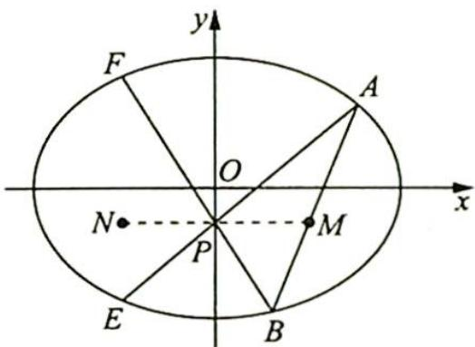

<!-- question-source:start -->
变式 1 如图所示, 已知椭圆 $\frac{x^{2}}{a^{2}} + \frac{y^{2}}{b^{2}} = 1 (a > b > 0)$ 和三个点 $M(x_{0}, y_{0}), P(0, y_{0}), N(-x_{0}, y_{0}) \left( \frac{x_{0}^{2}}{a^{2}} + \frac{y_{0}^{2}}{b^{2}} < 1, -b < y_{0} < 0 \right)$ , 过点 $M$ 的一条直线交椭圆于 $A, B$ 两点, $AP, BP$ 的延长线分别交椭圆于 $E, F$ 两点, 证明: $E, F, N$ 三点共线.

<!-- question-source:end -->

![[高中/总复习/专题/高考数学培优40讲/高考数学培优40讲-02-解析几何/第14讲_以形助数__圆锥曲线中几何性质研究/圆锥曲线的几何性质/14_5_圆锥曲线的蝴蝶定理/例题/answers/Q00019439A1.md]]
