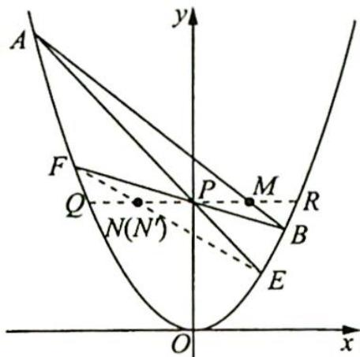

> [!faq]- 《高考数学培优40讲》例题解析
>
> > [!success]- **【答案】** 详见解析
>
> > [!note]- **【分析】**
> > 分析 ▶ 连接 EF 与 $y = y_{0}$ 交于一点, 证明这个点与 N 点为同一点即可. 根据圆锥曲线的蝴蝶定理结合线段长度的等量关系确定此两点为同一点.
>
> > [!note]- **【解析】**
> > 解析 如图所示,作直线 $y=y_{0}$ 交抛物线于 Q,R 两点,连接 EF,设 EF 与 PQ 交于点 $N'$ , 因为 PQ=PR, 所以根据圆锥曲线的蝴蝶定理,可得 $PM=PN'$ .
> > 又根据题意可知 $PM = PN$ ，所以 $N'$ ， $N$ 两点重合，故 $E, F, N$ 三点共线。
> > 
> > ## 评注
> > 如果将抛物线的方程改为 $x^{2} = 2py (p > 0)$ , 且满足 $x_{0}^{2} \neq 2py_{0}, y_{0} > 0$ , 那么结论仍然成立, 同理可知该结论在椭圆和双曲线中也成立.
