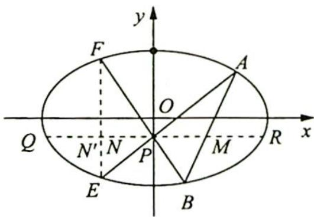

> [!faq]- 《高考数学培优40讲》例题解析
>
> > [!success]- **【答案】** 详见解析
>
> > [!note]- **【分析】**
> > 本题未单列分析。
>
> > [!note]- **【解析】**
> > 证明 如图所示,作直线 $y=y_{0}$ 交椭圆于 Q,R 两点,连接 EF,设 EF 与 PQ 交于点 $N'$ .
> > 因为 PQ=PR，所以根据圆锥曲线的蝴蝶定理，可得 $PM=PN'$ ，又根据题意可知 PM=PN，所以 $N'$ ，N 两点重合，点 N 在直线 EF 上.
> > 
> > 故 $E, F, N$ 三点共线.
