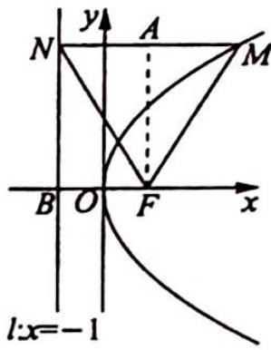

> [!faq]- 《高考数学培优40讲》例题解析
>
> > [!success]- **【答案】** C
>
> > [!note]- **【分析】**
> > 分析 ▶ MF 的斜率为 $\sqrt{3}$ ，说明 $\angle FMN = \frac{\pi}{3}$ ，又由抛物线定义有 $|MF| = |MN|$ ，所以 $\triangle MNF$ 是等边三角形。由抛物线 p 的几何意义求其边长，求高得解。
>
> > [!note]- **【解析】**
> > 解析 如图所示, 过 $F$ 作 $FA \perp MN$ , 垂足为 $A, l$ 与 $x$ 轴的交点为 $B, |FB| = 2$ .
> > 由于直线 FM 的斜率为 $\sqrt{3}$ ，故有 $\angle MFx = \frac{\pi}{3}$ ，即 $\angle FMN = \frac{\pi}{3}$ .
> > 根据抛物线定义可得 $|MF| = |MN|$ , 故 $\triangle MNF$ 是等边三角形, 从而 $A$ 是 $MN$ 的中点, 即有 $|AN| = |FB| = 2$ .
> > 
> > 在 Rt△FAN 中，|FA|=2tan π/3=2√3，因为等边三角形每条边上的高相等，所以 M 到 NF 的距离为 2√3。
> >
> > 故选 **C**.
