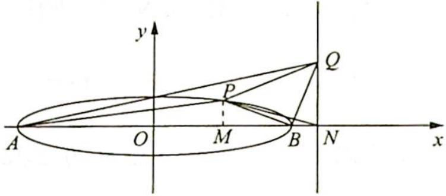

> [!faq]- 《高考数学培优40讲》例题解析
>
> > [!success]- **【答案】** 详见解析
>
> > [!note]- **【分析】**
> > 分析 ▶ (1)根据离心率的公式求出 m 的值即可; (2)本题可用已知三角形三顶点的坐标, 求三角形的面积, 但计算量较大。所以转换方向, 尝试从平面几何的角度思考: 过点 P 作 x轴的垂线, 设交点为 $M, x = 6$ 与 $x$ 轴交点为 $N$ , 由 $|BP| = |BQ|$ , $BP \perp BQ$ 易证 $\triangle PMB \cong \triangle BNQ$ , 由全等可得三角形中一些边的长, 再利用割补法求面积, 这样求解非常简洁.
>
> > [!note]- **【解析】**
> > 解析 (1) 由 $e = \frac{c}{a} = \frac{\sqrt{25 - m^2}}{5} = \frac{\sqrt{15}}{4}$ 可得 $m = \frac{5}{4}$ , 故 $C$ 的方程为 $\frac{x^2}{25} + \frac{16y^2}{25} = 1$ .
> > (2)由椭圆的对称性,不妨设点P在第一象限,如图所示.
> > 过点 $P$ 作 $x$ 轴的垂线, 垂足为 $M$ , 设 $x = 6$ 与 $x$ 轴的交点为 $N$ , 由 $|BP| = |BQ|$ , $BP \perp BQ$ 易证 $\triangle PMB \cong \triangle BNQ$ , 所以 $PM = BN = 1$ .
> > 则可得 P 点纵坐标为 $y_{P}=1$ ，将其代入椭圆方程解得 $x_{P}=3$ 或 $x_{P}=-3$ ，因为设点 P 在第一象限，所以 $x_{P}=3$ ，所以 QN=MB=5-3=2。
> > 因为 $PM = 1, QN = 2, AQ$ 的直线方程为 $y = \frac{2}{11} (x + 5)$ , 所以点 $P$ 在 $AQ$ 的下方, 则
> > 
> > $$
> > \begin{array}{r l} S _ {\triangle A P Q} & = S _ {\triangle A Q N} - S _ {\triangle P A N} - S _ {\triangle P N Q} \\ & = \frac {1}{2} \times 2 \times (5 + 6) - \frac {1}{2} \times 1 \times (5 + 6) - \frac {1}{2} \times 2 \times (6 - 3) \\ & = 1 1 - \frac {1 1}{2} - 3 = \frac {5}{2}. \end{array}
> > $$
> > 所以 $\triangle APQ$ 的面积为 $\frac{5}{2}$ .
> > 由已知条件容易想到初中常见的全等模型,用割补法求三角形面积省去繁杂的计算,由此可见运用平面几何知识可以减轻计算负担.历年高考题,尤其是客观题,经常可以数形结合,找到图形规律再“秒杀”,值得我们深入研究.
> > ## 5. 相似三角形的性质
