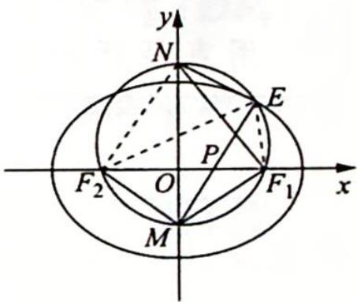

> [!faq]- 《高考数学培优40讲》例题解析
>
> > [!success]- **【答案】** 详见解析
>
> > [!note]- **【分析】**
> > 分析 ▶ 本题可从代数、几何两个角度入手考虑。代数角度:由条件进行坐标运算,将 $\frac{|EP|}{|PM|}$ 的值转化为E与M纵坐标的比;几何角度:证明 $\triangle MF_{1}P\sim\triangle MEF_{1}$ ,得到对应边的相似比, 再由 $\frac{PM}{ME} = \frac{PM}{MF_1} \cdot \frac{MF_1}{ME}$ 求出 $PM$ 与 $ME$ 的比, 进而得出 $\frac{|EP|}{|PM|}$ 的值.
>
> > [!note]- **【解析】**
> > 解析 (1) $2 c = 2, 2 a = 4$ , 得 $a = 2, c = 1, b = \sqrt {3}$ , 所以椭圆 $C$ 的方程为 $\frac{x^2}{4} + \frac{y^2}{3} = 1$ .
> > (2)解法一(代数方法): 设 $M(0,m)$ , $N(0,n)$ (不妨设 m<0, n>0), $E(x_{0},y_{0})$ , 因为 $\angle MF_{1}N=90^{\circ}$ , 所以 mn=-1, 则 $\overrightarrow{EM}=(-x_{0},m-y_{0}),\overrightarrow{EN}=(-x_{0},n-y_{0})$ .
> > 又 $\overrightarrow{EM} \cdot \overrightarrow{EN} = x_0^2 + (m - y_0)(n - y_0) = 0$ ，即 $x_0^2 + mn - (m + n)y_0 + y_0^2 = 0$ ，亦即 $x_0^2 - 1 - (m + n)y_0 + y_0^2 = 0$ ，整理得 $x_0^2 + y_0^2 - 1 - \left(n - \frac{1}{n}\right)y_0 = 0$ ①.
> > 又 $\frac{x_0^2}{4} +\frac{y_0^2}{3} = 1$ ，得 $x_0^2 = 4\left(1 - \frac{y_0^2}{3}\right) = 4 - \frac{4}{3} y_0^2$ ，代入①式得 $4 - \frac{4}{3} y_0^2 +y_0^2 -1 - \left(n - \frac{1}{n}\right)y_0 = 0,$
> > 即 $-\frac{1}{3} y_0^2 - (n - \frac{1}{n}) y_0 + 3 = 0$ ，亦即 $y_0^2 + 3(n - \frac{1}{n}) y_0 - 9 = 0$ ，可得 $(y_0 + 3n)(y_0 - \frac{3}{n}) = 0$ ，即 $y_0 = -3n$ 或 $\frac{3}{n}$ .
> > 又 $y_0 > 0$ ，得 $y_0 = \frac{3}{n}$ 所以 $\frac{|EP|}{|PM|} = \left|\frac{\frac{3}{n}}{\frac{-1}{n}}\right| = 3.$
> > 解法二(几何法): $\angle MEN = \angle MF_{1}N = 90^{\circ}$ , 得 $N, E, F_{1}, M$ 四点共圆. 连接 $EF_{2}, EF_{1}$ , 如图所示.
> > $\angle F_{2}EM = \angle F_{1}EM$ ，所以 $\frac{EF_2}{EF_1} = \frac{F_2P}{PF_1}\Rightarrow \frac{EF_2 + EF_1}{EF_2} = \frac{F_2P + PF_1}{F_2P},$
> > 
> > 可得 $\frac{2a}{2c} = \frac{EF_2}{F_2P} = \frac{1}{e} = 2$ ，故 $\frac{EF_2}{F_2P} = 2$ 或 $\frac{EF_1}{F_1P} = 2.$
> > $\triangle MF_{1}P \sim \triangle MEF_{1}$ , 得 $\frac{MP}{MF_{1}} = \frac{MF_{1}}{ME} = \frac{PF_{1}}{EF_{1}} = \frac{1}{2}, \frac{PM}{MF_{1}} \cdot \frac{MF_{1}}{ME} = \frac{PM}{ME}$ , 所以 $\frac{PM}{ME} = \frac{1}{4}$ , 则 $|PM| = \frac{1}{3} |PE|$ , 故 $\frac{|EP|}{|PM|} = 3$ .
