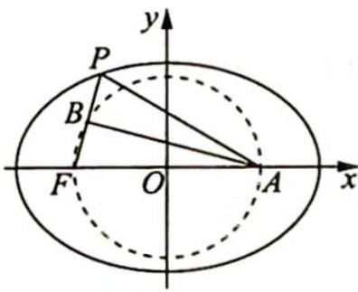

> [!faq]- 《高考数学培优40讲》例题解析
>
> > [!success]- **【答案】** 详见解析
>
> > [!note]- **【分析】**
> > 分析 ▶ PF 的中点在圆上, 直径所对圆周角为 $90^{\circ}$ , 所以存在垂直条件. 由等腰三角形三线合一知 $|AP| = |AF| = 4$ (其中 $A$ 为右焦点), 则可得 $|BF|$ 与 $|AB|$ , 再由 $k_{PF} = \tan \angle PFA = \frac{|AB|}{|BF|}$ 得解.
>
> > [!note]- **【解析】**
> > 解析 ▶ 设椭圆的右焦点为 A, PF 的中点为点 B, 连接 AB, AP, 如图所示.
> > 
> > 由已知 $\left| {AF}\right|  = {2c} = 4$ ,因为点 $B$ 在以原点为圆心, ${OF}$ 长为半径的圆上, 所以 $\angle {ABF} = {90}^{ \circ  }$ ,又点 $B$ 为 ${PF}$ 的中点,所以 ${AB}$ 为线段 ${PF}$ 的垂直平分
> > 线, 所以 $|AP| = |AF| = 4$ , 则 $|PF| = 2a - |AP| = 2$ , $|BF| = 1$ , $|AB| = \sqrt{|AF|^2 - |BF|^2} = \sqrt{15}$ .
> > 故直线 $PF$ 的斜率 $k_{PF} = \tan \angle PFA = \frac{|AB|}{|BF|} = \sqrt{15}$ .
> > ## 评注
> > 本题为填空题,题中出现了圆的条件,且 $\angle ABF$ 恰为直径所对的圆周角,所以利用直径所对圆周角为 $90^{\circ}$ ,我们就得出了重要的垂直条件,进而顺利解决了本题.
