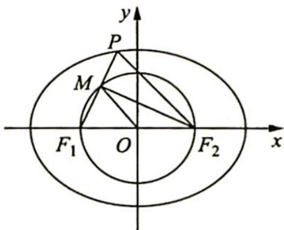

> [!faq]- 《高考数学培优40讲》例题解析
>
> > [!success]- **【答案】** 详见解析
>
> > [!note]- **【分析】**
> > 本题未单列分析。
>
> > [!note]- **【解析】**
> > 解析 ▶ 设 $PF_{1}$ 的中点为 M，连接 $MF_{2}$ ，不妨设 $\left|MF_{2}\right|=4$ ， $\left|MF_{1}\right|=3$ ，则 $\left|PM\right|=\left|MF_{1}\right|=3,\left|PF_{2}\right|=\left|F_{1}F_{2}\right|=5$ ，故椭圆离心率 $e=\frac{c}{a}=\frac{2c}{2a}=\frac{\left|F_{1}F_{2}\right|}{\left|PF_{1}\right|+\left|PF_{2}\right|}=\frac{5}{11}$ .
> > 
> > ## 评注
> > 焦点三角形的研究也是常考内容,本题是将焦点三角形与图形几何关系相结合研究.
