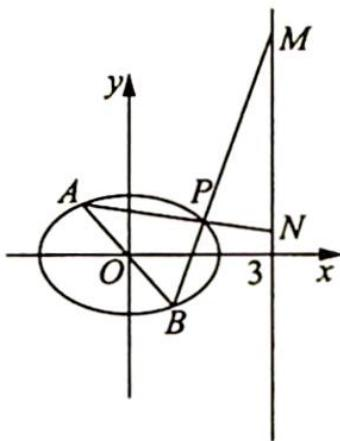

<!-- question-source:start -->
例 14.8 如图所示, 在平面直角坐标系 $xOy$ 中, 点 $B$ 与点 $A(-1,1)$ 关于原点 $O$ 对称, $P$ 是动点, 且直线 $AP$ 与 $BP$ 的斜率之积等于 $-\frac{1}{3}$ .

(1) 求动点 P 的轨迹方程；

(2)设直线 $AP$ 与 $BP$ 分别与直线 $x = 3$ 交于点 $N, M$ . 是否存在点 $P$ , 使得 $\triangle PAB$ 与 $\triangle PMN$ 的面积相等? 若存在, 求出点 $P$ 的坐标; 若不存在, 请说明理由.
<!-- question-source:end -->

![[高中/总复习/专题/高考数学培优40讲/高考数学培优40讲-02-解析几何/第14讲_以形助数__圆锥曲线中几何性质研究/挖掘平面几何性质多想少算/14_3_挖掘平行线的几何性质/例题/answers/Q00019431A1.md]]
