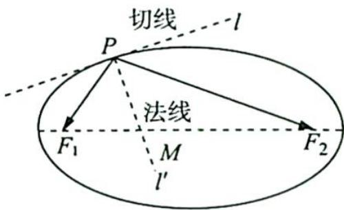

<!-- question-source:start -->
5.(椭圆光学性质)如图所示,椭圆有这样的光学性质:从椭圆的一个焦点出发的光线,经椭圆反射后,反射光线经过椭圆的另一个焦点.根据椭圆的光学性质解决下题:已知曲线C的方程为 $x^{2}+4y^{2}=4$ ,其左、右焦点分别是 $F_{1},F_{2}$ ,直线l与椭圆C切于点P,且 $|PF_{1}|=1$ ,过

点 $P$ 且与直线 $l$ 垂直的直线 $l'$ 与椭圆长轴交于点 $M$ , 则 $\left|F_{1} M\right|: \left|F_{2} M\right| = (\quad)$ .

A. $\sqrt{2}: \sqrt{3}$ B. $1: \sqrt{2}$ C. $1: 3$ D. $1: \sqrt{3}$
<!-- question-source:end -->

![[Q00019455A1]]
