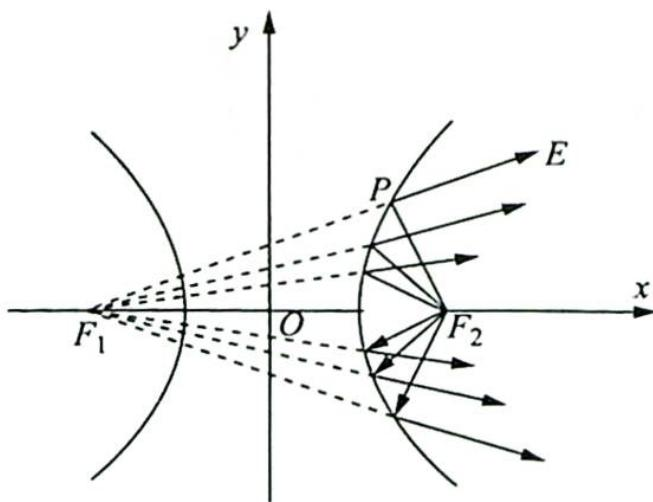

<!-- question-source:start -->
7. 智慧的人们在进行工业设计时, 巧妙地利用了圆锥曲线的光学性质, 比如电影放映机利用椭圆镜面反射出聚焦光线, 探照灯利用抛物线镜面反射出平行光线. 如图所示, 从双曲线右焦点 $F_{2}$ 发出的光线通过双曲线镜面反射出发散光线, 且反射光线的反向延长线经过左焦点 $F_{1}$ . 已知双曲线的离心率为 $\sqrt{2}$ , 则当入射光线 $F_{2}P$ 和反射光线 $PE$ 相互垂直时 (其中 $P$ 为入射点), $\angle F_{1}F_{2}P$ 的大小为 ( ). A. $\frac{\pi}{12}$ B. $\frac{\pi}{6}$ C. $\frac{\pi}{3}$ D

$$
\frac {5 \pi}{1 2}
$$
<!-- question-source:end -->

![[Q00019457A1]]
