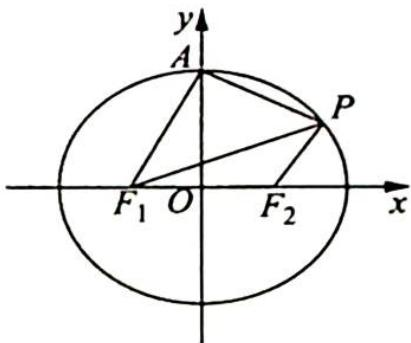

<!-- question-source:start -->
9. 已知椭圆 $C: \frac{x^2}{a^2} + \frac{y^2}{b^2} = 1 (a > b > 0)$ 的左、右焦点分别为 $F_1, F_2$ , 上顶点为 $A$ , 离心率为 $\frac{1}{2}$ , 点 $P$ 为第一象限内椭圆上的一个点, 且 $S_{\triangle PF_1A}: S_{\triangle PF_1F_2} = 2: 1$ , 求直线 $PF_1$ 的斜率.

<!-- question-source:end -->

![[Q00019459A1]]
