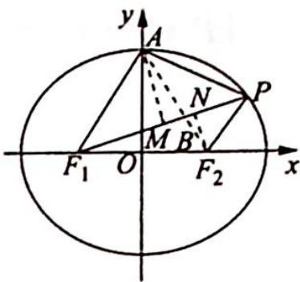

> [!faq]- 《高考数学培优40讲》参考答案
>
> > [!success]- **【答案】** 详见解析
>
> > [!note]- **【分析】**
> > 本题未单列分析。
>
> > [!note]- **【解析】**
> > 如图所示,作 AM 垂直于 $PF_{1}$ 于点 M,作 $F_{2}N$ 垂直于 $PF_{1}$ 于点 N,则 $|AM|:|F_{2}N|=S_{\triangle PF_{1}A}:S_{\triangle PF_{1}F_{2}}=2:1.$
> > 连接 $AF_{2}$ 交 $PF_{1}$ 于点 $B$ ，则由相似比知 $|AB|: |BF_{2}| = 2:1$ ，所以点 $B$ 是线段 $AF_{2}$ 的三等分点，又 $A(0,b), F_{2}(c,0)$ ，所以点 $B$ 坐标为 $\left(\frac{2c}{3}, \frac{b}{3}\right), k_{PF_{1}} = k_{BF_{1}} = \frac{\frac{b}{3} - 0}{\frac{2c}{3} + c} = \frac{b}{5c}$ . 又因为离心率为 $\frac{1}{2}$ ，即 $\frac{c}{a} = \frac{1}{2}$ ，又 $a^{2} - c^{2} = b^{2}$ ，所以 $\frac{b}{c} = \sqrt{3}$ ，则 $k_{PF_{1}} = \frac{\sqrt{3}}{5}$ .
> > 
