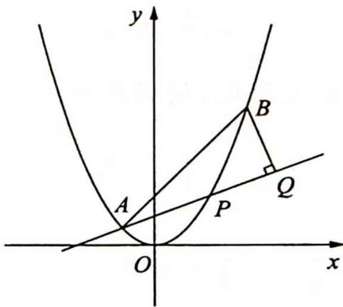

<!-- question-source:start -->
变式1 如图所示, 已知抛物线 $x^{2} = y$ . 点 $A\left(-\frac{1}{2}, \frac{1}{4}\right)$ , $B\left(\frac{3}{2}, \frac{9}{4}\right)$ , 抛物线上的点 $P(x, y)\left(-\frac{1}{2} < x < \frac{3}{2}\right)$ , 过点 $B$ 作直线 $AP$ 的垂线, 垂足为 $Q$ .

(1)求直线 $AP$ 斜率的取值范围；

(2)求 $|PA||PQ|$ 的最大值.
<!-- question-source:end -->

![[高中/总复习/专题/高考数学培优40讲/高考数学培优40讲-02-解析几何/第15讲_以数化形__圆锥曲线中几何条件的转化策略/15_1_以向量为背景的转化/例题/answers/Q00019468A1.md]]
