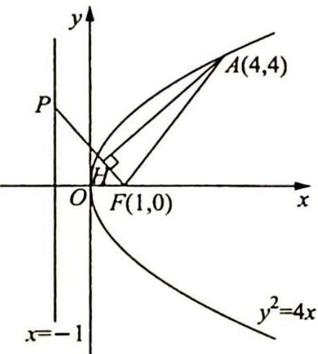

> [!faq]- 《高考数学培优40讲》例题解析
>
> > [!success]- **【答案】** 详见解析
>
> > [!note]- **【分析】**
> > 分析 ▶ 将 $\left| PH \right| \left| PF \right|$ 这个几何量转化为用向量的语言表示, 即 $\left| PH \right| \left| PF \right| = \overrightarrow{PA} \cdot \overrightarrow{PF}$ , 利用向量的坐标形式来求数量积, 再求其最值.
>
> > [!note]- **【解析】**
> > 解析 ▶ 依题意, 抛物线方程为 $y^{2} = 4x$ . 如图所示, 过点 $A$ 作 $PF$ 的垂线, 垂足为 $H$ , 则 $|\overrightarrow{PH}| |\overrightarrow{PF}| = \overrightarrow{PA} \cdot \overrightarrow{PF}$ .
> > 
> > 设 $P(-1, t), A(4, 4), F(1, 0), \overrightarrow{PA} = (5, 4 - t), \overrightarrow{PF} = (2, -t), \overrightarrow{PA} \cdot \overrightarrow{PF} = 10 - t(4 - t) = t^2 - 4t + 10 = (t - 2)^2 + 6 \geqslant 6.$
> > 所以 $|PH||PF|$ 的最小值为6.
