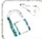
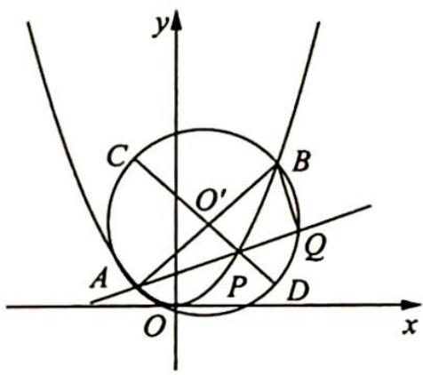

> [!faq]- 《高考数学培优40讲》例题解析
>
> > [!success]- **【答案】** 详见解析
>
> > [!note]- **【分析】**
> > 分析 ▶ (1) 将 $AP$ 的斜率 $k$ 表示为 $x$ 的函数求取值范围; (2) 可从目标函数法与向量法两个角度考虑. 函数角度: 将 $|PA||PQ|$ 表示为 $AP$ 的斜率 $k$ 的函数, 将问题转化为求函数最值; 向量角度: 直接表示 $|PA|$ , $|PQ|$ 会比较复杂, 从 $|\overrightarrow{PA}||\overrightarrow{PQ}| = -\overrightarrow{PA} \cdot \overrightarrow{PB}$ , 即转化为数量积入手求解会大大简化.
>
> > [!note]- **【解析】**
> > 解析 (1) 设直线 $AP$ 的斜率为 $k$ , 已知 $A\left(-\frac{1}{2}, \frac{1}{4}\right), P(x, y)$ , 则 $k = \frac{y - \frac{1}{4}}{x + \frac{1}{2}} = \frac{x^2 - \frac{1}{4}}{x + \frac{1}{2}} =$
> > $$
> > x - \frac {1}{2}.
> > $$
> > 因为 $-\frac{1}{2} < x < \frac{3}{2}$ , 所以 $-1 < x - \frac{1}{2} < 1$ , 则直线 $AP$ 斜率的取值范围是 $(-1, 1)$ .
> > (2)解法一(目标函数法): 因为直线 $AP \perp BQ$ , 且 $B\left(\frac{3}{2}, \frac{9}{4}\right)$ , 所以直线 BQ 的方程为 $y - \frac{9}{4} = -\frac{1}{k} \left(x - \frac{3}{2}\right)$ .
> > 联立直线 $AP$ 与 $BQ$ 的方程 $\left\{ \begin{array}{l} kx - y + \frac{1}{2} k + \frac{1}{4} = 0 \\ x + ky - \frac{9}{4} k - \frac{3}{2} = 0 \end{array} \right.$ ，解得点 $Q$ 的横坐标是 $x_{Q} = \frac{-k^{2} + 4k + 3}{2(k^{2} + 1)}$ . 又 $|PA| = \sqrt{1 + k^{2}} \left| x + \frac{1}{2} \right| = \sqrt{1 + k^{2}} (k + 1) (-1 < k < 1)$ ， $|PQ| = \sqrt{1 + k^{2}} |x_{Q} - x| = -\frac{(k - 1)(k + 1)^{2}}{\sqrt{1 + k^{2}}} (-1 < k < 1)$ ，所以 $|PA||PQ| = -(k - 1)(k + 1)^{3} (-1 < k < 1)$ .
> > 令 $f(k) = -(k - 1)(k + 1)^3 (-1 < k < 1)$ , 因为 $f'(k) = -(4k - 2)(k + 1)^2$ , 则当 $-1 < k < \frac{1}{2}$ 时, $f'(k) > 0$ ; 当 $\frac{1}{2} < k < 1$ 时, $f'(k) < 0$ , 所以 $f(k)$ 在 $\left(-1, \frac{1}{2}\right)$ 上单调递增, 在 $\left(\frac{1}{2}, 1\right)$ 上单调递减. 故当 $k = \frac{1}{2}$ 时, $|PA||PQ|$ 取得最大值 $\frac{27}{16}$ .
> > 解法二(极化恒等式): 直接表示 $\left|PA\right|$ , $\left|PQ\right|$ 会比较复杂, 利用 $\left|\overrightarrow{PA}\right|\left|\overrightarrow{PQ}\right|=-\overrightarrow{PA}\cdot\overrightarrow{PB}$ 会大大简化, 设 AB 中点为 M, 则 $M\left(\frac{1}{2},\frac{5}{4}\right)$ .
> > 由 $|\overrightarrow{PA}||\overrightarrow{PQ}| = -\overrightarrow{PA}\cdot \overrightarrow{PB} = -\left(\overrightarrow{PM^2} -\frac{1}{4}\overrightarrow{AB^2}\right) = \frac{1}{4}\overrightarrow{AB^2} -\overrightarrow{PM^2}$ ，又 $|\overrightarrow{AB}|^2 = \left(-\frac{1}{2} -\frac{3}{2}\right)^2+$ $\left(\frac{1}{4} -\frac{9}{4}\right)^2 = 8$ ，所以 $|\overrightarrow{PA} ||\overrightarrow{PQ}| = 2 - \overrightarrow{PM^2}$
> > 又 $\overrightarrow{PM^2} = \left(x_0 - \frac{1}{2}\right)^2 +\left(y_0 - \frac{5}{4}\right)^2 = \left(x_0 - \frac{1}{2}\right)^2 +\left(x_0^2 -\frac{5}{4}\right)^2 = x_0^4 -\frac{3}{2} x_0^2 -x_0 + \frac{29}{16}$ ，令 $f(x) =$ $x^{4} - \frac{3}{2} x^{2} - x + \frac{29}{16}\left(-\frac{1}{2} <  x <   \frac{3}{2}\right),f^{\prime}(x) = 4x^{3} - 3x - 1 = (x - 1)(2x + 1)^{2},$ 因此 $f(x)$ 在 $\left(-\frac{1}{2},1\right)$ 上单调递减，在 $\left(1,\frac{3}{2}\right)$ 上单调递增， $f(x)_{\min} = f(1) = \frac{5}{16}.$
> > 故 $|\overrightarrow{PA}| |\overrightarrow{PQ}|$ 的最大值为 $2 - \frac{5}{16} = \frac{27}{16}$ .
> > 解法三(几何方法,圆幂定理):依题意得 $QA \perp QB$ , 则以 AB 为直径的圆 $O'$ 过点 Q, 如图所示.
> > 
> > 由相交弦定理知 $|PA||PQ| = |PC||PD| = (r + |PO'|)\cdot (r - |PO'|) = r^2 -|PO'|^2 =$ $\left(\frac{|AB|}{2}\right)^2 -|PO'|^2 = 2 - |PO'|^2.$
> > 设 $P(x_0, x_0^2)$ , $O'\left(\frac{1}{2}, \frac{5}{4}\right)$ , $2 - |PO'|^2 = 2 - \left[\left(x_0 - \frac{1}{2}\right)^2 + \left(x_0^2 - \frac{5}{4}\right)^2\right] = 2 - \left(x_0^2 - x_0 + \frac{1}{4} + x_0^4 - \frac{5}{2}x_0^2 + \frac{25}{16}\right) = 2 - \left(x_0^4 - \frac{3}{2}x_0^2 - x_0 + \frac{29}{16}\right) = -x_0^4 + \frac{3}{2}x_0^2 + x_0 + \frac{3}{16}\left(-\frac{1}{2} < x_0 < \frac{3}{2}\right)$ .
> > $$
> > f (x _ {0}) = - x _ {0} ^ {4} + \frac {3}{2} x _ {0} ^ {2} + x _ {0} + \frac {3}{1 6} \left(- \frac {1}{2} <   x _ {0} <   \frac {3}{2}\right), f ^ {\prime} (x _ {0}) = - 4 x _ {0} ^ {3} + 3 x _ {0} + 1 = - 4 (x _ {0} ^ {3} - 1) +
> > $$
> > $3x_{0} - 3 = (2x_{0} + 1)^{2}(1 - x_{0}), f(x_{0})$ 在 $\left(-\frac{1}{2}, 1\right)$ 上单调递增，在 $\left(1, \frac{3}{2}\right)$ 上单调递减， $f(x_{0})_{\max} = f(1) = \frac{27}{16}$ .
> > 
