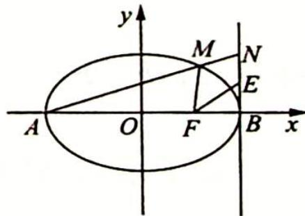

<!-- question-source:start -->
例 15.3 如图所示, 已知椭圆 $C: \frac{x^{2}}{a^{2}} + \frac{y^{2}}{b^{2}} = 1 (a > b > 0)$ 的短轴长为 $2\sqrt{3}$ , 右焦点为 $F(1,0)$ , 点 $M$ 是椭圆 $C$ 上异于左、右顶点 $A, B$ 的一点.

(1) 求椭圆 C 的方程；

(2) 若直线 $AM$ 与直线 $x = 2$ 交于点 $N$ , 线段 $BN$ 的中点为 $E$ . 证明: 点 $B$ 关于直线 $EF$ 的对称点在直线 $MF$ 上.
<!-- question-source:end -->

![[高中/总复习/专题/高考数学培优40讲/高考数学培优40讲-02-解析几何/第15讲_以数化形__圆锥曲线中几何条件的转化策略/15_2_以斜率为背景的转化/例题/answers/Q00019469A1.md]]
