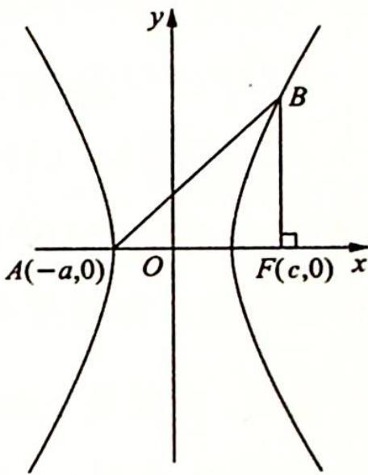
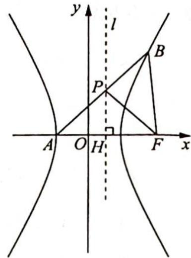

> [!faq]- 《高考数学培优40讲》例题解析
>
> > [!success]- **【答案】** 详见解析
>
> > [!note]- **【分析】**
> > 本题未单列分析。
>
> > [!note]- **【解析】**
> > 解析 (1) 当 $BF \perp AF$ 时, $|AF| = |BF|$ , 此时设 $B(c, y_B)$ , 则 $\frac{c^2}{a^2} - \frac{y_B^2}{b^2} = 1$ , 所以 $y_B^2 = b^2\left(\frac{c^2}{a^2} - 1\right) = \frac{b^4}{a^2}$ .
> > 因为 $|BF| = |y_B| = \frac{b^2}{a} = |AF| = a + c$ ，即 $b^2 = a^2 + ac$ ，又 $b^2 = c^2 - a^2$ ，所以 $c^2 - a^2 = a^2 + ac$ ，则 $c^2 - ac - 2a^2 = 0, e^2 - e - 2 = 0, (e - 2)(e + 1) = 0$ ，解得 $e = 2, e = -1$ （舍去）.
> > 故 $C$ 的离心率为 2.
> > (2) 解法一(坐标法): 如图所示, 设 $B(x_0, y_0)$ , 则 $x_0 > a, y_0 > 0$ .
> > 由(1)知， $e = 2$ ，所以 $\frac{c}{a} = 2, c = 2a, b = \sqrt{3} a$ ，则渐近线方程为 $y = \pm \frac{b}{a} x = \pm \sqrt{3} x, \angle BAF < 60^{\circ}, \angle BFA < 120^{\circ}$ .
> > - **①**：当 $x_0 = c$ 时，由(1)知， $\angle BFA = 90^\circ, \angle BAF = 45^\circ$ ，所以 $\angle BFA = 2\angle BAF$ .
> > 
> > - **②**：当 $x_0 \neq c$ 时, $\tan \angle BFA = \frac{-y_0}{x_0 - c}$ , $\tan \angle BAF = \frac{y_0}{x_0 + a}$ , 所以
> > \(\tan 2 \angle BAF = \frac{2\tan \angle BAF}{1 - \tan^2 \angle BAF} = \frac{\frac{2y\_0}{x\_0 + a}}{1 - \left(\frac{y\_0}{x\_0 + a}\right)^2} = \frac{2y\_0(x\_0 + a)}{(x\_0 + a)^2 - y\_0^2} = \frac{2y\_0(x\_0 + a)}{(x\_0 + a)^2 + b^2\left(1 - \frac{x\_0^2}{a^2}\right)} = \frac{2y\_0(x\_0 + a)}{(x\_0 + a)^2 + b^2\left(1 - \frac{x\_0^2}{a^2}\right)} = \frac{2y\_0(x\_0 + a)}{(x\_0 + a)^2 + b^2\left(1 - \frac{x\_0^2}{a^2}\right)} = \frac{2y\_0(x\_{0} + a)}{(x\_{0} + a)^{2} + b^{2}\left(1 - \frac{x\_{0}^2}{a^{2}}\right)} = \frac{2y\_0(x\_{0} + a)}{(x\_{0} + a)^{2} + b^{2}\left(1 - \frac{x\_{0}^2}{a^{2}}\right)} = \frac{2y\_0(x\_{0} + a)}{(x\_{0} + a)^{2} + b^{2}\left(1 - \frac{x\_{0}^2}{a^{4}}\right)} = \frac{2y\_0(x\_{0} + a)}{(x\_{0} + a)^{2} + b^{2}\left(1 - \frac{x\_{0}^2}{a^{4}}\right)} = \frac{2y\_0(x\_{0} + a)}{(x\_{0} + a)^{2} + b^{2}\left(1 - \frac{x\_{0}^2}{b^{4}}\right)} = \frac{2y\_0(x\_{0} + a)}{(x\_{0} + a)^{2} + b^{2}\left(1 - \frac{x\_{0}^2}{b^{4}}\right)} = \frac{2y\_0(x\_{0} + a)}{(x\_{0} + a)^{2} + b^{2}\left(1 - \frac{x\_{0}^3}{b^{4}}\right)} = \frac{2y\_0(x\_{0} + a)}{(x\_{0} + a)^{2} + b^{2}\left(1 - \frac{x\_{0}^3}{b^{4}}\right)} = \frac{2y\_0(x\_{0} + a)}{(x\_{0} + a)^{2} + b^{2}\left(1 - \frac{x\_{0}}{b^{4}}\right)} = \frac{2y\_0(x\_{0} + a)}{(x\_{0} + a)^{2} + b^{2}\left(1 - \frac{x\_{0}}{b^{4}}\right)} = \frac{2y\_0(x\_{0} + a)}{(x\_{0} + a)^{2} + b^{2}\left(1 - \frac{x\_{0}}{b ^{4}}\right)} = \frac{2y\_0(x\_{0} + a)}{(x\_{0} + a)^{2} + b^{2}\left(1 - \frac{x\_{0}}{b^{4}}\right)} = \frac{2y\_0(x\_{0} + a)}{(x\_{0} + a)^{2} + b^{2}\left(1 - \frac{x\_{0}}{b^{4}}, 1 - \frac{x\_{0}}{b^{4}}\right)} = \frac{2y\_0(x\_{0} + a)}{(x\_{0} + a)^{2} + b^{2}\left(1 - \frac{x\_{0}}{b^{4}}\right)} = \frac{2y\_0(x\_{0} + a)}{(x\_{0} + a)^{2} + b^{2}\left(1 + x\_{0}\right)} = \frac{2y\_0(x\_{0} + a)}{(x\_{0} + a)^{2} + b^{2}\left(1 - x\_{0}\right)} = \frac{2y\_0(x\_{0} + a)}{(x\_{0} + a)^{2} + b^{2}\left(1 - x\_{0}\right)} = \frac{2y\_0(x\_{0} + a)}{(x\_{0} + a)^{2} + b^{2}\left(1 - x\_{0}\right)} = \frac{2y\_0(x\_{0}, 1) - y\_0}{(x\_0 - 1) / (x\_0 - 1) / (x\_0 - 1) / (x\_0 - 1) / (x\_0 - 1) / (x\_0 - 1) / (x\_0 - 1) / (x\_0 - 1) / (x\_0 - 1) / (x\_0 - 1) / (x\_0 - 1) / (x\_0 - 1) / (5, 5) / (5, 5) / (5, 5) / (5, 5) / (5, 5) / (5, 5) / (5, 5) / (5, 5) / (5, 5) / (5, 5) / (5, 5) / (5, 5) / (5, 5) / (5, 5) / (5, 5)
> > 又 $\angle BFA<120^{\circ}$ , 所以 $\angle BFA=2\angle BAF$ .
> > 综合①②可得 $\angle BFA=2\angle BAF$ .
> > 解法二(几何法):如图所示,由(1)知 e=2,设直线 $l: x=\frac{a^{2}}{c}=\frac{a}{2}$ (右准线)与 x 轴交于点
> > $H\left(\frac{a}{2},0\right)$ ，和AB交于点P，连接PF，易知 $\triangle PAF$ 为等腰三角形，且 $\angle BAF=\angle PFA.$
> > 欲证 $\angle BFA = 2\angle BAF$ , 即证 $\angle PFA = \angle PFB$ , 也就是 $PF$ 为 $\angle BFA$ 的平分线.
> > 
> > 由角平分线定理可知, 若 $\angle PFA = \angle PFB$ , 则 $\frac{PA}{PB} = \frac{FA}{FB} (\ast)$ , 即 $\frac{d(A,l)}{d(B,l)} =$
> > $\frac{FA}{FB}\Leftrightarrow\frac{FA}{d(A,l)}=\frac{FB}{d(B,l)}$ ，由双曲线的第二定义，得 $\frac{|FA|}{d(A,l)}=\frac{|FB|}{d(B,l)}=e=2$ ，即 $(*)$ 式成立.
> > 由角平分线定理的逆定理, 可知 ${PF}$ 为 $\angle {BFA}$ 的平分线,命题得证.
