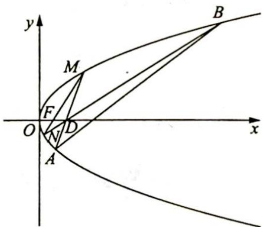

> [!faq]- 《高考数学培优40讲》例题解析
>
> > [!success]- **【答案】** 详见解析
>
> > [!note]- **【分析】**
> > 本题未单列分析。
>
> > [!note]- **【解析】**
> > 解析 ▶ (1) 当直线 $MD$ 垂直于 $x$ 轴时, $M(p, \sqrt{2} p)$ , 则 $|MF| = p + \frac{p}{2} = 3$ , 解得 $p = 2$ , 故抛物线 $C$ 的方程为 $y^2 = 4x$ .
> > (2)由题意知, $F(1,0)$ , $D(2,0)$ .
> > - **①**：当 $MN \perp x$ 轴时，易知 $AB \perp x$ 轴，此时 $\alpha = \beta = 90^{\circ}$ ，则 $\alpha - \beta = 0$ ；
> > - **②**：当直线 $MN$ 的斜率存在时, 如图所示, 设直线 $MN$ 的斜率为 $k_{1}, AB$ 的斜率为 $k_{2}$ .
> > 由题意可知 $k_{1}k_{2} > 0$ ，则根据对称性，不妨考虑 $k_{1} > 0, k_{2} > 0$ 的情况.
> > 
> > 若 $\alpha - \beta$ 取得最大值, 则 $\tan (\alpha - \beta) = \frac{k_1 - k_2}{1 + k_1k_2}$ 取得最大值.
> > 设 $MN$ 的直线方程为 $x = t_{1}y + 1$ (其中 $t_1 = \frac{1}{k_1}$ ), $M(x_1, y_1)$ , $N(x_2, y_2)$ , $A(x_A, y_A)$ , $B(x_B, y_B)$ , 联立直线 $MN$ 的方程与抛物线 $\left\{ \begin{array}{l} x = t_1y + 1 \\ y^2 = 4x \end{array} \right.$ , 可得 $y^2 - 4t_1y - 4 = 0$ , 则 $y_1y_2 = -4$ , 所以 $x_1x_2 = \frac{y_1^2}{4} \cdot \frac{y_2^2}{4} = 1$ .
> > 因为 AM, BN 均过 D(2,0)，则按同样方法可得 $x_{1}x_{A}=4, x_{A}=\frac{4}{x_{1}}; y_{1}y_{A}=-8, y_{A}=-\frac{8}{y_{1}}$ 且 $x_{B}=\frac{4}{x_{2}}, y_{B}=-\frac{8}{y_{2}}$ ，所以 $k_{1}=\frac{y_{1}-y_{2}}{x_{1}-x_{2}}=\frac{y_{1}-y_{2}}{\frac{y_{1}^{2}}{4}-\frac{y_{2}^{2}}{4}}=\frac{4}{y_{1}+y_{2}}, k_{2}=\frac{y_{A}-y_{B}}{x_{A}-x_{B}}=\frac{-8\left(\frac{1}{y_{1}}-\frac{1}{y_{2}}\right)}{4\left(\frac{1}{x_{1}}-\frac{1}{x_{2}}\right)}=$ $\frac{y_{2}-y_{1}}{\frac{y_{2}^{2}}{2}-\frac{y_{1}^{2}}{2}}=\frac{2}{y_{1}+y_{2}}$ ，则 $k_{1}=2k_{2},\tan(\alpha-\beta)=\frac{k_{1}-k_{2}}{1+k_{1}k_{2}}=\frac{k_{2}}{1+2k_{2}^{2}}=\frac{1}{\frac{1}{k_{2}}+2k_{2}}\leqslant\frac{1}{2\sqrt{2}}$ ，当且仅当 $\frac{1}{k_{2}}=$ $2k_{2}$ ，即 $k_{2}=\frac{\sqrt{2}}{2}$ 时等号成立，故当 $\alpha-\beta$ 取得最大值时， $k_{2}=\frac{\sqrt{2}}{2}$ .
> > 设直线 AB 的方程为 $x=t_{2}y+n=\sqrt{2}y+n$ ，联立直线 AB 与抛物线方程可得 $y^{2}-4\sqrt{2}y-4n=0$ ，因为 $y_{A}y_{B}=\frac{64}{y_{1}y_{2}}=-16=-4n$ ，则 n=4，故直线 AB 的方程为 $x-\sqrt{2}y-4=0$ 。
> > ## 评注
> > 本题考查抛物线中的运算能力,主要涉及抛物线中韦达定理的快速计算(单割线定理)及倾斜角与斜率的转化关系.若注意到直线 $MN$ , $AM$ (或 $BN$ )均过定点,可迅速判断横坐标及纵坐标之积为定值,进而构造四点坐标间的联系,不难发现 $AB$ 也过定点;否则,不断地设直线并与曲线联立,需要考生具备较强的逻辑推理能力.同时本题也考查学生对倾斜角与斜率的转化能力,注意到 $\alpha - \beta$ ,可采用分析法取正切值将角度差的最大值转化为含斜率形式的函数最大值,从而可以有效地将点的坐标引入进来.如果对本题研习较深,则会对角度与斜率的转化方法具有较高的敏感度.
