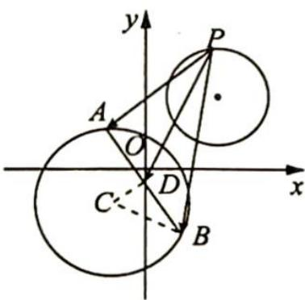

> [!faq]- 《高考数学培优40讲》例题解析
>
> > [!success]- **【答案】** D
>
> > [!note]- **【分析】**
> > 分析 ▶ 由两直线方程形式知 $l_{1} \perp l_{2}$ , 构造隐形圆, 找到动点轨迹, 转化距离.
>
> > [!note]- **【解析】**
> > 解析 ▶ 由题意得圆 C 的圆心为 $(-1,-1)$ ，半径 r=2，易知直线 $l_{1}:mx-y-3m+1=0$ 恒过点 $(3,1)$ ，直线 $l_{2}:x+my-3m-1=0$ 恒过点 $(1,3)$ ，且 $l_{1}\perp l_{2}$ ，所以点 P 的轨迹为 $(x-2)^{2}+(y-2)^{2}=2$ ，圆心为 $(2,2)$ ，半径为 $\sqrt{2}$ .
> > 若点 D 为弦 AB 的中点, 位置关系如图所示, 所以 $\overrightarrow{PA} + \overrightarrow{PB} = 2\overrightarrow{PD}$ . 连接 CD, 由 $|AB| = 2\sqrt{3}$ 易知 $|CD| = \sqrt{4 - (\sqrt{3})^2} = 1$ , 则 $|\overrightarrow{PD}|_{\max} = |PC|_{\max} + |CD| = \sqrt{3^2 + 3^2} + \sqrt{2} + 1 = 4\sqrt{2} + 1$ .
> > 所以 $\left|\overrightarrow{PA}+\overrightarrow{PB}\right|_{\max}=2\left|\overrightarrow{PD}\right|_{\max}=8\sqrt{2}+2.$ 故选 D.
> > 
