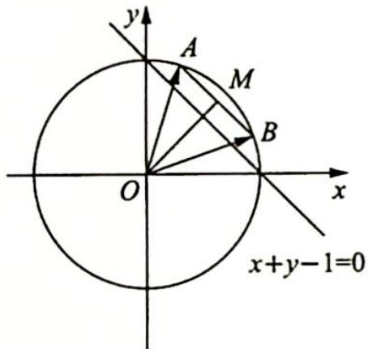
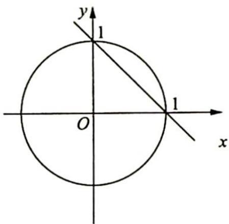

> [!faq]- 《高考数学培优40讲》例题解析
>
> > [!success]- **【答案】** 详见解析
>
> > [!note]- **【分析】**
> > 本题未单列分析。
>
> > [!note]- **【解析】**
> > 解析 如图所示, $\frac{|x_1 + y_1 - 1|}{\sqrt{2}}$ 和 $\frac{|x_2 + y_2 - 1|}{\sqrt{2}}$ 分别表示动点 $A(x_1, y_1), B(x_2, y_2)$ 到直线 $x + y - 1 = 0$ 的距离. $\frac{|x_1 + y_1 - 1|}{\sqrt{2}} + \frac{|x_2 + y_2 - 1|}{\sqrt{2}} = d_1 + d_2 = 2d$ ( $d$ 表示线段 $AB$ 的中点 $M$ 到直线 $x + y - 1 = 0$ 距离).
> > 
> > 
> > 因为 $x_{1}x_{2}+y_{1}y_{2}=\frac{1}{2}$ ，即 $\overrightarrow{OA}\cdot\overrightarrow{OB}=|\overrightarrow{OA}||\overrightarrow{OB}|\cos\angle AOB=\frac{1}{2}$ ，所以 $\angle AOB=60^{\circ}$ ，则 OM= $\frac{\sqrt{3}}{2}$ ，故动点 M 的轨迹方程为 $x^{2}+y^{2}=\frac{3}{4}$ ，动点到直线的距离 $d_{max}=\frac{\sqrt{2}}{2}+\frac{\sqrt{3}}{2}$ ，因此 $d_{1}+d_{2}$ 的最大值为 $\sqrt{2}+\sqrt{3}$ .
> > 两道题在命题角度上,均考查了点到直线的距离,探究动点的轨迹到定直线的距离.
