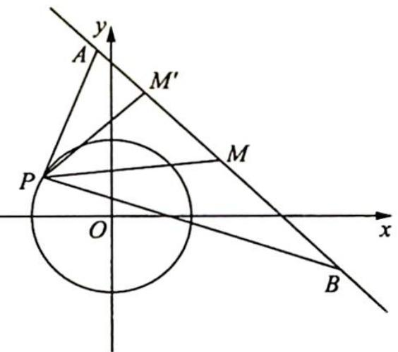
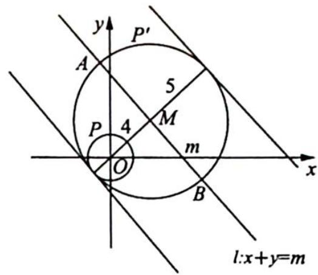

> [!faq]- 《高考数学培优40讲》例题解析
>
> > [!success]- **【答案】** C
>
> > [!note]- **【分析】**
> > 分析 ➤ 思路一: A, B 是直线 $x + y = m$ 上的两动点, 且 $|AB| = 10$ . 因为存在 A, B 使 $\angle APB = 90^{\circ}$ 成立, 转化为以 AB 为直径的圆与单位圆有交点, 即对于单位圆 O 上的任意一点 P, 总能找到一点 M, 使 $|PM| = 5$ , 所以应满足圆上点到直线的最远距离小于等于 5. 思路二: 点
> >
> > P 和线段 AB 都是动的, 首先对它们分别进行考虑. 作以 AB 为直径的圆 M, 因为对于单位圆上的任意点 P, 都存在 A, B 使 $\angle APB = 90^{\circ}$ 成立, 所以圆 M 应该包含圆 O. 求 m 的最大值就是向上平移直线, 使圆 O 内切于圆 M. 若再向上平移直线 l, 就会有圆 O 上的点 P 不合题意的情况了.
>
> > [!note]- **【解析】**
> > 解析 ▶ 解法一(转化为直线与圆的位置关系): 如图所示, 设 $P(x, y)$ , 则 $x = \cos \theta$ , $y = \sin \theta$ , 满足 $x^{2} + y^{2} = 1$ . 又因为 $\angle A P B = 90^{\circ}$ , 所以点 $P$ 在以 $A B$ 为直径的圆上.
> > 设 AB 中点为 M，由题意知，对于单位圆 O 上的任意一点 P，总能找到一点 M，使 $\left|PM\right|=5$ ，则圆上点 P 到直线 AB 的距离 $\left|PM'\right|\leqslant5$ ，所以应满足圆上点到直线的最远距离小于等于 5，即 $d(O,AB)+r\leqslant5$ ，则只需满足 $\frac{|m|}{\sqrt{2}}+1\leqslant5$ ，解得 $m\in\left[-4\sqrt{2},4\sqrt{2}\right]$ 。故选 C。
> > 
> > 
> > 解法二(转化为圆与圆的位置关系): 点 $P$ 和线段 $AB$ 都是动的, 首先对它们分别进行考虑. 以 $AB$ 为直径作圆, 设圆心为 $M$ , 因为对于单位圆上的任意点 $P$ , 都存在 $A, B$ 使 $\angle APB = 90^\circ$ 成立, 所以圆 $M$ 应该包含圆 $O$ , 若是其他情况, 总会存在点 $P$ 及 $A, B$ 使 $\angle APB \neq 90^\circ$ . 求 $m$ 的最大值就是平移直线 $l$ , 使圆 $O$ 内切于圆 $M$ , 此时是临界状态, 再向上平移直线 $l$ , 就会有圆 $O$ 上的点 $P$ 在圆 $M$ 外的情况, 不合题意. 圆 $O$ 内切于圆 $M$ , 此时 $OM = 5 - 1 = 4$ , 则 $m = 4\sqrt{2}$ , 即 $m$ 的最大值为 $4\sqrt{2}$ .
> >
> > 故选 **C**.
