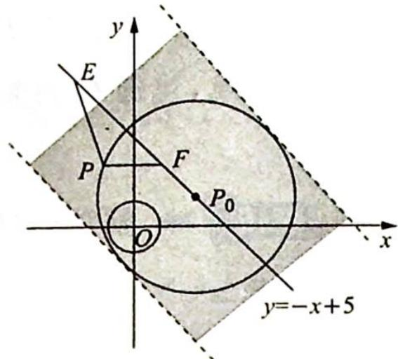

> [!faq]- 《高考数学培优40讲》例题解析
>
> > [!success]- **【答案】** 详见解析
>
> > [!note]- **【分析】**
> > 本题未单列分析。
>
> > [!note]- **【解析】**
> > 解析 ▶ 圆 O 的圆心到直线 l 的距离为 $\frac{5\sqrt{2}}{2}$ .
> > 我们先不考虑题中的坐标系, 以 $EF$ 中点 $O'$ , $EF$ 所在直线为 $x'$ 轴建立平面直角坐标系 $x'O'y'$ , 因为 $EF = 8$ , 故可设 $E(-4,0), F(4,0)$ .
> > 现计算在 $x^{\prime}O^{\prime}y^{\prime}$ 坐标系下满足 $PE = \sqrt{2} PF$ 的点的轨迹是何种曲线.
> > 由直译法易得轨迹是一个半径为 $8 \sqrt{2}$ 的圆.
> > 另外,我们也可以通过阿波罗尼斯圆满足的条件判断出 $P$ 点轨迹是一个半径为 $8\sqrt{2}$ 的圆.
> > 再回到原问题中,在平面直角坐标系 $xOy$ 中,对于确定位置的 $E,F$ ,如图所示,可得满足
> > $PE = \sqrt{2} PF$ 的 $P$ 的轨迹是以 $P_{0}$ 为圆心， $8\sqrt{2}$ 为半径的圆，其中 $P_{0}$ 在直线 $l$ 上；当 $E, F$ 在直线 $l$ 上滑动时， $P$ 点的轨迹为宽度为 $16\sqrt{2}$ 的带状区域。由题意可得，让此区域包含圆 $O$ 即可。
> > 
> > 因为 $O$ 到 $l$ 的距离为 $\frac{5\sqrt{2}}{2}$ , 所以 $r \leqslant 8\sqrt{2} - \frac{5\sqrt{2}}{2} = \frac{11\sqrt{2}}{2}$ , 即 $r \in \left[0, \frac{11\sqrt{2}}{2}\right]$ .
